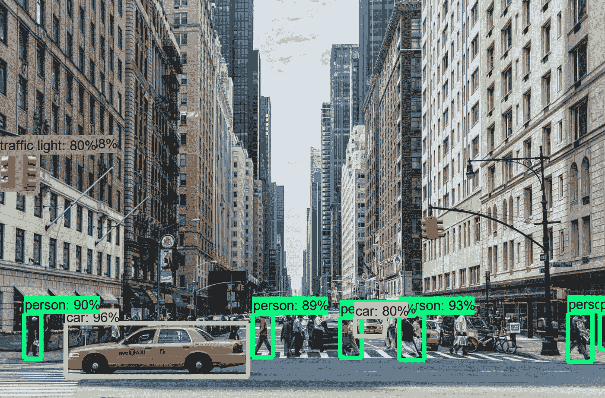
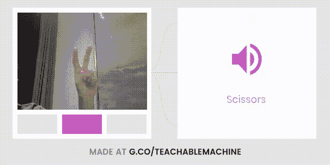
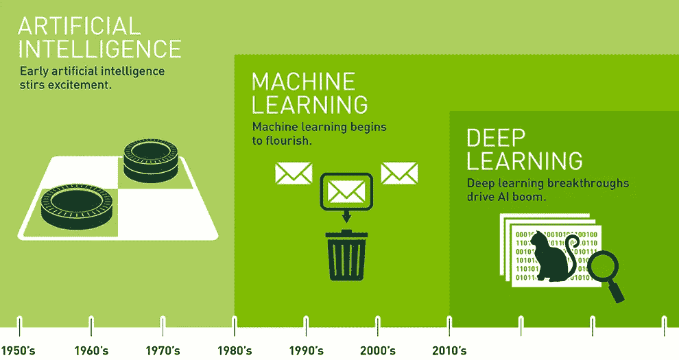
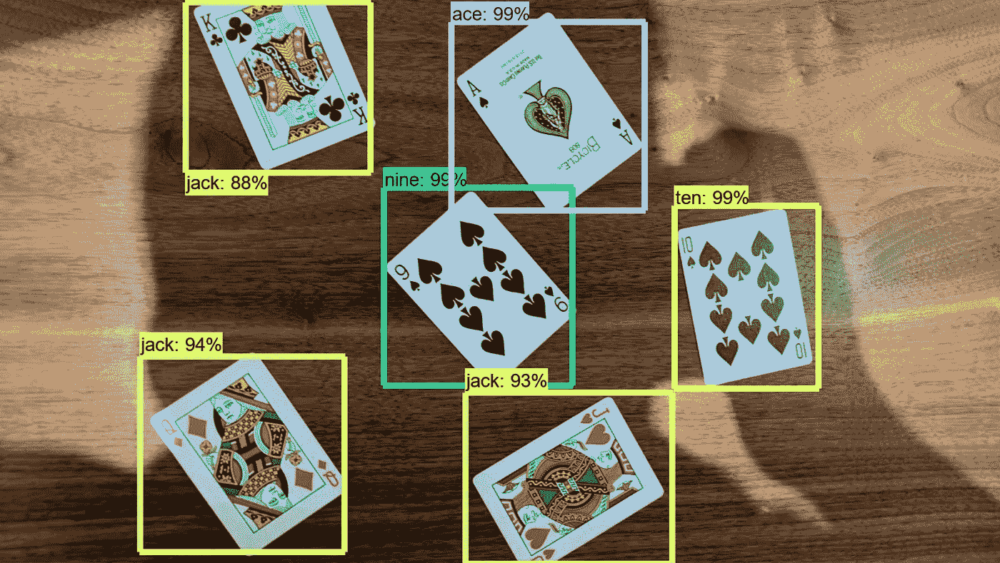
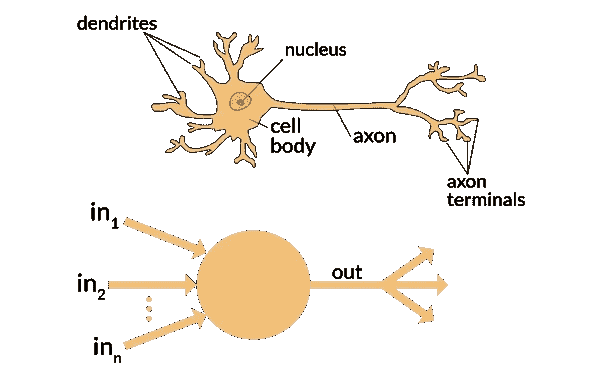
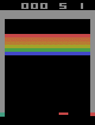
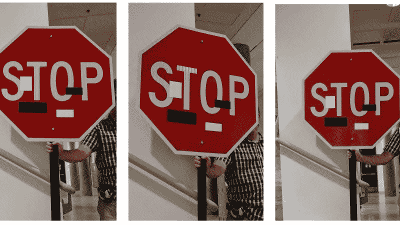
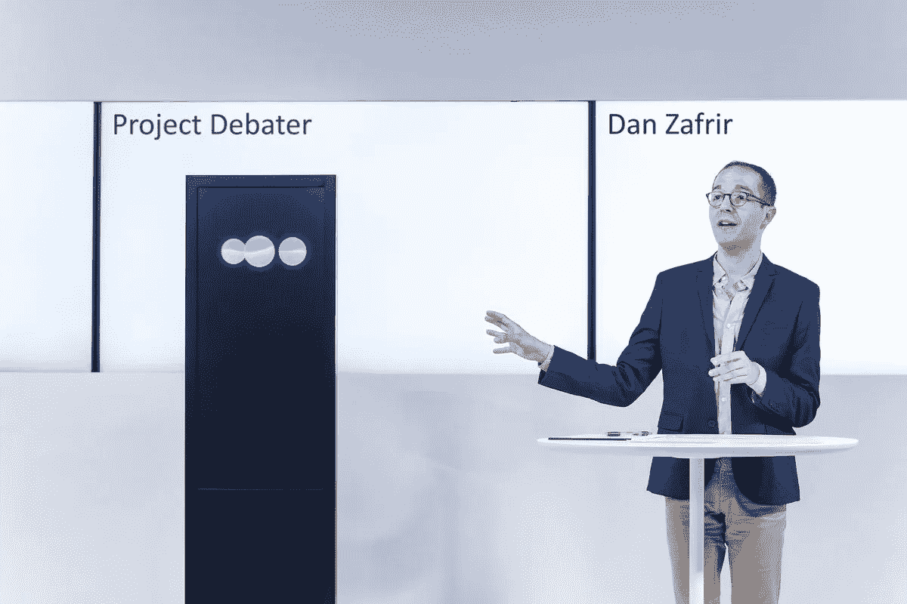
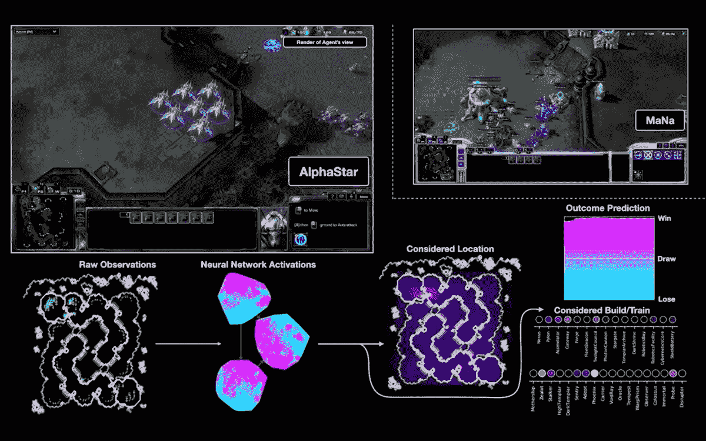

# 深度学习入门:14 岁孩子教的

> 原文：<https://towardsdatascience.com/intro-to-deep-learning-taught-by-a-14-year-old-6c49fc94d66?source=collection_archive---------14----------------------->

## 跳入深度学习的最深处

Manhattan Digest, “Streets of New York.” Image annotated by me using the Faster RCNN Inception V2 Model.

> “我是一个乐观主义者，我相信我们可以创造出对世界有益的人工智能。它能与我们和谐相处。我们只需要意识到危险，识别它们，采用尽可能最好的实践和管理，并提前为其后果做好准备。”斯蒂芬·霍金

你们中的许多人可能已经开始听到人工智能治愈癌症的传奇故事，或者听到智能机器人接管的可怕故事。今天，或者无论哪一天你正在阅读这篇文章(你好，未来机器人霸主)，我将解释什么是深度学习，为什么人们如此害怕它，以及如何使用它。

随着人类在 S.T.E.M .方面取得新的进展，有一个领域似乎每天都在快速进步。机器学习和人工智能的子集深度学习正在以惊人的速度前进。几乎每天，谷歌(Google)和亚马逊(Amazon)等大公司都会想出新的方法，让计算机能够检测出一些东西，比如一个人是否患有癌症，或者能够在放射扫描中快速检测出骨折。这些计算机可以比普通医生更精确、更快速地检测到这一点。

[Google Teachable Machine](http://g.co/teachablemachine) learning hand gestures (it took me 2 minutes to train).

# 人工智能 vs 机器学习 vs 深度学习:认知计算进化简史

This graphic from [Nvidia](https://blogs.nvidia.com/blog/2016/07/29/whats-difference-artificial-intelligence-machine-learning-deep-learning-ai/) shows the transition from Artificial Intelligence to Deep Learning as technology and understanding of the human nervous system improved.

## 人工智能:模仿人类智能

与你所想的相反，人工智能已经存在了很长时间。直到 1956 年关于人工智能的达特茅斯夏季研究项目，机器展示人类智能的想法才看起来像是一项可能的成就。那次会议标志着该领域努力的开始，虽然标准计算在当时并不复杂，但它似乎仍然是一个重要的里程碑。“50 年代创造的人工智能能做什么？”你可能会问。最受欢迎的例子是几乎每台电脑都预装的象棋应用程序。如果你决定与计算机下棋，你实际上是在使用人工智能的最基本形式。计算机根据硬编码算法知道下一步该怎么走。

## 机器学习:人工智能的新观点

通过人工智能的子集机器学习，工程师能够将大量关系数据输入计算机，并获得对未来数据的有根据的预测。这在理解一个地区的房价、天气模式、垃圾邮件等方面非常流行。虽然机器学习在其应用领域取得了成功，但由于其许多限制(更适合少量数据)，它仍然没有得到广泛使用。

## 深度学习:证明大脑高度活跃

深度学习是机器学习的一个子集，它赋予计算机“学习”(逐步提高特定任务的性能)的能力，而无需明确编程如何完成所述任务。深度神经网络能够接受数据输入，如图像和音频文件，并从被标记的内容中学习。由于对人类神经系统的新的和改进的理解以及硬件的改进，这项新技术最近才开始实施。以前，这些网络所需的巨大计算能力使得训练和评估模型几乎不可能。随着 GPU(显卡)的兴起，这种用于比特币挖掘的关键组件，研究人员每秒钟能够进行更多的数学运算。深度学习是如此之新，以至于许多计算机仍然没有足够的能力来运行模型；当我试图教一个网络扑克牌之间的区别时，在我的笔记本电脑上训练需要 28 周，而我的带 GPU 的台式机只需要 15 分钟。

My custom object detector for playing cards in a deck.

# 背后的神经科学

当事情发生时，我们的大脑能够通过遍布全身的神经元做出反应来理解我们所经历的事情。一个例子是，我们手中的一些神经元可能只有在物体热的时候才会向我们的大脑发出电脉冲，而其他神经元可能只有在物体冷的时候才会发出电脉冲。神经元遍布我们的身体和大脑，每一个都有不同的任务。仅大脑就有大约 860 亿个神经元。这个由神经元互联网络组成的系统，向大脑提供数据，发展成为一个令人难以置信的科学突破:深度学习。

Comparison between the connected networks within our bodies and a simple neural network (via [https://www.quora.com/What-is-the-differences-between-artificial-neural-network-computer-science-and-biological-neural-network](https://www.quora.com/What-is-the-differences-between-artificial-neural-network-computer-science-and-biological-neural-network))

# 深度学习是如何学习的

# 监督学习

卷积神经网络是使用监督学习的最常见的神经网络类型。监督学习是指人类获取非对应的输入数据，并对这些数据进行标记，以帮助模型进行学习。对于图像训练，这将需要标记图像中的对象，以便计算机能够用“答案”进行自我测试。这是我用扑克牌做的；我必须给 100 张不同的照片贴上标签，告诉电脑每种类型的卡片在给定的照片中的位置。

The architecture of a traditional convolutional network.

This person is not a real, it was created by a GAN. [Source](https://www.thispersondoesnotexist.com/)

Using [CycleGAN](https://junyanz.github.io/CycleGAN) to turn a video of a horse into a zebra.

# 无监督学习

OpenAI learning how to play Atari Breakout.

## 生成对抗网络

GAN(生成对抗网络)是一种无监督学习，能够从图像训练数据中从头生成数据。英伟达创造了生成人脸的 GAN 虽然照片中的脸看起来是真实的，但它绝不是曾经存在过的人类。甘拍摄了人类的照片，并发现了人类长相之间的共性。

## 强化学习

一种用无监督学习训练神经网络的新方法被称为强化学习。虽然大多数卷积神经网络模型都是用监督学习(模型根据给定的输入数据评估自身)来训练的，但强化学习模型根据给定的奖励来评估其性能。目前，这种形式的训练正在视频游戏中进行测试，游戏中的得分可以立即让模型满意，表明有所改善。谷歌 DeepMind 的 AlphaGo 最近就使用了这种方法，它在非常复杂的围棋比赛中以 5 比 0 击败了 3 次欧洲冠军。AlphaGo 计算机能够在没有任何指令的情况下学习。

# 人工智能的道德

这些新的科学突破让我们得以一瞥未来的社会，在未来，汽车为我们驾驶，医疗分析更便宜、更准确，我们的生活由机器人个人助理(如 Siri、Alexa 或 Google Home)组织。许多主流高管和研究人员担心，如果我们滥用这些新技术，会有什么后果。由于深度学习是一门新学科，我们无法确定它的使用范围；像强化学习这样的训练方法可能会导致计算机变得更加独立于人类，因为我们让它们自己去理解世界。无论这些可能性听起来有多好，它都会导致一些严重的未解问题，比如人造生命的权利，或者我们今天所知的社会终结的可能性。

根据我在页面顶部引用的斯蒂芬·霍金的话，他总结了由于早期采用者的错误决策而导致的这些新技术的误用。虽然在这一点上我们无法确定人工智能会给未来带来什么，但我们必须回忆起我们可能看过的机器人入侵的电影，并警惕人工智能可能带来的危险，尽管这听起来很荒谬。

Autonomous vehicles get confused when tape is put on top of a stop sign. Source: [U.C. Berkeley](https://arxiv.org/abs/1707.08945)

深度学习可能还没有做好大规模商业应用的准备，主要是因为一个致命的缺陷:深度学习训练数据是让它给出预测的东西，而不是道德。正如 2018 年 10 月亚马逊审判所证明的那样，亚马逊在意识到由于不良数据而导致的性别歧视后，取消了一项人工智能倡议。亚马逊试图通过创造一个人工智能来帮助决定申请人是否是合格的员工候选人，从而使亚马逊的招聘过程变得更容易。这个人工智能已经训练出亚马逊员工过去雇佣历史的信息，并拒绝了申请。那些雇用应聘者的人通常是性别歧视的，因为过去不合格的男性比合格的女性更容易被雇用。这是一个很好的例子，说明糟糕的训练数据会导致糟糕的模型。另一个糟糕的训练数据的例子是自动驾驶汽车的早期测试，其中如果标志上有便利贴，计算机无法检测到停车标志，而大多数人仍然知道这是停车标志。

# 2019 年深度学习的现状

虽然人工智能有许多优点，但如果不深入思考，它也有许多似乎并不具有威胁性的缺点。事实上，人工智能失控并终结人类的可能性非常小，至少现在是这样。对社会更大的威胁是失业；一个经常被忽略的工作是卡车驾驶。现在在美国，有超过 350 万卡车司机。沃尔沃和优步已经在测试他们的全自动卡车，这种卡车有能力让司机下班。截至 2019 年 1 月 30 日，亚马逊已经在 10 号州际公路上测试完全自动驾驶的卡车。随着 350 万卡车司机工作岗位的流失，如果司机不需要停下来休息，许多小型卡车站也会倒闭。

The Daimler Freightliner driverless truck. Source: Wall Street Journal

深度学习实际上是第四次工业革命，可能会被证明有利于就业率。继蒸汽机、电力和内燃机以及互联网等发明引发的革命之后，深度学习有望创造比失业人数更多的就业机会。当互联网普及时，许多人担心失业，但它创造了比以前更多的就业机会；一些因为互联网而创造的工作岗位的例子包括社交媒体经理、数据科学家、优步司机等等——这些工作在 15 年前甚至不存在。

深度学习帮助下的创新不会很快停止，因为刚刚签署了一项行政命令，将大量资源用于将美国变成人工智能的世界领导者，而不是中国。“2017 年 7 月，[中国]公布了一项成为人工智能世界领导者的计划，旨在到 2030 年为其经济创造价值 1500 亿美元的产业，两个中国城市承诺为此投资 70 亿美元，”《纽约时报》报道。

IBM’s Project Debater in a live debate against one of the world’s best debaters. Source: [IBM](https://www.research.ibm.com/artificial-intelligence/project-debater/index.html)

处理深度学习已经在当今社会中实施的事实是令人生畏的，但它不会很快停止。谷歌的一个团队正在使用人工智能帮助医生为印度的糖尿病患者预防失明，在印度，医生自己无法足够快地分析患者。2011 年，IBM 的沃森电脑赢得了“危险边缘！”他的奖金是连续 74 场比赛获胜的著名选手肯·詹宁斯的 7 倍多。最终，游戏之间的竞争表明沃森是明显的胜利者，正如肯·詹宁斯所表达的，“我，欢迎我们新的计算机霸主。”IBM 在智慧游戏中击败人类的持续追求最近在 2019 年 2 月 12 日继续进行，当时 IBM 与哈里什·纳塔拉詹(Harish Natarajan)进行了辩论，后者通常被认为是世界上最好的辩手。虽然 IBM 给出了许多有说服力的论据来说明为什么应该补贴学前教育，但 IBM 的 debater 由于其单调的声音，未能在情感层面上与评委建立联系。要是 IBM 能从[谷歌的 Tacotron 自然音频合成器](https://google.github.io/tacotron/publications/tacotron2/demos/washington_gen.wav)那里学到一些技巧就好了。不要为 IBM 的损失感到太难过…谷歌的 DeepMind 刚刚创造了一个 AI，它打败了最优秀的人类星际争霸玩家。

A graphic of how DeepMind’s AI is able to understand the map of the game. Source: DeepMind

# 结论

虽然一开始可能很难相信电视节目想到的许多不可思议的想法已经进入市场，但这不应该看起来很可怕。深度学习才刚刚起步；许多曾经被认为是不可解决的想法现在正成为似是而非的发明。我希望这篇文章没有让你回避深度学习，而是拥抱可能出现的好东西，并希望激励你继续学习更多关于制作神经网络的知识。

# 奉献

*如果没有我的学校 Pine Crest School 和佛罗里达州大西洋大学机器感知和认知机器人实验室的人的帮助，我永远不会找到我对深度学习的热情。我记得当威廉·哈恩博士和伊兰·巴伦霍尔茨博士在一次创新会议上对 Pine Crest 讲话时，我对了解深度学习是什么感到非常兴奋。这段旅程是一次不可思议的经历，我期待着进一步研究人工智能和深度学习。*

> "智慧的真正标志不是知识，而是想象力."-阿尔伯特·爱因斯坦