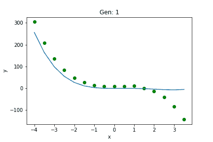

# 使用 DEAP 介绍进化计算

> 原文：<https://towardsdatascience.com/intro-to-evolutionary-computation-using-deap-618ca974b8cb?source=collection_archive---------14----------------------->

[Pixabay](https://pixabay.com/vectors/charles-darwin-evolution-2029626/)

# 介绍

进化计算是一种非常强大的通用优化技术，其主要灵感来自自然选择进化理论。自然选择进化是一个非常优雅的理论，它对自然界生物多样性的解释依赖于两个主要部分:

*   随机突变
*   选择压力

不同的生态栖息地对生存的挑战和要求是不同的。根据进化理论，在任何生态位中，由于 DNA 的随机突变和复制中的复制错误，不同生物的特征将是不同的。由于性状的这种变异，对于具有更适合生存的性状的生物来说，将会有不同的生存优势，也就是说，大自然隐含地施加了一种选择适合个体的压力。因为最健康的生物更有可能存活下来，它们会把“健康”基因传给它们的后代，后代也更有可能存活下来。

进化可以被认为是一种优化适应度的算法。这是进化优化的核心思想。换句话说，如果我们有一个问题，我们可以为它生成不同的解决方案，那么我们可以使用每个解决方案的性能作为适应度的度量，这可以驱动进化算法找到越来越好的解决方案。进化算法有不同的风格，这些风格共享它们的大部分组件，然而，在每个组件的细节和特征上有所不同。进化算法的主要组成部分是:

*   表示方案(例如基因型、表型等)
*   配对运算符(例如交叉)
*   变异操作符(如比特翻转)
*   健康指标
*   选择策略(如锦标赛选择)
*   进化策略(如 mu、lambda)

你可以在我的[上一篇文章](https://medium.com/@MohammedAmer/evolutionary-computation-a-primer-e3ca6fb0db5c)中找到关于进化算法不同变体的更详细的介绍。出于本教程的目的，我将重点关注一种叫做进化策略(ES)的变体，接下来我将简要介绍它。完整的 jupyter 笔记本可在[这里](https://github.com/mohammedamer/deap-tutorial)获得。

# 进化策略

正如我提到的，所有的进化算法都有前述的大部分组成部分，只是细节不同。对于专家系统，表示方案主要是一种表型，即个体(或解)被明确地表示为数字向量。每个个体都会有一个伴随的向量，叫做策略，它只是一个控制其变异的向量。ES 中使用了不同的交配算子，但我们将使用的是混合算子，它主要是交配亲本之间的一种线性组合形式。我们将使用的变异算子是对数正态的，像 ES 中的所有变异算子一样，它依赖于上面提到的策略向量来变异个体的表示向量中的不同值。选择策略将是锦标赛选择，其中对一个子集个体进行多次随机选择，每次选择最佳个体。适应度函数是任何进化算法中必须委托给用户来定义的唯一部分，即用户将提供一些函数，该函数将基于对于手边的问题的合适的测量来分配适应度给群体中的每个个体。进化策略控制种群的大小，这里我将使用(mu，lambda)_ 读作‘mu 逗号 lambda’_，其中 mu 和 lambda 是正整数，mu 指的是父代种群的大小，而 lambda 指的是所产生的后代的大小。在这个策略中，选择策略(即本例中的锦标赛选择)仅适用于后代。

像所有的进化算法一样，ES 是在被称为代的迭代中完成的。每一代，后代都是由群体中当前的父母通过交配然后突变而产生的。然后评估新成员的适应度，并应用选择策略来选择将存活到下一代的个体。

# DEAP

DEAP 是一个实现进化算法的 python 框架。它为协调任何进化算法所需的不同组件提供了一种有组织的简化方法。对于任何组件，DEAP 提供了预定义组件的大多数常见变化，同时提供足够的灵活性来定义自己的变化，以防常用组件不足以解决您的问题。

让我们首先定义一个可以使用 ES 优化的虚拟问题。在许多情况下，你会有一些自然的过程，我们称之为数据生成过程，你想要建模，以便你可以在以后做出预测。数据生成过程就像一个黑匣子，你永远无法看到里面，但你可以给它一个输入，它就会用一个输出来回应。

正如您在上面看到的，这个数据生成过程接受一个输入，并基于某个三次多项式产生一个输出。请注意，我们从来没有访问这个公式，这只是为了说明的目的。其实我们的任务就是用 ES 来建模这个未知的公式。我们只能“查询”这个黑盒并获得响应，也就是说，我们可以对它进行采样，

注意，增加了一个附加随机项。这个术语代表噪声，由于有许多来源，噪声是任何观测中不可避免的成分。

为了使用进化算法对一个过程建模，我们需要一个候选模型，基本上，一个关于我们正在寻找的模型类型的假设或“归纳偏差”。这可能来自另一个分析来源或以前的数据分析。对于我们的虚拟情况，我们将假设我们知道我们正在搜索的模型是最多四次的多项式，所以我们决定使用四次多项式，

“a”变量集是未知的，我们需要进化算法来优化它们，以便模型输出符合我们的数据。这将反映在我们下面讨论的评估函数的定义中。但是首先，我们需要准备我们的 ES 算法。

让我们导入实现所需的基本子包，

要使用 DEAP 实现 ES，我们首先需要将我们的个体、策略和适应性定义为数据类型。这可以在 DEAP 完成，不需要显式定义自己的类，

第一行定义了我们的健身数据类型。第一个参数给出了数据类型名称，第二个参数给出了基类，即 DEAP 提供的适应度度量的基类，第三个参数将适应度权重设置为负值，这意味着进化优化将尝试最小化该值。我们试图最小化适应度可能看起来很奇怪，但是正如你将看到的，我们将使用的适应度函数实际上是一个误差函数，也就是说，它测量我们的解决方案偏离观察值多少，因此，我们需要最小化它。

注意，在运行这一行之后，数据类型 FitnessMin 被动态地添加到 creator 子包中，您可以作为“creator”直接访问它。健身。

第二行类似，但是，它定义了个人。从第四个参数开始，您提供的任何参数都将作为字段或属性添加到已定义的数据类型中。对于个人来说，我们定义了 DEAP 所要求的一个必要条件，那就是健康。当 DEAP 想要更新适应值或读取它时，它将寻找这个。你可以看到我们把我们定义的 FitnessMin 传递给它。ES 算法需要策略属性，因为它依赖于策略向量来进行变异。我们将其初始化为“None ”,因为稍后我们将自己填充它。您可以将您需要的任何其他属性传递给 create 函数，它们将被添加到您的数据类型中。第三行定义了策略数据类型。

现在我们需要注册一些函数，以便于使用我们定义的数据类型来生成个体，并将它们聚合成一个群体。DEAP 为此提供了一个特殊的实用“工具箱”,

首先，我们定义一个函数，它接受我们的个体和策略类以及个体的大小，即个体向量中包含多少参数，并生成一个随机初始化的个体，并用随机初始化的策略向量填充它。然后，我们初始化我们的工具箱，并使用它的注册函数两次。第一种用法是注册一个名为“个人”的函数。您可以看到，第二个参数是我们实际定义的函数实现，其余参数是调用时默认传递给函数的参数。

第二种用法定义了另一个重要的函数，叫做‘population ’,我们将用它来生成人口。我们传递一个 DEAP 预定义的函数，它是 initRepeat。initRepeat 之后的参数也是调用时默认传递给它的参数。当我们从工具箱中调用函数“population”时，将调用 initRepeat，它将使用第二个参数初始化一组个体，这是我们预定义的个体生成函数，它将把它们放入“list”类型的容器中，这是它的第一个参数，并返回它。

我们现在需要注册评估功能，DEAP 将使用该功能为不同的个人分配适合度。这就是我们假设的多项式模型发挥作用的地方，

“pred”函数获取一个个体和一个数据点，并通过计算四次多项式返回模型输出。您可以看到，个人参数 1–4 用作不同指数的 x 的系数，第五个用作偏差/截距，即不含 x 的项。

“fitness”函数计算实际输出和我们的模型输出(使用前面的函数“pred”计算)之间的均方误差(MSE)。更健康的个体将具有更小的 MSE，这就是我们在开始时定义的健康被赋予负权重的原因。我们对使 MSE 更小感兴趣。

最后，我们使用特殊的关键字“evaluate”在工具箱中注册我们的适应度函数，以便 DEAP 在计算适应度时可以找到它。

我们需要注册一些操作所必需的函数，它们是变异、交叉和选择操作符。我们可以通过在工具箱中注册一组函数来实现，这些函数都有特定的名字，DEAP 在执行这些操作时会查找这些名字，

配对、变异和选择分别是交叉、变异和选择操作符。对于所有这些组件，我们使用预定义的 DEAP 组件，并传递它们所需的参数。

到目前为止，这些是 ES 运行的大部分必要组件。DEAP 提供的一个非常方便的可选工具是“统计”工具，我们可以配置它来获得每一代进化算法的一些统计数据，

当我们初始化我们的统计数据时，我们在构造函数中提供了一个函数定义，它将在 DEAP 调用时接收一个个体，我们需要返回我们希望对其应用统计运算符的个体的属性。注册的函数名将被用作相应 stat 的标签，例如{'avg': <the np.mean="" function="" output="">}。</the>

另一个方便的工具是“名人堂”,我们可以对其进行配置，DEAP 会将每一代中最优秀的 k 个人填入其中，

“1”表示它将只由最优秀的个体填充。

现在，我们准备启动 ES，让它为我们带来奇迹，

第一行只是初始化一个新的群体，它被传递了我们的 mu 值作为它的大小，因为我们将使用前面描述的(mu，lambda 或 MuCommaLambda)算法。第二行使用提到的算法运行单代 ES(ngen = 1 ),传递第二个需要的参数 lambda。你可以看到我们还通过了我们定义的工具箱，它包含了我们所有配置的函数和操作符，我们的统计数据和名人堂。下面是 100 代运行的可视化。

# 参考

*   [https://deap.readthedocs.io/en/master/](https://deap.readthedocs.io/en/master/)
*   贝克，t .，福格尔，D. B .，&米切莱维奇，z .(编辑。).(2018).进化计算 1:基本算法和算子。CRC 出版社。