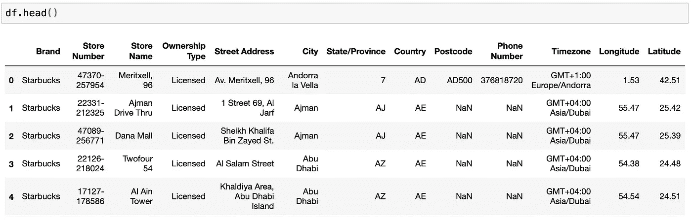
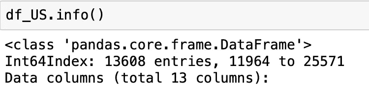
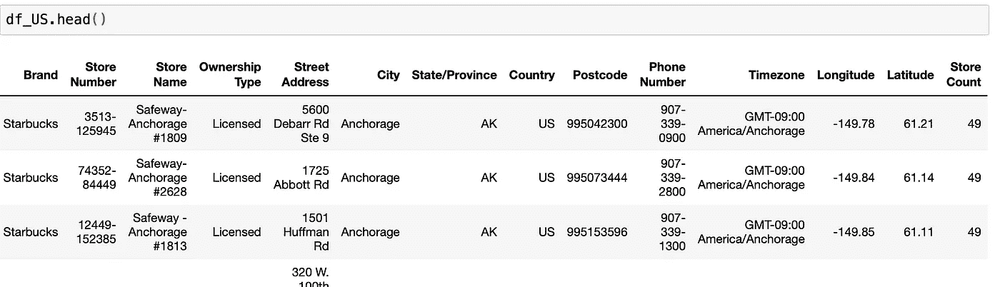
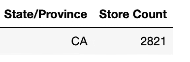
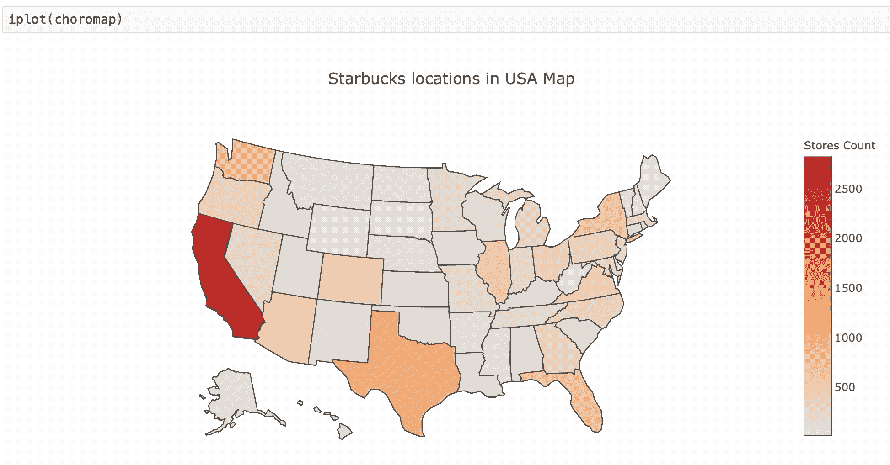
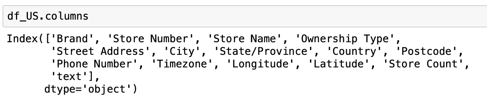
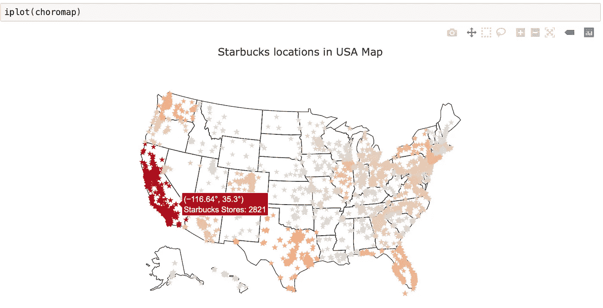
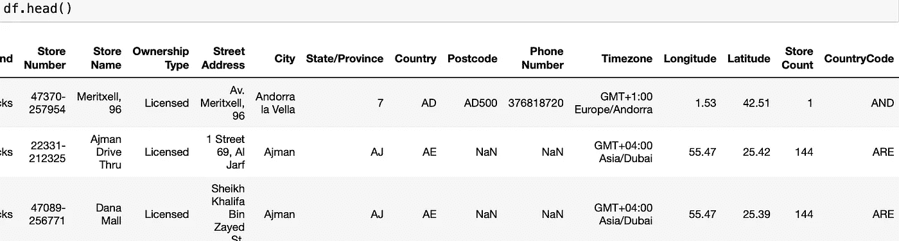
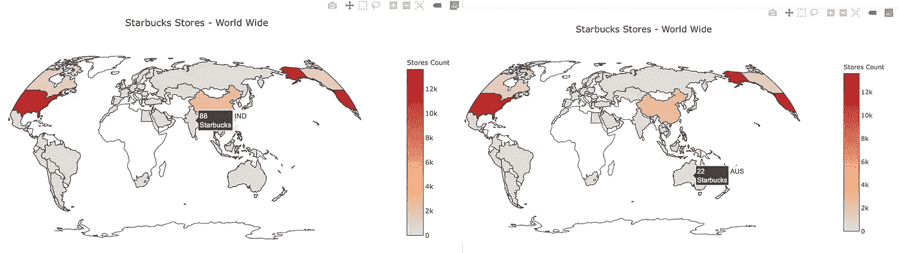

# 地理绘图介绍

> 原文：<https://towardsdatascience.com/intro-to-geographical-plotting-237f59fec735?source=collection_archive---------8----------------------->

## *使用 Python* 在任意地图上可视化 geographic数据


Photo by [Kelsey Knight](https://unsplash.com/@kelsoknight?utm_source=medium&utm_medium=referral) on [Unsplash](https://unsplash.com?utm_source=medium&utm_medium=referral)

在 *数据科学领域，我们经常致力于将数据可视化，这为我们提供了关于数据的清晰模式，并使其易于分析。幸运的是，python 为此提供了强大的数据可视化工具。此外，可视化世界各地或任何特定国家的基于地图的数据会更有趣，这给了我们关于地理数据的很酷的见解。地理地图很重要，因为它们为我们的数据值提供了背景。*

> 所以，让我们来看看 Python 的**交互式可视化**工具— `plotly`。使用 Plotly，我们可以从地理数据中创建美丽的 Choropleth 地图。

## Choropleth 地图:

> Choropleth maps 帮助我们绘制出全球或全国范围的信息。它让我们看到某个变量是如何在一个区域内分布的。在这篇博客中，我们将重点介绍如何使用`**plotly**`绘制 choropleth 地图。

## **阴谋地**

> Plotly 是一个开源库，它允许我们创建可用于仪表盘或网站的交互式绘图。Plotly 也是一家[公司](https://plot.ly/)，支持在线和离线托管数据可视化。现在让我们使用离线模式，因为它是开源的，并且它使得在我们的 Python Jupyter 笔记本中工作变得容易。

> 由于数据格式多样，使用 plotly 进行地理绘图起初有点困难，因此请参考此[备忘单](https://images.plot.ly/plotly-documentation/images/python_cheat_sheet.pdf)了解所有类型的`plotly`绘图的语法。

让我们从下面的例子开始理解这个概念…

## **来自 Kaggle 的数据集:**

让我们找出全球以及全国范围内的星巴克门店，并使用 choropleth 地图将这些数据可视化。数据集(directory.csv)可以从[这里](https://www.kaggle.com/starbucks/store-locations)下载。*该数据集包括截至 2017 年 2 月目前正在运营的每家星巴克门店的记录。*

**我们将经历以下步骤:**

1.  导入所有的库，并将我们的 Jupyter 笔记本设置为脱机模式。
2.  使用 pandas 将星巴克数据提取到 Dataframe。
3.  为“美国国家”创建“**数据**和“**布局**对象，并绘制 choropleth 地图。
4.  为“全球”创建“**数据**和“**布局**对象，并绘制 choropleth 地图。

让我们先把`plotly`安装到 Jupyter 笔记本上

```
pip install plotly
```

**第一步:**

```
import plotly.plotly as py 
import plotly.graph_objs as go #importing graphical objects
from plotly.offline import download_plotlyjs, init_notebook_mode, plot, iplot
```

`download_plotlyjs`允许 plotly 在离线模式下工作。
`init_notebook_mode`将 Javascript 连接到我们的笔记本。

第二步:

```
import pandas as pd
df = pd.read_csv('directory.csv')
```



在进入第 3 步之前，让我们快速执行以下任务:

☑从上述数据集中获取子集数据(美国国家数据),并将其分配给新的数据框。
☑向数据集添加了一个新列——“商店计数”，以获得每个州的商店总数。

```
df_US = df[df['Country'] == 'US']
```



13608 entries for ‘US’ country

现在，要向数据框架添加新列“商店数量”，我们可以在“州/省”列上使用`groupby()`,如下所示

```
df_US['Store Count'] = df_US['Store Number'].groupby(df_US['State/Province']).transform('count')
```



State ‘AK’ has a total of 49 stores

```
df_US[df_US['State/Province'] == 'CA'][['State/Province','Store Count']].head(1)  # to check num of stores in 'California'
```



‘CA’ has a total of 2821 stores

**第三步:**绘制 **'** 美国国家地图

让我们定义我们的'**数据**和'**布局**对象如下:

```
**data** = dict(type='choropleth',
            locations = df_US['State/Province'],
            locationmode = 'USA-states',
            colorscale = 'Reds',
            text = df_US['Brand'],
            z = df_US['Store Count'],
            colorbar = {'title':"Stores Count"}
            )
```

`type`:定义地图的类型(choropleth)
`locations`:所有州的名称
`locationmode`:通过给出国家名称
`colorscale`来指定位置:显示彩色地图。*(更多色阶请参考下文)*
`text`:悬停在地图上时显示每个状态元素
`z`的文本:显示每个状态元素
`colorbar`的“商店计数”的整数值:【右侧栏标题】

> colorscales:
> ['灰色'，' YlGnBu '，'绿色'，' YlOrRd '，'蓝色'，' RdBu '，
> '红色'，'蓝色'，'野餐'，'彩虹'，'波特兰'，'喷气机'，【T41 '，'热'，'黑体'，'地球'，'电'，'绿色'，'公民']

```
**layout** = dict(title = 'Starbucks locations in USA Map',
              geo = dict(scope='usa')
             )
```

现在，我们可以使用`go.Figure()`方法为地图创建一个对象，然后使用`iplot()`方法生成绘图

```
choromap = go.Figure(data = [data],layout = layout)
iplot(choromap)
```



Interactive Choropleth map for ‘US’ country[Image by Author]

酷！我们的“美国”国家 choropleth 地图已经生成，从上面我们可以看到，当鼠标悬停在地图上的每个元素上时，每个州都会显示文本、商店数量和州名，数据越集中在一个特定区域，地图上的颜色就越深。这里的“加州”有更多的商店(2821)，所以颜色很深。

类似于 Choropleth 地图，我们有另一个很酷的交互式地图，叫做“散点图”。

> **“散点图”**提供地图上的每个数据点(表示为标记点)以及由 x(经度)和 y(纬度)列表示的位置。

*我们可以使用数据集中的列“经度”和“纬度”来生成散点图。*



让我们使用下面的代码创建一个散点图。

```
**data** = go.Scattergeo(
        lon = df_US['Longitude'],
        lat = df_US['Latitude'],
        text = df_US['text'],
        mode = 'markers',
        marker = dict(symbol = 'star',size=5,colorscale = 'Reds'
                      ),
        marker_color = df_US['Store Count'],
        )
**layout** = dict(title = 'Starbucks locations in USA Map',
              geo_scope = 'usa'
             )
choromap = go.Figure(data = [data],layout = layout)
iplot(choromap)
```



‘Star’ markers represent store locations for each state[Image by Author]

**第四步:**绘制 **'** 世界地图



像我们之前做的那样，添加了一个新列“商店数量”。此外，我还在数据集“国家代码”中添加了一列，其中包含 ISO 3(3 位数)代码。

下面是创建 choropleth 世界地图的代码...

```
**data** = dict(
        type = 'choropleth',
        locations = df['CountryCode'],
        z = df['Store Count'],
        text = df['Brand'],
        colorbar = {'title' : 'Starbucks Stores - World Wide'},
      )
**layout** = dict(
    title = 'Stores Count',
    geo = dict(
            showframe = False,
            projection = {'type':'natural earth'}
    )
)
choromap = go.Figure(data = [data],layout = layout)
iplot(choromap)
```



Sample screenshots represent stores count in India and Australia[Image by Author]

我们的地理数据可视化部分到此结束。请查看`plotly`地图[官方页面](https://plot.ly/python/maps/)查看更多有趣的剧情类型。

我希望这篇文章对你有用，请在下面的评论区分享你的评论/反馈。谢谢大家！！