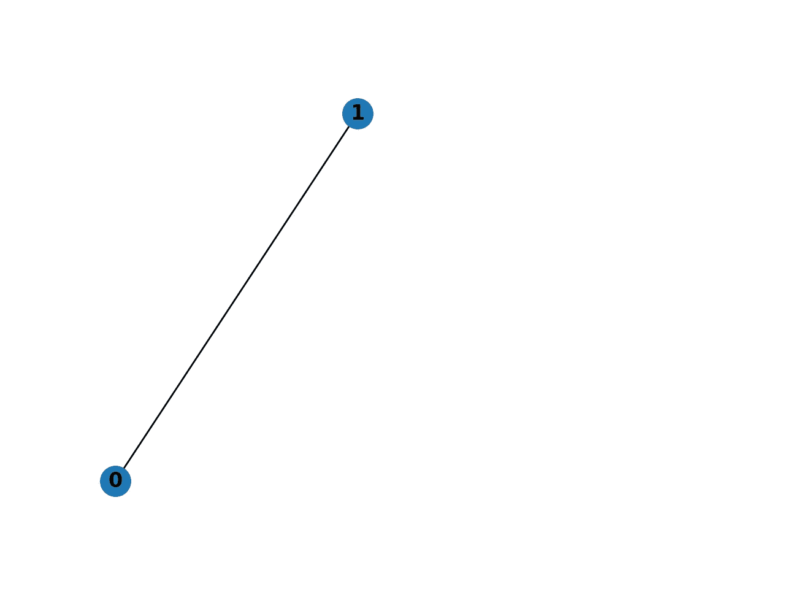
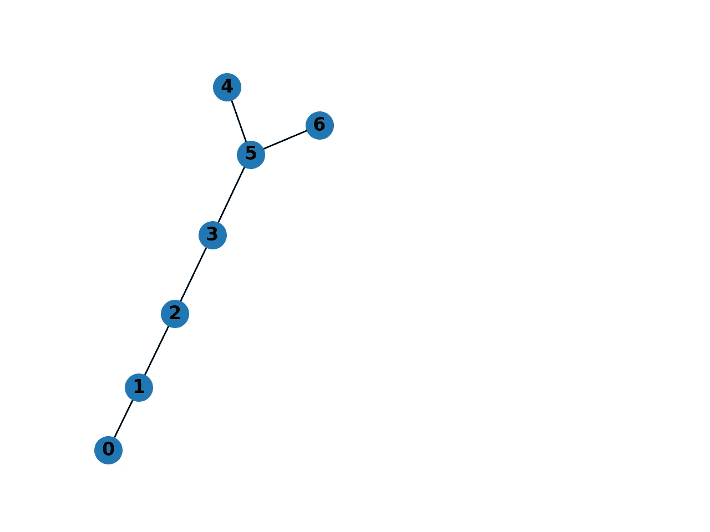
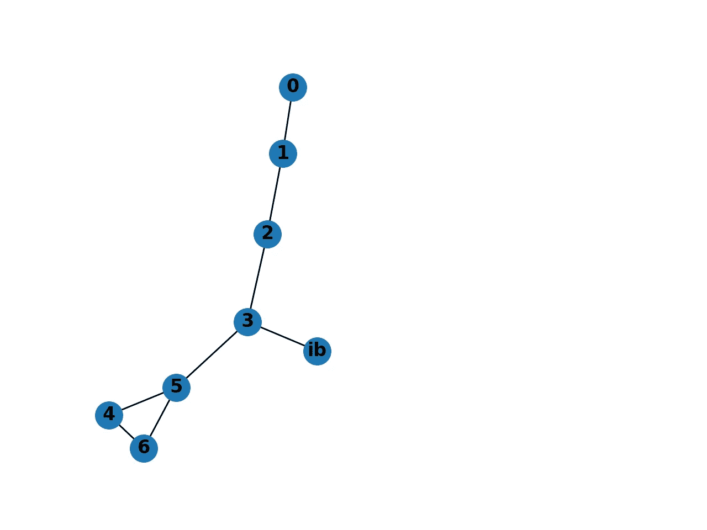
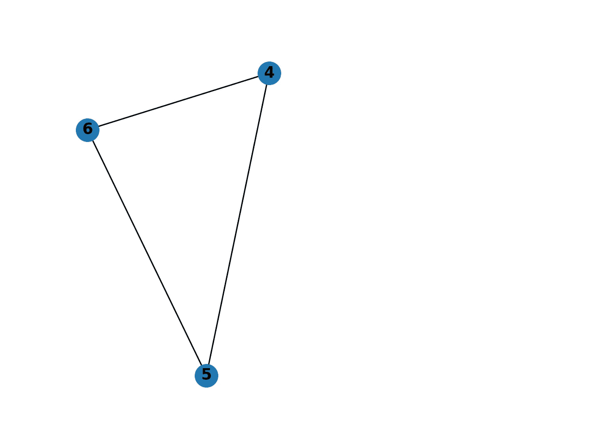

# 使用 Networkx 在 Python 中创建图表

> 原文：<https://towardsdatascience.com/intro-to-graphs-in-python-using-networkx-cfc84d1df31f?source=collection_archive---------11----------------------->

## [图表和数据科学](https://towardsdatascience.com/tagged/graphs-and-data-science)

## 用 Python 构建第一个图表的介绍

如果你对用 Python 做图论分析感兴趣，并且想知道从哪里开始，那么这是给你的博客。我们将首先介绍几个关键概念，然后使用方便的 Networkx 包在 Python 中实现它们。

## 一些图论术语

*   一个**图** *G* ( *V* ， *E* )是由一组顶点( *V* )和一组边( *E* )定义的数据结构。
*   **顶点** ( *v* )或节点是一个不可分割的点，由下图中的字母组件表示
*   一条**边** ( *vu* )将顶点 *v* 和顶点 *u* 连接在一起。
*   由 n 个顶点组成的完全图是这样一个图，其中每个顶点与其他所有顶点共享一条边，因此包含最多的边。
*   任何有 *n* 个顶点的简单图的**最大可能边集**的大小等于( *n* *( *n* -1))/2。这是因为它相当于顶点对组合的数量，即。( *n* 选 2) = *n* ！/( ( *n* -2)！(2!)).
*   图 *G* ( *V* ， *E* )的顶点 s 上的一个**诱导子图***g**g**s*是这样一个图，使得 *S* ⊂ *V* 和 *G* [ *S* 的边集合由
*   图 *G* 的一个**团** C 是 G 的任何诱导子图，它也是一个完全图

## 安装软件包并创建您的第一个图表

您需要做的第一件事是在您的机器上安装 Networkx 包。使用 Pip 非常简单:

```
pip install networkx
```

安装完成后，导入包并初始化图形对象

```
import networkx as nxG = nx.Graph()
```

添加前两个节点以及它们之间的边

```
G.add_node(1)
G.add_node(2)
G.add_edge(1, 2)
```

在这一点上，我们的图只是两个相连的节点



Fig. 1 A two vertex Graph

一次添加一条边非常慢，但幸运的是，我们还可以添加节点列表和边列表，其中每条边由一个节点元组表示。

```
G.add_nodes_from([2,3,4,5,6])
G.add_edges_from([(1,2),(4,5),(3,5),(2,3),(5,6)])
```

我们的图表现在应该看起来像这样



Fig 2\. Our graph now has seven vertices

## 访问和存储信息

通过打印图形的这些属性，我们可以看到节点或边的列表。

```
print(G.nodes())
>>>[0, 1, 2, 3, 4, 5, 6]
print(G.edges())
>>>[(0, 1), (1, 2), (2, 3), (3, 4), (3, 5), (5, 6)]
```

也可以将节点定义为字符串。

```
G.add_node('ib')
G.add_edge(3,'ib')
```

最重要的是，可以为每个节点分配任意数量的属性，然后存储在字典中。

```
G.nodes[1]['color'] = 'red'
G.nodes[1]['count'] = 10
print(G.nodes.data())
>>>[(0, {}), (1, {'color': 'red', 'count': 10}), (2, {}), (3, {}), (4, {}), (5, {}), (6, {}), ('ib', {})]
```

为了使这些数据更易于管理，将 nodes.data()的输出提供给一个 dict()函数，让它进入一个可爱的嵌套字典，其中每个节点都是一个键。

```
print(dict(G.nodes.data()))
{0: {}, 1: {'color': 'red', 'count': 10}, 2: {}, 3: {}, 4: {}, 5: {}, 6: {}, 'ib': {}}
```

## 最大团估计

为了找到最大团，我们需要从 networkx 导入近似包，因为它不包含在默认导入中

```
from networkx.algorithms import approximation as aprx
```

现在，为了测试最大团，我们将通过添加边(4，6)在当前图中创建一个大小为 3 的团

```
G.add_edge(4,6)
```



Fig 3\. Now with 8 vertices and a clique of size 3

因此，顶点集{4，5，6}包含我们的最大团大小为 3，该顶点集正是 max_clique 函数将返回的。

```
print(aprx.max_clique(G))
>>>{4, 5, 6}
print(len(approximation.max_clique(G)))
>>>3
```

要查看该顶点集的诱导子图，我们需要将上述与子图方法结合起来

```
max_clique = G.subgraph(approximation.max_clique(G))
```

这将为我们提供以下完整的 3 顶点图。



The induced subgraph of the maximum clique

**最后的想法和问题**

Python 有很多图形库，但我选择了 Networkx，因为它可读性强、易于设置，尤其是因为它有出色的文档。如果您有任何进一步的问题或希望更多地探索图书馆，请参考[官方文档](https://networkx.github.io/documentation/stable/index.html)。

**来源**

[https://networkx.github.io/](https://networkx.github.io/)
[https://en.wikipedia.org/wiki/Induced_subgraph](https://en.wikipedia.org/wiki/Induced_subgraph)
[https://en . Wikipedia . org/wiki/Clique _(graph _ theory)](https://en.wikipedia.org/wiki/Clique_(graph_theory))