# 自然语言处理的非技术性介绍

> 原文：<https://towardsdatascience.com/intro-to-nlp-using-inaugural-speeches-of-presidents-8c7ca32cbdfe?source=collection_archive---------18----------------------->

## 总统就职演说分析

虽然神经网络和 CNN 在计算机视觉领域取得了巨大的进步，但自然语言处理却没有得到应有的重视。它经常被忽视，因为还没有超越人类水平的表现。然而，正如我们将通过这个系列看到的，我们可以制作一些非常漂亮的工具，不仅可以帮助我们获得洞察力，还可以自动化任务。

所有提到的代码都可以在这里[获得。你可能需要从 github 链接中复制一些我写的帮助函数。在这里提到它会使一切都过于集中。](https://github.com/divyanshrai/medium-code/blob/master/Class%201%20medium.ipynb)

首先，我们将对从第一任总统到 2009 年奥巴马的演讲做一个基本的分析。这里我们将使用三个库
1。nltk
2。pyphen——将单词分成音节。matplotlib——嗯，为了绘图
,所有这些都可以使用 pip install 安装。

你需要下载语料库。您可以通过执行下面给出的代码来做到这一点

```
nltk.download(‘inaugural’)
nltk.download('stopwords')
```

或者你可以直接执行 *nltk.download()* 在下载器弹出后下载语料库部分的“inaugral”和“stopwords”，如下图截屏所示。您也可以通过这种方式探索其他语料库。

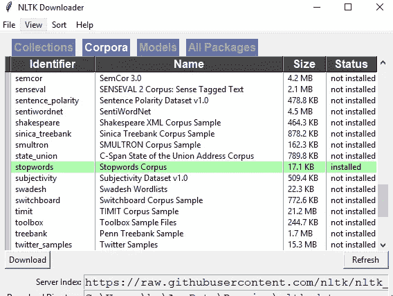

how to download nltk corpus

现在我们用下面的代码导入 nltk 包和语音(这可能需要几秒钟，取决于您的计算机)

```
import nltk
from nltk.corpus import stopwords 
from nltk.corpus import inaugural
from nltk.tokenize import word_tokenize, sent_tokenize
import matplotlib.pyplot as plt
import pyphen
```

现在我们已经导入了就职演说，我们可以看看数据。我们可以看到我们有 56 位总统的数据，从华盛顿到 2009 年的奥巴马。

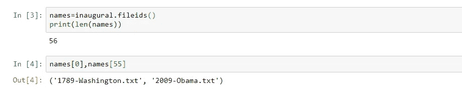

让我们来看看这些演讲。要获得数据的原始格式，我们可以简单地使用`inaugural.raw()`。但正如我们所看到的，我们不能清楚地把它分成单词。幸运的是，我们有`inaugural.words()`为我们做这项工作。

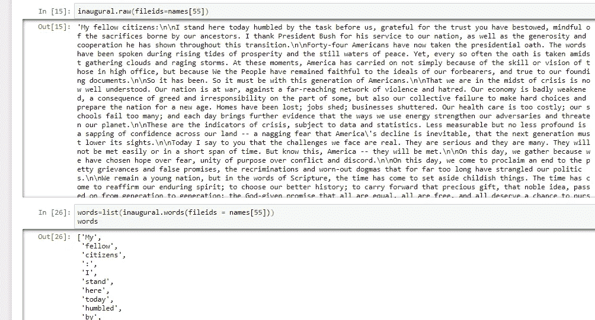

既然我们已经把我们的演讲分解成单词，我们可以开始对它做一些基本的分析。我们从频率分布开始。这将告诉我们一个特定的单词出现了多少次。而且已经按降序排列了。

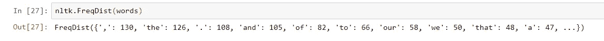

我们遇到了一个问题，它被停用词淹没了。通常有一些单词和标点符号比其他单词和标点符号重复得更频繁，它们通常不会给我们提供更多的数据信息。nltk 已经有了一个类似的单词列表，它们被称为`stopwords`。它们可用于多种语言。我们在导入的停用词列表中添加了一些符号。

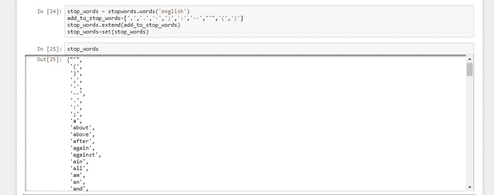

现在我们有了一个停用词列表，我们编写一个小代码来删除演讲中的所有停用词，并再次找出频率分布。

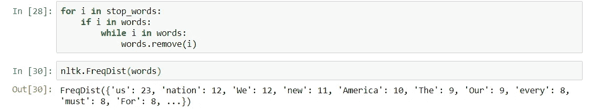

这更好，也给了我们一些关于数据的见解。但这只给了我们一次演讲的数据，我们需要一些东西来比较更多总统的演讲。

所以我们开始计算 xyz 总统使用了多少个 2，3，4 字母单词。然后，我们取每位总统每个词的平均字母数，并绘制出来。

“我感到快乐”——每个单词的平均字母数为 3.33 (1+4+5)/3。

“我散发出欣快感”——每个单词的平均字母数为 4.66(1+5+8)/3。

更高的每个单词的字母数意味着总统最常用“大”字。我们先数一下每位总统用了多少个 x 字母单词。

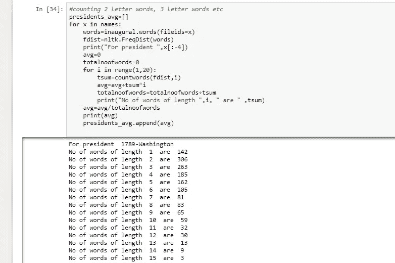

当我们这样做的时候，我们还将每个单词的平均字母数存储在一个名为`presidents_avg`的变量中。使用 matplotlib 来绘制它，我们可以看到它明显地随着时间/总统而减少。

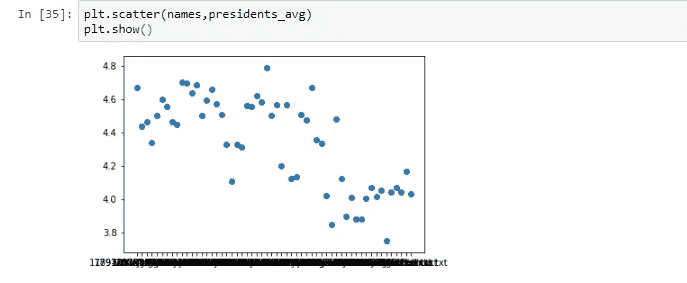

沿着类似的路径，我们开始计算 xyz 总统在一个句子中说了多少个单词。然后我们取每位总统每句话的平均字数，并绘制出来。

每句话的平均字数更高意味着总统最常用“大”句子。我们还将每句话的平均字数存储在一个名为`presidents_avg_words_per_sentence`的变量中。使用 matplotlib 来绘制它，我们可以看到它明显地随着时间/总统而减少。

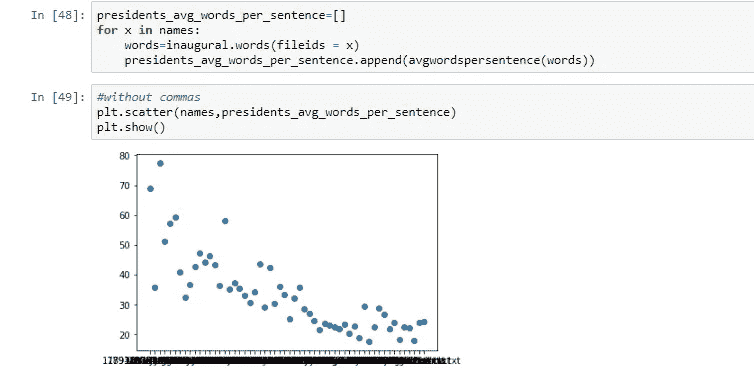

现在让我们看看单体型分析是否能给我们带来什么。在语料库语言学中，hapax legomenon 是一个在语境/言语中只出现一次的词。`words.hapaxes()`给出了给定语料库中所有独特的单词。

但是计算独特单词的数量是不够的。我们还需要用它除以整个演讲的长度。为什么？因为演讲的长度变化很大，所以一个更大的演讲可能有更多独特的单词，我们需要消除这种偏见。因此，我们在一篇演讲中找到独特的词，统计它们，平均它们，并为每位总统绘制它们。

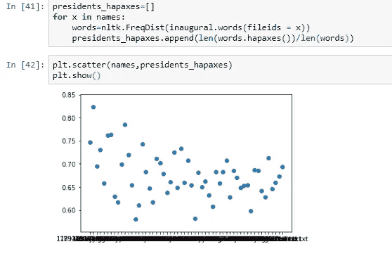

似乎在减少一点，虽然不是很明显。

在最后的分析中，我们计算每位总统在演讲中使用的每个单词的音节，我们使用 pyphen 库，因为像“Afghasnistan”这样的名词通常没有预定义的音节数。

然后我们取每位总统每个词的平均音节数，并绘制出来。

当我们看到图表时，我们看到它随着时间的推移而减少。

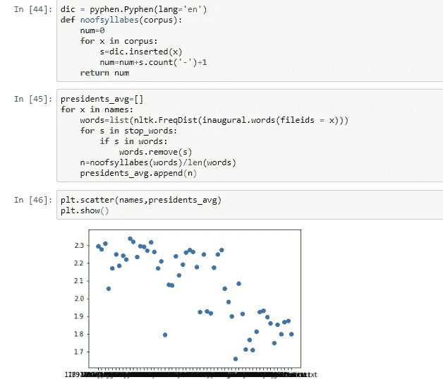

所以相比较而言，现在的总统比以前的总统使用更少的单词和更短的句子。
这可能是由多种原因造成的，英语本身在 200 年的时间里发展了很多，但也可能是因为媒体的进步。随着总统的演讲开始被普通人所接受，他们自然喜欢较短的句子和较小的单词，总统的演讲开始根据新的听众而改变。他们不是为了给华盛顿少数受过教育的人留下深刻印象，而是为了从普通人那里获得选票。