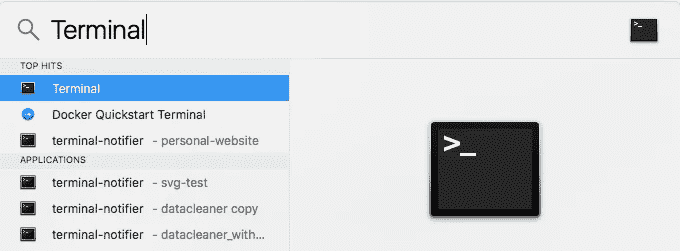

# 使用 Python 读写电子表格简介

> 原文：<https://towardsdatascience.com/intro-to-reading-and-writing-spreadsheets-with-python-b635ae514ab8?source=collection_archive---------5----------------------->

这个帖子是给谁的？

初学者和 Mac 用户(Windows 用户需要先安装和设置 Python)

**你需要什么？**

任何 Mac，一个文本编辑器(我推荐 [Atom](https://atom.io/) )和持久性

你能从中得到什么？

您将学习如何使用 Python 读取、转换和输出电子表格。对于转型，我们将着眼于获得在某个日期之前与我们交谈过的客户。

我到底是谁？

我是[爱电子表格](http://www.lovespreadsheets.com/)的创始人。我们的目标是在 Excel 用户和程序员之间架起一座桥梁。

# I .验证和安装库

首先，我们将检查是否安装了 Python，并安装另一个将帮助我们处理电子表格的库。

*库是一个代码集合，它以一种更简单的方式实现了(通常)难以实现的事情。*

1.  我们需要首先打开终端，让我们与系统进行交互。在 Mac 上进入**搜索**，找到并打开终端



Search and Open the Terminal Application

2.打开你的**终端，**输入 *python* 然后按**回车**

```
$ python
```

*注意:美元符号指定了终端行的开始，在开始处可能会有很多不同的文本* **。**

您应该会看到一个控制台，其中 Python 版本正在运行。我运行的是 Python 2.7，但是本教程和代码将会运行到 Python 3.7。如果你遇到任何问题，让我知道。


Type in python and click enter to see the console

如果这里有一个错误，那么谷歌这个错误，看看你需要做些什么来修复它。

3.如果 python 显示正确，首先我们需要按退出 python

```
Ctrl + d
```

这将把我们带回到带有＄的命令终端

现在我们将安装这个库，它将帮助我们阅读和处理电子表格。它叫做 *pandas* ，我们将用下面的命令安装它。键入以下内容并按下**键进入**:

```
$ pip install pandas
```

我们还将安装另外两个库 *xlrd、openpyxl* 来帮助 Excel 读写。您不会处理这些库，但它们需要安装。

```
$ pip install xlrd openpyxl
```

4.如果成功安装了 *pandas* 库，您将看到一串文本，最后一行声明安装成功。如果您在这里遇到错误，您需要在继续之前修复它。


There will be a bunch of text and it will not match mine but as long as the Successfully installed statement appears with no errors, you are good

同样，如果成功安装了 *xlrd* 和 *openpyxl* 库，您将会得到与 *pandas* 类似的“成功安装”消息

# 二。组织文件

现在，我们将保存示例电子表格并创建一个 Python 文件，我们将在其中编写代码。

5.我创建了一个名为 **CustomerSample.xlsx.** 的样本数据文件，你可以点击[这里](https://lovespreadsheet-tutorials.s3.amazonaws.com/CustomerSample.xlsx)下载。

该文件有两页:*客户*和*潜在客户。*该文件有 8 列虚拟数据。

6.现在我们将创建一个 Python 代码文件。打开 *Atom 或任何文本编辑器。*现在不用写任何东西，保存为 **excel.py** 。


7.有几件非常重要的事情需要记住:

I .**customer sample . xlsx**和 **Excel.py** 文件都应该放在桌面上同一个名为**python spreadsheettutorial**的文件夹中，这里的所有代码才能工作


These aren’t rules but if you are new it’s easier to follow my naming first before branching out

二。文件和文件夹的名称应该是上面的名称，这样代码才能工作

# 三。读取 Excel 文件

如果你已经做到了这一步，恭喜你！大多数人在设置好环境，准备好一切的时候就放弃了。

现在我们终于可以开始有趣的部分了。最后的代码只有 4 行，如下所示。我们将在邮件中分解它

The full excel.py file

8.打开您创建的 **excel.py** 文件，准备编写一些代码

读取文件的整个代码只有 2 行

```
import pandas as pdcustomer_sample_file = pd.read_excel("CustomerSample.xlsx", sheet_name="Prospects", parse_dates=[0])
```

9.第一行告诉 python 我们将在代码中使用熊猫库，我们将把它命名为 *pd*

10.第二行是我们如何阅读熊猫的电子表格。我们创建一个变量**customer _ sample _ fil*e****并存储调用函数**PD . read _excel***的结果(从 Pandas 库中读取 _ excel)**

**11. **pd.read_excel** 函数接受 1 个强制参数**，**电子表格的名称和位置(这就是为什么命名和位置正确很重要，但是如果您决定更改它，您需要在这里将其更改为完整路径)。**

**我们提供了另外两个可选参数， *sheet_name* 和 *parse_dates* 。 *sheet_name* 告诉函数要读取哪个工作表，而 *parse_dates* 获取应该作为日期读取的列的列表。0 指定第一列，依此类推。**

**这个函数有很多你可以指定的参数。我鼓励你在这里阅读它们。**

**您可以试验不同的参数，看看它们能做什么。**

**12.变量 **customer_sample_file** 现在包含了*数据框*中电子表格的所有行和列，因为我们的第一行是列名，所以它们成为了这个*数据框*的列名。**

**如果您打印出 **customer_sample_file** ，那么您会看到它包含以下内容**

****

**THIS IS NOT PART OF THE CODE. I PRINTED THIS SEPARATELY**

# **四。转换文件**

**对于我们的转换，我们将只获取 2017 年或更早时间记录的记录。**

**这部分的代码是 1 行。**

```
**customers_2017_or_earlier = customer_sample_file[customer_sample_file["DateTime Recorded"] < "2018-01-01"]**
```

**13.我们创建了另一个变量**customers _ 2017 _ or _ earlier**，并将其分配给在 2018 年 1 月 1 日之前*记录的客户。***

**14.这分两步完成，内部代码**

```
**customer_sample_file["DateTime Recorded"] < "2018-01-01"**
```

**当记录的*日期时间的列值*小于*2018 年 1 月 1 日*时，为每个记录分配 True 或 False 值，然后是代码的外部部分**

```
**customer_sample_file[customer_sample_file["DateTime Recorded"] < "2018-01-01"]**
```

**从*数据框*中选择那些记录**

# **动词 （verb 的缩写）输出记录**

**太好了，现在我们有了以前的记录，我们可以将它们输出到他们自己的小 Excel 文件中。**

**这个代码也只有一行**

```
**customers_2017_or_earlier.to_excel("Customers2017OrEarlier.xlsx")**
```

**15.我们采用变量**customers _ 2017 _ or _ earlier**并运行函数*来 _excel* 。这个函数接受一个参数，它是您想要创建的新文件的名称**

**16.既然文件已经完成，我们需要运行脚本。为此，我们需要打开**终端、**并导航到保存 **excel.py** 文件的文件夹，即*桌面*上的*python spreadsheettutorial*。**

**在我的终端中运行以下命令，然后按**键进入****

```
**$ cd ~/Desktop/PythonSpreadsheetTutorial**
```

**如果您将 **excel.py** 文件保存在不同的文件夹中，那么您需要指定路径。波浪线表示您位于用户的主目录中，然后构建脚本文件夹的剩余路径。如果它工作正常，那么您将会在$符号变成文件夹名称之前看到名称**

****

**There should be a clear change when you have entered the correct folder**

**17.现在是最后命令的时候了。在我们的*文件夹*中，从**终端**运行以下命令并按下**回车。****

```
**$ python excel.py**
```

****

**Press Enter to run the script and that’s it**

**如果没有错误，那么什么也不会发生，您应该会看到一个新文件出现在您的文件夹中，其中包含 2017 年或之前的所有记录！**

**我希望这有所帮助，如果你有任何问题，请在评论中告诉我！**