# 使用强化学习打乒乓球

> 原文：<https://towardsdatascience.com/intro-to-reinforcement-learning-pong-92a94aa0f84d?source=collection_archive---------5----------------------->

## 对强化学习关键原则的简明介绍

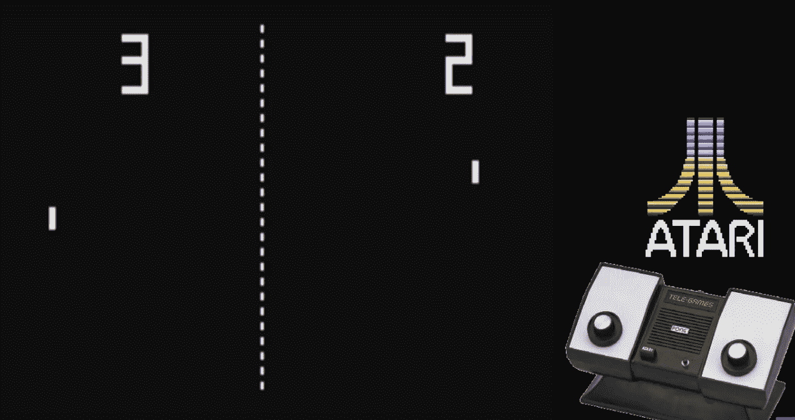

Home version of the Atari Pong console, released in 1975, by Sears Tele-Games [[Source: youtube.com](https://www.youtube.com/watch?v=pifYfvHDHGo)]

这篇文章的目的是通过训练一个代理玩游戏 Pong 的例子来介绍强化学习的一些关键原则。它呼应了很多资源，但我以一种对我来说直观的方式来写它——希望它对其他人也有一些用处。

> 注意:关于神经网络和机器学习的一些知识是假定的，但是不要因此而影响你阅读这篇文章。

# 简要背景

2013 年，[DeepMind 的研究员 Volodymyr Minh](https://www.cs.toronto.edu/~vmnih/docs/dqn.pdf) 与 deep mind 的同事发表了一篇论文，引起了新闻界和机器学习界的关注。在论文中，他们开发了一个系统，该系统使用**深度强化学习**(深度 RL)来玩各种雅达利游戏，包括 Breakout 和 Pong。该系统纯粹从视频游戏显示器的图像/帧的像素作为其输入来训练，而不必显式地编程任何规则或游戏知识。更引人注目的是，论文中详细描述的系统在多个 Atari 游戏中使用(几乎)相同的架构击败了人类的表现，并且基于相对简单的概念，这些概念已经分别在强化学习(RL)和机器学习(ML)领域中被了解和研究了几十年。

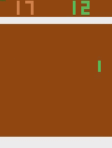

A short snippet of a game that was the output of a Neural Network I trained — the green paddle is controlled by RafAI Nadal.

这一发现是第一个被证明可以推广到多个游戏的方法之一。自 2013 年最初的论文以来，其他几个研究小组已经在雅达利设置和其他几个场景中建立并超过了这些结果，例如 p [奠定 DOTA](https://openai.com/five/) 或[创建一个通用算法，可以通过自我游戏](http://science.sciencemag.org/content/362/6419/1140.full?ijkey=XGd77kI6W4rSc&keytype=ref&siteid=sci)掌握多种游戏，如国际象棋&围棋。

# **怎样才能程序化的打败 Pong？**

如果我们试图在没有任何正式方法的情况下编写代码来击败 Pong，我们可以尝试并捕获所有可能的动作，并查看哪些动作最终导致了游戏的胜利。

为了手动地做到这一点，我们可以根据两个玩家的球和桨的位置，为给定的输入帧选择最佳动作，并在每个场景中提出建议的动作，例如，在场景 A 中，如果 AI 桨在屏幕的顶部，球的轨迹朝向底部，则 AI 应该向下移动。

让我们回顾一下我们在这里处理的数字:模拟 Pong 的 Atari 仿真器输出一个 *210 x160* RGB 显示，这是 *100，800* 像素。这些像素中有许多对于代理理解如何玩 Pong 是不相关的——在[技巧部分](#9e3b)中有更多的相关内容，所以我们可以丢弃它们，但是即使我们减少了 50%的输入像素，我们仍然有大量的像素。

手动计算出一个给定状态的正确动作是非常痛苦的。此外，如果我们编写一些试探法来分组屏幕的各种场景，例如在场景 A 中，并为给定的场景编写一个动作，这将意味着我们最终会编写非常 Pong /游戏特定的代码，这不是我们想要的。

我们如何才能避免手动编写推荐操作的代码？最天真的解决方案是，首先对输入采取随机动作，看看哪些动作有效，并在如下所示的地图中存储给定输入图像中哪些动作效果好(即，导致游戏获胜):

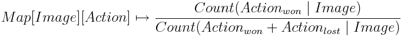

这允许我们估计场景的概率，并通过选择具有最高概率的动作来选择更好的动作。

例如，在 Pong 游戏中，如果我们想要比较给定图像的向上和向下动作，我们会看到下面的分数是否超过 0.5，并且在这种情况下选择向上动作:

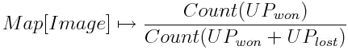

For Pong, assuming we only have UP & DOWN actions, we only need to store counts for either UP or DOWN to get the correct fraction

如果概率是 0.5，我们可以抛硬币选择一个随机动作。

通过大量的游戏和平均，这将很好地工作，因为我们对给定图像的哪些动作有效的经验有助于通知**代理**(基本上是 AI)一个比完全随机的动作更好的动作。上面描述的自动化方法可以更正式地描述为**强化学习，**，因为我们有一个*代理，它正在对其环境执行动作，观察结果，收集奖励，并使用收集的奖励知识来修改任何未来的动作，以便表现得更好。*

尽管上述方法存在一些低效之处:

1.  奖励的**稀疏性**使得这种方法相当无效，因为在游戏过程中可能有多个动作和过渡，但是在 Pong 的情况下，比如说 10 个来回的回合只有一个奖励，每个回合包含大约 10 个动作/移动，所以大约每 100 个动作有一个奖励。其他游戏可能比 Pong 少得多，其中一个动作现在影响游戏进行几分钟，也许几小时后。这使得给一个特定的行为分配信用变得相当具有挑战性。
2.  你可能知道在 Pong 中有一类行动，其中代理人只是保持反弹，而另一类行动可能会赢得比赛，包括在赢得比赛之前的行动。
3.  对于我们以前没有见过的图像，它不会工作得很好，因为它不能处理看起来相似的图像。这意味着我们必须运行更多的迭代，以允许 AI 探索整个状态空间和/或直到我们开始得到好的结果。

天真地将一场胜利游戏中的每一个动作都贴上好的标签是危险的，可能会导致混乱的结果，并且可能需要很长时间才能击败对手。稍后我将[谈到我们如何解决这个问题](https://medium.com/@omkarv/intro-to-reinforcement-learning-pong-92a94aa0f84d#a352)，但首先请阅读 RL 的更正式定义。

# **什么是强化学习？**

RL 的主要前提是通过在多个周期内在**环境**中尝试各种允许的动作，观察那些**动作**的结果，并使用经验来通知未来的动作，来为 AI(在该领域中被称为**代理**)建立经验历史。这是一个反复试验的过程，适合于完全自主运行的代理，不依赖于人的输入。对于一个学习有效玩 Atari Pong 游戏的 AI 代理来说，它需要玩多轮游戏，观察给定输入*图像的哪些动作效果最好，然后修改其行为以增加对输入效果好的动作的频率，反之亦然。

> ****暂且不提对强化学习感兴趣的术语***
> 
> *注意，输入对应于我们的 Pong 示例的状态。* ***状态*** *是代理认为它对允许它做出决策的环境的了解的表示。*
> 
> *代理的环境可以是***或* ***部分可观察的*** *:在 Pong 的情况下，环境是完全可观察的，假定整个游戏区域是可见的，并且可以完全被输入图像所占据。完全可观察的环境，其中输入映射到状态的情况很少发生，例如在现实生活场景中，机器人使用相机在户外导航其环境，它部分观察其环境并基于其观察结果计算状态，这可能是存储障碍物及其感兴趣特征的某种地图。在这种情况下，摄像机输入并不映射到整个状态，而是只贡献其中的一小部分。**

*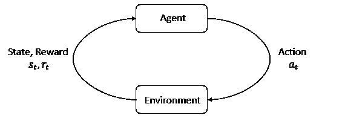*

*A simple diagram showing the way in which an Agent interacts with its environment [Source — [OpenAI Spinning up](https://spinningup.openai.com/en/latest/spinningup/rl_intro.html)]*

*RL 使用**奖励**的想法来决定执行哪些动作，对于 Pong 游戏，代理人每赢一轮，奖励就是+1，而对手 CPU 每赢一轮，奖励就是-1。对于其他游戏，如太空入侵者，奖励可以与击落不同类型的外星人获得的分数增量挂钩，但在现实生活中，计算奖励可能会更棘手，尤其是在没有明显的单一分数或目标需要优化的情况下。*

*在 RL 领域中，**策略**是规则、策略或行为功能，它评估并推荐给定特定状态的下一个动作；实际上，它可以被认为是从国家到行动的地图。一个策略在本质上可能是**确定性的**或**随机的**，由于一个 RL 代理的最终目标是最大化它的回报，我们希望选择一个策略来最大化给定行为的未来预期回报。Pong 情况下的策略帮助代理选择一个可能的动作，即向上、向下移动球拍或什么也不做。*

*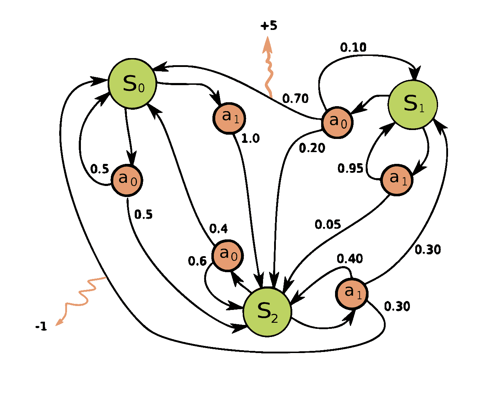*

*Markov Decision Process diagram [Source — [Wikipedia](https://en.wikipedia.org/wiki/Markov_decision_process#)] . Green Circles represent states, red nodes represent actions, decimals represents probabilities of given actions, lines represent transitions between states. The expected reward for a transition is represented by the number at the end of the yellow wiggly line*

*RL 基于称为**马尔可夫决策过程** (MDPs)的模型，这些模型是包含与环境中的可能状态相对应的不同节点的状态图，以及与代理可能采取的行动、其概率和预期回报相对应的状态之间的链接/边。Pong 也可以建模为 MDP，其中桨&球的每个配置都是一个状态，每个状态都有两个可能的状态转换箭头，每个转换都有一个奖励 0，除了最终的终端状态，奖励可能是+1 或-1。将问题公式化为 MDP 允许我们受益于马尔可夫属性，该属性陈述:*

> *"鉴于现在，未来独立于过去."*

*MDPs 的主要优点是，当前状态可以完全描述问题的特征，并允许代理独立于历史做出最优决策，因为历史可以编码在当前状态中。*

> *****暂且不提对强化学习感兴趣的术语****
> 
> ****值函数*** *是一种评估给定状态或状态-动作对有多好的方法，可用于选择试图将代理转换到未来状态的动作。有多种类型的价值函数，它们对将用于计算价值的政策做出不同的假设。要获得大量资源，请查看* [*OpenAI 对值函数类型的解释*](https://spinningup.openai.com/en/latest/spinningup/rl_intro.html#value-functions) *。**
> 
> **在* ***基于模型的*** *学习中，模型编码了一种对世界的理解，这种理解是由一个代理探索其环境而获得的，并且这种对世界的理解被用于在执行任何动作之前提前计划和计算对未来状态的期望。基于模型的代理的缺点是选择一个动作会导致较高的计算成本，但是可能更适合于具有大量状态的环境，其中评估所有状态是不可能的，例如在国际象棋游戏中。**
> 
> **在* ***无模型*** *学习中，一个智能体利用没有关于世界的先验知识，例如物理定律，关于如何玩其他游戏的知识，来采取一个行动。在这篇文章中，我们使用了一个无模型代理，因为神经网络被用来直接选择未来的行动，而政策并没有直接给我们任何关于世界未来状态的预测。**
> 
> ***稍后我们将使用一个非常简单的优势函数，它是一个标量。***

## *在一场胜利的游戏中，除了给每个动作平均分配奖励，我们还能做得更好吗？*

*前面描述的随机方法结合存储获胜动作的计数可以被描述为一种策略，一种糟糕的策略，但仍然是某种策略。*

*我们可以做得更好的方法之一是通过**奖励折扣**更明智地分配行为奖励。在代理人收到奖励之前的最近动作或帧是最相关的，因此在正面奖励的情况下应该鼓励，在负面奖励的情况下不鼓励。从收到奖励时起，时间上更早的任何行为或帧都被归因于指数因子贴现因子*γ(γ)*的较少功劳，在本文稍后编码的[示例中将其初始化为 0.99](#6650):*

```
*1\. def discount_rewards(rewards):2\.    discounted_r = np.zeros_like(rewards)3\.    sum_of_rewards = 04\.    for t in reversed(xrange(0, rewards.size)):5\.        if rewards[t] != 0: running_add = 06\.        sum_of_rewards = sum_of_rewards * gamma + rewards[t]7\.        discounted_rewards[t] = sum_of_rewards8\.    return discounted_rewards*
```

*这段代码是在一集的基础上运行的(一集是一系列回合，直到一个玩家达到 21 岁)，但实际上我们只对一个回合应用折扣，因为上面第 5 行的`sum_of_rewards`变量在奖励不为零时被重置，这是在每个“回合”结束时。*

*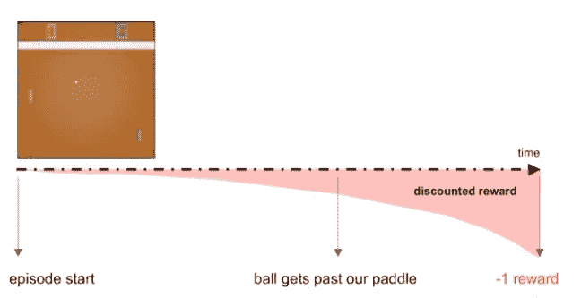*

***The effect of discounting rewards** — the -1 reward is received by the agent because it lost the game is applied to actions later in time to a greater extent [Source — [Deep Reinforcement Bootcamp Lecture 4B Slides](https://www.youtube.com/watch?v=tqrcjHuNdmQ)]*

*折扣的效果是更准确地将奖励归因于可能对奖励有重要贡献的行为，因此帮助我们更接近我们想要的地方。*

*Pong 有一个非常简单的奖励设置，因为只有赢得游戏的奖励，但在更复杂的问题中，折扣函数可以用作 RL 问题中值函数的一部分，以根据预期的未来奖励来评估状态:*

*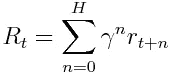*

*Finite-horizon reward discounting function, *γ* is the discounting factor, *n* is the number of timesteps, *r* is the magnitude of the reward for a given timestamp *t + n*, and *H* is the horizon for which we count the rewards. *H* may be infinity if we wish to account for actions an infinite amount of time away, which in practice is difficult.*

# ***更好的架构是什么样子的？我们实际上是如何编码的呢？***

*正如前面所观察到的，手动尝试捕获程序的状态是很棘手的-来自 DeepMind 论文的关键见解是使用神经网络作为一种手段来近似策略函数，而不必为每个输入图像状态显式编码。*

*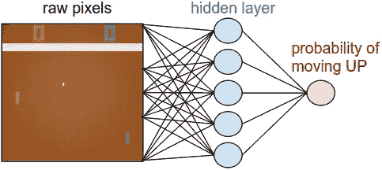*

*Architecture of the Neural Network used in the code example later in this post [Source — [Andrej Karpathy, Pong from Pixels blog post](http://karpathy.github.io/2016/05/31/rl/)]*

*策略函数，或称**策略网络**，用于根据 Pong 和许多 Atari 游戏的输入来决定下一步做什么，是一个具有 n 个隐藏层的*全连接*神经网络，这就是为什么这种方法被称为 *Deep* RL，尽管在本文中我们只有一个隐藏层。神经网络将游戏的一帧图像作为输入，其中每个像素对应于一个单独的输入神经元，并输出一个介于 0 和 1 之间的小数概率，该概率对应于我们的代理过去对类似图像采取的行动是向上移动的概率。请注意，如果概率低于 0.5，并且越接近 0，代理采取向下移动的动作的概率越高。由于该策略输出一个概率，因此该策略是随机的。*

*对于隐藏层代表什么的直觉，它可以被认为对应于各种游戏场景，例如，一个可能的场景是球向上移动，代理桨在底部。在下面的链接代码中，我们在隐藏层中有 200 个单元，这比 6400 个输入神经元减少了很多(参见[技巧预处理部分](#9e3b)了解我们如何从 100000 像素增加到 6400 像素)。*

*隐藏层中的单元数量是系统的**超参数**，对于我们的系统，我们有 200 个单元。这个数字是我们需要多少表示的粗略猜测，但在实践中，我们将使用自动方法来确定隐藏层的数量和大小。*

*隐藏层的输出被映射到一个 **sigmoid 函数**，它有效地将输出压缩到 0 & 1 之间的概率范围内。*

*然后，我们使用这个神经网络输出和一个锁定的随机数生成器来生成一个介于 0 和 1 之间的浮点数，以确定下一步是上涨还是下跌。*

```
*action = 'DOWN' if np.random.uniform() < action_prob else 'UP'*
```

*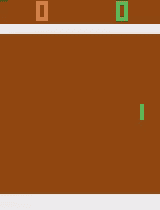*

*Playing pong before much training, the green paddle, RafAI Nadal, is struggling to keep up since it is initially performing completely random actions*

*随机数生成器的目标是引入对新状态的**探索**，这在早期神经网络无法真正区分好的行为和坏的行为时至关重要，因为神经网络权重是随机初始化的，并且由于 sigmoid 函数的形状，任何给定输入图像的概率输出都接近 0.5。这导致我们的代理人随机采取一系列行动，起初没有协调感…附带说明:根据随机因素调整的计算行动概率选择行动的过程也称为**采样。***

*随着神经网络越来越多地被训练，并且假设政策平均回报增加，随机性因素起着较小的作用，因为随着时间的推移，应该采取某个行动的概率更接近于 0 或 1 的极端值，并且`action_prob`决定结果。有助于代理探索状态空间的另一个因素是随机策略的使用——如果策略是确定性的，我们将只依赖随机数生成器进行探索，这最初是好的，但是这将意味着任何新的动作都是完全随机的，并且较少受 NN 捕获的先验概率的驱动。由于代理停止探索状态空间，探索的减少和对已知良好动作的更大利用**也会使策略陷入局部最优。***

*神经网络方法的另一个好处是，如果前面描述的映射实际上没有遇到输入图像，这对神经网络来说不是问题，因为大部分像素可能与神经网络已经看到和训练的图像相似，所以神经网络可能输出与先前看到的图像相似的预测。同样，我们可以手动进行这种相似性比较，但这需要更多的工作，而且神经网络是免费的。*

## ***但是当&强化学习中的神经网络是如何得到训练的呢？***

*强化学习(RL)使用尝试各种动作的多个周期来教会自主代理如何在环境中执行任务。*

*在一个**情节** *** 中，在多个**回合** *** 中尝试了一系列动作之后，我们*通过使用该情节中发生的所有动作来训练*NN。*

> *Pong 中****回合*** *对应其中一方玩家获得分数&奖励 1 并赢得一场拉力赛，输的玩家获得分数 0 和奖励-1。**
> 
> *在 Pong 比赛中，安* ***第一集*** *一直进行到其中一名选手得分达到 21 分。剧集是一个术语，在所有* [*OpenAI 健身房环境*](https://gym.openai.com/docs/) *中使用，包含一个严格定义的任务。**

*要更深入地了解神经网络是如何训练的，请继续阅读…*

*在**监督学习**中，我们通常有代表样本输入的基本事实的标签，这有助于我们计算损失(预测和实际标签之间的差异)，进而有助于我们使用反向传播和优化算法调整神经网络的权重。*

*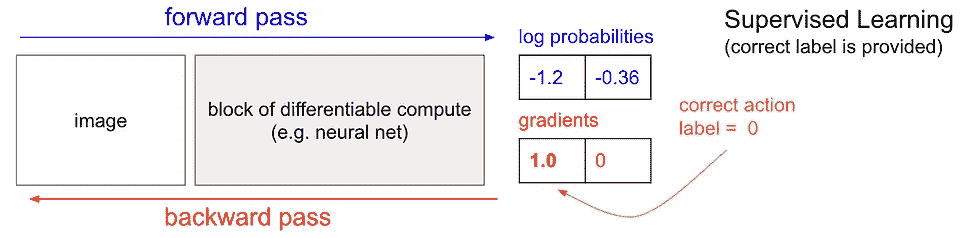**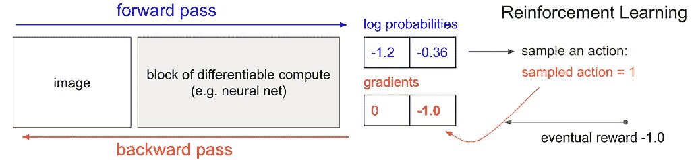*

*Supervised learning has a lot in common with Policy Gradients [Source — [Andrej Karpathy’s blog](http://karpathy.github.io/2016/05/31/rl/)]. **The diagram on the left shows the supervised learning case**: an image of Pong in which the agent’s best action is DOWN, and there is a label corresponding to the DOWN action, therefore the gradient that encourages the DOWN label for the input image is encouraged. **The diagram on the right shows the Policy Gradient case:** an image of Pong in which the action ‘sampled’ was UP, however given the game in which the action took place led to an eventual reward of -1 (due to a loss), a negative gradient is used to discourage the UP action for the given image.*

*在 RL 中，没有标签，也没有地面真相，所以我们改为使用*假标签*，它对应于一轮结束时收到的奖励，以便计算损失和梯度。如同常规的监督学习一样，损耗和梯度向量被用于使用反向传播和优化算法来更新 NN 权重，该算法被用于鼓励导致正奖励的行为(通过增加其输出概率)，反之则为负奖励。*假标签*由我们之前计算的贴现*优势*因子 A *i、*决定，其大小取决于我们对该行为的奖励贴现多少。让我们看一个例子:*

*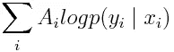*

*The loss function for the Neural Network that implements the Policy Gradient. y is the action we happened to sample given the image x, and A is a number that we call an **advantage**, which is a number from between -1 & 1 for our Pong example**.** Maximize this function for when an action has a positive reward, minimize when action has a negative reward*

*如果我们的策略采样的动作是向上，但是发生该动作的一轮导致最终奖励-1，因为它是一个失败的一轮，负梯度用于阻止给定图像的向上动作-参见上图右侧的直观解释。*

*请注意，我们只能在 Pong 的一轮比赛结束后更新 NN 的权重，因为当我们知道这一轮比赛的结果时，我们只能得出*优势因子*/*假标签*。*

*这种技术被称为**策略梯度**，因为我们使用梯度向量来更新 NN 权重，以改进 RL 问题中用于选择动作的策略。当通过足够的迭代训练时，策略梯度是一种非常有效的方法，它可以让我们训练出一个平均可以击败 Pong CPU 玩家的代理。*

# ***提高我们代理绩效的其他“技巧”***

*我们可以做一些小技巧来帮助我们减少计算时间，在给定的“挂钟时间”内运行更多的剧集，并总体上提高性能。*

***图像预处理***

*   ***图像裁剪** —正如你从 Pong 截图中看到的，有许多冗余区域对我们的算法没有任何价值，例如分数部分，以及分数下方的白色条。这有一个额外的好处，允许我们忽略比赛结果已经决定的部分，即在球已经过了挡板之后。*

*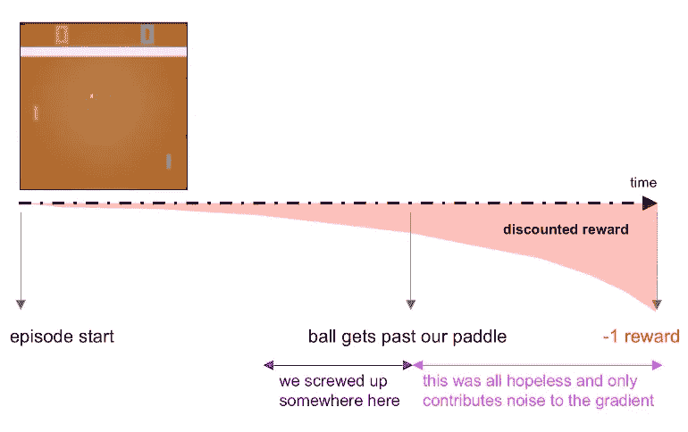*

*Diagram illustrating the case for ignoring / cropping the image section after the ball passes the paddle [Source — [Deep RL Bootcamp](https://www.youtube.com/watch?v=tqrcjHuNdmQ) Lecture]*

*   ***灰度** —像素的颜色是不相关的，因此我们可以移除它们，无论是背景色还是桨色。球拍和球可以是相同的颜色，但应该是与背景不同的颜色。*
*   ***下采样/降低分辨率** —让我们更少关心图像，并降低内存和计算要求。*

*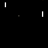*

*Pong image after cropping, downsampling cropping*

*所有这些预处理步骤允许我们将超过 100，000 像素的图像转换为 6400 像素(80px * 80px 图像)，如右图所示。*

## *数值方法*

*   *获取一帧和另一帧之间的差异，而不是仅仅向神经网络提供图像——这允许我们捕捉图像中的运动*
*   *RMS Prop 优化算法用于更新神经网络中的权重——每 10 集我们进行一次参数更新，以确保神经网络梯度得到调整，从而尝试更快地收敛*
*   *在将奖励传递给反向传播算法之前，将奖励标准化(减去平均值，除以标准偏差)。*

# *编写代理程序*

***库& GitHub 库***

*代码使用了 *python* 和 *numpy* ，但没有深度学习库——正向&反向传播步骤是手工完成的。此外, [OpenAI gym environment](https://github.com/openai/gym) 用于加载 Atari Pong 仿真器并接收输入，这允许我们的代理采取行动。健身房环境也将奖励从环境反馈给我们的代理——因此我们不需要手动解析游戏图像中的分数。*

*更多细节可在 GitHub Repo 中找到:*

*[](https://github.com/omkarv/pong-from-pixels) [## omkarv/像素乒乓

### 训练神经网络从像素播放 Pong-omkarv/Pong-from-pixels

github.com](https://github.com/omkarv/pong-from-pixels) 

这个回购是基于安德烈·卡帕西的出色报道和要点。我添加了解释性的行内注释，录制视频功能，修复了一个小问题，所以我现在比基本报告裁剪更多的图像宽度，原因如上所述。

我修改了学习率，使其比源 repo 收敛得更快，并实现了一个提高性能的修复。

超参数值也可以在上面的报告中找到，但被设置为源报告的默认值，除了 RMSProp 的学习率被设置为 1e-03，而不是 1e-04，因为它的训练速度比 1e-03 快 3-4 倍。

**接受过 GitHub 回购培训的代理的表现**

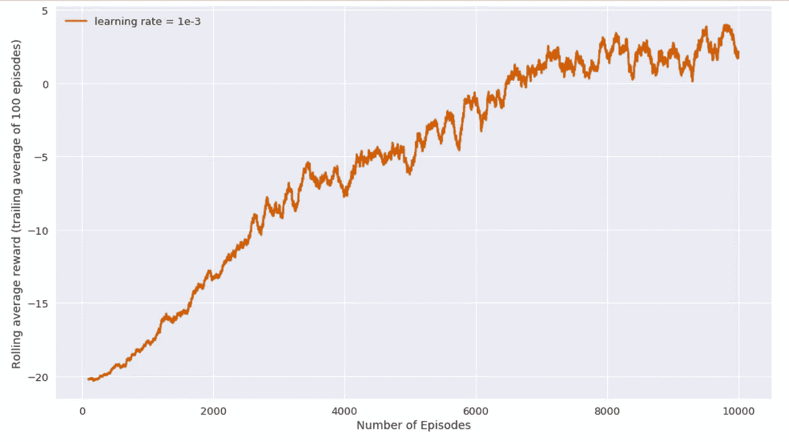

Average reward per episode for the agent

玩这个游戏的代理在大约 13 个小时的时间里接受了 10000 集的训练，使用的是 2.6GHz i7 (6 核)的 MacBook Pro 2018。

在后面的 100 集里，在我停止训练的那一点，每集的运行平均分数是 2.5，也就是说，**训练的** **AI 智能体将赢得每集 21 分，达到 18.5 分**。这篇博文的目标已经达到，所以我们现在可以停止了，但是如果你想知道进一步的训练是否会产生更好的表现…

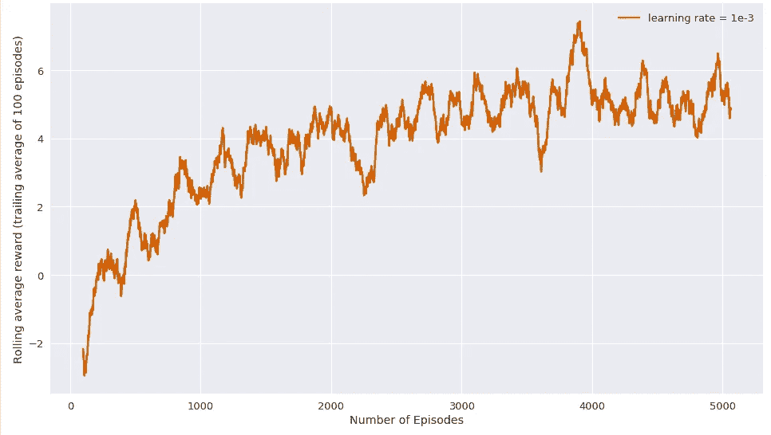

在暂停训练脚本后再训练 5000 集，在大约 10 小时的时间内，每集的运行平均分数达到 5，即**被训练的 AI 智能体将赢得每集 21 分对 16 分**。随着剧集数量的增加，回报明显减少且更加嘈杂。噪音可以通过降低学习速度来减少，但代价是训练时间。

我还运行了没有上述 bugfix 的基本代码，并获得了更差的性能——花了 12000 集才达到每集-5 的尾随平均分数。性能上的差异有多少可以用 bugfix 或用于发现新状态的随机性来解释，这并不明显，只能通过两种解决方案的重复迭代来测试，不幸的是我没有时间进行测试。

# **感谢阅读！**

# **参考资料/灵感**

*   动词 （verb 的缩写）Mnih，K. Kavukcuoglu，D. Silver 等人，[用深度强化学习玩雅达利(2013)](https://arxiv.org/abs/1312.5602) ，NIPS 深度学习研讨会 2013
*   安德烈·卡帕西，[学习玩像素乒乓](http://karpathy.github.io/2016/05/31/rl/)
*   [深度 RL 训练营视频](https://www.youtube.com/watch?v=tqrcjHuNdmQ)
*   [开放 AI 在 RL 中加速旋转](https://spinningup.openai.com/en/latest/spinningup/rl_intro.html)
*   [大卫·西尔弗深度 RL 系列讲座](http://www0.cs.ucl.ac.uk/staff/d.silver/web/Teaching.html)*