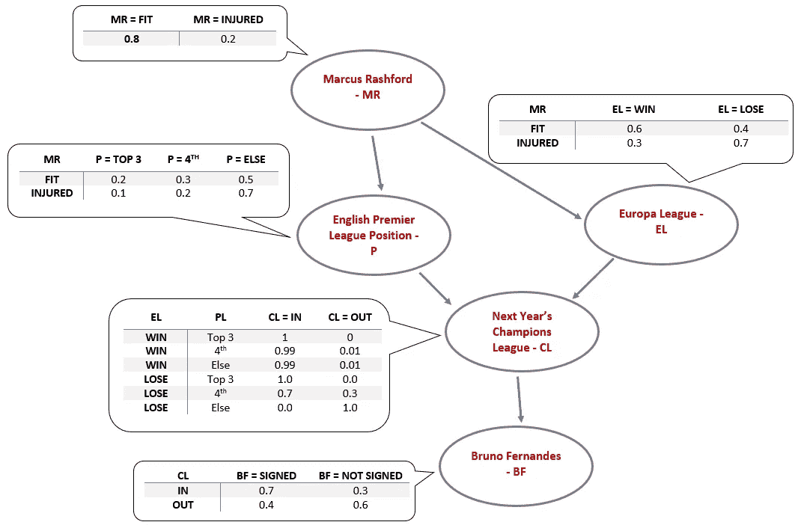
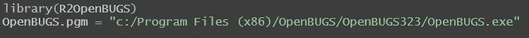
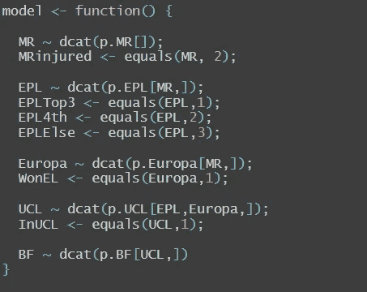
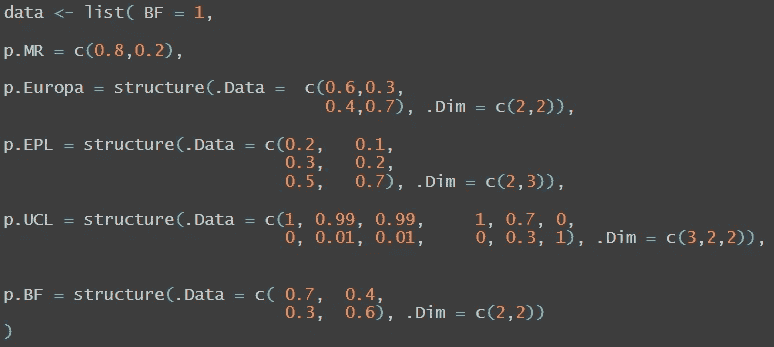
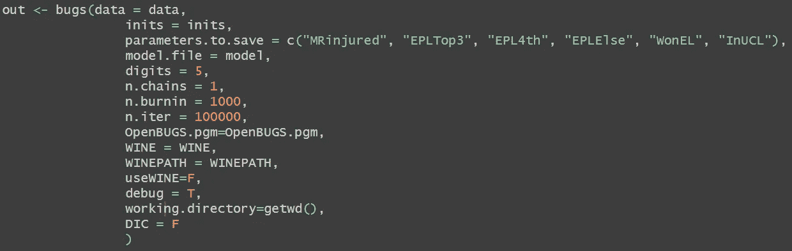
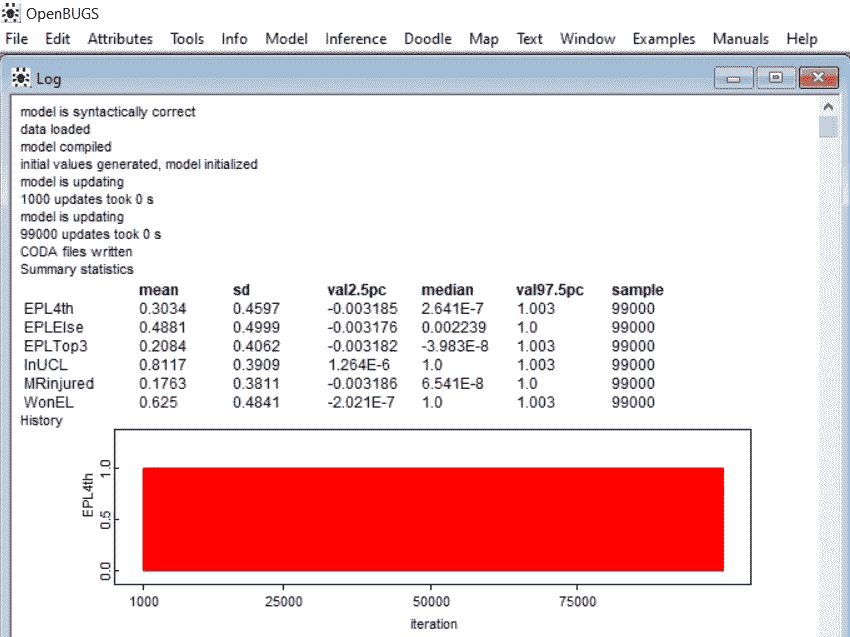
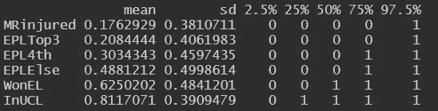

# 用 R 语言中的 OpenBUGS 求解基本贝叶斯网络简介

> 原文：<https://towardsdatascience.com/intro-to-solving-basic-bayesian-networks-with-openbugs-in-r-51def271f3ed?source=collection_archive---------31----------------------->

贝叶斯网络是一种概率图形模型，它通过有向无环图表示一组变量及其条件依赖关系。“定向的”意味着连接图的节点的箭头是定向的(即具有方向)，因此条件依赖具有单向方向。“无环”是指不可能通过网络循环。它只能上升或下降。

让我们从一个例子开始:

> 曼彻斯特联队正在参加英格兰超级联赛。在俱乐部历史上最成功的教练弗格森爵士退休后，他们一直在努力保持他们作为世界上最大的俱乐部之一的形象。去年，他们在联赛中只获得了第 6 名。因此，在 2019/20 赛季开始时，球迷们认为俱乐部将以 0.2 的概率排名联盟前 3，以 0.3 的概率排名第 4，以 0.5 的概率排名前 4。
> 
> 这些可能性只有在俱乐部的关键球员马库斯·拉什福德整个赛季都没有严重受伤的情况下才成立。他受重伤的概率是 0.2。如果发生这种情况，上述季末头寸的概率分别为 0.1、0.2 和 0.7。
> 
> 如果他们以前 3 名结束，他们将获得明年冠军联赛小组赛的资格。如果他们获得第四名，他们将不得不通过冠军联赛资格赛，因此他们进入冠军联赛小组赛的概率降低到 0.7。
> 
> 曼联也在参加欧洲联赛，欧洲冠军联赛的第二梯队。作为前冠军，如果拉什福德身体健康，他们有 0.6 的概率再次赢得欧联杯。如果拉什福德受伤，概率降低到 0.4。如果他们赢得欧联杯，那么他们即使进不了前 3，也保证以 0.99 的概率在明年的欧冠小组赛中占有一席之地，除非欧足联改变明年的规则。
> 
> 如果俱乐部获得了明年冠军联赛小组赛的资格，他们将有 0.7 的机会签下他们的首要转会目标之一，来自里斯本竞技的布鲁诺·费尔南德斯。如果没有，签下费尔南德斯的几率降低到 0.4。
> 
> 2020/2021 赛季初，布鲁诺·费尔南德斯是曼联球员。
> 
> -拉什福德受伤的概率有多大？
> 
> -俱乐部获得欧冠资格的概率有多大？
> 
> -俱乐部进入前 3 名的概率有多大？
> 
> -俱乐部获得第四名的概率有多大？
> 
> -俱乐部赢得欧联杯的概率有多大？

当涉及的变量和依赖项的数量很小时，这种类型的一些问题可以直接使用贝叶斯定理公式来解析求解。然而，对于像上面的例子这样的问题，使用贝叶斯分析的软件应用程序来找到有问题的概率要容易得多。



这里，我们将使用 R 中的库“R2OpenBUGS”来求解这些概率。该库基于 [**OpenBUGS**](https://en.wikipedia.org/wiki/OpenBUGS) 软件，用于使用[马尔可夫链蒙特卡罗(MCMC](https://en.wikipedia.org/wiki/Markov_chain_Monte_Carlo) )方法对复杂统计模型进行贝叶斯分析。“bug”代表([贝叶斯推断](https://en.wikipedia.org/wiki/Bayesian_inference)使用[吉布斯采样](https://en.wikipedia.org/wiki/Gibbs_sampling))。因此，要运行这个库，需要安装 OpenBUGS。安装说明可以在 [**这里**](http://www.openbugs.net/w/Downloads) 找到。

首先，我们导入库“R2OpenBUGS ”,并定义 OpenBUGS 程序的安装路径。



然后，我们将定义我们的模型



这里，先生表示马库斯·拉什福德，当先生大约为 2 时，拉什福德受伤，我们将该事件分配给受伤先生。请注意，在这种情况下，当先生在 1 左右返回时，拉什福德是合适的。这些事件的顺序可能会改变，这取决于我们以后如何分配概率。在这种情况下，我们几乎可以映射像(MRfit，MRinjured) -> (1，2)这样的事件。

类似地，还定义了其他变量。请注意，由于曼联在英超(EPL)的表现取决于马库斯·拉什福德的状况，因此在我们定义 EPL 变量时，“先生”变量也包括在内。其他依赖项也遵循类似的方式。

接下来，我们分配我们拥有的数据(即概率、确凿证据)。



我们看到 BF 被设置为 1。这是因为我们从这个问题中知道布鲁诺·费尔南德斯将在本赛季结束后与曼联签约。因此，这是确凿的证据，我们将 BF 变量赋值为 1。

其余的数据是给定的概率。具有相关性的概率具有矩阵的形式。请注意，这里定义矩阵的方式不同于 OpenBUGS 本身的原生矩阵配置。更多关于如何在 OpenBUGS 软件上定义矩阵的信息可以在 [**这里**](http://www.openbugs.net/Manuals/ModelSpecification.html) 找到。

接下来，我们需要遵循一个默认的强制步骤，称为初始化。然而，这更适用于涉及连续随机分布的问题，我们不需要在这里初始化任何值。但是，如果我们没有给初始化步骤赋值，那么这个包会返回一个错误，所以我们把它赋值为 NULL。


现在，我们可以运行模型来计算有确凿证据的概率。



“调试”默认为假。但是，建议将其切换为 True，因为在模型不运行的情况下更容易看到错误。我们现在可以运行代码让模型运行起来。这里，我们将运行并迭代模型 100，000 次，然后丢弃前 1，000 个结果，以确保不包括任何大的初始变化。

当模型运行时，OpenBUGS 将打开并显示一个类似上面的窗口。



它包含了我们正在寻找的所有答案，但是如果我们希望一切都在 R 中，我们将需要关闭应用程序，以便 R 代码可以完成运行。然后我们使用下面的代码在 r 中显示结果。



鉴于布鲁诺-费尔南德斯与曼联签约的消息，曼联获得明年欧冠参赛资格的概率为 81%。他们赢得欧联杯的概率也提高到了 62.5%。他们在英超联赛中获得前 3 名或第 4 名的概率也略高，分别为 20.8%和 30.3%。

值得注意的是，马库斯·拉什福德受伤的概率降低到了 17.6%，因为他对球队的表现起着重要作用，并直接影响到球队是否有资格参加 UCL 的比赛，这直接影响到费尔南德斯是否决定与曼联签约。

```
library(R2OpenBUGS)
OpenBUGS.pgm = "c:/Program Files (x86)/OpenBUGS/OpenBUGS323/OpenBUGS.exe"#Setting up the model
model <- function() {

 MR ~ dcat(p.MR[]);
 MRinjured <- equals(MR, 2);

 EPL ~ dcat(p.EPL[MR,]);
 EPLTop3 <- equals(EPL,1);
 EPL4th <- equals(EPL,2);
 EPLElse <- equals(EPL,3);

 Europa ~ dcat(p.Europa[MR,]);
 WonEL <- equals(Europa,1);

 UCL ~ dcat(p.UCL[EPL,Europa,]);
 InUCL <- equals(UCL,1);

 BF ~ dcat(p.BF[UCL,])
}#Hard evidence: 1 is TRUE and 2 is FALSEdata <- list( BF = 1,p.MR = c(0.8,0.2),p.Europa = structure(.Data =  c(0.6,0.3,
                         0.4,0.7), .Dim = c(2,2)),p.EPL = structure(.Data = c(0.2,   0.1,    
                   0.3,   0.2, 
                   0.5,   0.7), .Dim = c(2,3)),p.UCL = structure(.Data = c(1, 0.99, 0.99,     1, 0.7, 0,
                    0, 0.01, 0.01,     0, 0.3, 1), .Dim = c(3,2,2)),p.BF = structure(.Data = c( 0.7,  0.4,
                            0.3,  0.6), .Dim = c(2,2)) 
)#Initialization
inits <- NULL#Run BUGS and save resultsout <- bugs(data = data, 
                inits = inits, 
                parameters.to.save = c("MRinjured", "EPLTop3", "EPL4th", "EPLElse", "WonEL", "InUCL"),
                model.file = model, 
                digits = 5,
                n.chains = 1,
                n.burnin = 1000,
                n.iter = 100000,
                OpenBUGS.pgm=OpenBUGS.pgm, 
                WINE = WINE, 
                WINEPATH = WINEPATH,
                useWINE=F,
                debug = T,
                working.directory=getwd(),
                DIC = F
                )print(out$summary)
```