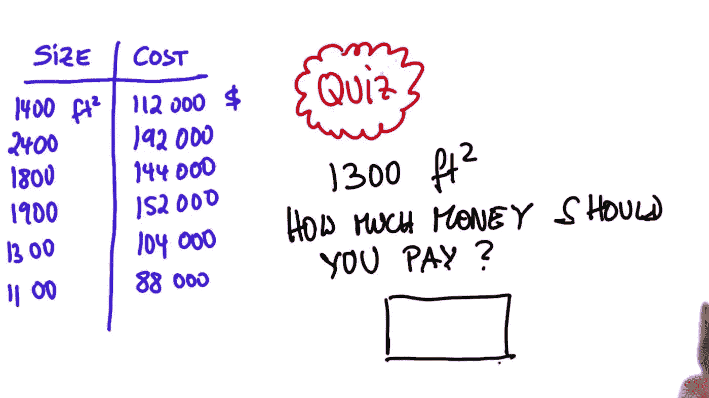
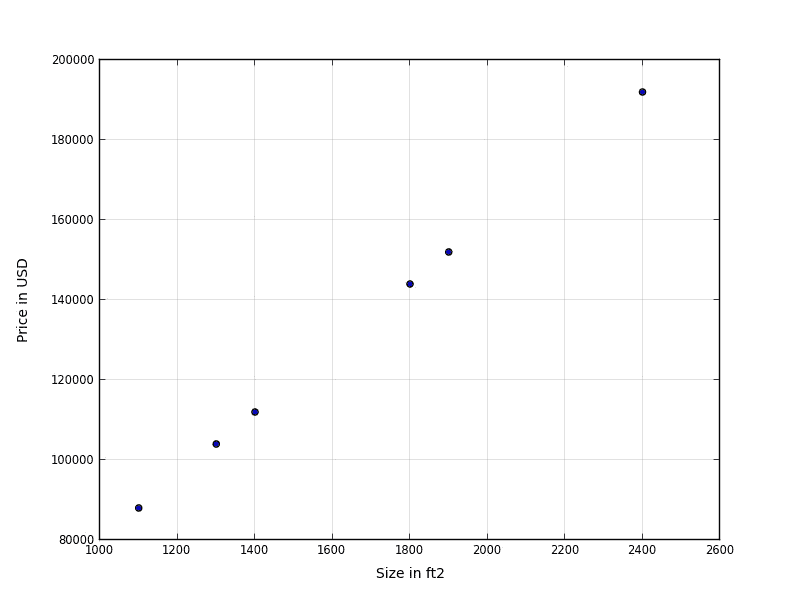
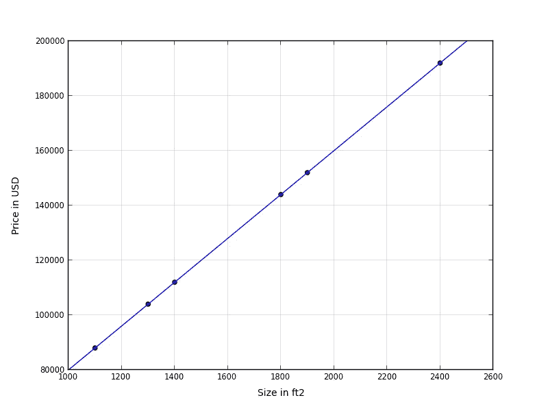
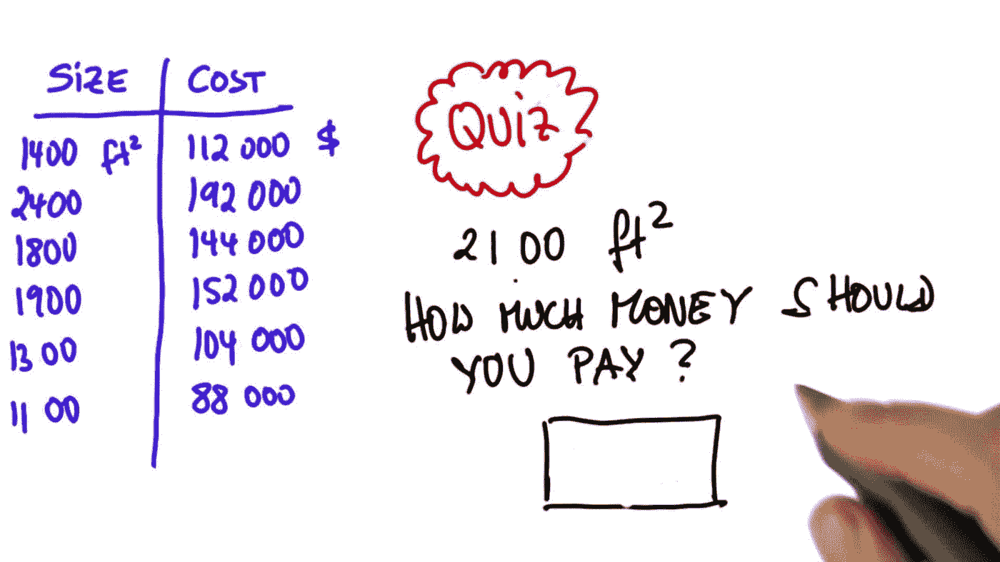

# 统计学简介—查看数据

> 原文：<https://towardsdatascience.com/intro-to-statistics-looking-at-data-1-23c49ef2bbd8?source=collection_archive---------15----------------------->

有许多关于统计的免费学习课程和资料。

统计学可以有效地用于分析、估计，有时甚至预测现实世界的事件。当正确使用时，它将引导我们根据数据观察做出更好、更安全的决策。它是数据科学中的基本支柱，也是许多领域中极其有用的工具。

你能找到的最优秀的课程之一是**【乌达城统计学导论】。**

*你会发现一个温和的和自定进度的领域介绍。对于那些像我一样在大学学位完成几年后对数据科学感兴趣的人来说，更新知识并开始在自己的模型中工作是完美的。我想全面地介绍一门统计学课程，作为课程完成的一部分，我正在写一些关于所有测试、编码和补充研究的帖子。*

*这些帖子可以在不参加课程的情况下阅读，因为它们主要涉及小测验，但我想对正在参加或考虑参加的人来说会更有趣——这是我强烈推荐的。*

*我希望你喜欢它们，让我们开始吧。*

# *第 2 课:查看数据*

*在本课程的第 2 课中(第 1 课只是一个预告片)，通过一组关于房价的实际例子介绍了数据探索的基本概念。*

*这些概念引入线性回归作为估计值的最简单形式。给定一个遵循直接关系的样本数据集，您可以估计一个表示直线的函数，这将使您能够估计任何值。*

*第一个数据集显示以下值:*

**

*Quiz: Valuing Houses 1 – Image from Udacity Intro to Satistics –*

*在这种情况下，首先要做的是绘制值。我们可以通过下面的源代码轻松实现:*

> *# -*-编码:utf-8 -*-*
> 
> *导入 matplotlib
> matplotlib . use(' Agg ')*
> 
> *将 numpy 作为 np 导入
> 将 matplotlib.pyplot 作为 plt 导入*
> 
> *size = [ 1400，2400，1800，1900，1300，1100]
> cost = [ 112000，192000，144000，152000，104000，88000]*
> 
> *plt.scatter(size，cost)
> PLT . save fig(' values 1 . png ')*

**

*Valuing Houses — Plot 1*

*这是一个理想化的场景，其中所有的点都正确对齐。没有必要做数学来提取线参数来回答一个 1300 英尺的房子多少钱，这个问题是数据的一部分*和*所有的数据点完全对齐。请注意，如果这些点没有对齐，数据集中的精确数据点并不意味着价格有效。*

*即使这是一种理想化的情况，并且不需要计算线性回归，我们也将使用第一个例子来实现我们的第一个线性回归。*

# *我们的第一个线性回归*

*用直线来逼近数据集的统计操作称为线性回归。线性回归基本上是一种算法——实际上，它是实现相同目标的一系列算法——它找到一条尽可能接近所有数据点的线。正确的定义可以在维基百科中找到，它简洁明了，所以我们在这里引用它:*

> *在统计学中，**线性回归**是一种**线性**方法，用于模拟标量响应(或因变量)与一个或多个解释变量(或自变量)之间的关系。一个解释变量的情况称为简单**线性回归。[1]***

*在第一个课程示例(测验 1)中，展示了所有数据点对齐的特殊情况。在这种情况下，线性回归可以有效地跨越所有数据点。这是一个很好的机会来看看线性回归提供的统计数据会发生什么。*

*为了计算线性回归，我们可以使用 *SciPy* 包中的 *stats* 模块。*

> *# -*-编码:utf-8 -*-*
> 
> *导入 matplotlib
> matplotlib . use(' Agg ')*
> 
> *从 scipy import stats 导入 numpy 作为 np
> 导入 matplotlib.pyplot 作为 plt*
> 
> *#散点图*
> 
> *size = [ 1400，2400，1800，1900，1300，1100]
> 成本= [ 112000，192000，144000，152000，104000，88000]*
> 
> *plt.scatter(size，cost)
> PLT . xlabel(' \n size in ft2 ')
> PLT . ylabel('美元价格\ n ')*
> 
> *#线性回归*
> 
> *gradient，intercept，r_value，p_value，std_err = stats . Lin regressive(size，cost)
> 打印“梯度和截距”，Gradient，intercept
> 打印“R 平方”，r_value**2
> 打印“p 值”，p_value
> 打印“标准误差”，STD _ err*
> 
> *lr_x = np.linspace(1000，2500，100)
> lr _ y = gradient * lr _ x+intercept*
> 
> *plt.plot(lr_x，lr_y，'蓝色')*
> 
> *#构建图*
> 
> *plt.xlim([1000，2600])
> plt.ylim([80000，200000])
> PLT . save fig(' values1b . png ')*

**

*Valuing Houses — Plot 1 with linear regression line*

*该代码还从计算的线性回归中提供以下值:*

> *梯度和截距 80.0 -2.91038304567e-11
> R 平方 1.0
> p 值 1.5e-40
> 标准误差 0.0*

*线梯度为 80，与数据集有意义；一栋 1300 英尺的房子意味着 104.000 美元的价格，也就是 80 乘以 1300。截距点几乎为零(与 y 轴刻度相比可以忽略不计)。*

# *关于 R 平方、零假设、p 值和标准误差*

*我们的第一个例子是探索第一个统计变量的绝佳机会。线性回归不仅提供了数据的估计模型，而且我们还可以测量我们的模型有多精确和可靠。*

*我不会深入回顾这些概念，因为它们在其他地方会有更好的解释(我会提供链接)，但至少我会提到它们，说明它们如何帮助您了解您使用的模型是否可靠。*

*—*

****R 的平方*** 是决定系数。它介于 0 和 1 之间，代表线性回归模型与数据的拟合程度。接近 1 的值意味着模型非常符合数据。因为它实际上跨越了所有的数据点。所以这是我们能得到的最好的了。*

> **R 的平方*是决定系数。它是数据与拟合回归线接近程度的统计度量。*

**—**

**不先理解**零假设**就无法解释 p 值*。*

> *在推断统计学中，**零假设**是一个一般的陈述或默认立场，即两个测量的现象之间没有关系，或者组之间没有关联。[2]*

*所以基本上，默认情况下，你假设因变量和自变量完全不相关。这就好比，除非被证明有罪，否则每个人都是无罪的。维基百科对零假设提供了一个很好且容易理解的解释。*

*—*

****p* -values** 帮助你确定你的结果/模型的重要性。它基本上衡量你是否否认/拒绝零假设。较小的值(小于 0.05)表示反对零假设的有力证据。较大的值(大于 0.05)表明您的模型/分析未能否定/拒绝零假设，因此您的模型/分析没有证明变量之间的依赖性。更多关于 p 值的信息可以在找到[。](https://www.dummies.com/education/math/statistics/what-a-p-value-tells-you-about-statistical-data/)*

> *p 值帮助您确定结果/模型的重要性。它基本上衡量你是否否认/拒绝零假设。*

*在这个例子中，p 值可以被认为几乎为零，因此我们可以相当确定自变量和因变量之间存在相关性。*

*—*

*线性回归的**标准误差**代表观察值偏离回归线的平均距离。一个合适的定义可以在[这里](http://statisticsbyjim.com/glossary/standard-error-regression/)找到。*

> *线性回归的标准误差表示观察值偏离回归线的平均距离。[3]*

*在我们的例子中是零，因为所有的数据都完全符合我们的模型。*

# *你的模型准备好了*

**

*Quiz: Valuing Houses 3 – Image from Udacity Intro to Satistics –*

*现在你已经提出了一个模型，你可以准确地估计其他价格值，比如一个 2100 英尺。由于*坡度*为 80 °,而*截距*为零，得到的值就是坡度乘以平方英尺。*

> *p =大小*梯度+截距= 2100*80 = 168000*

*第二课复习到此结束。在本课程中，所有示例价格都是在假设数据是线性的情况下计算的。这篇文章更准确地解释了线性是如何计算的，以及线性回归在完美的线性数据集中是如何表现的(这在现实世界中几乎不会发生)。*

# *参考*

*[1]https://en.m.wikipedia.org/wiki/Linear_regression*

*[2]https://en.m.wikipedia.org/wiki/Null_hypothesis*

*[3]http://statisticsbyjim . com/glossary/standard-error-regression/*

*[4]https://eu.udacity.com/course/intro-to-statistics-ST 101*