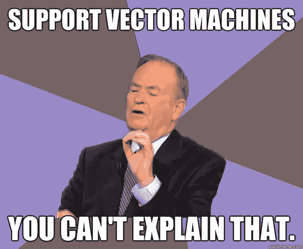
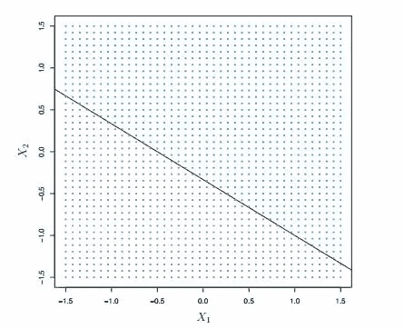
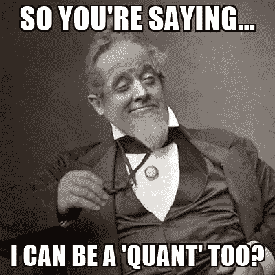
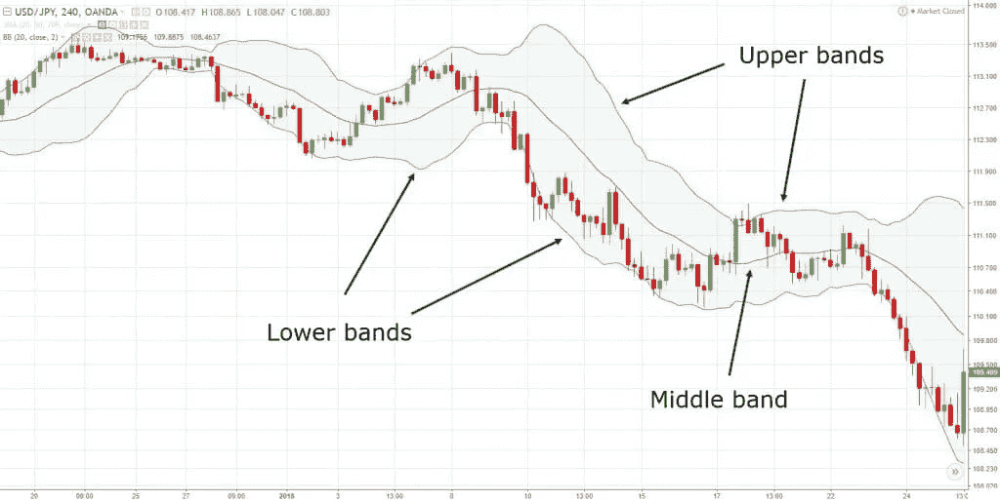
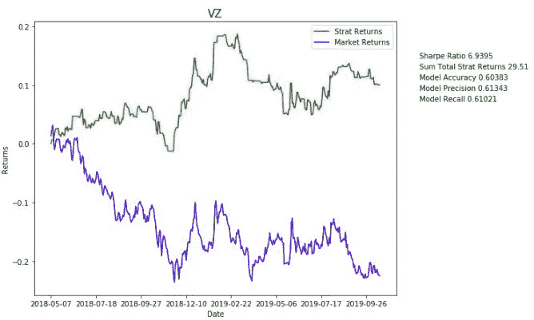
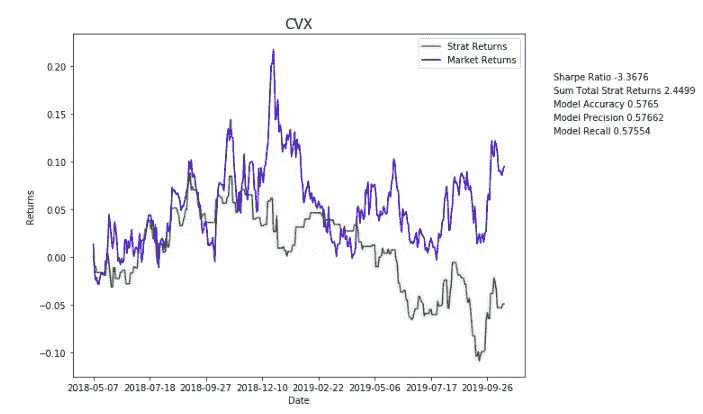

# 结合交易实例介绍支持向量机

> 原文：<https://towardsdatascience.com/intro-to-support-vector-machines-with-a-trading-example-1d4a7997ced6?source=collection_archive---------7----------------------->

## 让我们试着理解支持向量机，以及如何在金融市场中实现它们

就像任何其他机器学习算法一样，支持向量机(SVM)将数据作为输入，试图找到并识别模式，然后告诉我们它学到了什么。支持向量机属于监督学习的范畴，这意味着它创建一个将给定输入映射到输出的函数。更具体地说，SVM 是一种分类算法。

在我们开始实现交易算法和寻找阿尔法值之前，让我们弄清楚 SVM 是如何工作的

## 最大间隔分类器

支持向量机算法来自于最大间隔分类器。 ***最大间隔分类器*** 使用距给定决策边界的距离来对输入进行分类。距离或*裕量*越大，分类器处理数据就越好。在笛卡尔平面上，边界可以被认为是一条线。在三维空间中，它是一个平面，但在此之后，它变得难以概念化。这个边界可以更好地被认为是一个 ***超平面*** ，特别是维度 *p-1* 中的一个，其中 *p* 是数据点的维度。
我们的边界或超平面被称为*分离超平面*，因为它用于将数据点分成所需的类别。一般来说，有许多超平面可以分离给定的数据集，但我们关心的是 ***最大间隔超平面*** 或 o *最佳分离超平面*。这个分离超平面是与训练集中的每个数据点具有最大最小距离的超平面。通过使用这个超平面来分类来自测试集的数据点，我们得到了最大间隔分类器。

Source: Introduction to Statistical Learning

上图中的线代表超平面。请注意，它完全分隔了图表中蓝色和紫色区域的所有点。

现在，最大间隔分类器在一定程度上起作用了。如果你有一个不能被超平面分割的数据集，你就不能再使用它了。有时，您可能会遇到具有两个以上类别的数据，这使得线性边界毫无用处。

此时，您必须考虑您的选择:

1.  如前所述，您可以将分类器基于分离超平面。但是超平面不存在…所以你没有分类器。
2.  考虑一个不完美的分类器，但是它在某些时候/大部分时间都可以工作

## 支持向量分类器

我也喜欢第二种选择。通过使用一个不完美的分类器，您至少可以处理大多数观察结果，并在模型出现新数据时引入一定程度的适应性。

最大间隔分类器的这种演变被称为 ***支持向量分类器*** (SVC)，或者软间隔分类器。SVC 的分类并不精确，也不是非常稳健，它允许一些观察值位于边缘和/或超平面的错误一侧(软来自于此),以便得到最正确的分类。

在不涉及太多数学知识的情况下，该算法通过找到一个优化问题的解决方案来确定一个观察值将位于超平面的哪一侧，该优化问题使用一个调整参数、边缘的宽度(它试图最大化该宽度)和松弛变量。

调谐参数用于控制偏差-方差权衡。当它很小时，分类器非常适合数据，因为边距很小。换句话说，低偏差，高方差。更大的调谐参数是相反的。它允许更多的观察值位于误差的错误一侧，从而允许高偏差和低方差。

尤其是松弛变量非常酷。它们允许数据点位于边缘或超平面的一侧。它们还被用来将不平等转化为平等。松弛值的值也可以告诉我们给定数据点的行为。如果给定数据点的松弛变量等于 0，则该数据点位于页边距的右侧。如果松弛变量大于 0 但小于 1，则数据点位于页边距的错误一侧，但位于超平面的右侧。如果松弛变量大于 1，则数据点位于超平面的错误一侧。

这种优化的主要原因是它对超平面的影响。影响超平面并进而影响数据点如何分类的唯一值是那些位于边缘或错误一侧的值。如果一个物体在超平面的右边，它对它没有影响。分类器的名字来源于之前的数据点，因为它们被称为**支持向量**。

## 最后，支持向量机

支持向量机通过使用**内核**来增长特征空间，从而在支持向量分类器中建立优化。

与前面的优化类似，内核使用了相当多的数学知识。简而言之，内核告诉我们数据点有多相似。通过给数据序列分配权重，它可以识别两个点有多相似，因为它已经学会了如何比较它们。内核允许以更简单的方式处理数据，而不是在高维空间中处理。更具体地说，它计算特征空间中所有数据点对的所有可能输出之间的内积。通过使用核而不是扩大特征空间，该算法可以更加有效。它使用一个函数来比较不同数据点对，而不是对数据集中的原始要素使用函数。

存在许多不同的核，包括 RBF 核、图形核、线性核、多项式核。例如，线性核通过使用它们的二元相关性来比较一对数据点。多项式核试图在高维空间中拟合 SVC。支持向量分类器与使用具有 1 次多项式核的 SVM 是一样的。

基本上，支持向量机的主要目标是构建一个超平面，然后使用它来分类数据。尽管通常被归类为分类算法，但有一个用于回归的支持向量机的扩展，称为*支持向量回归*。

## 交易的支持向量机

在我进入这个应用程序之前，这绝不是关于你应该如何交易的建议。那是你的责任。

我们将从收集数据开始。

我们将使用大约五年前的时间段，从 2014 年 10 月 28 日到 2019 年 10 月 28 日。我们将获得数据的股票是道琼斯工业平均指数的组成部分。

雅虎财经曾经很容易获得数据，但大多数软件包不再工作，所以我们也将在这个过程中创建一个网络刮刀。

我们要做的第一件事是导入我们需要的所有包。

然后我们将使用 requests 包来抓取雅虎财经上[这个](https://finance.yahoo.com/quote/%5EDJI/components?p=%5EDJI)页面的内容。该页面包含组成道琼斯工业平均指数的公司名称，以及它们的代码。接下来，我们将使用[*beautiful soup 4*](https://www.crummy.com/software/BeautifulSoup/bs4/doc/)*使 *Dow_Content* 中的信息可搜索。*

*上面的几行代码解析从 web 页面收集的数据，并搜索与页面上的表格相对应的 HTML 代码。这可以通过右键单击页面区域，检查元素来找到，稍微调查一下就可以找到上面使用的类名。*

*搜索将会遇到两种类型的行:*

1.  *包含股票代码的行*
2.  *包含公司名称但没有股票代号的行*

*我们不关心后者，所以当循环找到它们时，它忽略那个位并继续前进。一些字符串操作来删除多余的脂肪，我们有我们的股票。然后，每一个股票都被添加到一个列表中，以便安全保管。*

*Yahoo Finance 在他们的 URL 中使用了 Unix 时间戳，所以我们使用了 *time* 包来将我们的开始和结束日期转换成所需的格式。它可以采用 *struct_time* (这里有更多关于[的内容](https://docs.python.org/2/library/time.html#time.struct_time))或者一个由 9 个时间参数组成的元组。我们真的不在乎任何过期的东西。*

**ScrapeYahoo* 函数有四个参数:*

1.  **data_df* ，你指定的存储输出的数据结构*
2.  **ticker* ，代表给定股票的字符串*
3.  **start* ，一个代表开始日期的 Unix 时间戳*
4.  **end* ，代表当天的 Unix 时间戳*

*它将这些与 Yahoo Finance 的基本 URL 结合起来，并从所需的网页中获取数据。我们不再像以前那样处理它，而是从页面中解析 JSON 数据。雅虎财经现在用 cookies，单纯用 HTML 代码会抛出错误。*

*后面的几行解析 JSON 数据的内容。在我最初探索数据集时，Python 字典的 [*keys()*](https://www.geeksforgeeks.org/python-dictionary-keys-method/) 方法非常有用。这使得遍历 JSON 数据变得更加容易。你可以在这里读到它*

*字典 *Stock_Data* 将保存我们解析的数据。字典中的关键字将是给定股票的代码。对于每只股票，函数 *ScrapeYahoo* 将创建一个包含开盘价、最高价、最低价、收盘价和成交量数据的数据框架。*

*我们有历史价格数据，现在呢？回想一下，支持向量机是一种分类算法。我们将尝试在技术分析的帮助下为我们的模型创建特性。*

*技术分析是一种利用过去的数据来预测价格未来走向的方法。一般来说，技术指标在计算中使用价格数据和交易量。选择这些指标的动机来自于文章末尾参考文献部分列出的论文。*

*继续前进之前需要注意的一件非常重要的事情: [**前瞻偏差**](https://www.investopedia.com/terms/l/lookaheadbias.asp) 。我们已经有了所有的结算数据，这些数据将用于计算。在现实世界中，你最多只有前一天的收盘。我们必须确保我们的计算不会包含技术上尚未出现的数据。为此，我们将滞后数据。也就是说，将我们的数据向后移一天。*

## *技术分析*

*我们将利用 [*talib*](https://mrjbq7.github.io/ta-lib/) 库执行技术分析计算。*

**

*Example of a chart with Bollinger Bands Source: Trading With Rayner*

*我们将使用我们的回报栏来计算我们每个交易日的标签。如果返回为 0 或正数，则标记为 1，否则标记为 0。请注意，returns 列使用的是开盘价而不是收盘价，以避免前瞻偏差。*

## *训练模型*

*在我们开始建立模型之前，必须对数据进行规范化。这样，当 SVM 计算其距离时，所有的要素都会被缩放并赋予同等的重要性。*

*我们使用了[*maxabscaler*](https://scikit-learn.org/stable/modules/generated/sklearn.preprocessing.MaxAbsScaler.html#sklearn.preprocessing.MaxAbsScaler)，它根据每个特征的最大绝对值对其进行缩放。*

*接下来，我们创建了一个字典来存储训练和测试数据。如果不删除 NaN 值，模型将不会运行。变量 *X* 将包含模型的所有特征，然后将被缩放。丢弃信号和返回列是很重要的。我们正在预测这个信号，如果它保持下去，这个模型将近乎完美。如果我们保留 Returns 列，也会对模型产生太大的影响。请记住，信号列最初是通过使用计算的回报率计算的。 *Y* 是我们要预测的，所以我们把它赋给包含信号的列。*

*我们的模型将使用 70%的数据进行训练，30%的数据进行测试，如第 11 行所示。*

*该模型由*模型*变量定义(以防您感到困惑)。我在下面链接的笔记本中留下了各种内核配置，您可以随意使用。该模型符合训练数据，并用于预测信号列中的值。*

*最后，我们将每只股票的准确度、精确度和召回率添加到我们的模型字典中。*

*快到了！下一段代码使用来自 SVM 模型的信号计算回报。通过对熊猫数据帧使用 [*iloc*](https://pandas.pydata.org/pandas-docs/stable/reference/api/pandas.DataFrame.iloc.html) 方法，将信号附加到末尾比我们之前所做的要容易得多。*

*我们将计算相对于市场表现的回报率，并以此作为我们的基准。投资组合的表现通过使用[夏普比率](https://www.investopedia.com/terms/s/sharperatio.asp)来衡量。*

*最后，绘制预测结果的图表。*

*输出的几个例子如下:*

**

*Not bad!*

**

*Not too good…*

## *结论*

*无论如何，这个模型并不完美，但它确实适用于道琼斯工业平均指数中的一些股票。有几种方法可以改进这一点:*

1.  *使用技术指标创造信号，而不仅仅是回报*
2.  *根据长/短场景调整模型*
3.  *使用不同的技术指标*
4.  *创建一个投资组合，包括头寸规模、交易成本、滑点等。*

*金融市场是一个非常复杂的地方，而我们的模型相当简单。这个例子简单地分类了以前的回报是否预示了未来的价格走向。*

*有很大的改进空间，所以尝试一下吧。参考资料中会有笔记本的链接，所以可以随意使用代码。*

*我希望这有助于你理解支持向量机！*

## *参考*

*[1] R .罗西洛、J .吉纳、d .德拉·富恩特和 r .皮诺，[标准普尔 500 指数中基于支持向量机的交易系统](https://pdfs.semanticscholar.org/4d9f/4d308e318eb65f02bd12d2abc37ce7493698.pdf) (2012)，2012 年国际人工智能会议论文集，ICAI，2012*

*[2] B. Henrique，V. Sobreiro 和 H. Kimura，[使用支持向量回归对每日和最新价格进行股票价格预测](https://www.sciencedirect.com/science/article/pii/S2405918818300060?via%3Dihub) (2018)，《金融和数据科学杂志》*

*[3] X. Di，[用 SVM](http://cs229.stanford.edu/proj2014/Xinjie%20Di,%20Stock%20Trend%20Prediction%20with%20Technical%20Indicators%20using%20SVM.pdf) (2014)的技术指标预测股票走势*

*[4] G. James，D. Witten，T. Hastie 和 R. Tibshirani，统计学习导论及其在 R 中的应用(2017)*

*[Python 代码](https://github.com/MarlonSomwaru/Machine-Learning/blob/master/Intro%20to%20SVMs/Support%20Vector%20Machines%20-%20Introduction%20and%20Trading%20Example.ipynb)*

*编辑:修正了在代码的不同部分使用“shift”的问题。感谢那些喊出它的人，我感谢他们的反馈。*