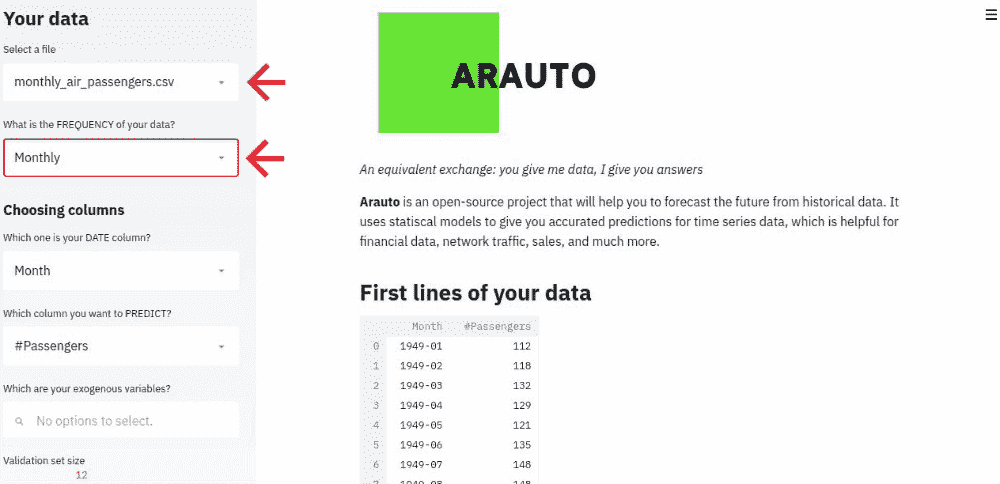
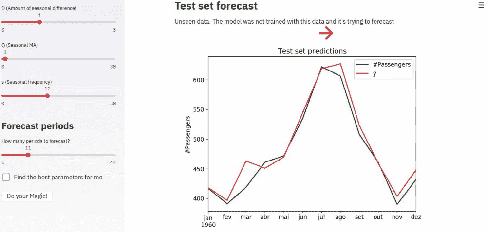
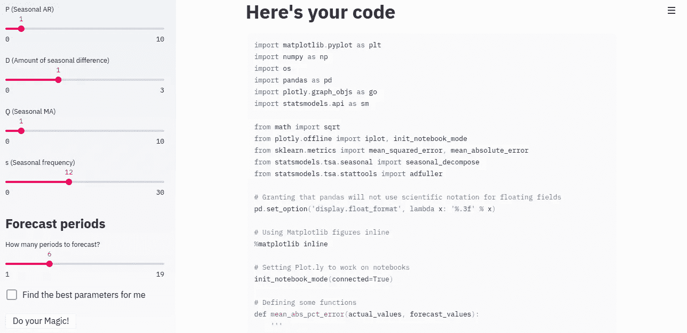
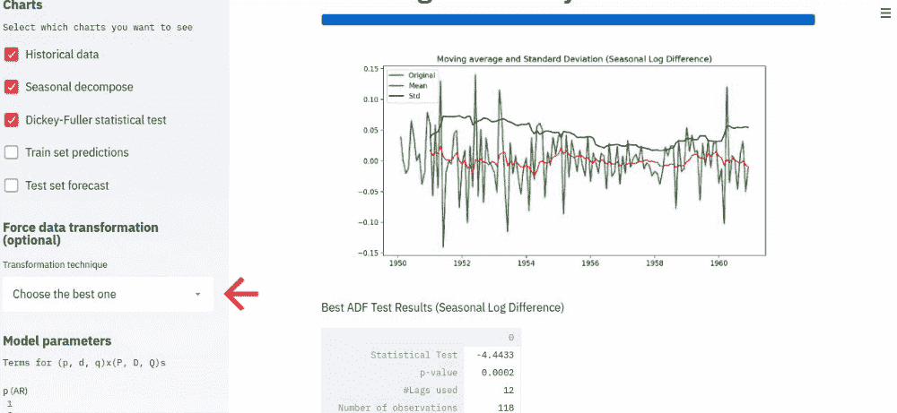

# 介绍 Arauto:一个用于时间序列预测的交互式工具

> 原文：<https://towardsdatascience.com/introducing-arauto-an-interactive-tool-for-time-series-forecasting-14b3e36b5f81?source=collection_archive---------16----------------------->

## 时间序列模型的快速实验和训练工具


Photo by [Aron Visuals](https://unsplash.com/@aronvisuals?utm_source=medium&utm_medium=referral) on [Unsplash](https://unsplash.com?utm_source=medium&utm_medium=referral)

时间序列预测一直是应用机器学习和统计模型的一个杰出领域，尽管许多数据科学家可能不认为它是一个像计算机视觉或 NLP 这样性感的领域。事实是，许多公司依靠时间序列预测和分析来了解业务的未来，如预测收入、活跃客户、平均门票等。

今天，我想介绍一个工具，它帮助我优化和提高了构建时间序列模型的效率: **Arauto，**这是一个用 Python 开发的开源应用程序，旨在为**提供一种交互式和直观的方式来构建混合自回归移动平均模型(AR，MA，ARMA，ARIMA，SARIMA，ARIMAX，SARIMAX)** 。

# 动机

在我目前的工作中，我负责创建和维护生产中运行的多个时间序列模型。 [**Hotmart**](https://www.hotmart.com/en) 是世界上最大的数字产品平台之一，我们的高管、投资者、经理和领导层需要**了解我们对未来一些关键业务指标的预期**，比如我们将获得多少收入，我们将在基础设施上花费多少资金，或者我们预计未来几个月有多少活跃用户。

然而，我注意到我在构建模型时有两个主要问题:

*   我的大部分时间都浪费在了重复构建流程和代码上:那些肯定可以自动化的东西；
*   **为我的模型迭代和试验不同的模型和参数不是很有成效。**

这几点促使我开发了一个工具，它可以帮助我——当然也可以帮助更多面临类似问题的人——在我的项目中更加敏捷和高效。这个项目的结果是自动的。



Arauto at work!

# 阿拉图是什么？

**Arauto** 是一个开源工具，**结合了一个交互式和直观的 web** **应用程序**，引导你完成时间序列模型的分析和构建。Arauto 的目标是在几分钟内给你一个预测模型，在这个过程的最后，它会生成用于转换和训练模型的代码，这样你就可以在 Jupyter 笔记本或 Python 脚本上复制和修改它。以下是 Arauto 的一些功能:

*   支持**外生回归变量**；
*   季节性分解，让你知道数据的**趋势**、**季节性**和**残差**；
*   使用**增强的 Dickey-Fuller 检验**的平稳性检验；
*   数据转换的平稳性定制:您可以使用从一阶差分到季节日志来转换您的数据；
*   用于项估计的 **ACF** (自相关函数) **PACF** (部分相关函数)；
*   定制 ARIMA 条款或**让 Arauto 根据您的数据选择最适合您的**；
*   **网格搜索**功能用于参数调整；
*   **代码生成**:在过程结束时，Arauto 返回用于转换数据和训练模型的代码



Arauto predicting in-sample and out-of-sample data

# 如何安装

## 网

使用 Arauto 非常容易。如果你对你能做什么感到好奇，有一个[在线版本，你可以点击这个链接](https://projectarauto.herokuapp.com)进入。请记住，**这是一个用于演示目的的轻量级版本**，因为它使用的是 Heroku 的自由层实例。

## 码头工人

Arauto 可以很容易地安装使用 Docker。通过运行三个命令，您将准备好在自己的基础设施上使用 Arauto。

```
**# Clone the repository**
git clone https://github.com/paulozip/arauto.git
cd arauto**# Run the docker compose**
docker-compose up --build
```

还有另一个选择是通过**使用 Conda 的环境**来安装 Arauto。更多信息请参考 [Github 知识库](https://github.com/paulozip/arauto)。



The code used to transform the data and train your model will be available at the end of the process

# 如何使用 Arauto

Arauto 被设计得尽可能直观，即使对于那些没有深入统计知识的人也是如此。然而，我们在几分钟内为你制作了一个完整的教程来帮助你开始使用 Arauto。请， [**参考 Arauto 的文档了解更多**](https://arauto.readthedocs.io/en/latest/how_to_use.html) 。



You can customize Arauto or let it choose the best parameters for you

# 如何投稿

目前，这个项目只由一个人维护。如果有更多的人合作并为这个开源项目做出贡献，那就太好了。如果你想和 Arauto 合作，你可以这样做:

*   **文档和教程**:让用户一打开浏览器就进入 Arauto 真的很重要。教程和更深入的文档可以帮助我们实现它。
*   新算法:我们可以给 Arauto 添加许多不同的算法，比如 ARCH、VAR 和基于树的算法等等。你所需要做的就是派生存储库，构建特性并打开一个 PR 来合并它。
*   错误修复:某些东西可能被破坏了。我们需要优秀的人来修复它。
*   **测试** : Arauto 不包含测试，这是错误的。
*   **请求功能** : [您可以使用我们的问题跟踪功能](https://github.com/paulozip/arauto/issues)提出新的想法和功能。请求将通过竖起大拇指表情符号(👍)

# 获取更新

Arauto 将增加新功能。如果你想知道新版本何时到来，请[订阅 Arauto 的时事通讯，了解新的事情](https://6f9c43ce.sibforms.com/serve/MUIEAI8Dq-U5iguZoH4tTXCgd1XsWZ2kDTwXG61HzqOe1smcmeFu1AKhca2lt0WmMOTwn3lGTx9zN1pk-0eo795pAFuq4eWzfH7edyG4Tk6tUsSq6vAwQdYlowk0MDXBSoDKIdsnzjRs_H_i8sjz2rRJDmtjRIW_xUmkUh03sW4qvUf7iaP1sMAlu1fAZ4XkZOi7I6562dzbkFn8)。我们不会发送垃圾邮件或共享您的电子邮件。只会发送与 Arauto 相关的内容。

我希望你对和 Arauto 一起创造新事物感到兴奋。我是 Paulo Vasconcellos， [Hotmart](https://www.hotmart.com/en) 的数据科学家，[数据黑客](https://datahackers.com.br)的联合创始人:巴西最大的数据科学和机器学习社区。欢迎在 [Linkedin](http://linkedin.com.br/in/paulovasconcellos) 或 [Twitter](https://twitter.com/paulo_zip) 上关注我(推文和帖子在 PT-BR 中)了解更多关于 Arauto 和数据科学的信息。再见！