# 熊猫图形用户界面 Bamboolib 简介

> 原文：<https://towardsdatascience.com/introducing-bamboolib-a-gui-for-pandas-4f6c091089e3?source=collection_archive---------3----------------------->

## 几天前，Tobias Krabel 先生通过 LinkedIn 联系我，向我介绍他的产品，一个名为 [**Bamboolib**](https://bamboolib.8080labs.com/) 的 Python 库，他说这是一个学习熊猫的 GUI 工具——Python 的数据分析和可视化库。


Photo by [Marius Masalar](https://unsplash.com/@marius?utm_source=medium&utm_medium=referral) on [Unsplash](https://unsplash.com?utm_source=medium&utm_medium=referral)

他说，我引用他的话:

> 我们的目标是帮助人们快速学习和使用熊猫，我们希望加入下一代 python 数据科学家。

我不得不承认，一开始我持怀疑态度，主要是因为我不是 GUI 工具和拖放原则的忠实粉丝。尽管如此，我还是打开了网址，看了介绍视频。

这是少有的一次我被合理地激起了兴趣。

从那以后，我很快回复了 Tobias，他友好地让我测试一下这个库，看看我是否喜欢它。

***情况怎么样？嗯，你必须继续阅读才能找到答案。所以让我们开始吧。***

# 免费吗？

在一个像 Numpy 和 Pandas 这样令人惊叹的图书馆可以免费使用的世界里，这个问题可能甚至不会出现在你的脑海里。然而，它应该，因为不是所有版本的 Bamboolib 都是免费的。

如果你不介意与他人分享你的作品，那么是的，它是免费使用的，但如果这造成了一个问题，那么它会让你每月至少花费 10 美元，这对于普通用户来说可能是令人失望的。下面是完整的价目表:

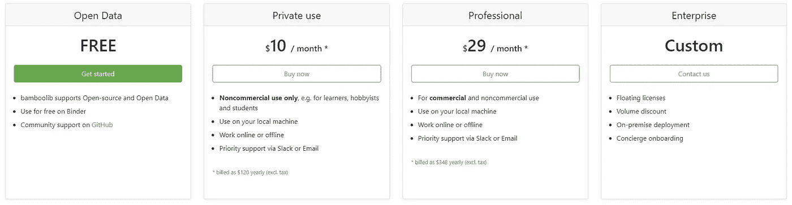

正如该库的开发者所说，Bamboolib 旨在帮助你学习熊猫，因此**我认为使用免费选项**没有问题——如果你刚刚开始，很可能不会从事一些绝密项目。

然而，这篇评论将基于私人版本的图书馆，因为这是托拜厄斯给我的。话虽如此，这篇文章绝不是抱着劝你买许可证的想法写的，它只提供我个人的看法。

在进入好的内容之前，您需要首先安装库。

# 安装过程

要做的第一件也是最明显的事情是 **pip** 安装:

```
pip install bamboolib
```

然而，如果你想让这个东西完全工作，还有很多事情要做。它被设计成一个 **Jupyter Lab** 扩展(*或者 Jupyter Notebook，如果你还在用那些*)，所以我们也需要在那里设置一些东西。

在命令行中键入以下内容:

```
jupyter nbextension enable --py qgrid --sys-prefix
jupyter nbextension enable --py widgetsnbextension --sys-prefix
jupyter nbextension install --py bamboolib --sys-prefix
jupyter nbextension enable --py bamboolib --sys-prefix
```

现在您需要找到安装在您机器上的 Jupyter Lab 的主要版本。您可以使用以下命令获得它:

```
jupyter labextension list
```

我的是“1.0”，但是你的可以是任何东西，所以这里是你需要执行的下一个命令的通用版本:

```
jupyter labextension install @jupyter-widgets/jupyterlab-manager@MAJOR_VERSION.MINOR_VERSION --no-build
```

请注意，您需要替换“MAJOR_VERSION。MINOR_VERSION”和版本号，在我的例子中是“1.0”。

再多几个命令，你就可以开始摇滚了:

```
jupyter labextension install @8080labs/qgrid@1.1.1 --no-build
jupyter labextension install plotlywidget --no-build
jupyter labextension install jupyterlab-plotly --no-build
jupyter labextension install bamboolib --no-build

jupyter lab build --minimize=False
```

就这样。现在你可以开始 Juypter 实验室，我们可以深入到好东西。

# 第一次使用

在 Jupyter 中，您可以导入 Bamboolib 和 Pandas，然后使用 Pandas 加载一些数据集:

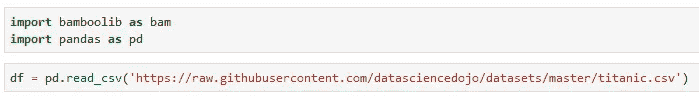

以下是使用库查看数据集的方式:

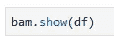

当你第一次使用图书馆时，这是行不通的。您需要**激活**它，因此请确保将许可证密钥放在附近的某个地方:

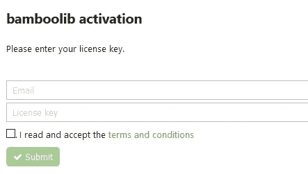

输入电子邮件和许可证密钥后，您应该会收到以下消息，表明一切顺利:


很好，现在您可以再次执行前一个单元格了。你马上会看到一个陌生的，但看起来很友好的**界面**:

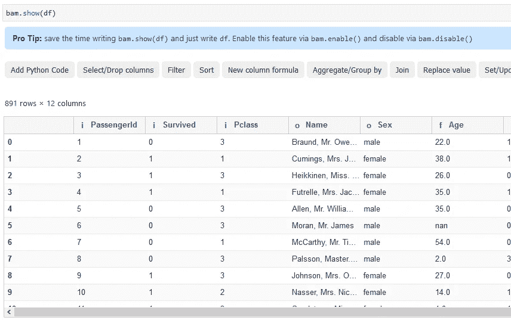

现在一切都准备好了，我们可以开始一些基本的功能了。走到这一步需要做很多工作，但是相信我，这是值得的！

# 数据过滤

任何数据分析师/科学家最常见的日常任务之一就是数据过滤。基本上，你只想保留在给定时刻与你相关的数据子集。

要开始用 Bamboolib 过滤，点击**过滤器**按钮。

应该会弹出一个类似下面的侧菜单。我决定按“年龄”列进行筛选，只保留“年龄”值小于 18 的行:

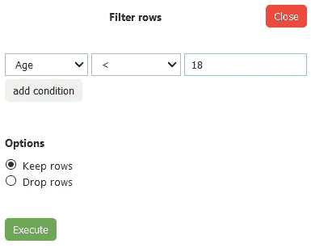

一旦你按下**执行**，你会看到动作立即发生:

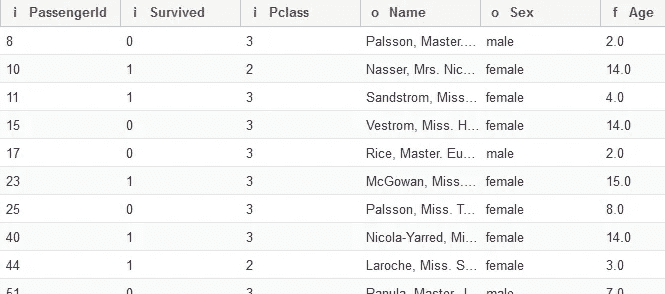

太好了！但是你还能做什么呢？

# 替换值

另一个常见的日常任务是用相应的数字替换字符串值。这个数据集非常适合演示值替换，因为我们可以很容易地将“性别”列中的字符串值替换为数字值。

首先，点击**替换值**按钮，指定列、要替换的值以及要替换的内容:

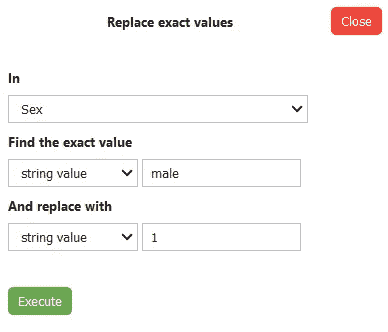

一旦按下**执行**按钮:

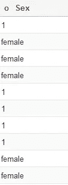

太棒了。对于“女”的选项也可以这样做，但要不要做由你自己决定。

# 分组依据

是的，您还可以执行聚合！要开始，点击**聚合/分组按**按钮，并在侧边菜单中指定应该做什么。

我决定按“Pclass”分组，因为我想看看每个乘客级别的幸存者总数:

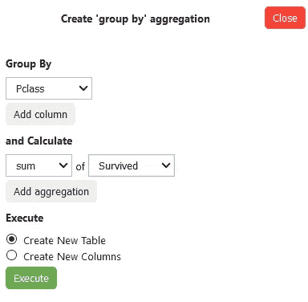

这将产生以下输出:

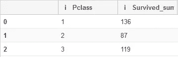

厉害！在结束之前，让我们再探索一件事。

# 一个热编码

很多时候，在为机器学习准备数据时，您会想要创建**虚拟变量**，因此为给定属性的每个唯一值创建一个新列。这样做是个好主意，因为许多机器学习算法无法处理文本数据。

要通过 Bamboolib 实现该逻辑，点击 **OneHotEncoder** 按钮。我决定从“apollowed”属性创建虚拟变量，因为它有 3 个不同的值，你不能说一个比另一个好。此外，确保移除第一个虚拟变量，以避免共线性问题(*的变量是其他变量*的完美预测变量):

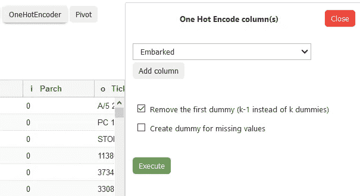

如您所料，执行将在数据集中创建两个新列:

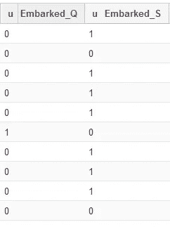

很好，我已经完成了我的转变，但是**下一步是什么？**

# 获取代码

直到现在都是有趣的游戏，但是迟早你会注意到这些操作没有在适当的位置执行——因此如果你不明确地指定它,**数据集将不会被修改**。

这不是一个错误，因为它使您能够在不弄乱原始数据集的情况下进行试验。然而，Bamboolib 要做的是，它将**生成 Python 代码**来实现期望的转换。

要获取代码，首先点击**导出**按钮:


现在指定您希望它如何导出—我选择了第一个选项:

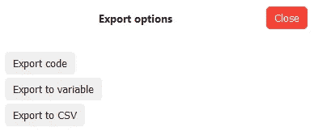

最后，它会给出您可以复制并应用到数据集的代码:

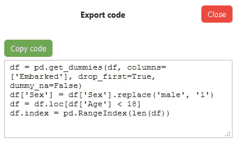

# 值得吗？

至此，我简要展示了 Bamboolib 的主要功能——这绝不是详尽的教程——只是想向您展示它背后的思想。

问题是，它值这个钱吗？

如果你决定走付费路线的话。你仍然可以免费使用它，前提是你不介意与他人分享你的作品。该库本身值得一试，主要有两个原因:

1.  它提供了一个学习熊猫的好方法——通过做来学习比通过读来学习要容易得多，而且像这样的 GUI 工具肯定只会对你有所帮助
2.  **它非常适合摆弄数据**——让我们面对现实吧，有时候你知道你想做什么，但你就是不知道如何用代码实现它——bamboo lib 可以提供帮助

**请记住**——付费版本不会给你带来任何额外的功能——唯一真正的好处是你的作品将是私有的，并且可以选择用于商业用途。

即使你还没有准备好拿你的信用卡，尝试一下免费版并看看它是否能让你受益也不会有什么坏处。

感谢阅读。保重。

喜欢这篇文章吗？成为 [*中等会员*](https://medium.com/@radecicdario/membership) *继续无限制学习。如果你使用下面的链接，我会收到你的一部分会员费，不需要你额外付费。*

[](https://medium.com/@radecicdario/membership) [## 通过我的推荐链接加入 Medium-Dario rade ci

### 作为一个媒体会员，你的会员费的一部分会给你阅读的作家，你可以完全接触到每一个故事…

medium.com](https://medium.com/@radecicdario/membership)