# 在深度学习中引入卷积神经网络

> 原文：<https://towardsdatascience.com/introducing-convolutional-neural-networks-in-deep-learning-400f9c3ad5e9?source=collection_archive---------10----------------------->

卷积神经网络又名 Convnets 或 CNN，是深度学习中神经网络的超级明星。这些网络能够执行图像、声音、文本、视频等相对复杂的任务。第一个成功的卷积网络是在 20 世纪 90 年代后期由 Yann LeCunn 教授为贝尔实验室开发的。

在类似 MNIST 的分类问题中，多层感知器(MLP)是最常用的，并且提供非常好的结果(很高的准确度)，此外，训练时间保持合理。然而，对于具有较大图像的较大数据集，模型的参数数量呈指数增长，因此，训练变得更长，性能更差。

**爆炸参数的数量**

MLP 对于解决几类问题非常有效，例如分类、估计、近似、识别等。但是，它们很快就会变得有限，尤其是对于非常高维的输入数据。

假设我们想要创建一个深度学习模型来执行猫或狗的分类任务。该模型在大小为 420x420px 灰度的图像数据集上训练；训练结束后，我们希望模型能够说出图像是狗还是猫。例如，第一种方法是使用具有 128 个神经元的输入层的多层感知器。由于该层的每个神经元接收 420x420 像素值作为输入，并为每个像素值分配一个权重，因此我们得到每个神经元 420x420 = 176400 个权重，乘以总共 128 个神经元，最后加上 128 个偏差，每个神经元一个偏差。这个微小的模型将不得不学习超过 2200 万个参数，只需要 128 个神经元和一个中间层。如果我们想要一个强大的模型，它将需要几个附加层和每层更多的神经元。参数数量激增。例如，一个 3 层模型(128–256–1)需要将近 2300 万个参数。这种模型需要大量的数据来训练，并且由于要调整的参数多得多，训练阶段将持续更长时间，并且性能下降；让我们清楚地说，即使我们有足够的计算能力，也不可能正确地训练这个模型，因为这不是唯一需要处理的问题。

**图像的空间退化**

训练多层感知器需要以向量(一维数组)的形式提供输入数据。如果输入数据是一个矩阵图像，那么它必须被展平以得到一个矢量。然而，在自然图像中，相邻像素之间存在非常强的联系；通过展平图像，我们丢失了这些信息，网络在训练阶段解释数据变得更加困难。这证明了对解决这种问题的另一种神经网络结构的兴趣。让我们首先介绍卷积是由什么组成的。

## 卷积算法

卷积是一种滤波器(也称为内核)与图像矩阵的乘积运算，用于从中提取一些预先确定的特征。从字面上讲，我们使用卷积过滤器来“过滤”图像，只显示对我们真正重要的内容。所考虑的图像是矩阵，所使用的滤波器也是矩阵，通常是 3×3 或 5×5。让我们看看卷积如何与下面的内核一起工作，

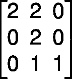

Convolution filter

6x6px 矩阵代表一幅图像。开始时，卷积核(此处为 3×3 矩阵)位于矩阵图像的左上角，然后该核覆盖该矩阵图像的一部分，然后我们对两个重叠块进行逐个元素(逐元素)的乘积，最后对这些乘积求和，最终结果对应于输出图像的一个像素。

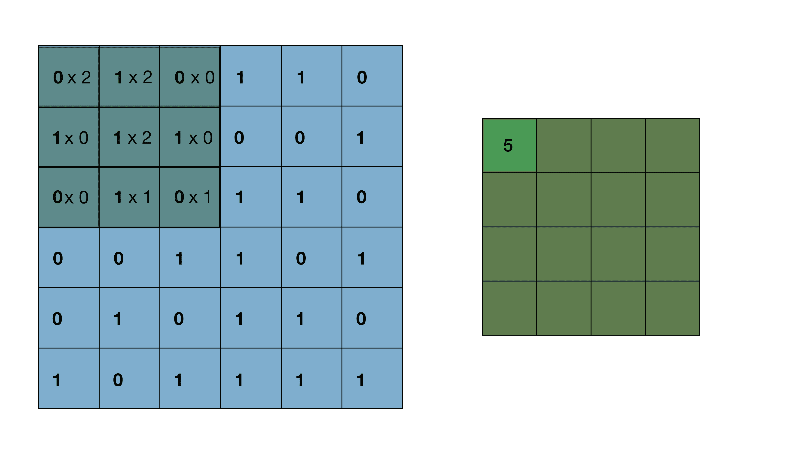

Convolution algorithm

然后，我们将卷积核从水平向右移动一个像素，我们生成一个新的元素乘积，然后相加得到输出图像的新系数。

一旦到了一行的末尾，内核垂直向下移动，然后从左边开始，我们同样迭代，直到内核覆盖了所有的矩阵图像。值得注意的是，内核始终保持在初始矩阵上，不会溢出。

当然，我们不能使用任何过滤器，我们的内核的系数将取决于我们希望过滤器突出的特征。让我们看看一些著名滤波器的卷积结果。

**垂直索贝尔滤波器**

它的作用是突出显示对象的垂直线。应用到左边的初始图像，这是结果，

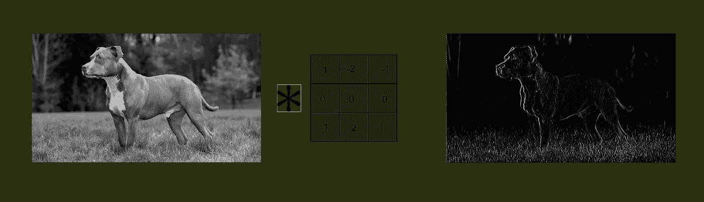

Vertical Sobel filter

**水平索贝尔滤波器**

这次是为了突出图像的水平轮廓。这是应用于左侧图像的结果，

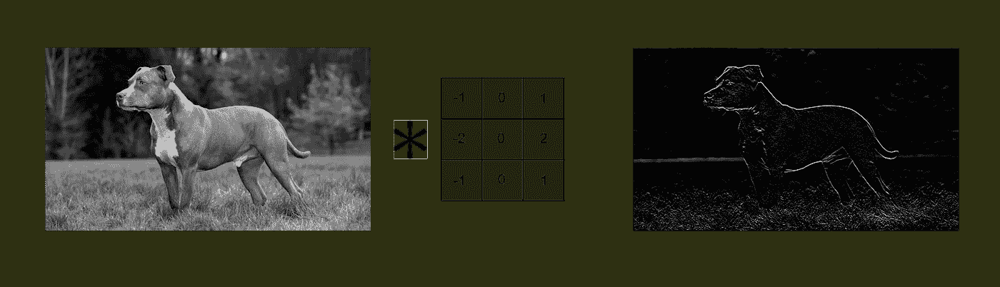

Horizontal Sobel filter

可以组合这些过滤器的动作来执行更复杂的操作。根据要解决的任务，已经列出了几个可以直接以这种方式使用的滤波器:平均滤波器、高斯滤波器等。在深度学习出现之前，人类专家必须计算并确定要使用的正确过滤器，以便执行特定的图像处理操作:人脸检测、照片编辑，像 Snapchat 过滤器等。现在有了深度学习，确定这些过滤器是通过学习自动完成的，模型会根据要解决的问题，从训练数据中找到好的过滤器。例如，在猫或狗的分类问题中，过滤器可以突出分类的决定性特征:耳朵的形状、眼睛的形状、口鼻的形状、轮廓等。

## 卷积神经网络

卷积神经网络，也称为 CNN 或 Convnets，使用上面介绍的卷积技术来建立模型，以解决在数据集上进行训练的各种问题。让我们看看经典的猫或狗分类问题中卷积网络的细节。

**卷积的深度学习方法**

在这个分类问题中，我们有两类，即狗和猫。将图像分类为这些类别中的一个类别，取决于诸如头骨形状、耳朵形状、眼睛形状等单一特征。只有这些特征对执行这一分类任务至关重要，其他信息对我们来说并不重要。

因此，理想的情况是从一幅图像开始，能够通过使用适当的过滤器来提取对分类问题感兴趣的主要特征。在深度学习环境中，它将是通过对数据集进行训练来确定这些过滤器的模型。

训练从内核(滤波器)的随机初始化值开始，在训练期间，这些值将通过梯度反向传播来更新。既然我们说的是**深度**学习，我们可以猜测几层卷积会一层接一层叠加起来，以增加模型性能。

**填充和边缘效果**

让我们再次以上面的卷积动画为例，看看输出图像的尺寸，也称为**特征映射**。输入图像是 6x6px 大小的矩阵，滤波器是 3x3 的矩阵。我们可以看到特征图(输出矩阵)是 4x4px 大小的。顺便说一下，一般来说，特征图的大小是，

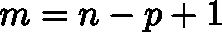

Feature map size

其中 **n** 表示输入图像的尺寸，而 **p** 表示滤波器的尺寸。例如，对于初始 120x120px 图像和 5x5 内核，特色图像的大小为 116x116px。请注意，卷积会减小输入图像的大小。如果我们要输出一个与输入图像大小相同的特征图，我们必须在卷积之前在输入图像周围加零，输入图像是“用零填充”的，因此这种操作的名字， **padding。**我们来看一个例子。

带 3x3 滤波器的 6x6px 矩阵示例。

我们希望特征图具有与输入图像相同的尺寸，即具有 3x3 卷积滤波器的 6x6px。在上面给出的等式中，p = 3，m = 6，因此 n = 6+3–1 = 8。因此，有必要使输入图像的大小为 8x8px，这意味着我们必须在原始矩阵图像周围添加零，以达到 8x8px 的大小；因此下面的矩阵，

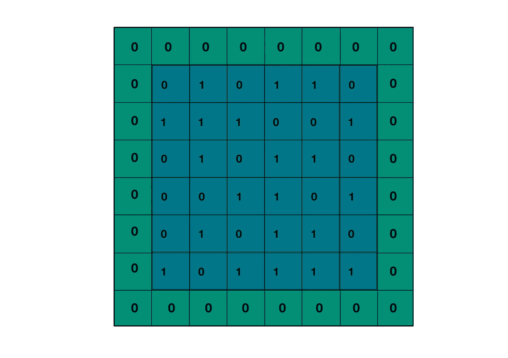

“Padded” matrix

填充不是强制的，一般会碰巧忽略；这可能看起来像轶事，但它确实有实际用途。让我们看看边缘像素，例如最左边的，他们只看到卷积核一次，而大多数其他像素看到它两次以上。因此，边缘像素对特征图的影响较小。为了限制这种副作用，我们用零“填充”原始输入图像，这样边缘的像素就不会被忽略。

**激活功能**

在训练期间，我们知道滤波器的系数被更新；这些可以是负的，正如我们在上面用 Sobel 滤波器所看到的，然后特征图的系数可以在训练期间保持大的负值。由于我们知道这些值代表像素级别，因此是正值，我们可以应用一个函数用零替换负值，并保持正值不变。这是一个名为 **relu** 的激活功能。但是请记住，还有其他激活函数，其思想基本上与 relu 相同，以保持特征映射值的合理性。

**卷积层**

提醒一下，卷积是将过滤器或内核应用于输入图像，然后我们得到一个突出输入图像的特征或“特征”的特征图:轮廓、斑点、形状等。每个过滤器都有一个简单而精确的任务要完成。所以，为了解决我们的分类问题(猫或狗)，我们将不得不使用几个过滤器；并且通过组合由那些过滤器突出显示的特征；例如耳朵、眼睛和轮廓的形状，我们的模型将能够被训练来区分狗和猫。因此，我们必须选择要做的卷积的数量，也就是要使用的滤波器的数量，知道我们的滤波器越多，提取的用于分类的细节就越多，要学习的模型的参数就越多，但是模型保证的性能就越好(更高的精度)。之后，我们必须决定是否填充以及使用哪个激活函数。这定义了一个卷积层。使用多少个过滤器？64，128，256 …哪个激活功能？relu，乙状结肠，tanh …有没有垫？

比方说，我们有一个 128 个过滤器的卷积层；它为每个过滤器提供了一个特征映射，因此一个输入图像总共有 128 个特征映射。这些特征图代表了图像中包含的不同信息，所以我们可以把它们看作这个图像的不同通道。由于 **rgb** 图像包含三个通道(红色、绿色和蓝色)，具有 128 个过滤器的卷积层提供了一个具有 128 个通道的单一特征图。如果相同的图像通过另一层 256 个过滤器，它将被输出为 256 通道的特征图，以此类推。

**池算法**

在自然图像中，像素之间有很强的局部相关性。这意味着，对于一幅图像，如果你知道一个像素是红色的，它的四个最接近的像素很可能也是红色的阴影。在灰度图像的情况下，例如，如果像素具有 180 的强度，则其最近的像素也将具有大约 180 的强度。因此，有可能通过仅保留每个像素局部块的局部代表来减小图像的尺寸，这被称为池化。一般来说，我们会将块中亮度最大(因此值最高)的像素— **max pooling** —我们也可以将块中像素的亮度平均— **average pooling** —并将其作为代表。

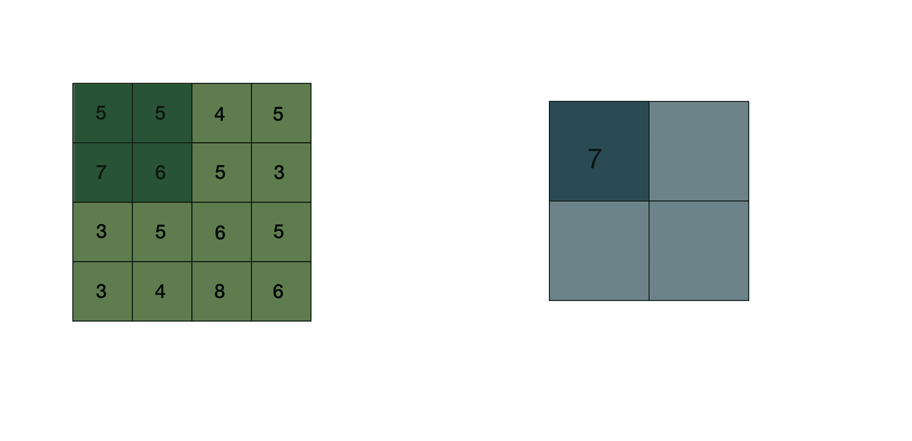

Max pooling operation

从上面可以看出，池将输入图像的每个维度(高度和宽度)减半。人们可能会认为，池化通过仅用一个像素表示一个像素块而严重降低了初始图像的质量；但实际上输出图像(特征图)当然是一半大，但包含了输入图像的主要特征。

例如，让我们将最大池化应用于水平 Sobel 滤波器输出的特征图，“池化”的图像已经被放大用于比较。

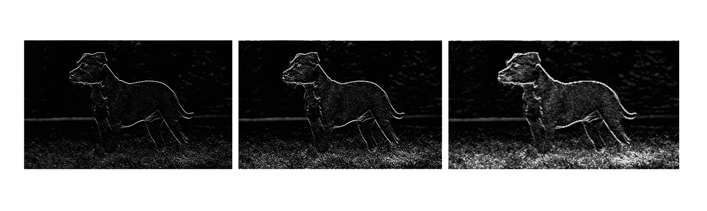

Feature map after two max-pooling

请注意，即使经过两次合并，轮廓仍然清晰可见，图像的细节也不太丰富。池化不仅仅是调整大小，还仅仅保留输入图像的有意义的特征。

通常，在卷积网络中，有一系列操作；卷积-池层-卷积-池层等等。通过多次重复这些操作，我们最终获得仅具有输入图像的有意义(根据所解决的问题)特征的特征图。我们现在可以利用多层感知器的能力来完成分类任务。

**展平特征图**

为了最终将图像分类到一个类别，比如猫或狗，我们将在最后一个卷积层的顶部设置一个多层感知器(多层感知器)。先前的卷积和汇集操作已经极大地减小了输入图像的大小，以唯一地保持分类的有意义的特征。由于供给 MLP 需要输入向量(一维数组或 1d 数组)，我们需要“展平”输出特征图。因此，MLP 接收小尺寸的特征地图作为 1d 阵列，并选择关于那些特征地图的相应类别。

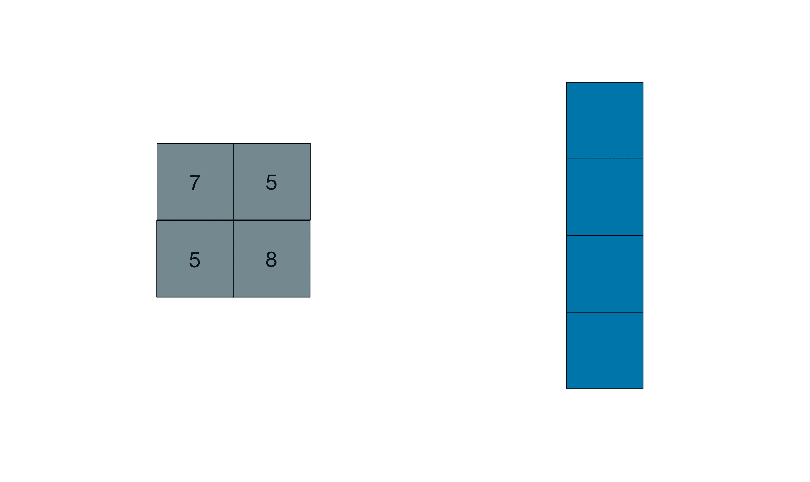

Flattening operation

现在你知道了卷积神经网络的所有关键步骤，如果你想更深入地研究卷积神经网络，你可以阅读下面的段落。

**卷积的高级方法**

在前面的描述中，据说卷积是将滑动矩阵(内核或滤波器)与输入矩阵图像相乘。虽然这种解释在深度学习社区中广泛存在，但实际的解释略有不同，但并没有复杂多少。让我们以我们的第一个卷积(漂亮的 gif)为例，它有一个 3x3 内核和一个 6x6px 矩阵。我们使用上面的公式来预测特征图的大小，4x4px。

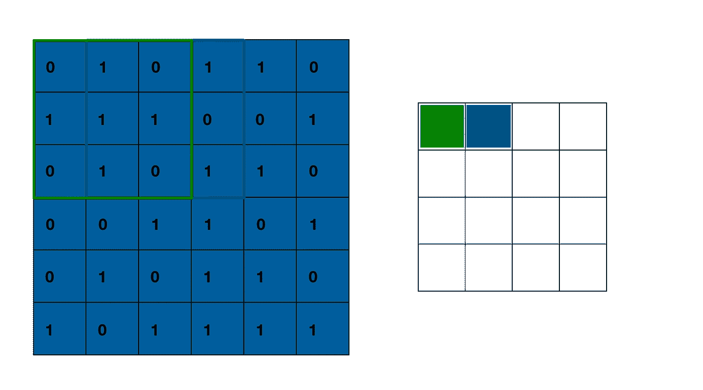

Receptive fields of neurons

特征图左上角位置的像素值直接取决于输入图像中的像素值和卷积核的值。该像素的值根据卷积算法，

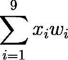

Feature map pixel value

其中 **wi** 是卷积核的系数， **xi** 是绿框中矩阵的系数。让我们提醒一下卷积核，

Convolution kernel

上面，我们有例如 w1 = w2 = w5 = 2 和 w9 = 1，还有 x1 = 0，x2 = 1，x5 = 1。注意像素值表达式中的加权和。这就好像我们有一个神经元，其中 **xi** 是输入，细胞核的 **wi** 系数是输入的权重。神经元计算加权和，然后是特征图中像素的值，这里是 5。被框住的区域被称为神经元的**感受野**；左上角神经元感受野上方的绿色部分。

当内核在卷积过程中在输入图像上移动时， **xi** 的值发生变化，但内核的权重**和**的值保持不变。然后，通过梯度反向传播来更新它们。特别地，所有这些神经元共享相同的权重**和**，这些权重是卷积核的系数，因为它们针对相同的特征(例如眼睛或轮廓的存在)查看输入图像。我们还可以给那些神经元加上一个**共享偏置 b** 。前面提到的激活函数实际上应用于那些神经元。

可以看出，第二个神经元的感受野与第一个神经元的感受野部分重叠，依此类推。由于这些神经元的感受野相互重叠，如果想要的特征被平移——向上、向下、向左或向右——它必然会在另一个神经元的感受野中，从而被这个神经元检测到。我们说我们通过平移得到了**不变性。在不太复杂的情况下，20 世纪 60 年代进行的生物学工作使科学家能够识别一些动物视觉皮层中的相同结构。特别是，视觉过程中涉及的第一批细胞将识别非常简单的几何形状:线、圆、点等。然后，更先进的细胞将使用这些信息来识别一个复杂的模式。类似地，在卷积神经网络中，第一卷积层将检测一般的几何形状:角、圆、斑点、轮廓等。接下来的图层将这些元素结合起来，以识别更具体的形状:头骨、眼睛、耳朵等。**

再次从上面的公式开始，我们知道使用 **pxp** 滤波器对大小为 **nxn** 的图像进行卷积，输出——没有填充——大小为 **mxm** 的特征图；已知特征图的每个像素与一个神经元相关联，然后我们使用 m ** 2 个神经元，每个神经元观察大小为 **pxp** 的场，具有 p ** 2 个权重(每个滤波器系数一个)和一个偏差。由于这些参数是共享的，我们最终得到了 m ** 2 神经元的 **p ** 2 + 1** 参数。

例如，对于大小为 420x420px 灰度的输入图像和大小为 5 * 5 的内核，我们将得到大小为 m = 420–5+1 = 416 的特征图，因此一个卷积需要 416 * 416 = 173056 个神经元！仅用 **26(5*5 + 1)个参数来学习**。

这是卷积神经网络的兴趣点。为了执行卷积，换句话说，**为了检测模式**，神经元共享相同的突触权重和可能的偏差，这大大减少了要学习的参数数量。

## 结论

本文的目的是介绍卷积神经网络及其主要兴趣。一般来说，这些网络为分类和识别任务提供了极好的结果。它们也用于解释声音、文本和视频数据。如果要解决的问题是在序列中寻找模式，那么卷积网络将是很好的候选。在以后的文章中，我们将详细研究卷积网络的连续层如何在训练阶段演变，我们还将了解如何使用热图让这些网络说话。