# 蒙特卡罗模拟中 Copula 的引入

> 原文：<https://towardsdatascience.com/introducing-copula-in-monte-carlo-simulation-9ed1fe9f905?source=collection_archive---------9----------------------->

## 概率油气体积估算的一个演示案例


[Source](https://thenextweb.com/insights/2019/07/30/quantum-darwinism-may-solve-the-question-of-whether-god-plays-dice-or-not/)

在石油和天然气行业，从地表到地下，不确定性无处不在。为了在任何估计中嵌入不确定性，需要概率方法。

一个简单的例子是体积估计。估算碳氢化合物(石油/天然气)初始地质储量(HCIIP)的公式如下:

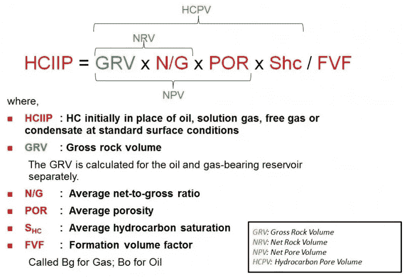

[Source](http://chapter24.one/hciip%20calculator.html)

为了对 HCIIP 进行概率估计，使用了蒙特卡罗方法，并遵循以下步骤([来源](https://en.wikipedia.org/wiki/Monte_Carlo_method)):

1.  定义可能输入的域
2.  根据域上的概率分布随机生成输入
3.  对输入执行确定性计算
4.  汇总结果

概率油气远景评价的一个 Ms Excel 实现可以在这里[得到](https://www.lsu.edu/ces/products/stats/index.php)。

如果所有输入都是 ***独立*** 随机变量或者 ***正态分布*** ，那么随机抽样就相当简单了。然而，输入，例如孔隙度和碳氢化合物饱和度在某种程度上与 相关，并具有不同的分布。在这种情况下，随机抽样是困难的。这时 ***系词*** 来拯救我们了。

# 介体

根据[维基百科](https://en.wikipedia.org/wiki/Copula_(probability_theory))，一个 **copula** 是一个多元的累积分布函数，对于这个函数，每个变量的边际概率分布是均匀的。

上面的定义很抽象，很难理解。然而，实现相当容易。托马斯·威奇写了一篇鼓舞人心的文章，直观地展示了系词。

为了完全掌握 copula 的概念，需要理解随机变量变换。

## 随机变量变换

让我们从 0 和 1 之间的均匀分布开始采样。

```
x = stats.uniform(0, 1).rvs(10000)
```

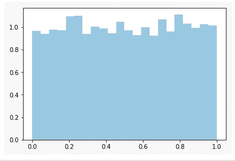

Uniformly distributed samples

这些样本不是均匀的，而是可以通过累积密度函数(CDF)的倒数转换成任何感兴趣的概率分布。假设我们希望这些样本呈正态分布。我们可以将这些样本传递给正态分布的逆 CDF 函数(例如 ***ppf*** 函数在 ***scipy.stats*** 中)。我们将得到以下正态分布的样本。

```
norm **=** stats**.**distributions**.**norm()
x_trans **=** norm**.**ppf(x)
```

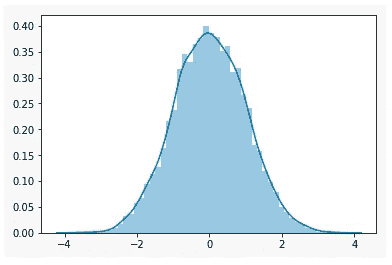

Transformed samples that are normally distributed

如果我们在同一图上绘制均匀样本、变换样本和反向 CDF 曲线，我们得到:

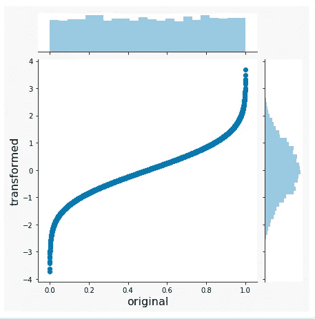

Overlaying uniform and transform (normally distributed) sample along with the CDF curve

当我们想从给定的分布中抽取样本时，计算机会在幕后进行这种转换。

重要的是，这个过程是可逆的；这意味着我们可以通过相同的 CDF 将任何分布的样本转换回统一的分布。

## 高斯连接函数-添加变量相关性

高斯连接函数的步骤如下:

1.  从相关的多元正态分布中抽取样本。变量相关性通过协方差矩阵指定。
2.  转换相关样本，使边缘(每个输入)一致。
3.  将统一边际转换为任何利益分布。例如，孔隙度服从截尾正态分布，碳氢化合物饱和度服从三角形分布等。

让我们从相关多元正态分布中抽取样本开始。

```
mvnorm = stats.multivariate_normal([0, 0], [[1., 0.5], [0.5, 1.]])
x = mvnorm.rvs((10000,))
```

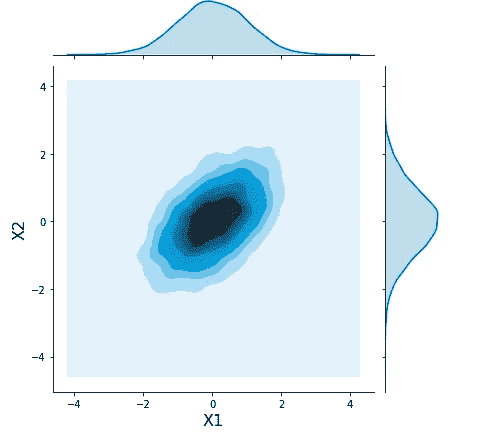

Correlated samples from a multivariate normal distribution with a covariance of 0.5

接下来，我们将边缘转换为均匀分布。

```
norm = stats.norm([0],[1])
x_unif = norm.cdf(x)
```

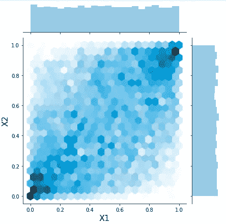

The joint & marginal distributions of X1 and X2

如我们所见，X1 和 X2 的联合分布是相关的，而它们的边际是一致的。

现在，我们可以在保持相关性的同时，将边际转化为任何感兴趣的分布。例如，我们想从三角形分布中得出 X1，从正态分布中得出 X2。

```
x1_tri  = stats.triang.ppf(x_unif[:, 0],  c=0.158 , loc=36, scale=21)
x2_norm =stats.norm(525, 112).ppf(x_unif[:, 1])
```

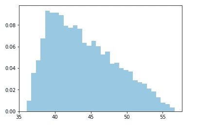

The transformed marginal of X1

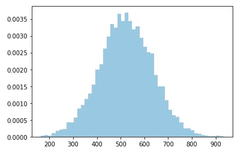

The transformed marginal of X2

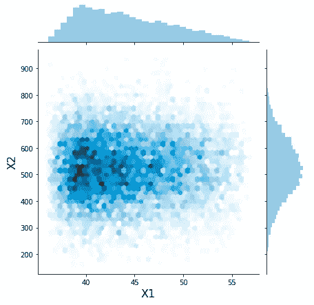

The joint distribution of X1 and X2

现在我们从不同的分布中得到 X1 和 X2 的期望的联合分布。

# HCIIP 的概率估计

有了 **copula** ，我们已经准备好将变量相关性引入蒙特卡罗的采样阶段。以下是计算 OIIP 的完整 python 代码:

```
import seaborn as sns
from scipy import stats
import numpy as np
import matplotlib.pyplot as plt
# HCIIP = GRV*NTG*POR*SHC/FVF
means = [0.]*5
cov = [[1., 0., 0., 0., 0.],
[0., 1., 0., 0., 0.],
[0., 0., 1., 0., 0.],
[0., 0., 0., 1., 0.],
[0., 0., 0., 0., 1.]]mvnorm_std = stats.multivariate_normal(means,cov)
x = mvnorm_std.rvs(10000,random_state=42)
norm_std = stats.norm()
x_unif = norm_std.cdf(x)#create individual distr.
grv = stats.triang(c=0.1 , loc=10000, scale=300).ppf(x_unif[:, 0])
ntg = stats.triang(c=0.2 , loc=0.5, scale=0.5).ppf(x_unif[:, 1])
phi = stats.truncnorm(-2*1.96,1.96,0.2,0.05).ppf(x_unif[:, 2])
shc = stats.norm(0.6,0.05).ppf(x_unif[:, 3])
fvf= stats.truncnorm(-1.96,2*1.96,1.3,0.1).ppf(x_unif[:, 4])stoiip = 7758*grv*ntg*phi*shc/fvf/1e6
sns.distplot(stoiip  , kde=False, norm_hist=True)
plt.figure()
sns.distplot(stoiip ,hist_kws=dict(cumulative=True),
kde_kws=dict(cumulative=True))
plt.show()
```

## 无变量相关情况

对于没有相关性的情况，协方差矩阵是一个对角矩阵(除了对角单元之外，处处为零)。

```
cov = [[1., 0., 0., 0., 0.],
[0., 1., 0., 0., 0.],
[0., 0., 1., 0., 0.],
[0., 0., 0., 1., 0.],
[0., 0., 0., 0., 1.]]
```

运行上面的代码，我们得到下面的 OIIP 直方图和累积概率分布。

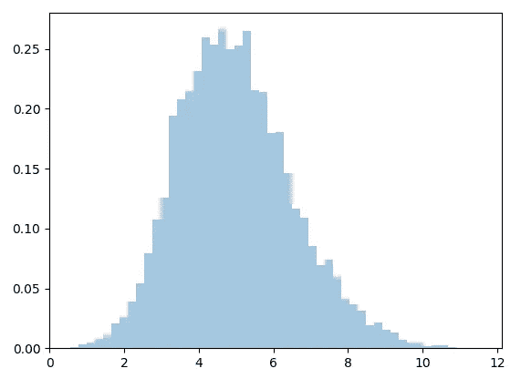

Histogram of OIIP for no correlation case

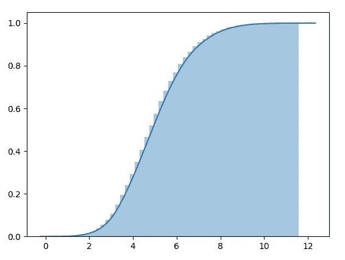

Cumulative distribution of OIIP for no correlation case

## 可变相关情况

为了说明可变相关性的情况，我们任意指定 NTG、POR 和 SHC 之间的正相关性。

```
cov = [[1., 0., 0., 0., 0.],
[0., 1., 0.7, 0.6, 0.],
[0., 0.7, 1., 0.8, 0.],
[0., 0.6, 0.8, 1., 0.],
[0., 0., 0., 0., 1.]]
```

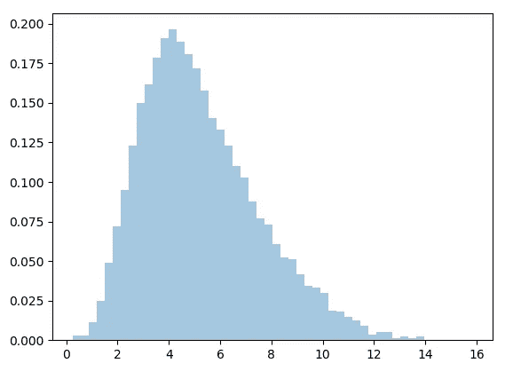

Histogram of OIIP for correlation case

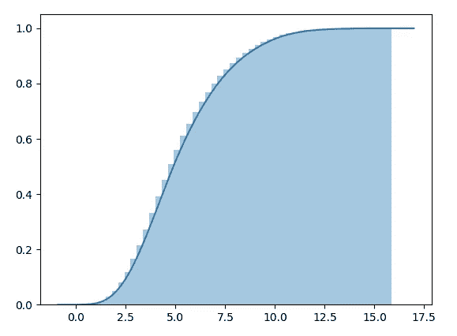

Cumulative distribution of OIIP for correlation case

# 总结

通过观察 OIIP 直方图和累积分布，我们可以看到，包括变量相关性或依赖性扩展了计算 OIIP 的 P10-P90 范围。这是合理的，因为通过包括相关性，采样可以探索极端空间，否则，在没有相关性的情况下可能会被错过。在下一篇文章中，我们将看看贝叶斯下降曲线分析(DCA)。