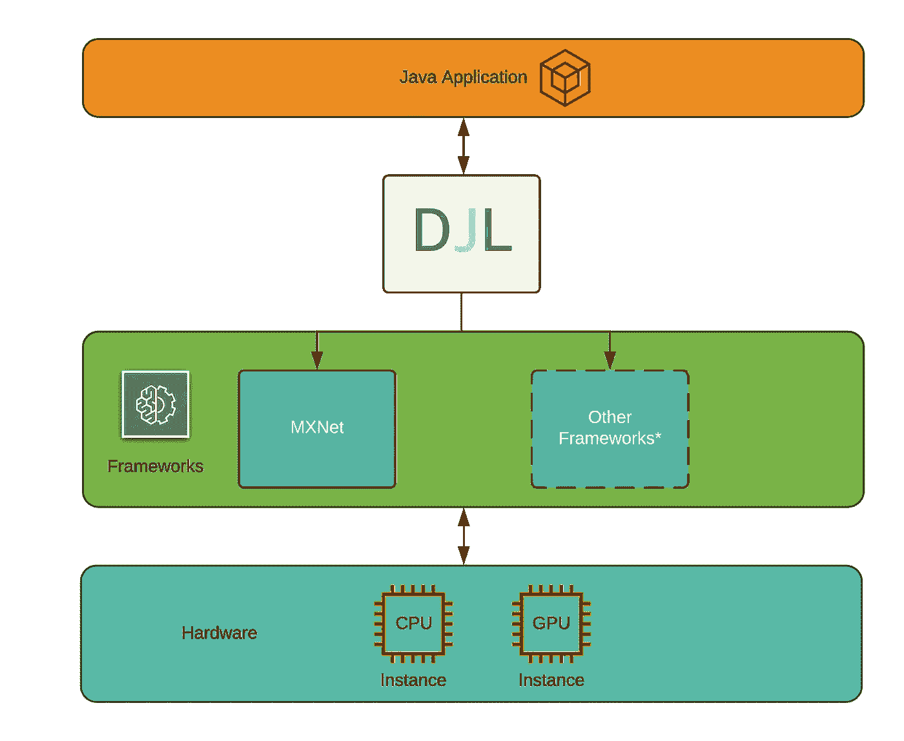
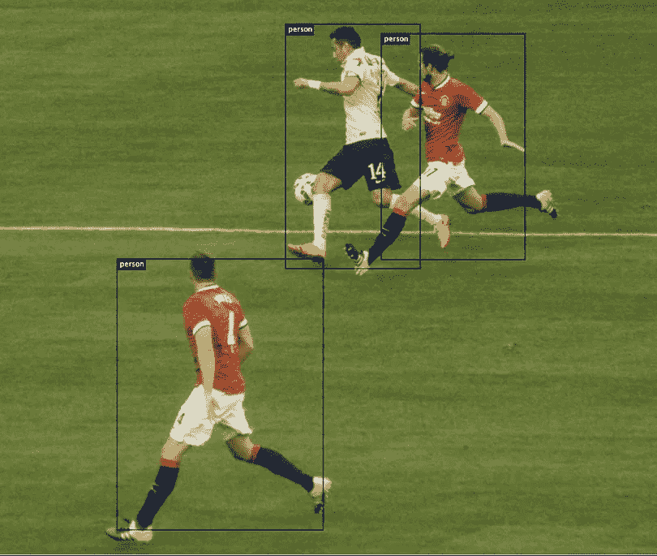

# 介绍深层 Java 库(DJL)

> 原文：<https://towardsdatascience.com/introducing-deep-java-library-djl-9de98de8c6ca?source=collection_archive---------11----------------------->

## 用 Java 构建和部署深度学习模型

我们很高兴地宣布[深度 Java 库(DJL)](https://djl.ai) ，这是一个开源库，使用直观的高级 API 来开发、训练和运行 Java 深度学习模型。如果你是一个对学习深度学习感兴趣的 Java 用户，DJL 是一个开始学习的好方法。如果你是一名使用深度学习模型的 Java 开发人员，DJL 将简化你训练和运行预测的方式。在这篇文章中，我们将展示如何在几分钟内用预训练的深度学习模型进行预测。

# 代表团

在开始编码之前，我们想分享一下我们构建这个库的动机。在调查深度学习领域时，我们发现 Python 用户有丰富的资源。比如数据分析的 NumPy 可视化的 MatplotlibMXNet、PyTorch、TensorFlow 等等框架。但是面向 Java 用户的资源非常少，尽管它是企业中最受欢迎的语言。我们的目标是为[数百万 Java 用户](https://slashdata-website-cms.s3.amazonaws.com/sample_reports/ZAamt00SbUZKwB9j.pdf)提供开源工具，用他们已经熟悉的语言来训练和服务深度学习模型。

DJL 是在现有深度学习框架之上，用原生 Java 概念构建的。它为用户提供了深度学习方面的最新创新，以及使用尖端硬件的能力。简单的 API 抽象出了开发深度学习模型所涉及的复杂性，使它们易于学习和应用。通过 model-zoo 中捆绑的一组预训练模型，用户可以立即开始将深度学习集成到他们的 Java 应用程序中。

* Other frameworks currently not supported.

# DJL 的例子

深度学习正在渗透到企业的各种用例中。在零售业，它被用来预测客户需求，分析客户与[聊天机器人](https://aws.amazon.com/solutions/case-studies/ryanair/)的互动。在汽车行业，它用于导航自动驾驶汽车，并发现制造过程中的质量缺陷。在体育行业，实时教练和训练洞察正在改变比赛的方式。想象一下，能够使用深度学习模型来模拟对手的移动或确定如何定位您的团队。在这篇[文章中，你可以了解西雅图海鹰队如何使用深度学习来告知游戏策略并加速决策。](https://finance.yahoo.com/news/seattle-seahawks-select-aws-cloud-140000784.html)

在本帖中，我们分享了一个让我们队的足球迷们产生共鸣的例子。我们演示了一个异议检测模型，该模型使用来自 DJL [模型动物园](https://github.com/awslabs/djl/blob/master/mxnet/mxnet-model-zoo/README.md)的预训练单镜头检测器模型从图像中识别球员。您可以在 Linux 和 macOS 中运行这个示例。

要在应用程序项目中使用 DJL，[用 IntelliJ IDEA 创建一个 gradle 项目](https://www.jetbrains.com/help/idea/getting-started-with-gradle.html)并将以下内容添加到您的 build.gradle 配置中。

*注意:MXNet 的运行时依赖对于 Linux 和 macOS 环境是不同的。参考* [*GitHub 文档*](https://github.com/awslabs/djl/blob/master/mxnet/mxnet-engine/README.md) *。*

我们用这个足球图像进行检测。

Source: [Offered under Apache-2.0 license on Gluon-CV](https://github.com/dmlc/web-data/blob/master/gluoncv/pose/soccer.png)

我们使用下面共享的代码块运行预测。这段代码从 model-zoo 加载一个 [SSD 模型](https://arxiv.org/abs/1512.02325)，从该模型创建一个`Predictor`，并使用`predict`函数来识别图像中的对象。然后，辅助工具函数在检测到的对象周围布置边界框。

这段代码识别图像中的三名球员，并将结果作为 ssd.png 保存在工作目录中。

该代码和库可以很容易地修改，以测试和运行 model-zoo 中的其他模型。但乐趣不止于此！你可以使用[问题回答模型](https://github.com/awslabs/djl/blob/master/jupyter/BERTQA.ipynb)来训练你自己的文本助手，或者使用[图像分类模型](https://github.com/awslabs/djl/blob/master/examples/docs/image_classification.md)来识别杂货店货架上的物品等等。请访问我们的 Github repo 获取更多[示例](https://github.com/awslabs/djl/tree/master/examples/docs)。

# 了解更多并做出贡献

在这篇文章中，我们介绍了 DJL，这是我们为 Java 用户提供最新、最棒的深度学习开发体验的一份微薄之力。我们用预先训练好的模型演示了 DJL 如何在几分钟内从图像中检测出物体。我们在 DJL GitHub [资源库](https://github.com/awslabs/djl)上提供了更多[示例](https://github.com/awslabs/djl/tree/master/examples)和[附加文档](https://github.com/awslabs/djl/tree/master/docs)。

我们欢迎社区参与我们的旅程。前往我们的 [Github 仓库](https://github.com/awslabs/djl)并加入我们的 slack [频道](https://join.slack.com/t/deepjavalibrary/shared_invite/enQtODQyOTYxNDExMTA3LWE5YjVlMWFmNTk3ZTJjNTE4NDIwNDc4NjA2MjZkM2VmM2M3MjI4MTFiMzFkOTVlZTM1NGVlZTI0OTlkNjhhNDI)开始吧。让我们开始酝酿吧！☕️