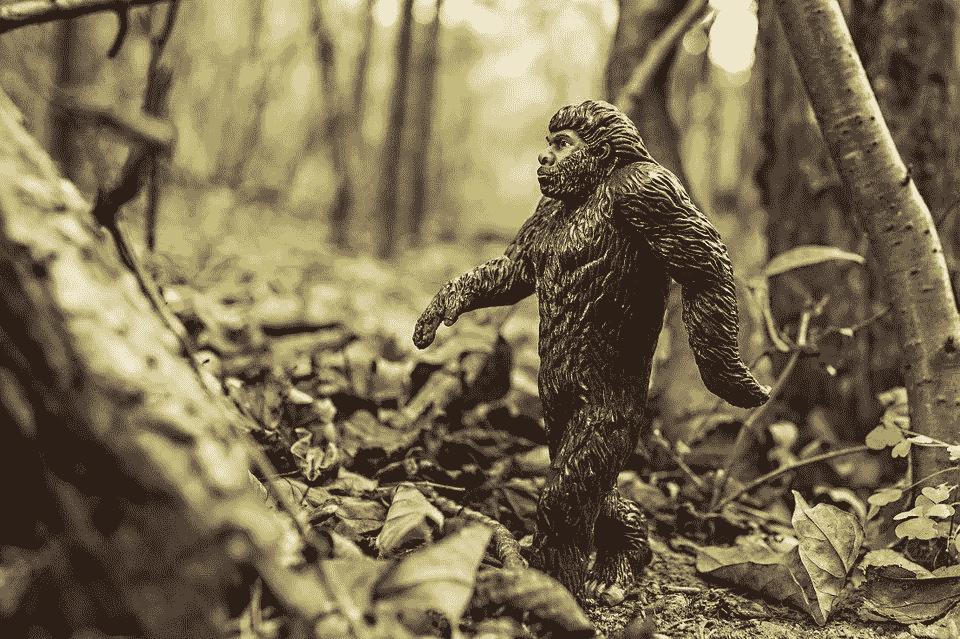
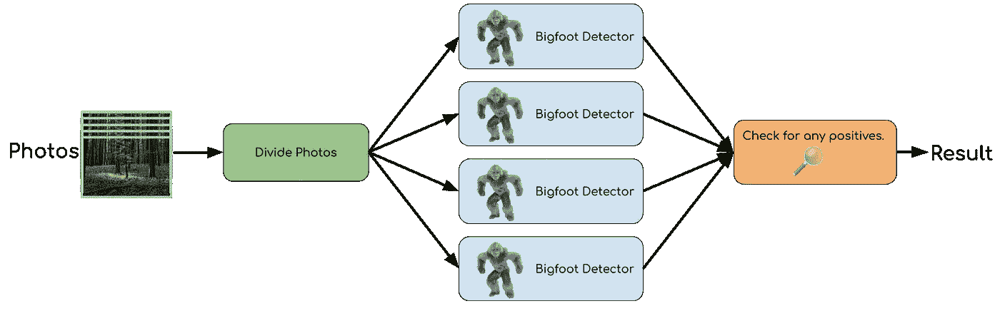
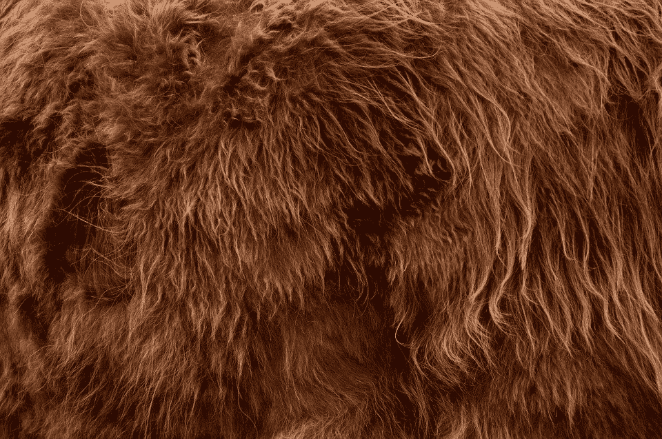

# 引入 flythub——可扩展的开源“点击式”人工智能。

> 原文：<https://towardsdatascience.com/introducing-flytehub-open-source-click-button-ai-that-scales-ffaeb7ebae44?source=collection_archive---------35----------------------->

# 好得难以置信？

执行机器学习(尤其是大规模)涉及大量的协调和无数的技术。直到最近，这还需要建立针对特定机器学习任务的定制环境。然而，最近的技术进步已经使得创建复杂的机器学习工作流成为可能，这些工作流可以移植到新的环境中，并且只需点击一个按钮就可以运行。

FlyteHub 是一个新的开源机器学习工作流的免费公共注册表。使用 FlyteHub，您可以点击运行任何开源工作流，并大规模执行强大的机器学习，而无需编写任何代码。由于这些工作流是可移植的，它们可以在您的笔记本电脑上运行，或者跨 1000 台机器的集群运行。

想象以下场景:

*   数据科学家编写工作流来执行图像识别。
*   数据科学家意识到其他人可能会从他们的工作中受益，并将工作流上传到 FlyteHub。
*   由于 flythub 工作流是可移植的，任何安装了 flythub 的人都可以点击导入这个开源工作流，执行图像识别，而无需编写任何代码，也无需安装任何额外的包。
*   这些用户可以对项目做出贡献，为每个人改进工作流程。

事实上，FlyteHub 已经有了图像识别的开源工作流。您可以在 5 分钟内运行它们，而无需编写任何代码，甚至可以训练您自己的模型来识别自定义对象。

FlyteHub 现在之所以成为可能，是因为几个行业的进步，包括几周前在 KubeCon 推出的“Flyte”。现在就试试[flythehub](https://flytehub.org/)吧，或者继续阅读，了解今天使开源工作流成为可能的进步的时间表。

在这个过程中，我们将展示如何使用开源工作流来搜寻和捕获难以捉摸的大脚野人(更好地称为“大脚怪”)。

* the target (not to scale)

类似的工作流程可以用于发现“拉撒路物种”(像大村鲸鱼这样的生物，曾经被认为已经灭绝)，或者追踪超稀有的西伯利亚虎，其数量被认为低于 5000 只。

# 让我们回到 2013 年。

来自 BFRO(大脚野外研究者组织)[的数据显示，西雅图郊外的金县出现了多次大脚野人](http://www.bfro.net/news/google_earth.asp)。我们在瞄准点附近的树林里安装了摄像头，每隔几秒钟就会自动拍摄一张照片。

我们没有时间看所有的照片。幸运的是，我们有一位数据科学家，他写了一些 Python 代码，他称之为“大脚探测器”。该代码使用计算机视觉扫描每张照片，并告诉我们它是否包含大脚怪。

我们希望与加利福尼亚的一个团队共享此代码，这样他们也可以使用它。现在是 12 月，报告显示这种生物可能正在向南迁徙。

在 2013 年之前，用户需要在他们的计算机上手动安装所有必要的要求，然后才能使用该代码。

要运行我们的 Python 任务，加州团队必须安装正确版本的 Python，以及所有必需的库。如果任务需要不同的技术，比如 Apache Spark，他们需要确保 Java 和 Spark 已经安装，并且配置正确。

用这种方式创建可移植的“点击式”人工智能是非常困难的，因为每个任务都有一套独特的需求。不同的人工智能任务甚至可能需要同一个库的不同版本。即使对于经验丰富的工程师来说，这也是一种令人沮丧的体验，通常被称为“依赖地狱”。

加州团队没有工程师，我们不想让他们经历依赖地狱。我们需要尽可能多的帮助。世界上的任何人都应该只需点击一个按钮就可以提交他们的照片，并加入追捕大脚怪的行列。

# 2013:容器彻底改变了我们共享代码的方式

“容器”就像一段代码，捆绑了所有必要的需求。例如，我们的容器可以包含 Python 3.6 版，以及完成我们的大脚探测器任务所需的所有 Python 包。

容器在隔离的环境中运行。如果您在笔记本电脑上启动大脚怪检测器容器，该容器将使用 Python 3.6 运行，即使您的笔记本电脑安装了 Python 2，或者根本没有安装 Python。

当您运行开源 FlyteHub 工作流时，所有代码都在容器内运行。这确保了代码可以在所有环境中可靠地运行。

# 解决了？没那么快。

某些人工智能任务可能需要很长时间来运行(尤其是在大规模的情况下)。

当我们取回相机时，我们将拥有一百万张照片。如果 AI 代码处理每张图像需要 10 秒，那么计算机完成所有 100 万张图像需要 115 天。

我知道你在想什么:“115 天？！野兽可能在去墨西哥的半路上！”

我们需要更快的反馈。

为了加速这个过程，我们可以使用 100 台计算机，在它们之间分配图像。如果每台机器处理 10000 张图像，1 天就可以完成全部 100 万张照片。

由于代码被打包到一个容器中，您不需要担心在所有这些计算机上安装任何要求，但是，您仍然需要指示 100 台计算机中的每一台运行 Bigfoot 检测器容器。

我们可以编写循环 100 次的代码，告诉每台机器运行容器。但是，如果代码假设正好有 100 台机器，那么代码是不可移植的。

为了让这项人工智能任务具有可移植性，我们的团队应该能够在一天内在 100 台计算机上执行这项任务。加州团队(他们没有 100 台计算机)应该能够在一台笔记本电脑上执行相同的任务，并在 115 天内处理图像。换句话说，代码不需要理解它运行的基础设施。

# 2015 年:推出 Kubernetes

Kubernetes 是一个在计算机“集群”上启动容器的平台。您的集群可能只有一台机器(您的笔记本电脑)，或者 1000 台机器。

当您指示 Kubernetes 启动 100 个容器时，Kubernetes 会尽快将它们安排在您的机器集群上。

Kubernetes 跟踪有多少机器资源可用。如果您的集群只够同时运行 50 个容器，Kubernetes 将立即启动前 50 个容器。一旦其中一个容器运行完毕，Kubernetes 将检测到现在还有空闲空间，并启动第 51 个容器。随着更多容器的完成，Kubernetes 将继续推出新的容器，直到所有容器完成。

如果您只有足够的资源一次启动一个容器，大脚怪探测器工作流程将需要 115 天才能运行，但它最终会完成。

FlyteHub 开源 AI 运行在 Kubernetes 上。Kubernetes 集群可以小到像笔记本电脑这样的单台机器，也可以是 AWS 中的大型集群。Kubernetes 确保工作流在任一场景下都能成功运行。

# 解决了？没那么快。

一旦所有这些大脚探测器容器完成，我们有一百万个输出(每个图像一个输出)。我们需要把这些结果结合成有用的东西。

为了解决这个问题，我们可以创建另一个容器来组合来自每个图像处理容器的结果，并寻找积极的结果。

问题是，订购对这个容器很重要。

与可以同时运行的大脚探测器容器不同，我们需要等到所有大脚探测器任务完成之后，才能启动最后一个容器。

这不是容器排序很重要的唯一场景。在运行图像处理之前，我们应该将照片分成小批，以便我们可以为每批照片启动一个大脚探测器容器。我们的逻辑流程如下所示:

*   第一步:将照片分成小批。
*   步骤 2:为每批照片启动大脚探测器容器。
*   第三步:结合第二步的结果，并检查任何积极的结果。

(all steps run inside containers)

数据科学过程倾向于采取类似于这样的“任务”的“工作流”的形式。这些工作流程可能会变得非常复杂。工作流中的任务可能包括数据收集、数据预处理、特征提取、模型训练、模型评估等等。

一些任务(如大脚探测器)可以并行运行。其他任务(如“检查阳性”任务)需要等待前面的任务完成后才能启动。

由于 Kubernetes 对我们的排序逻辑一无所知，它不知道要等待一些任务完成后再开始其他任务。

我们需要一个理解我们工作流程逻辑的“工作流程经理”。“工作流管理器”需要在工作流运行时照看它。当前面的所有步骤都完成后，它应该只在 Kubernetes **中启动容器。为了完成我们的工作流，工作流管理器需要做这样的事情:**

1.  告诉 Kubernetes 启动“分割照片”任务。
2.  等待任务完成。
3.  告诉 Kubernetes 为每批启动“大脚探测器”任务。
4.  等待所有大脚探测器任务完成。
5.  告诉 Kubernetes 启动最后一个任务来检查积极的结果。
6.  存储结果，并显示给用户。
7.  用户捕获大脚怪，并与马戏团环游世界。

# 2019: Lyft 推出 Flyte

Flyte 是使工作流可移植所需的拼图中缺失的一块。

Flyte 引入的一个关键概念是“工作流规范”。工作流规范提供了一种健壮的方式来表达工作流中的逻辑流。

Flyte 中的所有工作流都必须符合该规范。Flyte 可以阅读这些工作流，理解任务的排序，并以正确的顺序在 Kubernetes 上启动它们。

Flyte 不仅理解排序，还理解工作流中的数据流。通常，一个任务的输出成为下一个任务的输入。从工作流规范中，Flyte 明白这一点。

Flyte 确保一个任务的输出可用于下一个任务，即使这些任务运行在完全独立的计算机上。不管我们是在 1 台笔记本电脑上运行大脚怪检测器，还是在 1000 台机器上运行，这些图像识别任务的输出都可以用于“检查阳性”任务。

当我们将工作流上传到 flythehub 时，flythehub 会存储工作流规范。任何大脚猎人都可以导入工作流，提交他们的照片，并获得结果，而不需要了解它如何工作的任何细节。

事实上，该工作流程最近被蒙大拿州的一名家庭研究员用于制作以下照片:

看着这张照片，很明显这种类型的头发只能来自于…神话本人。

# 结论

今天的帖子只是触及了这些技术所释放的可能性的表面。在后续文章中，我将进一步描述 Flyte 工作流规范，并展示开发人员如何通过将任务组合成超级工作流来利用彼此的工作。

试试 FlyteHub 吧。我希望通过在开源工作流程上的合作，我们可以创造出更好的产品。

敬请关注更新。