# 引入 Hoeffding 不等式生成无存储决策树

> 原文：<https://towardsdatascience.com/introducing-hoeffdings-inequality-for-creating-storage-less-decision-trees-b5135e65e51e?source=collection_archive---------15----------------------->

## 探索 Hoeffding 不等式陈述了什么，以及如何使用它来创建一类特殊的不使用存储的决策树:Hoeffding 树。


© by my lovely wife [Tinati Kübler](https://dribbble.com/tinati)

# 任务

我想象你有一个巨大的带标签的数据集，你想为一个预测任务建立一个模型。例如，这可以是 Twitter，在那里你有比你可以计算的包括相应的喜欢(标签)数量更多的推文(功能)。现在你想要建立一个模型，可以预测一条推文是否会被喜欢超过 100 次，对去年写的所有推文进行训练，也就是说，我们想要解决一个**分类任务**。标签为 1 意味着该推文有超过 100 个赞，否则为 0。


Photo by [Sara Kurfeß](https://unsplash.com/@stereophototyp?utm_source=medium&utm_medium=referral) on [Unsplash](https://unsplash.com?utm_source=medium&utm_medium=referral)

你决定使用决策树，甚至是从它衍生出来的智能工具，比如随机森林或梯度推进。但是决策树、基于决策树的模型、甚至其他模型都有以下缺点:

> 您需要在内存中随时可用的训练数据。

# 问题是

在最好的情况下，完整的训练数据可以放入本地机器的内存中。但是，您意识到 tweets 数据集大于 8–32GB，所以您运气不好。也许您可以访问具有 512 GB RAM 的集群，但这也不够大。

数据集实际上有多大？让我们做一个粗略的估计。[推特](https://blog.twitter.com/engineering/en_us/a/2013/new-tweets-per-second-record-and-how.html)本身和其他几个来源(这里是[这里是](https://www.internetlivestats.com/twitter-statistics/)和[这里是](https://www.dsayce.com/social-media/tweets-day/))报告称，每秒大约有 6000 条推文。这意味着每年大约有 6000 * 60 * 24 * 365 =189,216,000,000‬推文。让我们假设每条 tweet 的大小为 140 字节，每个字节对应于[单词包编码](https://en.wikipedia.org/wiki/Bag-of-words_model)中的一个字符。*我们忽略了每条 tweet 可能附带了一些元数据，我们也可以使用二元模型、三元模型等。*这是一个巨大的 140 *189,216,000,000‬/10⁹=**26，490 GB 的推文数据**！

因此，使用 RAM 不是一个选项。即使你碰巧拥有一个足够容纳整个数据集的硬盘，从其中读取数据也会使训练非常缓慢，正如你在这里看到的[(图 3)](https://queue.acm.org/detail.cfm?id=1563874) 。

嗯，怎么办呢？

# 解决方案

来自华盛顿大学计算机科学与工程系的 Pedro Domingos 和 Geoff Hulten 介绍了决策树的一种变体，称为*Hoeffding Trees*【1】，可以用于*流*方式。这意味着我们只需**解析一次大的训练数据集**，并在此过程中构建树。

我们甚至不必存储所使用的样本:我们可以直接从 Twitter(或任何大型数据库)中获取它们，通过增加一些计数器来处理它们，然后再次忘记它们。为什么这是可能的可以用*赫夫丁不等式*来解释，这就是赫夫丁树的名字。

高层次的想法是，我们不必查看所有的样本，而只需查看决策树算法中每个分裂点的**足够大的随机子集**。这个子集有多大是下一节的主题。

我写这篇文章是因为 Domingos 和 Hulten 的论文非常专业(因此也非常精确),我想提出一个高级的、易于理解的观点来解释作者的方法为什么有效。

此外，如果您不想在接下来的部分中处理数学问题，至少可以看看最后一部分的一些代码！在那里，我使用 scikit-multiflow 软件包来使用 Hoeffding 树。

# 赫夫丁不等式

让我们研究一下霍夫丁不等式的内容，以及如何利用它来解决存储问题。

## 介绍

[芬兰统计学家、非参数统计的创始人之一瓦西里·赫夫丁](https://en.wikipedia.org/wiki/Wassily_Hoeffding)(基于[赫尔曼·切诺夫](https://en.wikipedia.org/wiki/Herman_Chernoff)的思想)发现了一个不等式[2]，量化了以下陈述:

> 有界随机变量的和(也是均值)紧紧围绕其期望值。

以一枚公平的硬币(看到正面的概率= 0.5)为例，我们掷 1000 次。定义随机变量 *X₁，…，X₁₀₀₀* 用

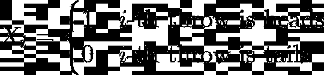

那么人头的数量——让我们称之为*x*——正好是 *Xᵢ* 的总和。我们已经知道，从那以后我们可以预期 500 次人头

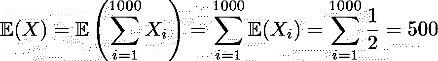

The expectation of the *Xᵢ*’s is the probability of them being equal to 1, which is 0.5 in our case. Furthermore, the [expected value is linear](https://en.wikipedia.org/wiki/Expected_value), justifying the first equation.

现在赫夫丁不等式把我们覆盖了:我们也知道 *X* 大概率不会偏离*500*太多*，*见下图*。*我们一会儿就知道“多”和“概率大”是什么意思了。

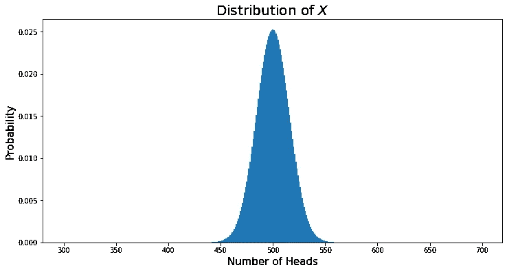

You can see how concentrated the probability mass is around 500\. The probability of seeing exactly 500 times heads is about 0.025.

## 简化的定理

> 设 X₁，…，Xₙ是独立的伯努利随机变量，即它们中的每一个都取值 0 或 1。设 X = X₁ + … + Xₙ是他们的和。然后


Hoeffding’s Inequality for sums.

**注意:**一个更一般的公式成立，其中 *Xᵢ* 可以在任意实数 *a* 和 *b* 之间有界，甚至不必随机独立。但是我们使用这里给出的版本。

直觉上，这个不等式是有意义的:t*变得越大，也就是说，我们允许误差变得越大，落在区间或长度 2 *t* 内的概率就越大。*

但是真正有趣的事情是这样的:等式的右边只包括随机变量的数量 *n* 和允许误差 *t.* **最重要的事情，Xᵢ等于 1 的概率，在不等式的右边是找不到的。概率对我们来说可以是已知的，也可以是未知的，对所有人来说都是一样的，这并不重要。**这就是为什么这种不平等如此多才多艺，如此适合研究。

具有这种性质的其他不等式是更容易的[马尔科夫不等式](https://en.wikipedia.org/wiki/Markov%27s_inequality)和[切比雪夫不等式](https://en.wikipedia.org/wiki/Chebyshev%27s_inequality)，但是它们给我们的右边的下界要差得多。平心而论，这两个不等式不需要我们的随机变量有界。然而，赫夫丁不等式利用了这样一个事实:Xᵢ在 0 和 1 之间有界。

取该不等式，用 *nt、*代替 *t* ，并将 P(…)内的不等式除以 *n* 得到平均值的 Hoeffding 不等式:

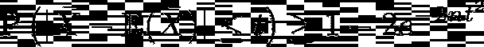

Hoeffding’s Inequality for the mean.

在哪里

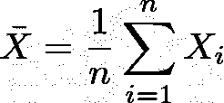

# 应用程序

现在让我们来看看不平等在起作用。首先，我们将谈论一个非常基本的硬币例子。然后，我们会去第二个非常重要的例子，估计股份，我们需要了解为什么赫夫丁树工作。

## 回到硬币的例子(总和)

假设我们要计算得到小于等于 450 或者大于等于 550 人头的概率。由于𝔼( *X* ) = 500，我们可以设置 *t* =50，最后得到

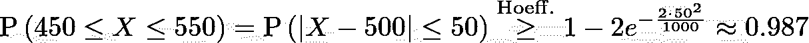

这意味着偏离期望值小于 50 的概率非常高。头数极度集中在 500 左右。

## 估计份额(平均值)

假设有一大池 *N* 个球，其中未知份额 *p* 为白色，其余为黑色。一个自然的问题可能是:白球的份额 *p* 有多大？如果池大小 *N* 足够大(想想几十亿)，捡起每个球并检查它不是一个选项。

当然，自然要做的事情是均匀地抽取几个样本——比如说有替换的 *n —* 球，然后检查它们。如果其中的 *w* 是白色的，我们就可以断定 *p* ≈ *w/n* 。但是我们的子样本应该有多大呢？什么尺寸适合 *n* ？10 可以吗？100?1000?

嗯，这取决于**与 *p*** 的偏差有多大，以及**在这个偏差范围内，你需要多大的信心**。您可以设置两个参数:

*   误差的上界在 *p，*让我们再把它叫做 *t*
*   在以长度为 2 的 *p* 为中心的区间内概率的一个下界姑且称之为 1- *ɛ* 对于小的 *ɛ > 0* 。

> 这意味着 t 和ɛ是固定的，我们想找到 n 个例子，这样至少在概率为 1-ɛ的情况下，分数 w/n 与 p 的差异不超过 t

我们现在要正式确定这件事。让我们定义 *n 个*随机变量 *X₁，…，Xₙ* 为

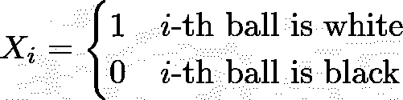

由于我们随机抽取有替换的球， *Xᵢ* 为 1 的概率正好是 *p* ，未知份额。这也正是 *Xᵢ.的期望值*


让 *X̅=w/n* 再次成为这些伯努利变量的平均值。然后我们还有

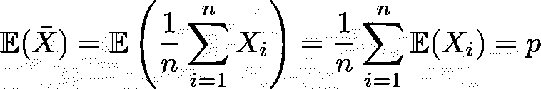

赫夫丁不等式给了我们

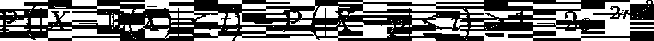

现在我们希望右手边大于 1- *ɛ，*，这给我们一个关于 *X̅=w/n* 偏离 *p* 不超过 *t* 的下限，其概率至少为1- *ɛ.*因此，我们必须解决这个不等式

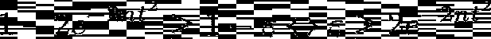

对于 *n* 。使用一些基本运算，我们得到

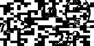

如果我们容忍概率至少为 99%的 *p* 的绝对误差至多为 1%，我们必须将 *t* =0.01，将 *ɛ=* 设为 0.01，这样我们得到的所需子样本大小至少为

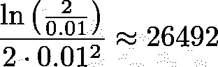

让我们用 Python 来试试吧。我们考虑 30，000，000 个球的池，其中 10，000，000 个球是白色的(标记为 1)，20，000，000 个球是黑色的(标记为 0)。所以白球的真实份额是 0.3333……我们假装不知道。

```
import numpy as npnp.random.seed(0)# Create a pool with 30 million entries, 10 million being a one (white ball) and 20 million being a zero (black ball).
# This means that we have a share of 1/3=0.3333... white balls. 
pool = 200000000 * [0] + 100000000 * [1]# Set Hoeffding parameters.
t = 0.01
eps = 0.01
hoeffding_amount = int(np.ceil(np.log(2 / eps) / (2 * t ** 2)))subsample = np.random.choice(pool, size=hoeffding_amount, replace=True)
print(subsample.mean())
# Result: 0.32975992752529065
```

看起来不错！误差只有 0.0035 < 0.01 = *t* 左右。但是这种情况发生的概率至少是 99%,所以我们为什么要庆祝呢？；)

> 注意，不是采样、保存，然后取 26，492 个样本的平均值，我们可以仅仅采样，每当我们画出一个白球(1)时增加一个计数器，然后再次忘记该样本。通过这种方式，我们只需要跟踪计数器和我们查看的球的总数，这使得这成为一种**非常高效的内存**算法(在我们的子样本大小中为对数 *n* )。

总的来说，我们可以说一个 26500 左右大小的子样本就足以高置信度地确定白球的份额。

# 回到机器学习

在最后一个例子中，我们已经看到了如何在一个巨大的黑白球池中计算白球的份额，而无需检查整个池，也不会有很大的误差。

我们将使用这些知识来训练决策树，而不需要在内存中有大量可用的训练数据，这是我们首先要解决的问题。

但是首先，我们必须重复一遍决策树是如何按照通常的方式构建的。

## 以传统方式构建决策树

在这里，我不会详细讨论决策树算法是如何工作的。在网上和媒体上有很多很棒的视频和文章。

但是，如果完整的训练数据集适合我们的内存，通常这是算法的第一步:

我们计算完整数据集的标签的杂质 *I₁* 的度量，例如用于分类任务的[香农熵](https://en.wikipedia.org/wiki/Entropy_(information_theory))，我们现在也将使用它。

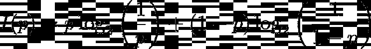

The formula of the Shannon Entropy. p is the share of samples labeled 1\. If p is 0 or 1, **meaning that the samples all have the same label**, the impurity is 0\. The entropy function (=impurity) takes its maximum when exactly half of the samples are labeled 1 and the other half labeled 0, which corresponds to p=0.5\. As you can see, the formula is symmetric, i.e. I(p)=I(1-p), which means that we can also consider the share of black balls instead of white balls.

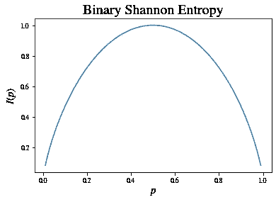

然后，我们采用特征 *f* 和切割点 *c.* 使用这些，我们将整个数据集划分成两个不相交的子集:

*   其中特征 *f* 的值小于(或等于)c*的所有样本*
*   *另一个包含所有样本，其中特征 *f* 的值严格大于 *c.**

*再次测量这两组的杂质，并合并成一个加权平均值，给出两组的单个杂质测量值 *I₂* 。则*信息增益*计算为 *G* = *I₁ — I₂.**

*考虑以下一个拆分示例:*

*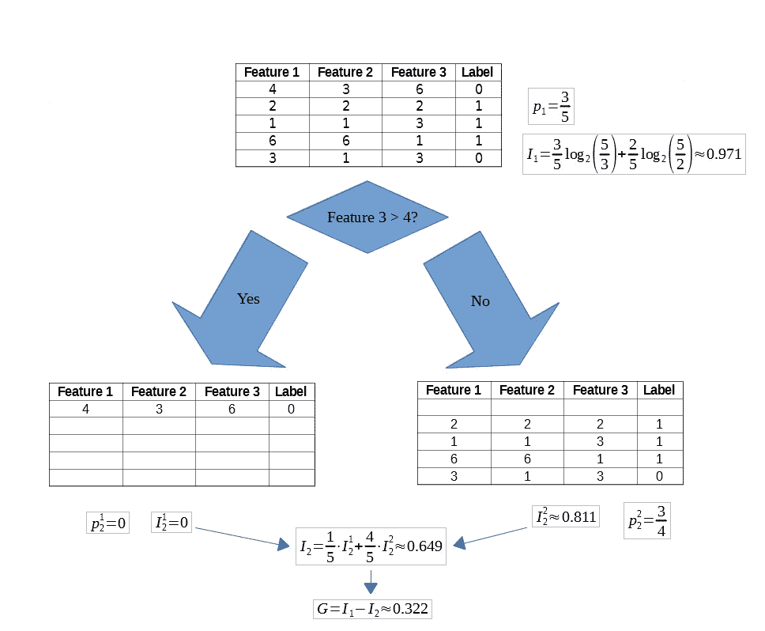*

*In this small example, we start with five samples with three features each. We start by measuring the impurity, namely *I₁*. Then we choose Feature 3 and a cut point of 4 to split the node. Doing this, the original five samples are distributed in the two children nodes. We measure the impurities of both nodes and combine them into a single number *I₂. The Information Gain is then computed.**

**对所有特征和所有可能的切割点进行上述操作，选择具有最大信息增益 G 的切割点作为树中的第一个分割点。我们现在对树中的所有叶子递归地重复这一过程，直到满足某个停止标准(节点的杂质小于阈值，树已经达到最大深度，节点中的样本太少等等)。**

## *消除内存需求*

*现在，我们必须使用更少的样本来模拟行为。正如我们在普通决策树中看到的:*

> *只有标签为 1 的样品的份额 p 与计算杂质有关！*

*幸运的是，我们可以使用原始训练集的子样本来近似这个份额 *p* 和**因此杂质**，正如在关于赫夫丁不等式的部分中所讨论的。在球示例的语言中，带有标签 1 的标签是白球，带有标签 0 的样本是黑球。*

*考虑到单次分裂，我们仅使用大约 26，500 个样本就可以近似得到 *I₁* 。然而，为了估计 *I₂* ，我们在每个子节点中需要 **26，500。如果幸运的话，样本被平均分配到两个节点上，那么 2*26，500=53，000 个样本就足够了。否则，我们可能需要更多，但只要我们需要的样本少于几百万，我们就比以前更好了。即使我们需要一百万个:因为我们可以将它们流式传输到树中并跟踪一些计数器，所以我们不会遇到内存问题。***

*这样我们可以安全地训练我们的模型，即使是在 Twitter 上的每条推文中。快乐大练兵！*

*如果你想详细了解这是如何做到的，请阅读论文[1]。作者用伪代码描述了他们的算法以及所有必要的计数器，并且他们还给出通过流式传输数据来构建多少 Hoeffding 树的证明，并且相应的正常决策树将会偏离。*

# *结论*

*我们已经看到，在极大的训练集上训练决策树是不可行的。克服这个问题需要对正确数量的训练样本进行子采样，并用不完整但相当准确的信息构建树。这种二次抽样是合理的赫夫丁不等式，给这些特殊的决策树也有他们的名字:赫夫丁树。*

*此外，我们**甚至不必存储子样本**，我们只需在扫描训练数据时跟踪我们已经看到了多少标签为 1(白色球)的样本，这是一种简单有效的方法，可以进一步降低存储复杂度。*

*在本文中，我们只看到了用于分类任务的香草胡夫丁树。还存在用于回归的算法，甚至是对抗所谓的*概念转移*的方法，即当训练分布随时间变化时*。**

*幸运的是，这些算法都是由 Python 的 [scikit-multiflow](https://scikit-multiflow.github.io/scikit-multiflow/index.html) 的开发者实现的！让我们做一个快速测试。*

# *四处玩耍*

*首先，做一个禁食*

```
*pip install scikit-multiflow*
```

*然后，让我们比较在完整的训练集上拟合 Hoeffding 树(=足够的可用 RAM)与逐个传递每个样本。更详细的测试也可以在[1]中找到。*

```
*from sklearn.datasets import make_classification
from sklearn.model_selection import train_test_split
from skmultiflow.trees import HoeffdingTree
import matplotlib.pyplot as pltres = []# Create a dataset.
X, y = make_classification(10000, random_state=123)
X_train, X_test, y_train, y_test = train_test_split(X, y, test_size=0.2, random_state=123)# Define a tree for fitting the complete dataset and one for streaming.
ht_complete = HoeffdingTree()
ht_partial = HoeffdingTree()# Fit the complete dataset.
ht_complete.fit(X_train, y_train)
ht_complete_score = ht_complete.score(X_test, y_test)
print(f'Score when fitting at once: {ht_complete_score}')# Streaming samples one after another.
timer = False
j = 0
for i in range(len(X_train)):
    ht_partial.partial_fit(X_train[i].reshape(1, -1), np.array([y_train[i]]))
    res.append(ht_partial.score(X_test, y_test))
    print(f'Score when streaming after {i} samples: {res[-1]}')
    if res[-1] >= ht_complete_score - 0.01:
        print(f'(Almost) full score reached! Continue for another {20 - j} samples.')
        timer = True
    if timer:
        j += 1
        if j == 20:
            break# Plot the scores after each sample.
plt.figure(figsize=(12, 6))
plt.plot([0, i], [ht_complete_score, ht_complete_score], '--', label='Hoeffding Tree built at once')
plt.plot(res, label='Incrementally built Hoeffding Tree')
plt.xlabel('Number of Samples', fontsize=15)
plt.ylabel('Accuracy', fontsize=15)
plt.title('Fitting a Hoeffding Tree at once (enough Memory available) vs fitting it via Streaming', fontsize=20)
plt.legend()*
```

*生成的图形可能如下所示:*

*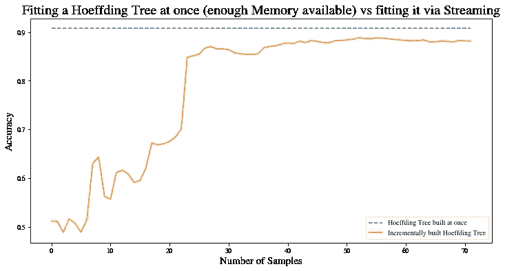*

*We can see that building a Hoeffding Tree H directly yields an accuracy of about 91% (on a test set). If we build another Hoeffding Tree by feeding in each sample one after another, we can see that the performance approaches the performance of H. After about 50 samples, our streaming Hoeffding Tree has an accuracy of about 88% already. If we pass in more samples, 91% is reached at some point (for me it was after about 4000 samples out of the 8000 training samples).*

# *参考*

*[1] P. Domingos 和 G. Hulten，[挖掘高速数据流](https://homes.cs.washington.edu/~pedrod/papers/kdd00.pdf) (2000)，第六届 ACM SIGKDD 知识发现和数据挖掘国际会议论文集*

*[2] W. Hoeffding，[有界随机变量和的概率不等式](http://repository.lib.ncsu.edu/bitstream/1840.4/2170/1/ISMS_1962_326.pdf) (1962)，美国统计协会杂志。58 (301)*

*我希望你今天学到了新的、有趣的、有用的东西。感谢阅读！*

***作为最后一点，如果你***

1.  ***想支持我多写点机器学习和***
2.  ***无论如何，计划获得一个中等订阅，***

***为什么不通过此链接**[](https://dr-robert-kuebler.medium.com/membership)****？这将对我帮助很大！😊*****

****说白了，给你的价格不变，但大约一半的订阅费直接归我。****

***非常感谢，如果你考虑支持我的话！***

> ****有问题就在*[*LinkedIn*](https://www.linkedin.com/in/dr-robert-k%C3%BCbler-983859150/)*上写我！****