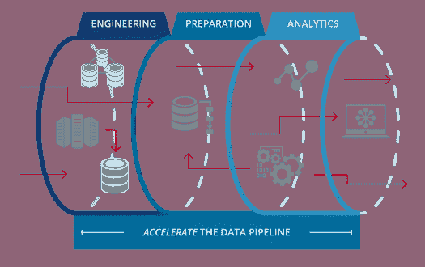

# 介绍车床:朱莉娅的管道

> 原文：<https://towardsdatascience.com/introducing-lathe-pipelines-for-julia-57d7d7c07349?source=collection_archive---------34----------------------->



在 Julia 语言中，我最想念的工具之一是 SKlearn 管道。与 SKlearn 相比，Lathe 本质上是一个非常不同的东西，不仅是基于函数式编程语言构建的，而且还具有像 fit-initialization 这样的初学者友好的属性。我非常想实现的是车床内部 Sklearn 管道的替代方案，随着即将发布的车床 0.0.5，我已经做到了！

[**笔记本**](https://github.com/emmettgb/Emmetts-DS-NoteBooks/blob/master/Julia/Lathe%20pipelines%20example.ipynb)

# 数据

为了开始我们的小管道演示，我们需要读入一些数据。由于这不一定是一个项目，我将从我的[深海相关项目](/deep-sea-correlation-27245959ccfa)中回收数据。当然，第一步是使用 CSV 读取我们的数据:

```
using CSV
df = CSV.read("bottle.csv")
```

然后我们快速清洗！

```
using DataFrames
df = DataFrame(:TempC => df.T_degC, :Salinity => df.R_SALINITY, :Depth => df.Depthm)
# We're going to drop the missing values now, if we did that prior, # we would
#    have likely dropped a-lot more data.
df = dropmissing(df)
```

> 轻松点。

现在我们可以进入主题的实质，从选择我们的特性和目标开始。这对我来说并不重要，因为我们不追求准确性，而只是新模块的演示。对于我的特征，我选择了盐度和我的目标温度。让我们对测试和训练集做一个快速分割，然后我们可以设置我们的 x 和 y…

```
using Lathe.preprocess: TrainTestSplit
train,test = TrainTestSplit(df)
```

以及 X 和 Y 设置:

```
trainX = train.Salinity
trainy = train.TempC
testX = test.Salinity
testy = test.TempC
```

# 管道

为了在车床中建立管道，首先要建立一个模型。虽然在 Sklearn 中也可以这样做，但是这里的不同之处在于，管道的其他部分依赖于在模型中构造的 X 和 Y。考虑到这一点，我们仍然可以按照 Sklearn 的方式来做，但拟合模型的方式必须与我们在外部做的方式相同。

```
using Lathe.preprocess: StandardScalar
using Lathe.models: LinearRegression
using Lathe: pipelines
```

现在我们可以调用函数，它接受一个构造好的车床模型、一个方法或数组中的方法，然后接受一个类型参数。将来，除了原始的管道之外，可能会有不同类型的管道用于不同类型的特性，并且可能到 0.0.5 发布时，会有一个管道能够与其他 Julia 模型通用地工作。现在我们可以构建我们的管道。

```
pipl = pipelines.Pipeline(LinearRegression(trainX,
trainy),StandardScalar,:CON)
```

最后一部分，“:CON”告诉 predict 方法要运行哪个算法，这可能会改变，所以我不会太关注这一部分，因为它基本上不重要。

为了预测，我们使用来自车床的函数 pipe _ predict . pipelines:

```
[@time](http://twitter.com/time) pipelines.pipe_predict(pipl,testX)
```

> 恭喜你！

现在我们已经正式创建了一个 fit 管道来保存我们的训练值、预处理方法和模型类型！一个巨大的好处是即将到来的管道系列化。我不仅计划在 Julia 中序列化这些模型，还计划用 PyPi 包将它们读入 Python，以便在 Flask 和 Django 管道和 web 应用程序中使用，这不是很酷吗？

```
pipelines.save(pipl,"My-Pipeline")
```

我真的很兴奋的未来，这部分车床，和车床整体举行！车床 0.0.5 中有很多新的统计数据、模型和更多的东西，之后还会有更多！