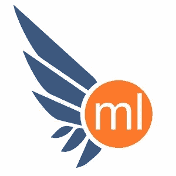

# 介绍 Mercury-ML:一个开源的“机器学习之神的使者”

> 原文：<https://towardsdatascience.com/introducing-mercury-ml-an-open-source-messenger-of-the-machine-learning-gods-c571f90e6b36?source=collection_archive---------27----------------------->


在古罗马神话中，墨丘利神被称为“众神的使者”。他穿着带翼的鞋子，戴着带翼的帽子，在奥林匹斯山和人类王国之间飞奔，确保众神的意志被知晓。他不是众神中最强壮、最聪明、最受尊敬或最令人畏惧的，但他脚步敏捷、狡猾，可以依靠他来引导事情朝着他们想要的结果发展。没有他，珀尔修斯不可能打败美杜莎；奥德修斯可能会中了喀尔刻的魔咒；而赫拉克勒斯也不可能将冥府之神地狱犬从冥府中拖出来，从而完成他 12 项神话般的劳动中的最后一项…

在这篇文章中，我想介绍一个名为 [Mercury-ML](https://github.com/mercury-ml-team/mercury-ml) 的新项目，以及开源的“机器学习之神的使者”。

**机器学习工作流程看似简单，却依赖于多种工具和技术的复杂组合**

机器学习和数据处理工具的最新发展导致了无数的开源库，其中每个库都提供了开发良好的透明 API，并且每个库都在构建健壮的机器学习工作流时发挥作用。经常使用的机器学习库，如 TensorFlow、PyTorch、Keras 或 SciKit-Learn，通常会形成这种工作流的主干，但仍然有来自不同库的无数功能，通常需要串在一起才能完成工作流。

例如，考虑一个图像识别工作流，您需要从 HDFS 获取图像；在这些图像上拟合 Keras 模型；使用 SciKit-Learn 评估模型；在 AWS 上将训练好的模型保存到 S3；在 MongoDB 中存储训练运行的元数据；并最终使用 TensorFlow 服务来服务模型。你如何建立这样的工作流程？

此外，如果您的需求在项目中途发生变化，以至于您需要从其他地方获取数据，或者需要使用不同的机器学习引擎，该怎么办？你将如何拔掉这些组件中的一个并用另一个替换它？您需要引入多少新代码(和测试！)才能让这个正常工作？

**机器学习工作流程的上帝使者**



这些是我们在 [Alexander Thamm](https://www.alexanderthamm.com/en/) 为客户开发机器学习解决方案时经常面临的一些非常现实的问题。

最近，我们很清楚，我们需要一个能够将机器学习项目分解成典型组件(如读取数据、转换数据、拟合模型、评估模型、服务模型等)的库。)足够模块化和通用，允许我们根据需要插入不同的技术。

最初是一个帮助我们更好地完成自己工作的内部项目，现在已经发展成为我们认为值得作为开源库提供给更广泛的社区的东西。因此，我们决定让 Mercury-ML——我们内部开发的“机器学习之神的使者”——在 MIT 许可下在 GitHub 上可用[。](https://github.com/mercury-ml-team/mercury-ml)

最新的稳定版本也将始终在 [PyPi](https://pypi.org/project/mercury-ml/) 上提供，并且可以使用“pip install mercury-ml”进行安装

(注意，尽管这个库已经有了丰富的特性，但它还远远没有达到特性的完备。我们暂时将它标记为“预发布”，这意味着一些大范围的变化仍然可能发生。

**工作原理**

Mercury-ML 旨在提供对不同抽象层次功能的简化访问。

作为这种工作方式的一个简单例子，让我们看看通常构成机器学习工作流一部分的两个小组件:保存拟合的模型，然后将保存的对象存储在远程位置(以后可以从该位置提供服务)。为此，我们将考察四个抽象层次:

1.  不使用 Mercury-ML(即直接使用底层依赖关系)
2.  使用提供者 API
3.  使用容器 API
4.  使用任务 API(结合容器 API)

这些方法中的每一种都是完全有效的，尽管在某些情况下一种可能比另一种更有意义。让我们来看看:

**参数化:**

对于这个例子，我们将保存一个 Keras 模型，并将其存储到 AWS 上的 S3 存储桶中。假设我们有以下输入:

```
model = … # assume a fitted Keras model fetched here
filename = “my_model”
local_dir = “./local_models”
extension = “.h5”
remote_dir = “my-bucket/remote-model”
```

**1。通过直接访问底层库(即不使用 Mercury-ML)的示例**

当您希望最大限度地灵活配置如何使用这些库时，使用底层库而不是使用 Mercury-ML API 是有意义的。下面是一个典型的脚本，你可以把它放在一起。

```
import os**# save model**
if not os.path.exists(local_dir):
os.makedirs(local_dir)filename = filename + extension
local_path = os.path.join(local_dir + "/" + filename)
model.save(local_path)**# copy to s3**
import boto3
session = boto3.Session() #assuming connection parameters are implicit
s3 = session.resource("s3")s3_bucket, s3_partial_key = remote_dir.split("/", 1)
s3_key = s3_partial_key + "/" + filename + extension
s3.Object(s3_bucket, s3_key).put(Body=open(local_path, "rb"))
```

这里没有什么特别复杂的东西，但是有许多小步骤需要正确执行。您需要手动检查您希望在本地保存您的模型的目录是否存在(并且必须注意 Keras 不会为您这样做)。您必须知道，Keras 将其模型对象保存为 HDF5 文件，扩展名为“. h5”。您必须知道如何打开一个 S3 连接，并且知道保存到 S3 位置的函数调用需要“桶”和“键”输入(这两个输入放在一起可以简化为“路径”)。要做到这一点，你必须处理大量连接和分离字符串路径的调用。

(例如，如果您决定将您的模型对象存储在 Google 云存储中，您将需要再次这样做)。

**2。供应商示例**

Mercury-ML 中的提供者旨在将大部分内容抽象出来，并在公开一个简单的(但也是高度可配置的)API 的同时处理好细节。

```
from mercury_ml.keras.providers import model_saving
from mercury_ml.common.providers.artifact_copying import from_disk
import os**# save model**
path = model_saving.save_keras_hdf5(
    model=model,
    filename=filename,
    local_dir=local_dir, 
    extension=extension
)**# copy to s3**
from_disk.copy_from_disk_to_s3(
    source_dir=local_dir, 
    target_dir=remote_dir, 
    filename=os.path.basename(path)
)
```

如果您想要硬编码您想要使用的提供者，使用提供者 API(而不是任务 API 的容器)是最有意义的。例如在上面的代码片段中，你只能使用**model _ saving . save _ keras _ HD F5**和**from _ disk . copy _ from _ disk _ to _ S3**。

如果您想要以不同的格式保存模型，或者将它复制到不同的存储中，那么您必须更改您的代码来做到这一点。例如，要存储到 Google 云存储中，您可以将**from _ disk . copy _ from _ disk _ to _ S3**替换为**from _ disk . copy _ from _ disk _ to _ GCS。**

**3。通过容器的示例**

当您希望通过配置文件来控制工作流时，使用容器 API 是最有意义的。

容器只是轻量级的类，允许您从一个位置访问各种类似的提供者。例如，上面使用的函数**model _ saving . save _ keras _ HD F5**也可以通过容器 **ModelSavers.save_hdf5** 来访问。使用 **getattr** 函数，这也可以作为 **getattr(ModelSavers，" save_hdf5")** 访问，使我们可以在配置中轻松地对其进行参数化。

```
from mercury_ml.keras.containers import ModelSavers
from mercury_ml.common.containers import ArtifactCopiers
import osconfig = {
    "save_model": "save_hdf5",
    "copy_model": "copy_from_disk_to_s3"
}save_model = getattr(ModelSavers, config["save_model"])copy_from_local_to_remote = getattr(
    ArtifactCopiers, 
    config["copy_model"]
)**# save model**
path = save_model(
    model=model,
    filename=filename,
    local_dir=local_dir,
    extension=extension
)**# copy to s3**
copy_from_local_to_remote(
    source_dir=local_dir,
    target_dir=remote_dir,
    filename=os.path.basename(path)
)
```

想要将模型保存为张量流图吗？而想将其存储在谷歌云存储中？只需更改配置:

```
config = {
    "save_model": "save_tensorflow_graph",
    "copy_model": "copy_from_disk_to_gcs"
}
```

**4。示例通过任务(与容器一起)**

当您想要使用单个函数来定义涉及多个提供者并需要多个步骤的小型工作流时，使用 tasks API 是有意义的。例如，下面的 **store_model** 任务被注入了一个 **save_model** 和一个**copy _ from _ local _ to _ remote**提供程序，并继续使用这些提供程序首先在本地保存模型，然后将其复制到远程位置。

```
from mercury_ml.keras.containers import ModelSaversfrom mercury_ml.common.containers import ArtifactCopiers
from mercury_ml.common.tasks import store_modelsave_model = getattr(ModelSavers, config["save_model"])
copy_from_local_to_remote = getattr(
    ArtifactCopiers, 
    config["copy_model"]
)**# save model and copy to s3**
store_model(
    save_model=save_model,
    copy_from_local_to_remote=copy_from_local_to_remote,
    model=model,
    filename=filename,
    local_dir=local_dir,
    remote_dir=local_dir,
    extension=extension
)
```

tasks API 比其他任何东西都更方便，但是对于经常一起出现的小块工作流来说非常有用。

**了解更多信息**

以上只是一个小例子。完全成熟的示例工作流可以在[这里](https://github.com/mercury-ml-team/mercury-ml/tree/master/examples)找到。

Mercury-ML 能够促进工作流的一个关键因素也与它在机器学习管道的各个阶段处理数据的方式有关。Mercury-ML 将数据包装成通用的 DataWrapper 对象(例如“特征”和“目标”)，并将它们排列成数据集(例如“训练”、“有效”和“测试”)，并最终排列成数据组。你可以在这里找到更多关于如何做的信息[。](https://github.com/mercury-ml-team/mercury-ml/blob/master/README.md#data-in-mercury-ml)

**成为投稿人！**

这也是对任何对使用 Mercury-ML 感兴趣的开发人员的公开邀请。告诉我们您需要什么功能，让我们知道哪些功能不起作用，或者贡献您自己的更改或添加内容！