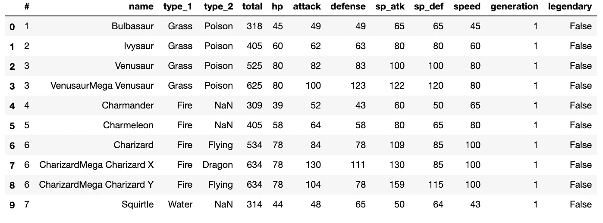
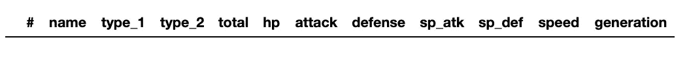
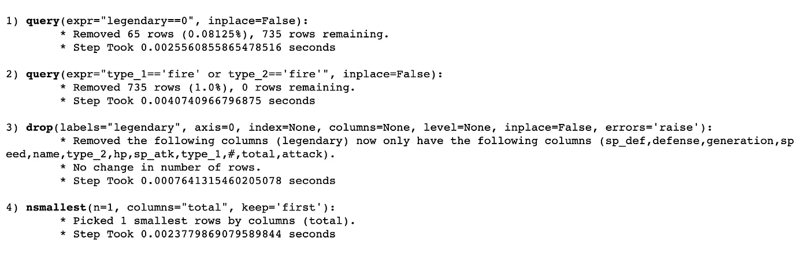
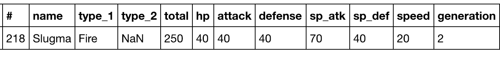

# 熊猫介绍-日志

> 原文：<https://towardsdatascience.com/introducing-pandas-log-3240a5e57e21?source=collection_archive---------21----------------------->

## 用于调试 pandas 操作的新 Python 包


Photo by [billow926](https://unsplash.com/@billow926?utm_source=unsplash&utm_medium=referral&utm_content=creditCopyText) on [Unsplash](https://unsplash.com/s/photos/pandas?utm_source=unsplash&utm_medium=referral&utm_content=creditCopyText)

熊猫生态系统对于数据科学生态系统来说是无价的，因此今天大多数数据科学任务由熊猫将原始数据转换成可理解/可用格式的一系列步骤组成。

这些步骤的准确性至关重要，因此理解意外的结果也变得至关重要。不幸的是，生态系统缺乏理解这些意外结果的工具。

这就是为什么我创建了[熊猫日志](https://github.com/eyaltrabelsi/pandas-log)，它提供了每个操作的元数据，这将允许查明问题。比如说*之后。查询*它返回被过滤的行数。

和往常一样，我相信用一个例子更容易理解，所以我将使用[口袋妖怪数据集](https://www.kaggle.com/abcsds/pokemon)来寻找*“谁是最弱的非传奇火口袋妖怪？”。*


Photo by [Thimo Pedersen](https://unsplash.com/@thimo?utm_source=unsplash&utm_medium=referral&utm_content=creditCopyText) on [Unsplash](https://unsplash.com/s/photos/pokemon?utm_source=unsplash&utm_medium=referral&utm_content=creditCopyText)

# 那么谁是最弱的火口袋妖怪呢？

(笔记本代码的链接可在[这里](https://github.com/eyaltrabelsi/pandas-log/blob/master/examples/pandas_log_intro.ipynb)找到)

首先，我们将导入相关的包并读取我们的口袋妖怪数据集。

```
import pandas as pd
import numpy as np
import pandas_logdf = pd.read_csv("pokemon.csv")
df.head(10)
```



A sample of our dataset

**要回答我们的问题，谁是最弱的非传奇火口袋妖怪，我们需要:**

1.  *用* `*.query()*` *过滤掉传说中的口袋妖怪。*
2.  *只保留火口袋妖怪使用* `*.query()*` *。*
3.  *降传奇柱* `*.drop()*` *。*
4.  *使用* `*.nsmallest()*` *保留其中最弱的口袋妖怪。*

在代码中，它看起来像这样

```
res = (df.copy()
         .query("legendary==0")
         .query("type_1=='fire' or type_2=='fire'")
         .drop("legendary", axis=1)
         .nsmallest(1,"total"))
res
```



It resulted in empty dataframe

哦，NOO！！！我们的代码不起作用！！我们有一个空的数据框！！如果有一种方法来跟踪这些问题就好了！？幸运的是，这就是[熊猫日志](https://github.com/eyaltrabelsi/pandas-log)的作用！

通过在我们的示例中添加一个小的上下文管理器，我们将获得相关的信息，帮助我们找到打印到 stdout 的问题。

```
with pandas_log.enable():
    res = (df.copy()
             .query("legendary==0")
             .query("type_1=='fire' or type_2=='fire'")
             .drop("legendary", axis=1)
             .nsmallest(1,"total"))
```



在阅读输出后，很明显问题出在第 2 步，因为**我们还剩下 0 行，**所以谓词*“type _ 1 = = ' fire '或 type_2=='fire '”是错误的。*的确口袋妖怪类型是以大写字母开头的，所以让我们运行固定代码。

```
res = (df.copy()
         .query("legendary==0")
         .query("type_1=='Fire' or type_2=='Fire'")
         .drop("legendary", axis=1)
         .nsmallest(1,"total"))
res
```



## 最后，我们得到了我们的结果，我们得到了斯拉格马！！！！！！！！

# 最后几句话要说

该软件包仍处于早期阶段，所以它可能包含一些错误。请看看 Github 库，并建议一些代码的改进或扩展。我将很高兴地欢迎任何建设性的反馈，并随时为熊猫日志做贡献！😉