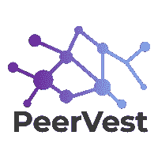

# 使用机器学习推荐 P2P 借贷投资

> 原文：<https://towardsdatascience.com/introducing-peervest-using-machine-learning-to-recommend-investments-in-p2p-lending-d55c07947872?source=collection_archive---------21----------------------->

## 介绍 PeerVest:一个免费的 ML 应用程序，帮助你在风险回报的基础上选择最好的贷款池

# 问题

像 LendingClub 和 Prosper Marketplace 这样的 P2P 贷款市场是由连接投资者和借款者的经纪人费用驱动的。他们被激励去增加在他们平台上发生的交易的数量。在易用性的驱动下，他们现成的信用风险评估按分组桶对风险进行评分。在逐笔贷款的基础上，考虑到每笔贷款的独特性和从借款人那里收集的大量数据，这是低效的。在更精细、更连续的基础上对风险进行评分不仅是可能的，而且优于离散的分组桶。

信用风险是所有 P2P 贷款投资者和债券投资者在做出明智决策时必须仔细考虑的问题。包括大型银行在内的机构一直在雇佣研究人员和定量分析师来争论和分析这些数据，希望对自己的风险回报评估更有信心。借款人未能支付所需款项导致本金和利息损失的潜在风险是什么？考虑到贷款的条件，投资者能期待什么样的回报？对于希望超越市场上现成顾问的普通投资者来说，应该有一种更简单、更容易使用的工具。

# 解决方案:PeerVest

PeerVest 帮助个人投资者扩大他们的投资组合，通过使用基于 LendingClub.com 历史贷款数据训练的机器学习来评估风险和预测回报，智能地将资金分配到 P2P 贷款市场。PeerVest 根据用户的可用资金、最大风险承受能力和最低预期年化回报，推荐最佳投资贷款。有很多机构在利用现代的替代数据集评估信用风险和预测投资潜力方面处于思想领先地位，但我将这个问题简化为两个关键模型:(1)通过预测贷款违约的概率来评估风险，以及(2)预测年化回报。

# 重要术语和概念

*   **点对点借贷(又称 P2P，Crowdlending)** :通过在线服务撮合借贷者向个人或企业放贷的行为。由于其纯在线性质和低管理费用，一般来说，与银行提供的储蓄和投资产品相比，贷款人可以获得更高的回报，而借款人可以以更低的利率借钱。
*   **人工神经网络:**一种计算学习系统，它使用一个函数网络来理解一种形式的数据输入，并将其转换为所需的输出，通常是另一种形式。灵感来自于人类大脑神经元共同运作来理解人类感官输入的方式。[在此了解更多信息](https://www.forbes.com/sites/bernardmarr/2018/09/24/what-are-artificial-neural-networks-a-simple-explanation-for-absolutely-anyone/#7a5465a12457)
*   **随机森林模型:**一种用于分类、回归和其他任务的集成学习方法，通过在训练时构建大量决策树并输出作为类的模式或个体树的均值预测的类来进行操作。[点击此处了解更多信息](https://www.kdnuggets.com/2019/01/random-forests-explained-intuitively.html)
*   **违约概率:**对借款人无法履行债务的可能性的估计。[在此了解更多信息](https://www.investopedia.com/terms/d/defaultprobability.asp)
*   **年化回报率:**按比例缩减至 12 个月的回报率。我使用的公式是:ar =(xTP/xLA)^(365/d)-1，其中 xla 是贷款金额，xtp 是借款人支付的总付款额，d 是贷款资金和最后一次付款日期之间的天数。[点击此处了解更多信息](https://www.investopedia.com/terms/a/annualized-rate.asp)

# 预测违约概率

为了给每笔贷款分配一个数量来衡量其风险水平，或借款人违约的概率，我像处理一个标准的分类问题一样处理这个问题，其中如果每笔历史贷款已全额偿还，则分配 1，如果违约，则分配 0。为了提供比 LendingClub 和类似网站提供的更精细的风险评估，我不是寻找类别(1 或 0)，而是寻找每笔贷款预计落入每个类别的概率。我最初的方法是使用逻辑回归，尽管对每笔贷款进行了非常自信的分类，尽管进行了概率校准，但似乎与 sklearn 的*没有很好的互动。predict_proba()* 函数。此函数返回一笔贷款属于类别 1 的概率，介于 0 和 1 之间。用 1 减去这个数字就可以得到一个可解释的违约概率指标(它越大，违约的可能性就越大)。

给定 1，107 个独特的特征，似乎存在许多非线性关系，并且手动减少维度的努力将是麻烦的。使用主成分分析并没有真正的好处，因为它并没有改善这种情况——它降低了维数，减少了等量的解释方差。我决定保留所有的特性，尽管特性冗余的可能性增加了。知道神经网络能够在许多训练时期处理这种复杂性，我开始使用 Keras 构建一个模型，Keras 是一个基于 TensorFlow 的神经网络库。我通过使用隐藏层大小、丢失正则化、L2 核正则化、早期停止、历元、类权重平衡和 ReLU/Sigmoid 激活函数的不同组合，遍历了许多不同的 Keras 架构。尽管在验证损失方面存在一些停滞，但该模型最终取得了突破，并在几个时期内开始对训练集和测试集进行更显著的改进，同时非常好地校准了预测概率。

**表现不佳:** 3 个 Scikit-Learn 逻辑回归模型，7 个 Keras 神经网络
表现最佳: Keras 神经网络 v8

**最佳神经网络模型架构:**
输入层(1107，Sigmoid)>
密集层(1000，Sigmoid，L2)>
密集层(300，Sigmoid)>
密集层(50，Sigmoid，L2)>
密集输出层(1，Sigmoid，L2)

**最佳模型参数:**

*   损失:[二元交叉熵](https://gombru.github.io/2018/05/23/cross_entropy_loss/)
*   优化器:[亚当](http://ruder.io/optimizing-gradient-descent/index.html#adam)
*   提前停止
*   等级重量平衡
*   批量:5000 个

**最佳模型评估指标(测试误差):**

*   完全支付的精确度:0.943
*   召回全额支付:0.979
*   F-1 分数完全支付:0.961
*   ROC-AUC 评分:0.86
*   预测概率已校准

# 预测回报

我根据 LendingClub 的可用数据，使用了一个非常简单的年化回报计算方法。由于可解释性，我决定不使用 LendingClub 复杂的调整后净年化回报计算，尽管随着我继续迭代我的模型，我对利用更传统的财务损失估计的精确计算持开放态度。与贷款条款和付款相关的时间因素包含在这一计算中。像联邦利率、通货膨胀和货币的时间价值这样的宏观信息是借款人所报利率中固有的，尽管当然有深入时间序列和生存分析的空间，以增加金融机构生产这种模型的严谨性。

线性回归在训练集上运行良好，但是过度拟合，不能很好地推广到未来集或同一时期的测试集。岭回归，这是类似的，但应用 L2 正则化修复了我的第二次迭代过度拟合的问题。也就是说，我想知道如果使用一些可以做出不同回归决策的东西，我的评估指标是否会有所改善，以及是否有一个模型不那么依赖于总付款，以便我的预测可以用于 LendingClub 上一个没有付款历史的全新列表。考虑到过度拟合的问题，以及其已被证明的引导特征子样本和聚集许多决策树的能力，Random Forest 是完美的候选。简而言之，一个随机森林将能够构建和组合许多彼此不相关的不太好的模型，以创建一个单一的、体面的模型——同时配备处理我的 1，107 个特征，除了找到最佳参数之外，没有太多额外的准备。鉴于 Google Cloud GPU 的强大功能，我让 GridSearchCV 通过搜索最佳组合来处理这个问题。

**表现不佳:** 1 个线性回归模型，3 个岭回归模型，1 个 Keras 神经网络，4 个随机森林回归模型(使用 Scikit-Learn)
表现最佳:随机森林回归 v5 与 GridSearch 交叉验证

**最佳模型参数:**

*   n _ 估计值= 100
*   最大深度:15
*   最小 _ 样本 _ 叶:4
*   最小 _ 样本 _ 分割:2

**最佳模型评估指标(测试误差—不包括支付历史):**

*   r 平方值:0.56
*   均方差:0.02
*   均方根误差:0.16

最佳随机森林回归模型在测试集上实现了 0.16 的均方根误差，这意味着预测的年化回报估计与真实的年化回报相差 0.16。虽然这可能会出现很大的第一，该模型可以非常有用的制定贷款选择策略。贷款违约通常发生在贷款融资后不久，违约的机会随着付款的增加而减少。因此，我推荐年化回报预测高于用户设定的合理阈值的贷款。直观上，阈值可以作为投资者可以根据其投资账户规模进行调整的参数:最小年化回报(较高回报)越大，最大违约概率越小(较低风险)，整体贷款选择越严格，因此可以投资的总美元数越少。希望由于更有选择性地投资贷款，年化回报会更高。

也就是说，如果我们对借款人的还款历史有所了解，我们会对自己的预测更有信心，尽管在实践中，作为投资者，我们无法将最初的借款还款行为纳入其中。也就是说，有了一些支付历史记录，这个模型有了很大的改进:

**评估指标(测试错误—如果包括支付历史):**

*   r 平方值:0.97
*   均方差:0.001
*   均方根误差:0.04

# 如何配合 LendingClub.com 使用 PeerVest 应用程序

*这个应用程序是免费使用的。如果你决定将我的模型应用到你自己的投资组合中，对我来说没有任何费用或好处。我不是任何形式的注册财务顾问——投资风险自担。*

该模型已经作为 Flask 应用程序部署在 web 上，托管在 Amazon Web Services EC2 实例上，使用 HTML、CSS 和 Brython。它可以收集用户的最大风险承受能力和他们相应的最小期望投资组合回报，并根据我的模型的建议，输出目前在 LendingClub.com 生活的贷款的综合列表。

1.  访问 peer vest:[www . peer vest . online](http://www.peervest.online/)
2.  下载推荐 CSV
3.  使用下载的 CSV 中的贷款 id 来指导您对 LendingClub.com 的投资！点击路径:[点击此处](https://www.lendingclub.com/auth/login) >登录(或创建账户)>投资>手动投资>更多过滤器>按贷款 ID 过滤>添加美元

*关于最优多元化的说明:*

*   在任何给定的时间内，LendingClub.com 上的可用投资往往少于 100 项，尽管一个优化的贷款组合应该包含至少 100 项不同的贷款，以充分降低缺乏多样化的风险。实际上，我会在接下来的几周里继续使用这个应用来指导新的投资。尽快找到 100 笔贷款的投资组合，适当分散投资。
*   来自 LendingClub:票据总数少于 100 张的账户更有可能出现负回报

# 未来的工作——示例用户故事

*   我想知道应用程序的推荐是否一定会比现成的 LendingClub/Prosper 推荐更能让我赚钱
*   我希望所有新上市的产品都出现在推荐集中，这样我的投资决策就可以基于最近的更新
*   我希望能够通过贷款目的进行筛选，这样我就可以策划一个任务驱动的贷款集
*   我想看看 P2P 贷款平台是如何设定利率的
*   我希望看到一个 Python 代码输出，我可以使用它来根据建议集执行我自己的订单，以减少手动分配时间

感谢您的阅读，

亚历克斯

***来连线吧！我鼓励你评论、分享或直接给我发消息，告诉我你对这里提出的想法的想法，或者对我今后应该关注的有趣话题的建议。***

[LinkedIn](http://www.linkedin.com/in/alexandershropshire) | [GitHub 组合](http://github.com/as6140)

 [## as6140/peervest

### (http://www.peervest.online)使用神经网络(分类、概率…

github.com](https://github.com/as6140/peervest) 

***来自《走向数据科学》编辑的注释:*** *虽然我们允许独立作者根据我们的* [*规则和指南*](/questions-96667b06af5) *发表文章，但我们并不认可每个作者的贡献。你不应该在没有寻求专业建议的情况下依赖一个作者的作品。详见我们的* [*读者术语*](/readers-terms-b5d780a700a4) *。*