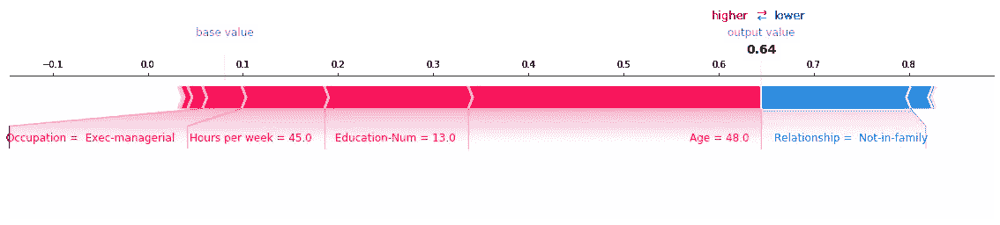

# 介绍 SHAP 决策图

> 原文：<https://towardsdatascience.com/introducing-shap-decision-plots-52ed3b4a1cba?source=collection_archive---------3----------------------->


## 更加详细和灵活地可视化机器学习模型的内部工作方式

[SHAP(SHapley Additive exPlanations)](http://papers.nips.cc/paper/7062-a-unified-approach-to-interpreting-model-predictions)框架已经被证明是机器学习模型解释领域的一个重要进步。由 Scott Lundberg 和 Su-In Lee 开发的 SHAP 结合了几种现有的方法，创建了一种直观的、理论上合理的方法来解释任何模型的预测。

SHAP 通过对每一个预测和特征提出同样的问题来建立模型解释:“当特征 *j* 从模型中移除时，预测 *i* 如何变化？”所谓的 *SHAP 值*就是答案。它们量化了特征对预测影响的大小和方向(积极或消极)。正如本文将展示的，SHAP 值可以用线性模型的清晰性来产生模型解释。

由 Scott Lundberg 等人开发的 Python 软件包 [shap](https://github.com/slundberg/shap) 提供了计算和绘制 shap 值的工具。[项目的主页](https://github.com/slundberg/shap)展示了典型的 SHAP 图，并提供了示例笔记本的链接。

最近，称为*决策图*的一类新图被添加到[形状](https://github.com/slundberg/shap)包中。决策图提供了模型内部工作的详细视图；也就是说，它们展示了模型是如何做出决策的。本文简要介绍了决策图的几个用例:

1.  清晰展现大量特色效果。
2.  可视化多输出预测。
3.  显示互动的累积效果。
4.  探索一系列特征值的特征效果。
5.  比较和对比几个模型的预测。
6.  识别典型的预测路径。

有关更多细节和源代码，请参见[决策图文档/插图](https://slundberg.github.io/shap/notebooks/plots/decision_plot.html)或下载[笔记本](https://github.com/slundberg/shap/blob/master/notebooks/api_examples/plots/decision_plot.ipynb)。

**更新:**除了学习 SHAP，我推荐探索 [interpretML](https://github.com/interpretml/interpret) 包中可解释的助推机器(EBM)([官方文件](https://interpret.ml/docs/intro.html)，[视频](https://www.youtube.com/watch?v=MREiHgHgl0k))。循证医学本身是可以解释的，相关的包包括互动的情节。interpretML 还集成了 SHAP，以及其他方法/模型，便于并行比较。

# 清晰显示大量特征效果

迄今为止，力图(在[自然 BME](https://rdcu.be/baVbR) 中介绍)一直是通过 [shap](https://github.com/slundberg/shap) 包可视化单个模型预测的默认方法。考虑以下情节。它显示了根据 [UCI 成人收入](https://archive.ics.uci.edu/ml/datasets/adult)数据集训练的 [LightGBM](https://github.com/microsoft/LightGBM) 模型的预测。预测是个人年收入超过 5 万美元的概率。红色箭头表示提高预测值的要素效果(SHAP 值)，而蓝色箭头表示降低预测值的效果。每个箭头的大小代表相应特征的影响程度。“基础值”(见图像左上角的灰色印记)标记了模型对训练集的平均预测。“输出值”是模型的预测:概率 0.64。最大影响的特征值打印在图的底部。总的来说，力图为这个预测提供了一个有效的总结。



将上面的力图与下面的决策图进行比较。决策图的垂直直线标记了模型的基础值。这条彩色的线是预测。特征值打印在预测线旁边，以供参考。从图的底部开始，预测线显示了 SHAP 值(即特征效果)如何从基础值累积到图顶部的模型最终得分。(粗略地说，这类似于统计线性模型，其中效应之和加上截距等于预测。)决策图是 SHAP 值的文字表示，使它们易于解释。


力图和决策图都有效地解释了前述模型的预测。主要影响的大小和方向很容易识别。然而，正如我们接下来将展示的，当涉及许多重要特征时，决策图比力图更有效。

下一个例子使用在 [UCI 社区和犯罪](https://archive.ics.uci.edu/ml/datasets/Communities+and+Crime+Unnormalized)数据集上训练的 [LightGBM](https://github.com/microsoft/LightGBM) 模型来预测人口中每 10 万人中非暴力犯罪的数量。该模型使用了 101 个特征。使用力图和决策图解释了相同的预测。请注意，力图的水平格式使其无法清晰显示所有重要特征。


相比之下，决策图的垂直格式可以清楚地显示任意数量特征的影响。该图被配置为显示总共 101 个特征中的 30 个最重要的特征。


前面的例子表明，决策图在解释上类似于力图，但是决策图的线性、垂直格式允许描述更多的效果。

# 可视化多输出预测

决策图可以有效地解释多产出模型。这个例子解释了在 UCI 心脏病数据集上训练的一个分类模型 [Catboost](https://github.com/catboost/catboost) 。对于每个观察，有五个等级指示疾病的程度:等级 1 指示没有疾病；5 级表示晚期疾病。

下面的决策图显示了单次观察的模型的多个输出。在这种情况下，x 轴代表原始分数，而不是概率。分数包含在图的图例中，以便于识别。该模型预测类别 4(虚线)。该图显示，该模型自信地预测疾病存在(类别 1 具有非常低的分数)，但是该模型不能轻易地区分类别 3、4 和 5。


熟悉 [shap](https://github.com/slundberg/shap) 包的人都知道，它为每个模型输出产生一个单独的基值。决策图显示模型基础值的平均值，并相应地移动 SHAP 值，以准确再现模型的得分。这种方法简化了可视化，并允许在相同的比例下绘制和比较任意数量的输出。

# 显示互动的累积效果

决策图支持 SHAP 相互作用值:从基于树的模型估计的一阶相互作用。与显示许多预测的单个相互作用的[依赖图](https://slundberg.github.io/shap/notebooks/plots/dependence_plot.html)相反，决策图显示所有主要影响和相互作用。

这个决策图使用主效应和交互作用解释了来自 [UCI 成人收入](https://archive.ics.uci.edu/ml/datasets/adult)数据集的单一预测。它被配置为显示 20 个最重要的效果。该图清楚地表明，几个相互作用推动这一预测的得分更高。


# 探索一系列特征值的特征效果

决策图可以详细展示模型的行为。在此示例中，我们探讨了在给定的特定情况下，模型的预测如何随着特征值的变化而变化。我们从 [UCI 成人收入](https://archive.ics.uci.edu/ml/datasets/adult)数据集中的以下记录开始。

```
Age                                56
Workclass                   Local-gov
Education-Num                      13
Marital Status     Married-civ-spouse
Occupation               Tech-support
Relationship                  Husband
Race                            White
Sex                              Male
Capital Gain                        0
Capital Loss                        0
Hours per week                     40
Country                 United-States
```

我们通过多次复制参考记录来创建一个合成数据集，但是以 100 美元为增量从 0 美元到 10，000 美元改变资本增值。这种方法允许我们评估和调试模型。分析师也可能会发现这种方法对提出假设情景很有用。请记住，本例中显示的资本收益的影响是特定于参考记录的，因此不能一概而论。

[依赖图](https://slundberg.github.io/shap/notebooks/plots/dependence_plot.html)可以显示 SHAP 值在特性值范围内的变化。该模型的 SHAP 值代表对数概率的变化。该图显示了 SHAP 值在 5000 美元附近的急剧变化。它还在 0 美元和大约 3，000 美元处显示了一些重要的异常值。


尽管依赖图很有帮助，但在上下文中很难辨别 SHAP 值的实际效果。为此，我们可以用概率标度上的决策图来绘制合成数据集。首先，我们绘制参考记录来建立上下文。这些特征被手动排序以匹配随后的合成数据的绘图。预测是概率 0.76。资本收益为零，这种模式对资本收益的负面影响很小。


现在，我们绘制合成数据。参考记录用虚线突出显示。通过分层聚类对特征进行排序，以对相似的预测路径进行分组。我们看到，在实践中，资本收益的影响在很大程度上是两极化的；只有少数预测介于 0.2 和 0.8 之间。


在进一步检查预测后，我们发现阈值约为 4300 美元，但也有异常情况。0 美元、3，000 美元和 3，100 美元的资本收益有助于出乎意料的高预测；5000 美元的资本利得导致了出乎意料的低预测。这些异常在这里用图例标出，以帮助识别每个预测。3000 美元和 3100 美元的预测路径是相同的。


总的来说，使用决策图很容易解释模型行为，因为可以并排绘制几个预测的全部细节。本文中的其余示例也利用了这一特性。

# 比较和对比几个模型的预测

决策图对于比较不同模型的预测或解释模型集合的预测非常有用。

五个 LightGBM 模型的预测结果绘制如下，这些模型是在 T2 UCI 成人收入数据集中训练出来的。如果概率 0.5 是这个二元分类任务的阈值，我们看到这个观察值很难分类。然而，Model 2 确信个人年收入低于 5 万美元。如果这是一个典型的观察，那就值得研究一下为什么这个模型是不同的。


# 识别典型的预测路径

决策图可以展示模型的典型预测路径。在这里，我们将来自 [UCI 成人收入](https://archive.ics.uci.edu/ml/datasets/adult)数据集的所有预测绘制在概率区间【0.98，1.0】中，以查看高分预测的共同点。使用分层聚类对特征进行排序，以对相似的预测路径进行分组。该图显示了两条不同的路径:一条是由资本收益主导的，另一条是由资本损失主导的。与关系、年龄和教育相关的影响也是显著的。Alpha 混合(部分透明)用于指示高密度和低密度区域。


为了比较，这里显示了多预测力图。它是许多旋转 90 度并水平堆叠的单个力图的组合。这些情节之间有几个不同之处；我们将指出几个。力图显示，大约四分之三的预测遵循资本收益主导的预测路径。决策情节无法传达这种比例感。在力图中，左侧的预测并不明显是由资本损失主导的，除非在交互模式下查看，在这种模式下，鼠标悬停时会显示功能标签。此外，年龄和关系的一般模式并不突出。决策图更有效地揭示了这些方面。


# 结论

决策图是对[形状](https://github.com/slundberg/shap)包的自然补充。它们通过 SHAP 框架提供的简单性和清晰性有效地交流模型决策。它们也很灵活，允许从单一预测解释到模型诊断的各种用例。如果您发现了使用决策图的新方法，请发表评论。