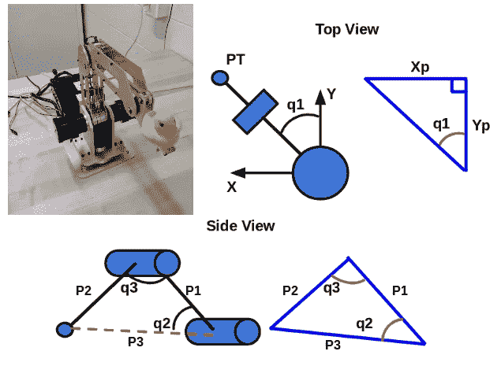
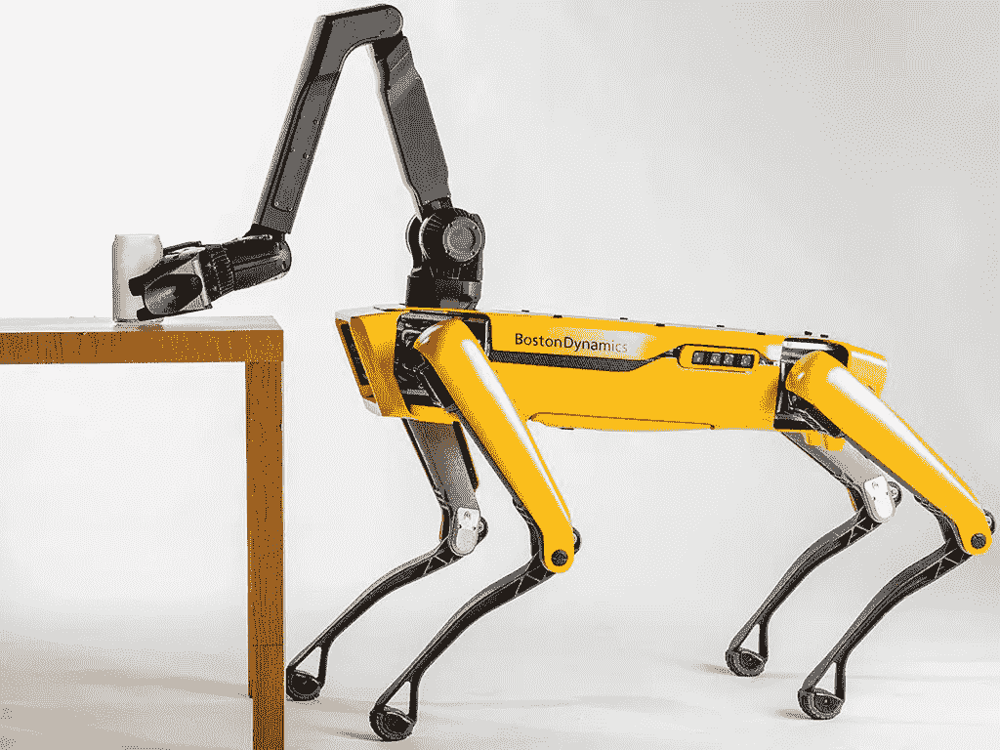

# 向学生介绍自动化和机器人

> 原文：<https://towardsdatascience.com/introducing-students-to-automation-robotics-a88dd9cecee0?source=collection_archive---------17----------------------->

Photo by [Andy Kelly](https://unsplash.com/@askkell?utm_source=medium&utm_medium=referral) on [Unsplash](https://unsplash.com?utm_source=medium&utm_medium=referral)

## 这个领域没必要那么可怕

自动化很快就成了人们谈论的话题。[政客们](https://www.bloomberg.com/opinion/articles/2019-03-12/andrew-yang-s-presidential-campaign-could-shape-democratic-party)现在正围绕它展开竞选活动。整个[公司](https://money.usnews.com/investing/stock-market-news/slideshows/artificial-intelligence-stocks-the-10-best-ai-companies)都是建立在人工智能(AI)和机器人算法之上的。相关技术甚至已经开始渗入[国内](http://www.moley.com/)领域。一二十年后，我们与机器人和人工智能互动的频率可能会与我们与人类的互动相当。

然而，随着教育的发展，高中生所学的内容和工程领域的实用知识之间存在着差距。虽然有专门的学校致力于在计算机科学原理方面教育学生，早熟的学生组成了涉及现代领域的俱乐部，但大多数年轻人直到大学晚期才接触到高级课题。这是基于他们的大学有如此先进的领域的假设，而许多并没有。

令人担忧的是，就读 STEM 学院的学生对技术领域了解不足。他们可能会进入一个就业增长有限的领域。此外，未知的领域或主题可能会让人望而生畏。如果没有中学的初步介绍，学生可能会被阻止进入一个令人生畏的领域。老师也没有错。没有人能指望数学老师会熟悉机器人学中的数学。

为了向年轻人介绍这个领域，机器人技术可以大大简化。在大学里，我们学习开发机器人系统数学模型的最正规的方法。这样做主要是为了使分析策略能够被推广并应用到各种系统中。这样做，该领域需要彻底的线性代数和微分方程的先决知识。然而，许多基本的机器人系统可以简化成三角原理。

我想用一个简单的例子来证明这一点(如果数学很可怕，可以跳过图像)。也许一个雄心勃勃的数学老师可以找到在教案中实现这个概念的方法。在机械臂建模中，有正向和反向运动学的概念。当我们知道机器人关节之间的角度时，就可以使用正向运动学。知道了这些角度，我们就可以计算出手臂末端，也就是末端执行器，在三维坐标空间中的位置。这有助于检查机械臂是否处于预期位置。反向运动学可能更有用。反向运动学是指我们知道末端效应器在三维坐标空间中的位置。基于这个位置，我们想要计算手臂必须配置的关节角度，以实现这样的坐标。

一个典型的机械臂，一个具有三个旋转关节的三自由度机械臂，将是我们的测试示例。这个机器人有三个关节，每个关节都沿着一个轴旋转。我们通常将这个机器人简化为三个圆柱体，代表旋转关节，两个杆，代表实际的手臂。如果我们知道末端效应器需要的位置，那么我们可以很容易地使用三角形的切线属性(记住，SOH-CAH-TOA)找到第一个关节的角度(俯视图)。其他两个关节角度的值是使用机器人手臂的已知尺寸和末端执行器的位置的三角关系来求解的。

It’s just a bunch of triangles!

对于长期放弃数学的读者来说，上述内容可能令人望而生畏。然而，在一个上三角函数课的高中生的头脑中，上述内容并不陌生。除了向学生介绍机器人技术，上面的例子还回答了老生常谈的课堂问题:“我们什么时候会在现实生活中使用它？”。给学生一个任意科目的实际应用。

我的意思不是用上面的例子来概括机器人和自动化的整个领域。理解上述概念并不能使一个人成为机器人专家。然而，它可以激发学生的好奇心。

随着社会走向一个更加自动化的世界，预测什么将构成“现实生活”是一件棘手的事情。虽然不是每个学生都会继续从事自动化研究，但可能会需要相当于现代汽车修理工的机器人技术人员。在波士顿的一个机器人展示会上，我有幸听到波士顿动力公司的首席执行官马克·雷伯特博士展示他的机器狗。据雷伯特博士的技术员转述，他的预测之一是，机器人浪潮将创造我们尚未想象的工作岗位。

Would you like ice with that?

spot mini 等机器人被设计为室内家用机器人。也许一个网络工程师找到了一个聪明的方法，将齿轮控制的猎犬连接起来，递送食物和包裹。也许一个电机和嵌入式硬件的修补匠会发现机械狗有一个臭名昭著的小故障。像手机屏幕更换店一样频繁的维修店将会发展起来。这些知识中的大部分需要理解相当复杂的机制是如何运作的。

我们不应该回避复杂，以此作为避免阐述材料的理由。在以大猩猩玻璃产品闻名的陶瓷公司康宁公司实习时，我有幸与康宁创新部门的负责人交谈。该小组负责监控康宁公司哪些技术领域被低估了。

在我们的谈话中，我们谈到了人工智能和机器学习的话题。部门负责人向我解释说，公司已经在使用高中实习生通过张量流库实现机器学习算法。虽然一位资深的机器学习科学家可能会嘲笑张量流绝不是黑盒的概念，但孩子们能够操作工具的事实证明了他们的能力。为什么要浪费一个推动 STEM 感兴趣的学生超越教育部门构建的限制的机会呢？