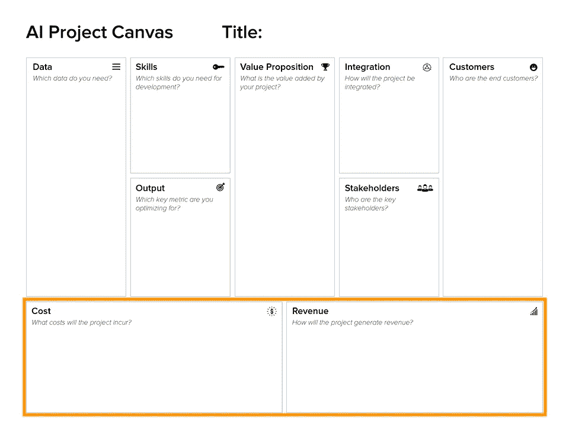

# 介绍人工智能项目画布

> 原文：<https://towardsdatascience.com/introducing-the-ai-project-canvas-e88e29eb7024?source=collection_archive---------2----------------------->

## [人工智能项目管理](https://towardsdatascience.com/tagged/project-management-ai)

## 使用调整后的商业模式画布来推销你的下一个人工智能项目。

创造一个人工智能项目总是涉及到回答同样的问题:你增加的价值是什么？需要什么数据？客户是谁？预期的成本和收入是多少？

2008 年，Alexander Osterwalder 开发了[商业模式画布](https://strategyzer.com/canvas)，该画布在解释世界各地的商业模式方面取得了巨大成功。过去需要 30 页的商业计划来详述一个商业想法，现在可以在一页上完成。它与精益启动方法配合得很好，使您能够专注于增值活动，并快速创建 MVP 驱动的产品。

精益启动周期由构建-测量-学习反馈回路组成。作为一名数据科学家，你会接受这种精益方法。建立解决方案的原型并不断迭代直到达到关键指标是任何成功的人工智能项目的核心。因此，调整人工智能项目的商业模型画布是很自然的。

作为一名前管理顾问和数据科学的现任项目负责人，我的背景帮助我设计了 AI 项目画布。人工智能项目画布将帮助您回答关于您的人工智能项目所需的成果和资源的最紧迫的问题。这篇文章解释了人工智能项目画布以及真实世界的例子。在此下载[可编辑的](https://drive.google.com/open?id=1OIozsr9zXkFoSmu88uUXSRDzJsUMso6k)或[空白画布](https://drive.google.com/open?id=1ZVbxjr-gq6VeVhWgWRbdltEebPvkrjmW)。

Photo by [rawpixel](https://unsplash.com/photos/kXJeVrOjDrU?utm_source=unsplash&utm_medium=referral&utm_content=creditCopyText) on [Unsplash](https://unsplash.com/?utm_source=unsplash&utm_medium=referral&utm_content=creditCopyText)

我们开始吧。🖌 ⬜️

# 人工智能项目画布

想象以下场景:你对一个新的人工智能项目有一个绝妙的想法。要实现它，你需要说服管理层为你的想法提供资金。你需要向利益相关者和管理层推销你的人工智能项目想法。呸。

这是 AI 项目画布发挥作用的第一步。虽然 Louis Dorard 已经创建了 [ML Canvas](http://www.louisdorard.com/machine-learning-canvas/) ，但 AI 项目 Canvas 的重点是解释你的 AI 项目的商业价值。人工智能项目画布帮助你构建并向他人传达你的人工智能项目的整体思想。

人工智能项目画布由四个不同的部分组成:作为项目中心部分的价值主张，左侧的成分，右侧的客户集成，以及底部的融资。所有这些部分都是任何人工智能项目的重要方面。让我们看一下每一部分，从价值主张开始。

人工智能项目画布的核心是价值主张。它解释了项目将为您的组织增加的价值。增值可以是一种新的人工智能产品，以产生收入，或改善现有流程以降低成本。AI 项目在解决什么客户痛点？您添加了哪些维生素来改善顾客的生活？理想情况下，您可以用一个简洁的要点来描述价值主张。列出许多价值主张可能会淡化影响，或者未能关注最重要的价值主张。

旁注:尝试一种听起来很酷的新论文不会让你走得很远。你的 AI 项目的附加值是什么？充分回答这个问题有助于你专注于手头的任务，并让你为你的人工智能项目获得一半的资金。接下来让我们看看配料块。

成分部分由数据、技能和输出块组成。

数据是每个人工智能项目所依赖的主要元素。你越能解释你需要什么数据来创造价值主张，对你的人工智能项目就越好。你需要多少数据？您是否已经有一个准备好的数据集，或者您是否需要获取它？一定要贴标签吗？你期望什么样的数据格式？

在技能模块中，您将定义您需要的专业技能。是计算机视觉还是自然语言理解任务？需要数据工程师帮你写高效软件吗？甚至可能是一个产品经理和一个 UX 设计师来收集客户需求并设计一个工作流程？

输出块显示了您正在评估的单个关键指标。吴恩达在他的书[机器学习的渴望](http://www.mlyearning.org/)第八章中建议在项目开始前定义一个单一数字的评估指标。这有助于您首先选择一个好的模型，然后根据这个指标比较不同模型的性能。输出指标可以是准确度、f1 分数、精确度或召回率、使用服务的时间等。可以用足够的度量来补充输出度量，例如，精度必须超过 95%(关键度量)，而推理时间不超过 1 秒(足够的度量)。

在解释了你的 AI 项目的成分部分之后，接下来我们来谈谈你将如何把你的 AI 项目带给客户。

AI 项目画布的右边部分涵盖了将您的项目集成到当前的基础设施中，供利益相关者和客户使用。

人工智能产品很少生活在一个孤立的世界中，几乎没有在 Jupyter 笔记本中。它们总是需要集成到现有的架构中。解释项目将用于何处以及如何使用。它在后端的什么位置？客户将如何使用您的模型？在流式传输期间，您会使用微服务、整体服务还是动态预测？回答这些问题将使人们清楚这个项目将如何投入生产。

列出关键利益相关者会让你对重要的决策者有一个大致的了解。关键利益相关者可以是法律、UX、管理等内部部门，甚至是承包商、所有者、政治或非盈利组织等外部利益相关者。

最右边的部分是价值主张之后第二重要的部分。你为谁设计项目？很多时候，数据科学家爱上了他们模型的技术细节，但却不知道他们在为谁开发模型。客户真的关心准确性从 99.2%提高到 99.3%吗？还是更快的推断时间更适合他们？详细描述您的不同客户群，以指导您在整个过程中的决策。

在定义了如何将项目带给客户之后，我们最后来探讨一下你的 AI 项目的财务要求。

任何项目都需要有良好的财务基础。回答关于成本和收入的问题将使你处于一个强有力的位置来解释为什么你的人工智能项目应该得到资助。

成本块详细列出了将要发生的成本。需要外包贴标吗？您会产生计算成本吗？不要忘记提及你的团队成员花费的时间或薪水。你不必写下绝对成本，给出成本类别的概述就足够了。

最后，收入块显示你的人工智能项目将如何使公司获得新的收入。该产品将作为一项服务出售，还是作为用户的新功能类别出售？该项目是否会通过自动化流程降低内部成本或支持创新计划？提及收入类型是任何人工智能项目的重要组成部分。

总结一下 AI 项目画布，看看上图中的循环依赖。为了达到目标产量，你需要花费成本来与关键技能争论数据。有了这个模型，你将为组织提出新的价值。然后，在与涉众沟通的同时，将产品整合到现有的架构中。客户将从您的项目中受益，从而为您的公司创造收入。

理论够了。在解释了 AI 项目画布背后的理论之后，接下来让我们看一个真实世界的例子。

# 人工智能项目画布示例

在之前的[帖子](/data-science-in-the-real-world-e97e2534e43)中，您了解到了真实世界的数据科学项目，该项目对汽车记录的面部进行匿名处理，以保护个人隐私。让我们为这个项目创建 AI 项目画布。

价值主张很简单:保护个人隐私。这将建立信任，缓解法律担忧，并仍然使该公司能够收集开发自动驾驶汽车所需的数据。

接下来，我们将了解创建价值主张所需的要素。找出数据块是配料管道中最重要的部分。由于我们将使用预先训练的模型，我们至少需要一个现实的验证和测试集来评估不同的模型。比方说，我们需要 10k 张从汽车视角拍摄的带标记人脸的图像。我们决定获取一个特定于我们用例的新数据集。

在技能模块中，我们列出了计算机视觉技能。我们将在 Python 中实现模型，可能需要数据工程技能来生产模型。

输出模块的关键指标已由 OKRs 定义，如本[帖子](/the-power-of-goal-setting-for-your-data-science-project-9338bf475abd)中所定义。我们需要在检测 IoU 为> 0.5 的人脸时达到 95%的准确率。现在不需要足够的度量。

接下来，我们进入价值创造部分。

该项目将通过微服务整合到当前的视频提取服务中。开发者可以调用 API 来匿名化他们的图片。

关键利益相关者是法律部门，因为他们必须决定服务何时提供法律利益。其他利益相关者是一般管理人员，因为他们赞助这个项目。

谁将是这个项目的客户？数据驱动的汽车功能开发人员从匿名化中获益，因为他们可以访问自己的数据集，也可能访问其他人的数据集。工程师是我们最有价值的客户。

最后但同样重要的是，我们将描述我们项目的财务状况。

对于成本模块，我们需要一名数据科学家三个月的时间。我们还需要签约一家标签公司来收集和标记我们的训练数据。此外，我们还会产生云计算成本。

为了获得收入，这种匿名化微服务可以在软件即服务的基础上获得许可。

恭喜你，我们已经创建了我们的第一个人工智能项目画布！你看到这些部分是如何很好地组合在一起来展示这个项目的吗？

如果某些块在您的项目中不如其他块重要，请不要担心。重要的是，你已经考虑了这些块。

因此，我们对我们提出的人工智能项目有了一个全面的了解。我们知道我们试图创造什么价值。我们可以展示我们需要哪些数据和技能来创建一个输出。我们知道最终的模型将如何集成到现有的架构中，以及谁是我们的利益相关者和客户。最后，我们展示了我们预期的成本和收入。

# 关键要点

就像商业模型画布一样，人工智能项目画布是一个方便的工具，可以快速解释你的人工智能项目的附加值。它旨在用于向管理层、风险承担者和新团队成员解释项目的范围、目的和内容。使用人工智能项目画布来构建人工智能初创公司、人工智能产品和人工智能项目。它有助于你从客户的角度思考问题，设计出真正有影响力的人工智能项目。

*   使用人工智能项目画布向利益相关者和同事解释你的人工智能想法
*   重温人工智能项目画布，以客户为中心关注价值主张
*   确保考虑人工智能项目画布的所有区域

在这里下载 AI 项目画布[。当决定接下来支持哪些人工智能项目时，我们将使用人工智能项目画布。你会吗？🖌 ⬜️](https://drive.google.com/open?id=1u6UT8xHLY1GQqqpa_R5rbqHm2YW8EP2I)

这篇文章是正在进行的系列文章的一部分，旨在教育数据科学家以客户为中心的思维和商业敏锐度。我们鼓励数据科学家摆脱“让我们实现这篇论文，看看会发生什么”的态度，转向“我们能产生什么价值”的态度。正如李开复指出的，我们正在进入[人工智能实施](https://twitter.com/kaifulee/status/1052632722093629441)的十年，需要冠军来生产机器学习模型。

如果你想了解最新消息，请考虑在 [Medium](https://medium.com/@janzawadzki) 或 [LinkedIn](https://www.linkedin.com/in/jan-zawadzki/) 上**关注**我。你也可能[喜欢](/top-5-business-related-books-every-data-scientist-should-read-6e252a3f2713) [这些](/storytelling-for-data-scientists-317c2723aa31) [帖子](/the-power-of-goal-setting-for-your-data-science-project-9338bf475abd)。如果您认为应该在 AI 项目画布上添加一些内容，请发表评论。干杯！☮️