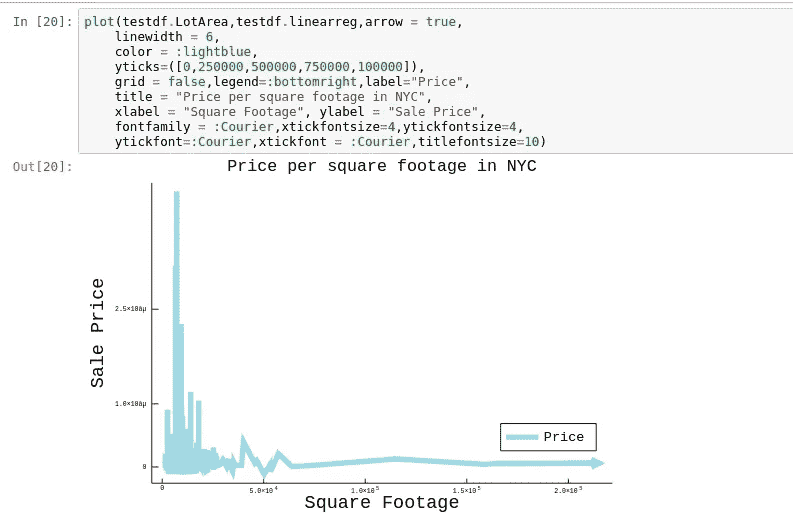
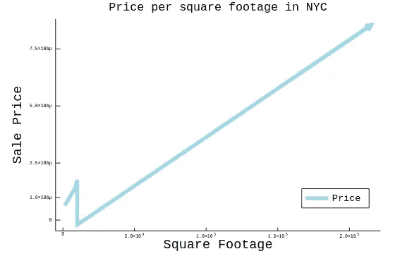

# 介绍四方模型:为了更精确的线性回归

> 原文：<https://towardsdatascience.com/introducing-the-four-square-model-for-more-accurate-linear-regression-24c3192b5022?source=collection_archive---------24----------------------->



为数据科学铺平道路是如此迷人。我认为创建一个模型来提高你的准确性，哪怕只是一点点，都是令人惊讶的。对我来说，我发现很少有事情比使用复杂的条件和数学公式来创建一些可以循环用来训练模型的东西更有趣。不仅如此，获得比传统模型更高的精度让它更加令人兴奋。

我觉得好像应该建立一些东西，不管有多好；事情总是要改进的，这在机器学习中尤其普遍。我喜欢数据科学的一点是，我可以在数学上、精神上有创造力和激情，同时还可以玩一些我最大的爱好。所以我向你们介绍:四方模型。在实践中，这是一个非常简单的模型，但在我迄今为止的经验中，这是一个非常有用的模型。

# 是什么样的？

如果您已经在数据科学领域工作过一段时间，您可能会想到所有的模型都是特定于案例的。为了选择一个模型，你首先需要知道你想要这个模型做什么。这类似于在软件工程的任何夸克中要求机器做某件事；如果你执行一行代码，你期望得到一定的回报。回报可能不总是我们想象的那样，但是，嘿，这就是编程。

所以，当然，我不能为不特别的用例推荐这个模型，我会为你解释这个模型背后的数学和软件。

这个模型，就像我说的，很简单。它使用第一、第二、第三和第四季度以及最小和最大数据将数据分类到不同的范围。然后用简单的线性模型来拟合这些范围。将来，我计划根据所述数据的计算方差来改变模型。该模型的用例正是具有高方差的数据。单价就是一个很好的例子。线性回归模型不太擅长预测单位数据，因为它受到线性度的限制。想象四条独立的线，四个独立的模型，每一个模型对应一个季度的数据。不用说，在某些情况下，对于连续特征，该模型比线性回归更准确。

> 它是机器学习算法的终极目标吗？不。但这就是数据科学的意义，实验。

当然，我将在本文中排除线性回归的使用。但这个实验是基于相同的数据，如果你想查看文章，这里是[。](/predicting-nyc-lot-prices-with-lathe-in-julia-446b14de77c9)一如既往，笔记本可以在[这里买到。](https://github.com/emmettgb/Emmetts-DS-NoteBooks/blob/master/Julia/NYC%20Foursquare.ipynb)此外，我应该注意，如果您想使用该型号，它仅在不稳定的 0.0.2 版本中可用。优势当然是存在的，增加了更多的统计数据，标量，更多的验证，更多的模型。您可以通过以下方式添加它:

```
using Pkg
Pkg.add(url="[https://github.com/emmettgb/Lathe.jl](https://github.com/emmettgb/Lathe.jl)#Unstable")
```

要获得最新的稳定版本，只需移除#Unstable，或者放入#master

```
using Pkg
Pkg.add(url="[https://github.com/emmettgb/Lathe.jl](https://github.com/emmettgb/Lathe.jl)")
```

在不久的将来(未来几天)，您将能够:

```
using Pkg
Pkg.add("Lathe")
```

# 安装和使用

那么这种模式有实际的需求吗？与传统的线性或逻辑模型相比，它有什么样的改进？嗯，我继续进行测试，当然是在我之前的努力中使用的相同的纽约市数据上，拟合线性回归。

我们可以像拟合线性回归一样拟合模型。

```
model = models.FourSquare(df.LotArea,df.SalePrice)
```

这将返回以下输出:

```
Lathe.models.FourSquare(Int64[8450, 9600, 11250, 9550, 14260, 14115, 10084, 10382, 6120, 7420  …  9000, 9262, 3675, 17217, 7500, 7917, 13175, 9042, 9717, 9937], Int64[208500, 181500, 223500, 140000, 250000, 143000, 307000, 200000, 129900, 118000  …  136000, 287090, 145000, 84500, 185000, 175000, 210000, 266500, 142125, 147500])
```

或者类似的东西。当然，我还拟合了一个线性回归模型来比较两者的准确性。

```
using Lathe: models
model = models.LinearRegression(df.LotArea,df.SalePrice)
```

## 太棒了，4 个系列中的 2 个合身款。

在用我的两个模型预测后，

```
testdf.linearreg = models.predict(model,testdf.LotArea)
testdf.foursqu = models.predict(model,testdf.LotArea)
```

我们有两个数组，最后可以比较一下，看看分数如何。到目前为止，我们仍然坚持使用 MAE，然而，0.0.2 将承诺 r2 也可以进行验证。这是我们得到的！：

```
linearacc = validate.mae(testdf.SalePrice,testdf.linearreg)
```

输出为:

```
173848.28232265453
```

173，000 并不是那么糟糕，考虑到这些数据只是被清理了一点点，然后直接扔进了模型。此外，在接下来的文章中，我计划实际上为此建立一个非常棒的模型，并使用车床获得相当高的精度，所以请继续关注。当然，你会想知道四方模型的精确度是多少？

```
foursqacc = validate.mae(testdf.SalePrice,testdf.foursqu)
```

我们高兴地迎接:

```
104892.39723066095
```

我当然会四舍五入这些数字，174 对 105。总误差在 65 左右。所以:不一定不可思议，但正如数据科学人士会注意到的那样，如此大的跳跃可能意义重大。当然，在我看来，对于这种比较，r 验证会更好。

# 但是…它是如何工作的？

该模型将从获取数据的长度开始，并比较适合的数组的长度。

```
x = m.x
y = m.y
# Go ahead and throw an error for the wrong input shape:
xlength = length(x)
ylength = length(y)
if xlength != ylength
   throw(ArgumentError("The array shape does not match!"))
end
```

这只是为了确保数组形状是相同的，因为如果不是这样，模型就不会像我们希望的那样顺利。这是预测方法中最重要的等式:

```
# x = q1(r(floor:q1)) |x2 = q2(r(q1:μ)) |x3 = q3(r(q2:q3)) |x4 q4(r(q3:cieling))
# y' = q1(x * (a / x)) | μ(x * (a / x2)) | q3(x * (a / x3) | q4(x * (a / x4))
```

这到底是怎么回事？嗯，由于该模型专用于预测连续数据，所以我们根据数据排序时它所在的四分位数来拆分数据。因此，第一个范围是数据到第一个四分位数的最小值，这是数据的四分之一标记，第二个范围是第一个四分位数到第二个四分位数(中位数)，以此类推。有几种方法可以做到这一点，我们可以使用 Lathe.stats.firstq 计算四分位数在哪里，当数据在较低范围内时，使用条件将数据追加到列表中，或者我们可以使用 Lathe.preprocess 中一个名为 SortSplit 的方法。SortSplit 自动对数据进行排序，取指定的最大百分比(默认为 0.25)并将其分成两个新数组。

```
# Quad Splitting the data ---->
    # Split the Y
    y2,range1 = Lathe.preprocess.SortSplit(y)
    y3,range2 = Lathe.preprocess.SortSplit(y2)
    y4,range3 = Lathe.preprocess.SortSplit(y3)
    range4 = y4
    # Split the x train
    x1,xrange1 = Lathe.preprocess.SortSplit(x)
    x2,xrange2 = Lathe.preprocess.SortSplit(x1)
    x3,xrange3 = Lathe.preprocess.SortSplit(x2)
    xrange4 = x3
```

本质上，我们把 x 和 y 分成下端，中下端，中上端和上端。SortSplit 方法是这样做的:

```
function SortSplit(data, at = 0.25, rev=false)
  n = length(data)
  sort!(data, rev=rev)  # Sort in-place
  train_idx = view(data, 1:floor(Int, at*n))
  test_idx = view(data, (floor(Int, at*n)+1):n)
  return(test_idx,train_idx)
end
```

它取数据的长度并将其相乘，然后用百分位倒数返回两个数据。

接下来，我们拟合出线性回归模型，每个季度一个数据。

```
# Fitting the 4 linear regression models ---->
    regone = LinearRegression(xrange1,range1)
    regtwo = LinearRegression(xrange2,range2)
    regthree = LinearRegression(xrange3,range3)
    regfour = LinearRegression(xrange4,range4)
    # Split the train Data
    xt1,xtrange1 = Lathe.preprocess.SortSplit(xt)
    xt2,xtrange2 = Lathe.preprocess.SortSplit(xt1)
    xt3,xtrange3 = Lathe.preprocess.SortSplit(xt2)
    xtrange4 = xt3
    # Get min-max
    xtrange1min = minimum(xtrange1)
    xtrange1max = maximum(xtrange1)
    xtrange2min = minimum(xtrange2)
    xtrange2max = maximum(xtrange2)
    xtrange3min = minimum(xtrange3)
    xtrange3max = maximum(xtrange3)
    xtrange4min = minimum(xtrange4)
    xtrange4max = maximum(xtrange4)
    # Ranges for ifs
    condrange1 = (xtrange1min:xtrange1max)
    condrange2 = (xtrange2min:xtrange2max)
    condrange3 = (xtrange3min:xtrange3max)
    condrange4 = (xtrange4min:xtrange4max)
```

我们还获取了每个四分位数的范围，以便对我们的训练数据中的每个 x 进行分类。此外，我们必须创建一个空数组来追加数据。

```
e = []
```

然后，我们可以根据我们的迭代在 X 序列的哪个四分位数上继续使用预测方法:

```
for i in xt
        if i in condrange1
            ypred = predict(regone,i)
        end
        if i in condrange2
            ypred = predict(regtwo,i)
        end
        if i in condrange3
            ypred = predict(regthree,i)
        end
        if i in condrange4
            ypred = predict(regfour,i)
        end
        append!(e,ypred)
    end
    return(e)
```

# 结果呢

当然，我们已经比较了结果，但如果我们将结果与我们的朋友线性回归进行比较，我们会发现，当关系发生变化时，FourSquare 模型能够发生变化。在某些类型的数据中肯定可以看到好处，包括我最初下载到[来看看线性回归的随机数据。](/predicting-nyc-lot-prices-with-lathe-in-julia-446b14de77c9)

以下是这些模型的可视化效果对比:


Linear Regression



Four-Square

## 这告诉我们什么？

如我们所见，我们有两条不同的线。如果我们使用线性回归，正如我们在上面看到的，方差较高的区域，也就是更接近底部的区域，完全被排除在方程之外，不会被忽略，但会稍微移动最佳拟合线。通过这个模型，我们得到了一条 4 向量自适应线。数据初始部分的斜率要陡得多，与数组其余部分相对平缓的性质相比，y 截距将直线推到了荒谬的水平。当接近下一个季度的数据时，我们看到预测突然转变。看起来前两个回归模型在一开始就出现了，在平方英尺的价格下降之前，斜率在接近结束时有一个相当大的弯曲。这是因为一次购买更多的土地当然总是更便宜。他们都出现在开始的原因很简单；我们的大部分数据都在那里。我们数据的中位数最有可能在 2000 点左右。

你可能会对自己说“哇，这太棒了，但它确实看起来很像逻辑回归。”虽然它是相似的，但这种模型在技术上是线性的，尽管它实际上是多线性的。

# 最后

虽然模型会有变化，也许会增加更多的划分，超参数来调整它们等等。我有兴趣听听其他数据科学家对这个模型的想法。

最后，我真的很享受扩展 Julia 包注册表的时光。如果你想通过 Github fork 学习更多知识或为车床做贡献，请点击这里的[。](https://github.com/emmettgb/Lathe.jl/tree/Unstable)我真诚地希望像我一样的其他人会觉得这个包有用。我当然很高兴能继续发展到测试版，甚至更高。