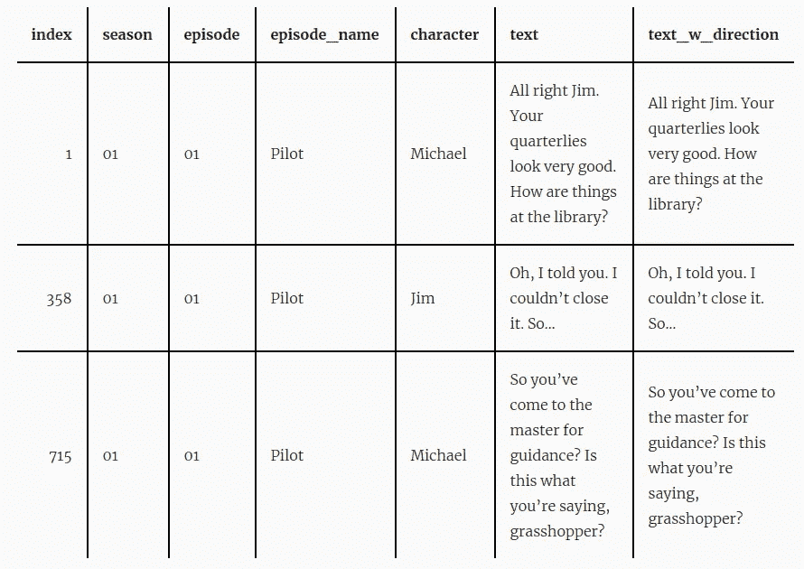
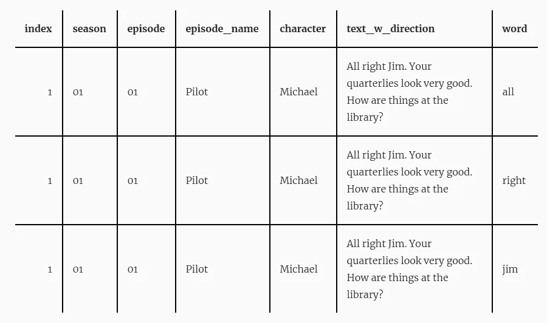
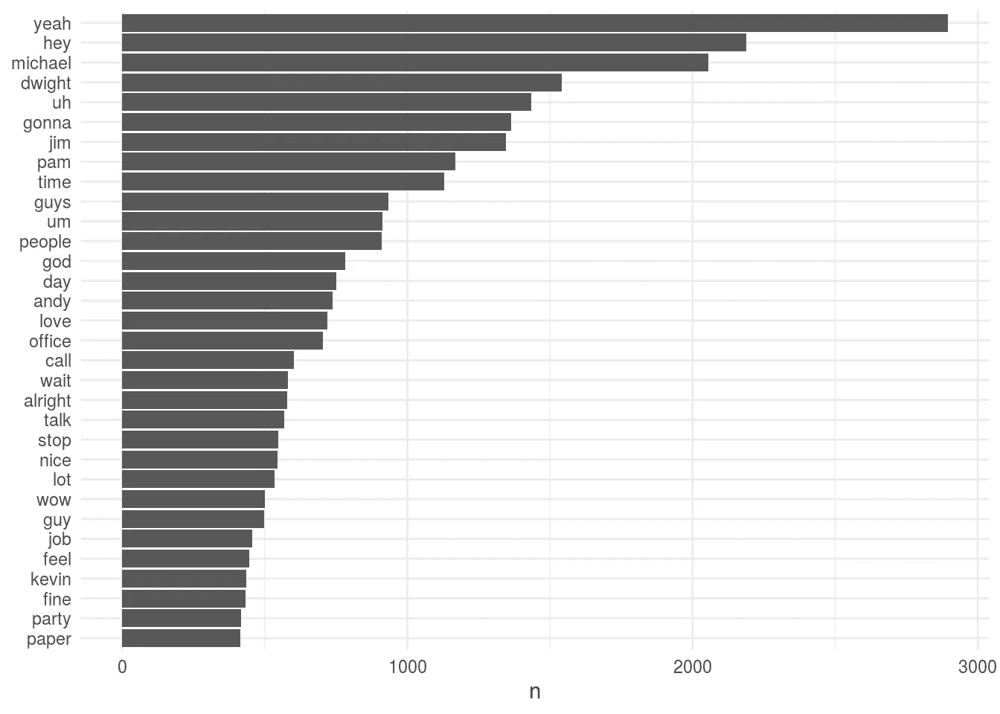

# 介绍 schrute 软件包:办公室的全部记录

> 原文：<https://towardsdatascience.com/introducing-the-schrute-package-the-entire-transcripts-from-the-office-cfc13fe1e769?source=collection_archive---------26----------------------->

## 文本数据集的集锦


[Github 回购](https://bradlindblad.github.io/schrute/)

这是一个只有一件事的软件包:办公室[所有剧集的完整副本！](https://www.imdb.com/title/tt0386676/)(美版)。

使用这个数据集来掌握自然语言处理或文本分析。让我们从茱莉亚·西尔格和大卫·罗宾逊所著的优秀的《用 R 进行文本挖掘的 T4》一书中的几个例子来了解一下这个主题。

首先，从 CRAN 安装软件包:

```
# install.packages("schrute") 
library(schrute)
```

schrute 包只有一个数据集；将它赋给一个变量

```
mydata <- schrute::theoffice
```

看一下格式:

```
dplyr::glimpse(mydata) #> Observations: 55,130 #> Variables: 7 
#> $ index <int> 1, 358, 715, 1072, 1429, 1786, 2143, 2500, 2857... #> $ season <chr> "01", "01", "01", "01", "01", "01", "01", "01",... #> $ episode <chr> "01", "01", "01", "01", "01", "01", "01", "01",... 
#> $ episode_name <chr> " Pilot", " Pilot", " Pilot", " Pilot", " Pilot... 
#> $ character <chr> "Michael", "Jim", "Michael", "Jim", "Michael", ... 
#> $ text <chr> " All right Jim. Your quarterlies look very goo... #> $ text_w_direction <chr> " All right Jim. Your quarterlies look very goo...mydata %>% 
dplyr::filter(season == '01') %>% 
dplyr::filter(episode == '01') %>% 
dplyr::slice(1:3) %>% 
knitr::kable()
```



所以我们有的是季节，集数和名字，人物，说的台词和跟舞台方向(cue)说的台词。

我们可以用 tidytext 包中的几行来标记所有的行:

```
token.mydata <- mydata %>% 
tidytext::unnest_tokens(word, text)
```

这将我们的数据集增加到 575146 条记录，其中每条记录包含脚本中的一个单词。

```
token.mydata %>% 
dplyr::filter(season == '01') %>% 
dplyr::filter(episode == '01') %>% 
dplyr::slice(1:3) %>% 
knitr::kable()
```



如果我们想分析整个数据集，我们需要先删除一些停用词:

```
stop_words <- tidytext::stop_words tidy.token.mydata <- token.mydata %>% dplyr::anti_join(stop_words, by = "word")
```

然后看看最常见的单词是什么:

```
tidy.token.mydata %>% 
dplyr::count(word, sort = TRUE) 
#> # A tibble: 19,225 x 2 
#>  word      n 
#> <chr>    <int> 
#> 1 yeah    2895 
#> 2 hey     2189 
#> 3 michael 2054 
#> 4 dwight  1540 
#> 5 uh      1433 
#> 6 gonna   1365 
#> 7 jim     1345 
#> 8 pam     1168 
#> 9 time    1129 
#> 10 guys   933 
#> # ... with 19,215 more rowstidy.token.mydata %>% 
dplyr::count(word, sort = TRUE) %>% 
dplyr::filter(n > 400) %>% 
dplyr::mutate(word = stats::reorder(word, n)) %>% ggplot2::ggplot(ggplot2::aes(word, n)) + 
ggplot2::geom_col() + 
ggplot2::xlab(NULL) + 
ggplot2::coord_flip() + 
ggplot2::theme_minimal()
```



你可以继续这样做。现在你已经有了时间线(剧集，季节)和剧中每一行每一个词的角色，你可以进行无限的分析。一些想法:—逐角色感悟—逐角色感悟—逐季节自恋(咳咳..Nard Dog 第 8-9 季)——角色台词——等等。

*原载于 2019 年 12 月 15 日*[*https://technistema.com*](https://technistema.com/posts/introducing-the-schrute-package-the-entire-transcripts-from-the-office/)*。*