# 介绍

> 原文：<https://towardsdatascience.com/introducing-theto-1db9bfbb8d69?source=collection_archive---------28----------------------->

## 设计和数据科学

## 地理空间数据探索的工作流自动化

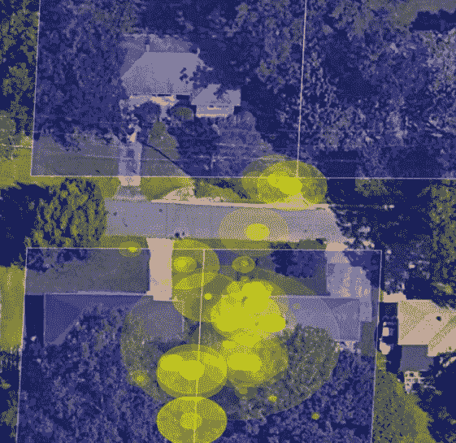

我最近开源了一个 Python 库，名为 Theto，用来自动化我的一些工作流程。这篇文章是关于我设计这个工具的过程。如果你只是想跳到工具本身，你可以在这里看到一个演示笔记本[。否则，通读帖子，我会在最后发布笔记本和其他资源的链接。](https://nbviewer.jupyter.org/github/Valassis-Digital-Media/theto/blob/master/theto_demo_notebook.ipynb)

大约一年半以前，[我写了一篇关于](/codify-your-workflow-377f5f8bf4c3)的文章，这是一个工具的前身，并解释了我在创建这个工具时试图遵循的一些原则。我想在这里展开讨论:在编写和组织代码的过程中，我需要系统地思考我试图实现什么目标，尤其是哪些事情会阻止我实现这些目标，以及我如何以避免这些陷阱的方式进行构建。换句话说，我需要修改工具的设计，而代码的修改是从这项工作中产生的。

加入设计工作使得代码更容易修复和改进，但更重要的是，它让我可以花更多的时间使用工具，而不是维护它。现在的设计比过去好，但这在很大程度上是更好的设计而不是更好的代码的结果。(要更完整地讨论应用于数据科学的设计，请阅读我[在这里](/data-is-a-stakeholder-31bfdb650af0)写的内容)。

所以我想谈谈我经常做的工作，我觉得我需要一个工具来帮助我。然后我想谈谈好的设计原则是如何帮助我组织创建这个工具的。然后，我将介绍一下机器人能做的一些事情。

# 我的目标:探索地图上的形状(有背景)

我在 Valassis 的大部分工作都与理解移动定位数据有关。当您在地标(建筑物、道路、行政边界、水体等)的背景下查看位置数据时，会更容易理解。将所有的上下文数据转换到一个位置和格式，以便与移动 GPS 信号等进行有意义的比较，这既困难又昂贵。在一张有许多这些背景信号的图片上绘制这些 GPS 信号，然后使用我的人脑来理解一切，这要容易得多。例如:

## 数据有效性

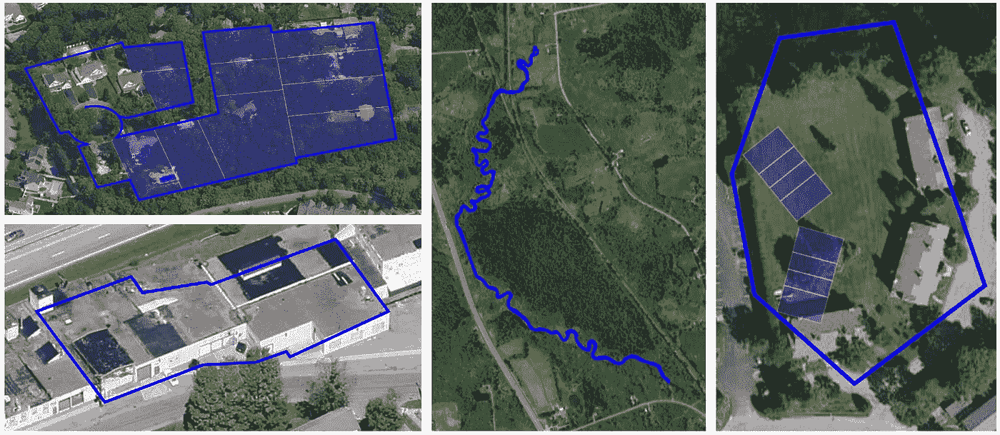

A few of the parcel shapes we don’t want

当我们能够将位置信号附加到有意义的空间时，我们的客户通常会觉得很有价值。例如，知道一个位置信号是在一个独户住宅或一个家得宝所在的建筑中通常是有用的。背景帮助我们做出更好的决定。为了获得这种背景，我们购买了从城市和县评估办公室、基于卫星图像的图像识别和其他来源获得的地块数据集。

上图左上角显示了一个细分。白线划定了住宅用地。深蓝色的线划分细分。我们的数据不包含区分这两个界限的元数据；较大的边界完全包含所有较小的边界，并且较大的边界没有被较小的形状完全填充—存在间隙。

左下方的图像显示了商店的边界。数据没问题。如果你仔细观察图像的中间，你会看到一个黑色的正方形。那是个垃圾箱。如果你从垃圾箱的左上看得更近，你会看到一个蓝色的形状。据我所知，那是垃圾箱里的包裹。我不知道它为什么会在那里，但它就是在那里。

中间的图像是河流的包裹。有意思，但对我们的生意没什么价值。我也见过这样的情况，城市里的每条路都有一个巨大的包裹。

最右边的图像是错误的。这些包裹甚至不接触他们的建筑，似乎旋转不当。

我构建了识别上述所有条件以及更多条件的过程。在某些情况下，我们会标记它们以便修复它们。在其他情况下，我们标记它们以便我们可以删除它们。在所有情况下，我们根本不知道我们需要修复或删除任何东西，直到我们把形状放在地图上，并理解我们在看什么。

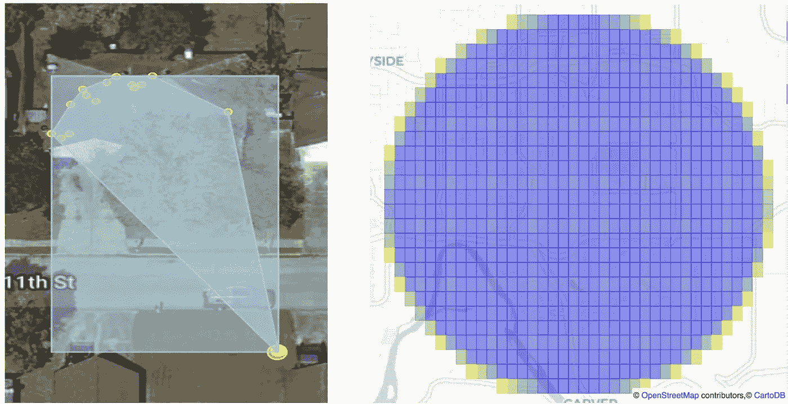

Mobile location data can be wrong in a lot of different ways

形状不是我们业务中唯一有问题的数据。有时位置数据本身是错误的。

比如看左边上图。你可以看到很多橙色的点。这些小点中的大部分都聚集在图像顶部的房子上。如果你仔细看，你甚至可以看到这些点的大部分都在车道后面的房子上，这意味着那个人在上车或下车时更有可能使用他们的手机。看起来车库旁边有一点活动，大概是厨房，然后在房子的另一头有一点，大概是卧室。所有这些都有道理。

现在看图像的底部。在邻居的前院，你可以看到两个大点，实际上是一个在另一个上面。从上下文来看，这些看起来有点奇怪。点的大小反映了一周内在每个位置报告的设备数量:顶部的每个点是由单个设备报告的，而右侧的两个点是由数百个设备报告的。太奇怪了。

我称右边的图片为麦田怪圈。我不知道这是什么。每个方块大致是两个并排的足球场边上的一块土地，但我只展示这些方块，因为你无法同时看到问题的性质和范围。每个正方形本身包含一个完美的网格，每个网格点之间只有几码远。所以每个方块包含几百个网格点。蓝色方块包含一个完整的网格。沿边缘的黄色方块仅包含部分网格。换句话说，有一个巨大的网格。

每个网格点都来自假定的有机移动定位数据。这些数据形成了一个完美的网格，网格点之间的间隔只有几米，它横跨了一个直径约为 2.5 英里的完美圆形。据我所知，美国只有六家这样的公司。其中大部分发生在市中心附近——在阿拉巴马州伯明翰市中心就有一个——但上图中的这个是在俄勒冈州的一块空地上。

每个人都知道手机定位数据不能只看表面。我们需要在很多很多不同的背景下，实际上*观察*移动位置，以找出哪些信号我们可以相信，哪些不可以。

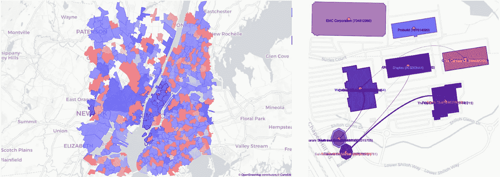

A couple post-analysis sanity checks

有时我们需要在分析之后而不是之前检查数据。上面的左图显示了当我们重新设计一个为物理位置分配 IP 地址的算法时发生的变化。蓝色表示重新设计导致分配更多 IP 地址的地方。红色表示分配的 IP 数量减少的地方。

右图显示了类似的分析后健全性检查。我们一直在寻找销售类似产品或服务的商店。黑色曲线的宽度显示了我们认为某些商店有多相似。这让我们可以查看商店名称，看看我们是否得到了正确的相似性分数。

## 算法开发

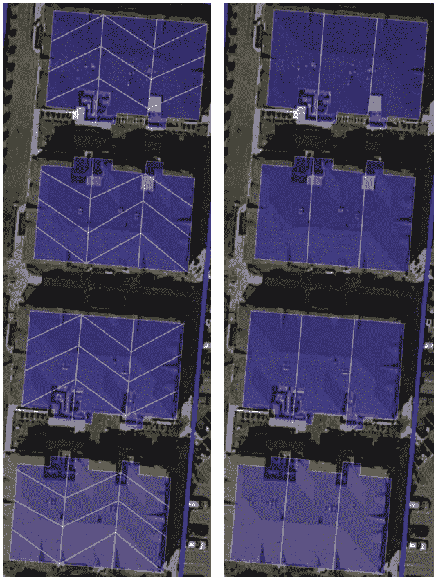

What makes sense for a county assessor doesn’t make sense for us.

我不仅仅使用可视化来计算我正在处理的数据或结果。我经常用它来迭代我正在构建的算法的不同设计选项。

上图显示了一些宗地数据。左边的图像显示了我们从县评估员那里收到的数据。白线表示不同地块之间的分界线。很明显，那些对角线并没有划分出真正怪异的公寓。查看分配给该建筑的邮寄地址，我们认为县评估员试图找出如何解释该建筑有三个公寓平面图，但有四层。对于我们来说，不知道移动信号在几楼有点问题，但如果它出现在某人的客厅，那么将它分配给一个公寓，如果它出现在他们的卧室，那么将它分配给另一个公寓，这确实是个问题。

因此，我编写了一个过程，从一个地块开始，爬行到相邻的地块，在每个阶段检查不同的度量——例如，查看爬行的总空间有多大。这里没有正确的答案——在某些情况下，很难准确说出正确的组合是什么，即使直视它。我甚至使用可视化来尝试不同的指标:

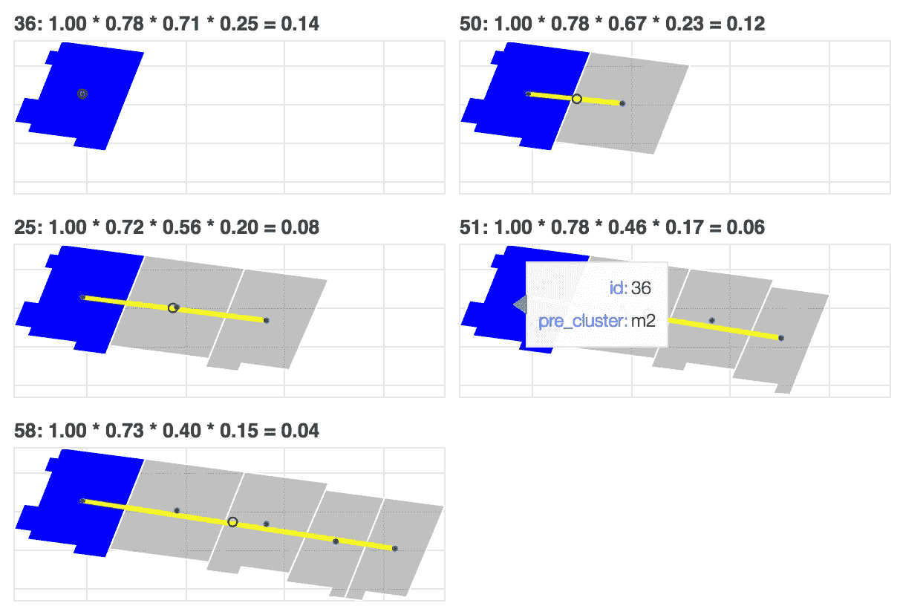

Screen shot of me trying to undo a county assessor’s good intentions

鉴于我几乎总是处理没有可获得的基本事实来验证模型的问题，我很少开发一种算法而不开发一种方法来可视化该算法的结果。这是另一个例子:

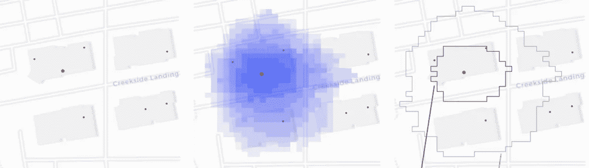

红点是一个企业的位置。我们没有为那家商店(和许多其他喜欢它的商店)留下建筑足迹。因此，我们查看了商店附近的移动设备，并计算出它们还去了附近的其他地方。我们能够利用这一点来对地块进行评分，确定出现在给定地块上的人出现在离商店质心更近的地方的概率。我们能够利用这种概率云来构建一个建筑足迹，不仅捕捉到了商店，还捕捉到了商店前门外的专用停车场。

# 好的设计产生好的代码

以上所有的例子实际上只是一个简单目的的不同版本:我需要在地图上以一种我可以看到上下文的方式放置形状。这就是我需要一个工具来实现的目的。一个好的设计不应该分散我对那些可能妨碍我实现目标的事情的注意力，而且应该尽量减少我在其他事情上花费的精力。我会回到那一点。

设计是一件有趣的事情。许多好的设计原则适用于你正在设计的任何东西，无论是软件、机器还是建筑:

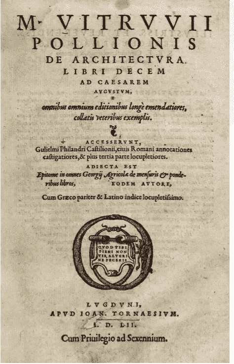

Vitrivius 是一位罗马设计师，他写了“十本关于建筑的书”，现在通常简称为“建筑论”。在那部作品中，维特鲁威提出了优秀设计的三个品质:

*   有用
*   坚定
*   高兴

前两个是不言自明的——尤其是第一个。一个好的设计应该是有用的，因为它首先实现了一个目的。我经常看到数据科学家，尤其是初级数据科学家，设计复杂的工作流和流程来适应他们想要使用的特定方法，而没有首先确认该方法比(通常更简单的)替代方法更好地实现了分析目的。我自己做过的次数比我愿意承认的要多。

无论你是在建造一栋建筑还是一个软件，你都希望它“坚固”到不容易损坏。实际上，这种品质很难达到。在我自己的经验中，我经常发现我写代码是为了在一定条件下适应某种输入，并提供某种输出。然后输入发生变化，或者我需要不同的输出，或者基础条件发生变化，一切都崩溃了。我重新设计了可视化代码，因为我厌倦了保持相同过程的多个版本，或者每当一个旧的需求重新出现时就搜索旧版本的代码。我之前写的代码不牢。这一目标还有一段路要走，但它已经稳固得多了。

最后一个品质——愉悦——是最不直观的，但在我看来，却是最重要的。在设计建筑时，这个概念更加直观:建筑不应该只是挡雨。应该很好看。但这就提出了一个问题，一个算法或一个软件“看起来不错”意味着什么？

弗雷德里克·布鲁克斯(Frederick Brooks)最出名的可能是写了《人月神话》,并监督了 IBM 的 System/360 系列计算机的设计，这是第一个支持小写字母表示的系统。布鲁克斯已经[写了很多关于设计的文章。他认为维特鲁威的快乐概念是一种“逻辑美”。如果一个设计减少了脑力劳动，那么它在逻辑上就是美丽的——它让我们很容易注意到需要我们注意的事情，也很容易忽略甚至完全意识不到那些不需要我们注意的事情。Books 将逻辑美的概念分为三个部分:](https://www.amazon.com/Design-Essays-Computer-Scientist/dp/0201362988)

*   **礼义廉耻。**布鲁克斯将此描述为“不要介绍不重要的东西”。我们制造东西是因为我们有任务要完成。任何与完成任务直接相关的事情都适合于该任务。任何不直接相关的东西——如果有必要的话——都是不合适的。一个好的设计应该让适当的任务变得容易，让不适当的任务变得不可见。
*   **正交性。**布鲁克斯将此描述为“不要链接独立的东西”。我们也可以将其描述为模块化。一个好的设计不应该让设计的不同方面互相依赖，除非它们真的总是需要一起发生。如果他们可以分别快乐，他们应该被建造成彼此独立。
*   **共性。布鲁克斯将此描述为“不要限制固有的东西”。一个好的设计不应该为了使用这个设计而一遍又一遍地让人们去做同样的事情。设计应该只是做那件事。**

那么，让我们回到作为一名数据科学家，我真正想要完成的事情上来。我的目标:探索地图上的形状以理解背景。不是我的目标:得到形状，得到地图，把形状放在地图上。这些事情都不适合我的任务，尽管它们显然需要发生才能让我完成任务。事实上，当我想得更多的时候，我发现大量的任务是必要的，但并不恰当:

*   存储默认值
*   摄取数据
*   验证数据
*   过程数据
*   追加元数据
*   获取地块大小和边界
*   获取缩放级别
*   检索地图切片
*   项目数据
*   添加形状
*   将数据映射到形状
*   格式化形状
*   连接形状
*   批注形状
*   添加互动
*   设置交互工具
*   添加/格式化图例
*   渲染图
*   重复

一个好的设计应该尽量减少我在上面任何一项任务上花费的脑力。它们应该尽可能高效地发生，尽可能减少我的工作量。这就是得体的原则。

所以现在我们得到了正交性原理。如果我想最大限度地减少我花在上述任务上的注意力，我需要以一种最大限度减少依赖性的方式来组织它们。我需要对任务进行足够的划分，这样，如果一个东西出现故障或未能满足需求，就不会影响到工具的其他部分。有很多方法可以分解这些任务。这是我选择的:

*   设置默认值
*   添加来源
*   添加互动
*   创建绘图
*   添加层
*   渲染图

这些是我与设计的互动点:我不需要对所有那些必要但不恰当的任务做出决定，我只需要做出以上六个决定。这样更省力。

我的最后一个目标是将这六项任务尽可能分开。这就是展示比讲述容易得多的地方。

# 建筑师可以做的几件事

上面文章中几乎所有的图片都是用这个工具创建的，但是在这里我将介绍所有的主要功能。该工具构建在[散景](https://bokeh.pydata.org/)库之上，该库具有一定的内置交互性，例如平移和缩放图形的能力。的其他部分提供了更高级的交互性。Medium 没有提供任何直接嵌入 Javascript 的方法，所以如果你想看到交互式部分，可以向下滚动到文章的底部，点击笔记本的链接。

## 输入格式

计算器可以自动处理以下类型的输入:

*   [Geohashes](https://en.wikipedia.org/wiki/Geohash)
*   [知名正文](https://en.wikipedia.org/wiki/Well-known_text_representation_of_geometry)
*   经度/纬度对
*   [匀称的物体](https://shapely.readthedocs.io/en/stable/manual.html)
*   [乔森](https://en.wikipedia.org/wiki/GeoJSON)

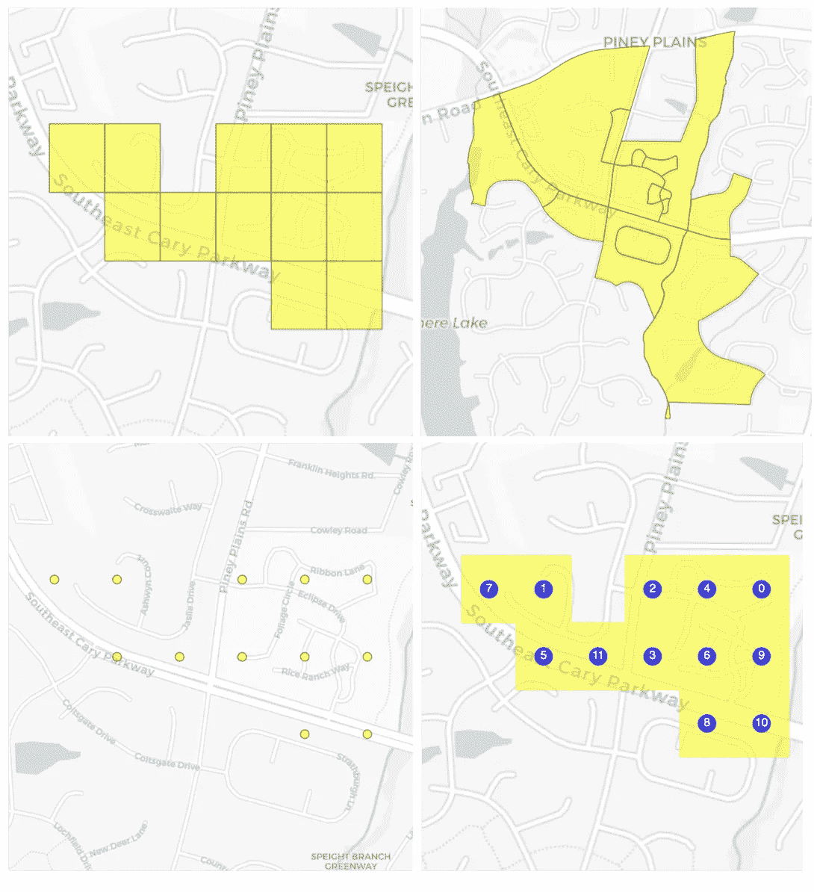

Shapes on maps!

散景能够渲染字形(其中形状的边界映射到实际的地图坐标，因此如果您缩放图像，形状也会放大)和标记(映射到地图上单个点并且无论您如何缩放都保持不变的点或其他形状)。这个工具将接受上面的任何输入，并将它们格式化为一个字形或一个标记——随你怎么想。

这个工具还可以自动追加元数据。您可以将所有想要的数据作为 Pandas dataframe 加载，并指定包含形状的列，或者您可以将形状作为值列表加载，然后通过将元数据作为关键字参数包含在`add_source`方法中来追加元数据。您可以加载任意数量的源，并以多种方式渲染单个源。

## 视觉造型

为形状边框、形状表面或同时为两者指定颜色提供了多种方法:

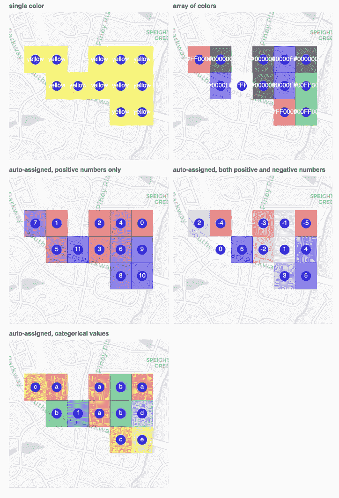

如果您将单一颜色名称或十六进制颜色代码传递给`add_layer`方法，所有形状都将是该颜色。或者传递一个值列表来分别分配给每个形状。如果您在数据源中传递一个列的名称，并且该列包含字符串值，则将自动从分类调色板中分配颜色。(您可以在实例化调色板时指定哪个调色板，但它也有一个缺省值)。如果列包含数值，则将创建一个颜色渐变(包括具有正值和负值的列的中点颜色渐变)。所有的颜色映射都在幕后进行。

还提供了几种地图类型:

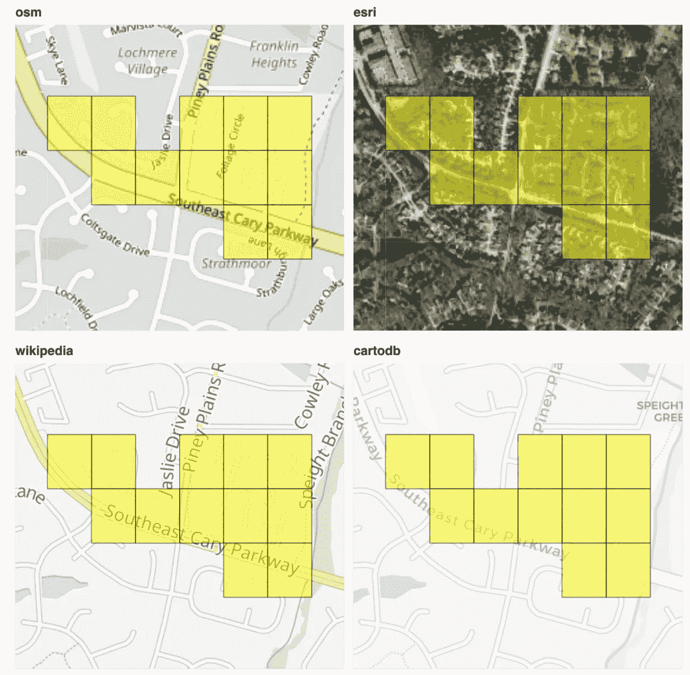

只需使用适当的关键字来获得您想要的地图类型。另外，如果在实例化一个 Theto 实例时输入一个 Google API 键，那么可以使用任何 Google Maps 地图类型(“卫星”、“路线图”、“地形”或“混合”)。只是要小心:Bokeh 将 API 键存储在用于渲染图的 Javascript 对象中，因此任何查看您渲染图的页面的源代码的人都可以看到您的 API 键。

这个工具还有一个`add_path`方法，可以让你在形状之间添加线条(曲线或直线)。它可以处理一对一的关系来显示从一个位置到另一个位置的旅行，或者处理多对多的关系来显示其他类型的连接。

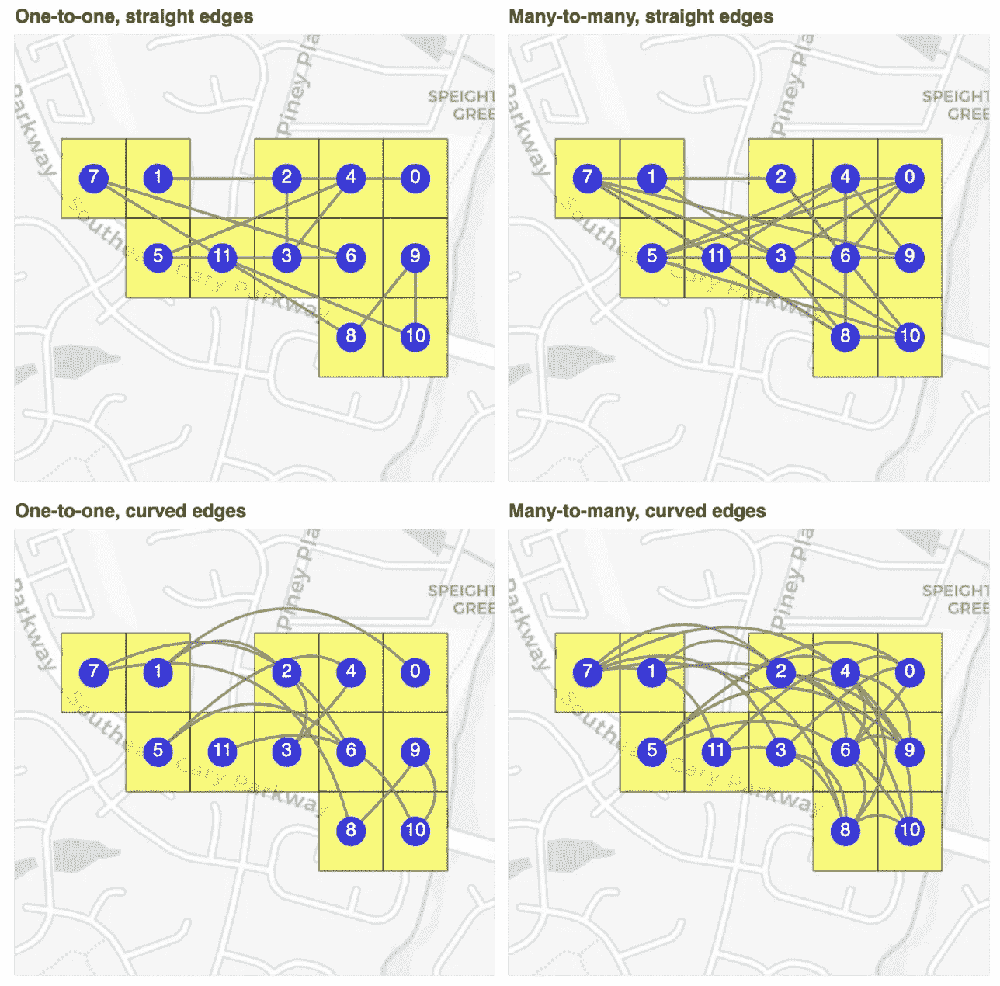

## 交互性

正如我之前提到的，由于是建立在散景的基础上的，所以它可以获得一些开箱即用的交互性。除了平移和缩放，你还可以在`add_layer`方法中的`legend`关键字参数中加入一个标签，这将创建一个图例，点击标签将打开和关闭相关层。

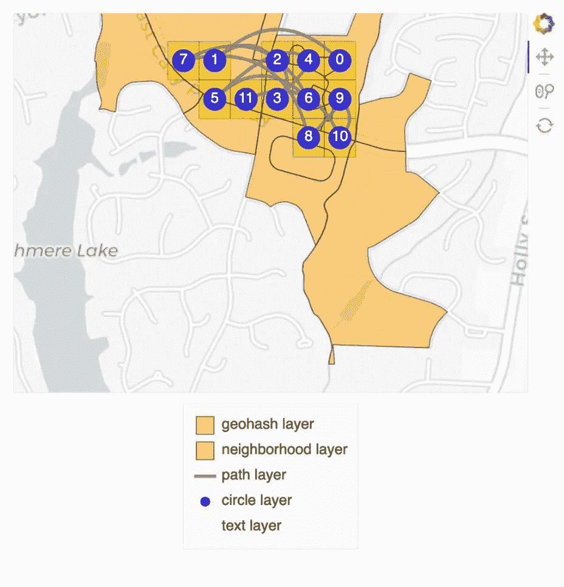

此外，还有一种`add_widget`方法，允许更复杂的交互来动态过滤地图上显示的形状:

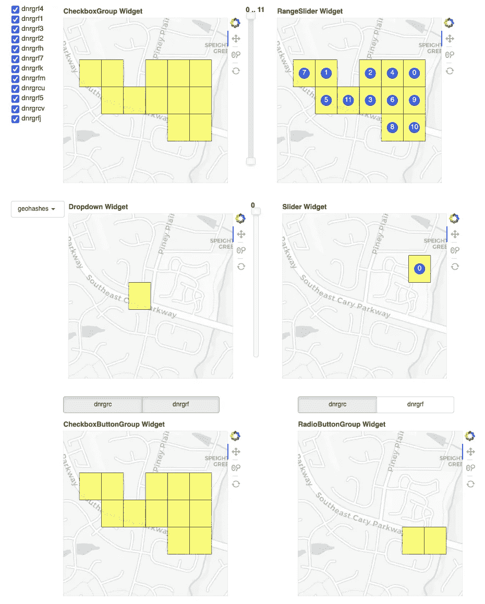

# 如何自己使用计算器

如果你只是想开始使用它:

`pip install theto`

您可以在这里看到所有功能的演示:

 [## nbviewer 笔记本

### Geohashes 是划分地球表面的长度为 1 到 12 的字符串。该工具将转换这些…

nbviewer.jupyter.org](https://nbviewer.jupyter.org/github/Valassis-Digital-Media/theto/blob/master/theto_demo_notebook.ipynb) 

您可以在这里查看代码、文件问题和创建拉取请求:

 [## valassis-数字媒体/the

### 任何可视化都需要大量琐碎的决策，这些决策加起来会对…产生重大影响

github.com](https://github.com/Valassis-Digital-Media/theto)