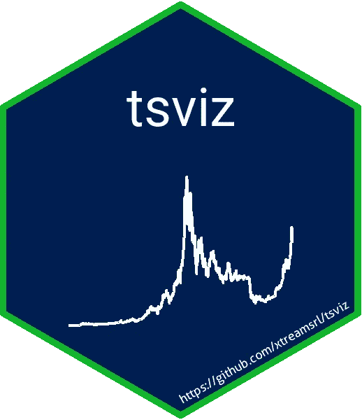
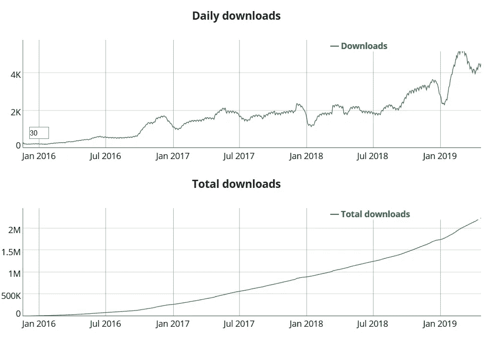
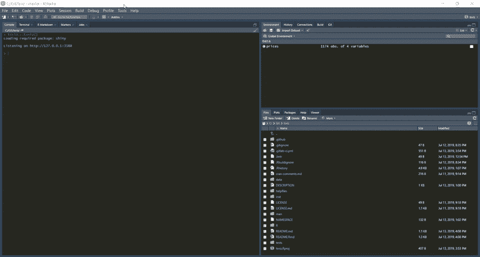

# 介绍 tsviz，R Studio 中的交互式时间序列可视化

> 原文：<https://towardsdatascience.com/introducing-tsviz-interactive-time-series-visualization-in-r-studio-a96cde507a14?source=collection_archive---------15----------------------->

## 我们为什么以及如何开发 R Studio 插件

tsviz logo

# 上下文:R 数据可视化工具

我们都知道。r 非常适合数据可视化。

Hadley Wickham 的 [ggplot2](https://ggplot2.tidyverse.org/) 提供了一个简单而优雅的语法来创建非常有效的图表。此外，万一 ggplot2 不支持一些奇特的图表，R 提供了许多有效的替代方法，如[点阵](https://cran.r-project.org/web/packages/lattice/index.html)。

在这种场景下，2016 年初，发布了新的包。随着 JavaScript 库的开源发布，R 的 [Plotly](https://plot.ly/r/) 在 CRAN 上可用。Plotly 允许创建交互式图表，用户可以缩放，平移，选择数据，并通过悬停在数据点上查看附加信息。

交互性可能只是一个花哨的功能。在学术著作中，数据是已知的，真正重要的是为出版物制作清晰和信息丰富的图表。

但是…

> 对于从业者来说，交互性是一件大事。它有助于接近数据并获得早期洞察力，从而加快数据探索的整个过程。

毫不奇怪，Plotly 立即获得了成功，随着新功能的增加，它越来越受欢迎，比如与 ggplot2 的[集成。](https://plot.ly/ggplot2/)

然而，即使是 Plotly 和 ggplot2 也是要付出代价的。

Plotly R package daily downloads. Data from [rpackages.io](https://www.rpackages.io/package/plotly).

# 动机:寻求早期洞察力

Plotly 和 ggplot2 未能提供一个通用的语法:将纯 plotly 中的图表与用 ggplot2 创建的 plotlified 图形混合在一起是很棘手的。即使有了库的帮助，创建有效的可视化仍然需要时间。

大多数数据科学家喜欢创建图表。图表是我们交流的方式，是分享我们从数据中获得的信息的最有效的语言。

> 但是，创建图表来共享结果不同于创建图表来浏览和调查数据。

在第一种情况下，我们很乐意在一个数字上花很多时间，但在第二种情况下，我们就不乐意了。我们想尽快获得知识，这样我们可以做出更好的决定，避免危险的误解。

幸运的是，R and R 工作室为这种需求提供了答案。2016 年初，R Studio 宣布支持插件。作为 IDE 的有效扩展，外接程序可能有助于与开发相关的任务，但也为数据分析提供支持。例如，一些加载项简化了数据子集设置，而其他加载项则帮助选择图表的颜色。

因此，为什么不创建一个插件来简化交互式图表的使用呢？

在过去的几个月里，在 xtream 中，我们参与了几个涉及时间序列分析的项目。我们多次重复同样的过程:

1.  绘制时间序列
2.  检查目标系列和特征之间的散点图
3.  建立和分析自相关、偏自相关和周期图

当然，我们构建并使用了函数，但是创建一个脚本或一个 R Markdown 文档来一直使用它们是很乏味的。

因此，我们决定将最有用的功能封装在一个插件中。

# 创造:站在巨人的肩膀上

由于有很多有用的资源，开发 R Studio 插件的过程非常快。以下是清单:

1.  [使用这个包](https://usethis.r-lib.org/):一个易于使用的工具，在 R 包的基础上构建框架并添加元素，比如许可证、测试、CI 配置。
2.  [styler 包](https://styler.r-lib.org/):实现 tidyverse 风格导轨的棉绒。它可以通过其插件运行。
3.  hexSticker package :为包创建六边形标志的工具。
4.  Hadley Wickham 的 R 包:创建 R 包的严谨而易懂的指南。
5.  [R Studio 关于插件的教程](https://rstudio.github.io/rstudioaddins/):对于从未创建过插件的开发者来说是一个很棒的资源。
6.  GitLab 和 GitLab CI:起初，插件托管在 xtream 的私有 GitLab 存储库中。[本教程](https://blog.methodsconsultants.com/posts/developing-r-packages-using-gitlab-ci-part-i/)帮助我们配置持续集成管道。
7.  GitHub 和 Travis CI:社区维护的 Travis 的 R 映像提供了与 GitHub 的无缝 CI 集成。

# 结果:tsviz

tsviz 是一个 R 包，其中包含 tsviz 插件和一个样本数据集。

您可以通过运行以下命令从[曲柄](https://cran.r-project.org/package=tsviz)安装 tsviz:

或者可以从 [GitHub](https://github.com/donlelef/tsviz) 下载开发版。确保安装并运行 devtools 包:

安装后，您可以尝试加载项:

您应该能够做这样的事情:

tsviz usage example

tsviz 也可以随时从 R Studio 中的 add-ins 菜单运行:不需要用`library()`加载包。

当然，你可以在自己的数据上尝试 tsviz。

启动时，加载项会自动在全球环境中查找合适的数据框。如果满足以下条件，可以使用 tsviz 分析数据帧:

*   它至少有一个类型为`Date`的列
*   它至少有一个`numeric`类型的列

# 参考

tsviz 在 GitHub 上:[https://github.com/xtreamsrl/tsviz](https://github.com/xtreamsrl/tsviz)。它仍处于早期开发阶段:欢迎每一个反馈或错误报告！

我的读者，感谢你来到这里！

*如果你喜欢这篇文章，你可能会感兴趣:*

*   [*真实机器学习项目的经验，第 1 部分:从 Jupyter 到 Luigi*](/lessons-from-a-real-machine-learning-project-part-1-from-jupyter-to-luigi-bdfd0b050ca5)
*   [*真实机器学习项目的经验，第二部分:数据探索的陷阱*](/lessons-from-a-real-machine-learning-project-part-2-the-traps-of-data-exploration-e0061ace84aa)

*如果你对* [*me*](https://www.linkedin.com/in/emanuelefabbiani/) *或*[*xtream*](https://www.linkedin.com/company/18545289/admin/)*有什么好奇的话，上领英看看吧！*