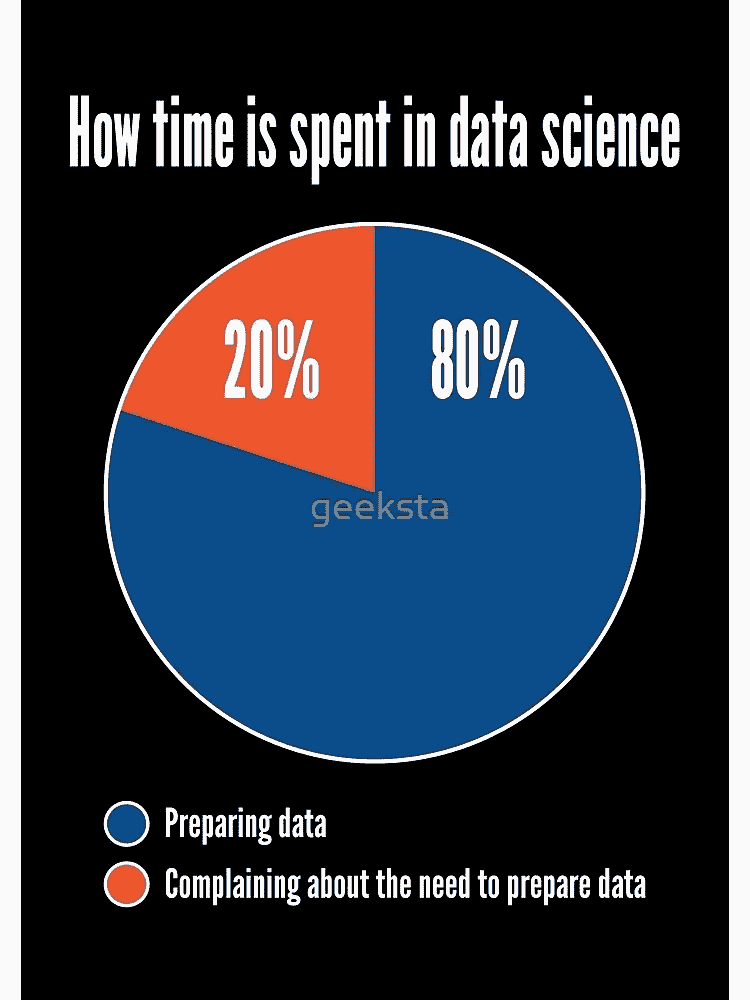
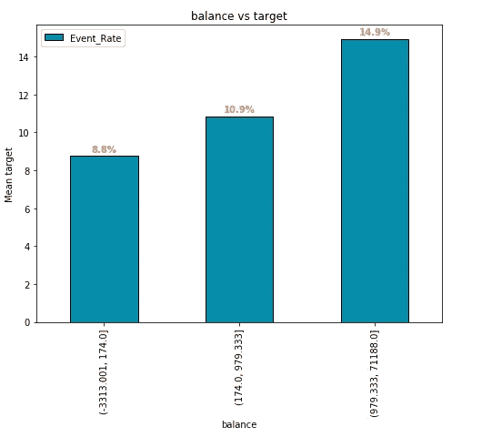
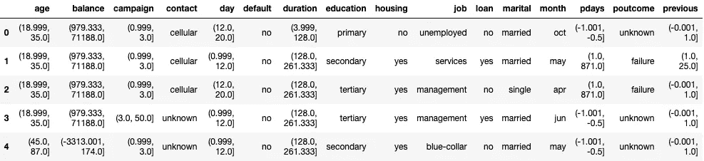
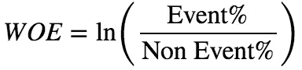
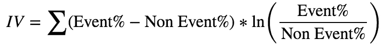
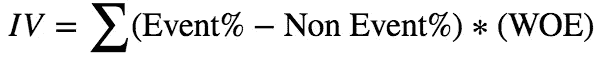
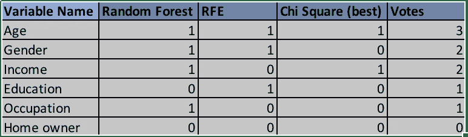
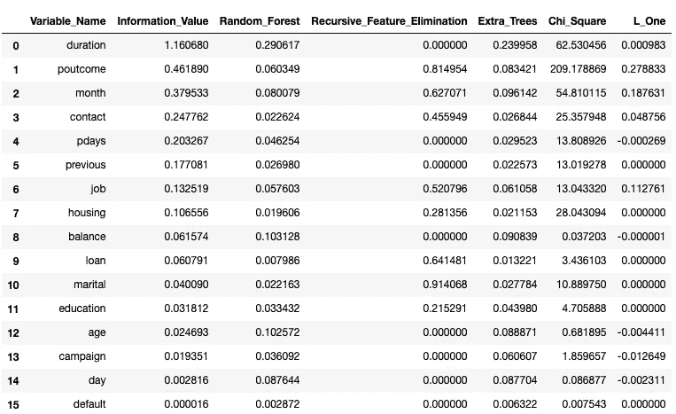
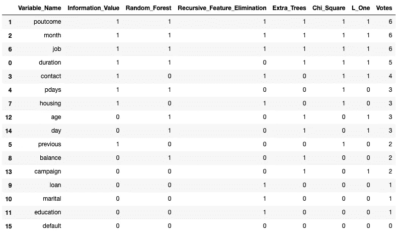
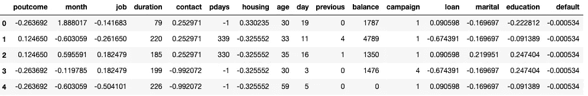

# Xverse 介绍！—用于要素选择和变换的 python 包

> 原文：<https://towardsdatascience.com/introducing-xverse-a-python-package-for-feature-selection-and-transformation-17193cdcd067?source=collection_archive---------3----------------------->

## 节省数据科学家 80%的时间


Credits: [Pixabay](https://pixabay.com/photos/apple-fruit-selection-especially-1594742/)

Xverse 是 **X** Uni **verse** 的缩写，是一个用于机器学习的 python 包，用于协助数据科学家进行特征转换和特征选择。在我们谈论这个包的细节之前，让我们理解为什么我们需要一个。

# 背景



Credits: [Geeksta](https://www.redbubble.com/people/geeksta/works/28377172-how-time-is-spent-in-data-science-funny-pie-chart-design?p=spiral-notebook#&gid=1&pid=3)

我看到了这张图片，我觉得没有更好的方式来解释这个项目。虽然听起来很有趣，但它发生在数据科学生命周期的大部分时间里。数据科学家 80%的时间花在处理特性(X)上，因此得名 **XuniVerse** 又名**“X verse”。**

另外，整个项目是基于我 2018 年在 Medium 上发表的作品。根据我从读者那里得到的反馈，我想改进代码的功能。与其把它作为一个更新的功能发布，我认为把它作为一个 python 包发布会更好。嗯，《xverse》就是这么诞生的。

# 此包的早期作品

下面显示的文章现在是这个包的一部分。

[](https://medium.com/@sundarstyles89/weight-of-evidence-and-information-value-using-python-6f05072e83eb) [## 使用 Python 的证据权重和信息价值

### 证据权重(WOE)和信息价值(IV)是简单的，但强大的技术来执行可变…

medium.com](https://medium.com/@sundarstyles89/weight-of-evidence-and-information-value-using-python-6f05072e83eb) 

> “证据权重(WOE)和信息价值(IV)是执行**变量转换和选择**的简单而强大的技术。这些概念与逻辑回归建模技术有着巨大的联系。它被广泛用于信用评分，以衡量好客户与坏客户的区分。”

[](https://medium.com/@sundarstyles89/variable-selection-using-python-vote-based-approach-faa42da960f0) [## 使用 Python 的变量选择—基于投票的方法

### 变量选择是预测建模过程中的关键步骤之一。这是一门艺术。简单来说…

medium.com](https://medium.com/@sundarstyles89/variable-selection-using-python-vote-based-approach-faa42da960f0) 

> “这个想法是应用各种技术来选择变量。当一个算法选择一个变量时，我们给这个变量投票。最后，我们计算每个变量的总投票数，然后根据投票选出最佳变量。这样，我们就能在变量选择过程中以最少的努力挑选出最好的变量。”

# 功能

[](https://github.com/Sundar0989/XuniVerse) [## Sundar0989/XuniVerse

### xverse (XuniVerse)是用于特征工程和特征选择的转换器的集合

github.com](https://github.com/Sundar0989/XuniVerse) 

下面显示的所有示例使用的数据集都在“data”文件夹中。此外，您可以参考此链接中的 Jupyter 笔记本代码“Xverse.ipynb”。

## 1.单调宁滨

单调宁滨是记分卡开发中广泛使用的数据准备技术。它试图通过创建与目标具有单调关系的箱来将数值变量转换为分类变量。下面给出的例子将演示它是如何工作的。



Balance vs Target (Monotonic Relationship)

上面显示的特征“余额”的范围从＄3，313.001 到＄71，188。我们都同意这是一个非常广泛的范围。如果我们必须基于领域知识绑定这个变量，那么我们就不必担心单调关系。然而，当没有先验知识存在时，则很难确定容器类别。这是一个理想的情况，单调宁滨可以帮助。

它从 20 个箱开始(默认值，可以随时更改)，然后减少箱数，直到发现 X 变量和目标 y 之间的单调关系(增加或减少)。如果它没有建立单调关系，则使用 force_bins 选项强制在 X 变量上创建箱数。一直以来，它使用 ***斯皮尔曼相关*** 来验证 X 和 y 变量之间是否存在单调关系。

> 单调宁滨的优点:

1.  处理异常值
2.  在特征和目标变量之间建立单调关系

> 单调宁滨的缺点:

1.  在可变宁滨期间，我们会丢失信息
2.  没有处理缺失值的正确方法

## 如何用“Xverse”演奏单调的宁滨？

```
from xverse.transformer import MonotonicBinning

clf = MonotonicBinning()
clf.fit(X, y)

print(clf.bins)
output_bins = clf.bins *#will be used later in this exercise*
```

这里 X 表示特征数据集，它是一个熊猫数据框架，y 是目标列的 numpy 数组。我们还可以使用预计算的单调条柱应用于新数据集，如下所示。

```
clf = MonotonicBinning(custom_binning=output_bins) *#output_bins was created earlier*

out_X = clf.transform(X)
out_X.head()
```



## 2.证据权重和信息价值

WOE 包在 transformer 函数中可用。WOE 转换的优点是

1.  处理缺失值
2.  处理异常值
3.  该变换基于分布的对数值。这与逻辑回归输出函数一致
4.  不需要虚拟变量
5.  通过使用适当的宁滨技术，可以在自变量和因变量之间建立单调关系(增加或减少)
6.  IV 值可用于快速选择变量。

计算 WOE 和 IV 的公式如下。



或者简单地说，



## 如何使用“Xverse”执行 WOE？

```
from xverse.transformer import WOEclf = WOE()
clf.fit(X, y)**clf.woe_df # weight of evidence transformation dataset. This dataset will be used in making bivariate charts as well.** clf.iv_df #information value dataset
```

要选择功能，请使用下面的规则

```
+-------------------+-----------------------------+
| Information Value | Variable Predictiveness     |
+-------------------+-----------------------------+
| Less than 0.02    | Not useful for prediction   |
+-------------------+-----------------------------+
| 0.02 to 0.1       | Weak predictive Power       |
+-------------------+-----------------------------+
| 0.1 to 0.3        | Medium predictive Power     |
+-------------------+-----------------------------+
| 0.3 to 0.5        | Strong predictive Power     |
+-------------------+-----------------------------+
| >0.5              | Suspicious Predictive Power |
+-------------------+-----------------------------+
```

要基于之前计算的 WOE bins 转换变量 X，请使用下面的代码。

```
clf.transform(X) #apply WOE transformation on the dataset
```

## 如何在未来数据集上应用 WOE 转换？

```
output_woe_bins = clf.woe_bins #future transformation
output_mono_bins = clf.mono_custom_binning  #future transformationclf = WOE(woe_bins=output_woe_bins, mono_custom_binning=output_mono_bins) #output_bins was created earlierout_X = clf.transform(X)
```

## WOE 包中可探索的其他功能:

```
*treat_missing: {‘separate’, ‘mode’, ‘least_frequent’} (default=’separate’)**This parameter setting is used to handle missing values in the dataset.
 ‘separate’ — Missing values are treated as a own group (category)
 ‘mode’ — Missing values are combined with the highest frequent item in the dataset
 ‘least_frequent’ — Missing values are combined with the least frequent item in the dataset*
```

## 3.二元分布的条形图

二元分布帮助我们探索 X 和 y 变量之间的关系。这个选项在“xverse”中也是可用的。

## 如何使用“Xverse”制作图表？

为了制作二元图表，我们需要从上面显示的 woe 选项生成的**“WOE _ df”**数据集。

```
woe_df = clf.woe_dffrom xverse.graph import BarCharts
clf = BarCharts(bar_type='v')
clf.plot(woe_df)
```

## 要在条形图中探索的其他功能:

```
*plot_metric: 'count' or 'mean' (default='mean')
        Metric to be used while plotting the bivariate chart.
        'count' - Event counts in the particular bin
        'mean' - Mean event rate in the particular bin**bar_type: 'horizontal' or 'vertical' (default='vertical')
        Type of bar chart.**fig_size: figure size for each of the individual plots (default=(8,6))**bar_color: CSS color style picker. Use it with the hashtag in the front. (default='#058caa')
        Bar color

    num_color: CSS color style picker. Use it with the hashtag in the front (default='#ed8549')
        Numbers color. It represents the numbers written on top of the bar.*
```

## 4.变量选择的投票选择器

> *变量选择是预测建模过程中的关键过程之一。这是一门艺术。简单地说，变量选择就像挑选一支足球队赢得世界杯。你需要在每个位置都有最好的球员，你不希望两个或多个球员踢同一个位置。*

在 python 中，我们有不同的技术来选择变量。其中一些包括递归特征消除、基于树的选择和基于 L1 的特征选择。

这里的想法是应用各种技术来选择变量。当一个算法选择一个变量时，我们给这个变量投票。最后，我们计算每个变量的总票数，然后根据投票选出最好的变量。这样，我们就可以在变量选择过程中以最小的努力挑选出最好的变量。



```
from xverse.ensemble import VotingSelectorclf = VotingSelector()
clf.fit(X, y)
```

现在，让我们用下面的代码来看看特性的重要性。

```
clf.feature_importances_
```



```
clf.feature_votes_
```



```
clf.transform(X).head()
```



## 投票选择器中可探索的其他功能:

```
*selection_techniques: 'all', 'quick' or list(default='all')
    List of selection techniques to be applied on the data. 
    Available techniques - Weight of evidence ('WOE'), Random Forest ('RF'), Recursive Feature Elimination ('RFE'), Extra Trees Classifier ('ETC'), Chi Square ('CS'), L1 feature selection ('L_ONE').

    'all' - Apply all selection techniques ['WOE', 'RF', 'RFE', 'ETC', 'CS', 'L_ONE']
    'quick' - ['WOE','RF','ETC']
    list - user provided list of feature selection techniques from available techniques 

no_of_featues: 'auto', 'sqrt' or int(default='auto')
    Number of features to be selected by each selection technique.
    'auto' - len(features)/2
    'sqrt' - sqrt(len(features)) rounded to the lowest number
    int - user provided number in integer format

handle_category= 'woe' or 'le' (default='woe')
    Handle category values transformation using Label encoder or Weight of Evidence option. Takes care of missing values too. It treats missing values as separate level.
    'woe' - use weight of evidence transformation
    'le' - use label encoder transformation

numerical_missing_values= 'median', 'mean' or 0 (default='median')
    Handle numerical variable missing values.
    'median' - use median of the column
    'mean' - use mean of the column
    0 - use 0 to impute the missing values

minimum_votes = int (default=0)
    Minimum number of votes needed to select a variable after feature selection. Only used in the transform process. Default value is set to 0 to select all variables.*
```

## 5.管道特征

最后，关于“Xverse”的一件重要事情是管道功能。我们可以将所有步骤作为流水线的一部分，让我们的生活变得更加轻松。

下面的代码展示了管道特性。

```
from sklearn.pipeline import Pipelineclf = Pipeline(steps=[('split_x_y', SplitXY(['target'])),('feature_votes', VotingSelector())])
clf.fit(df, df['target'])
```

最后，为了在新的数据集上进行转换，

```
clf.transform(df)
```

# 为 Xverse 做贡献

XuniVerse 正在积极开发中，如果你想参与其中，我们欢迎你的加入。请在这篇文章中留下回应，我们可以谈论下一步。

代码在这里的一个笔记本中给出，供您在自己的数据集上进行实验。

[](https://github.com/Sundar0989/XuniVerse/blob/master/Xverse.ipynb) [## Sundar0989/XuniVerse

### 此时您不能执行该操作。您已使用另一个标签页或窗口登录。您已在另一个选项卡中注销，或者…

github.com](https://github.com/Sundar0989/XuniVerse/blob/master/Xverse.ipynb) 

玩得开心！