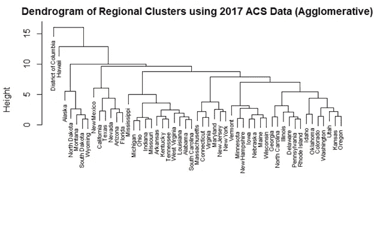
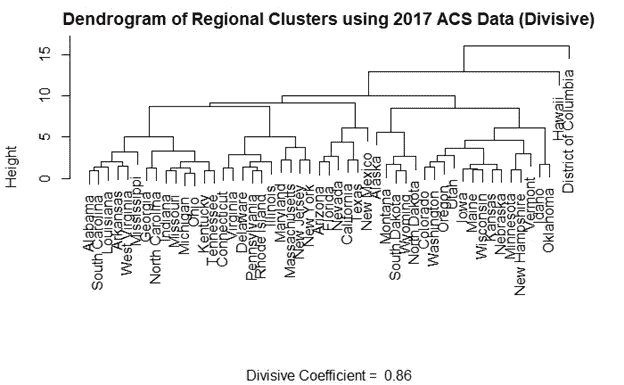

# 分层聚类简介

> 原文：<https://towardsdatascience.com/introduction-hierarchical-clustering-d3066c6b560e?source=collection_archive---------7----------------------->

## 揭示 R 州级人口统计数据的结构

聚类试图通过创建具有相似特征的数据分组来发现数据中的结构。最著名的聚类算法可能是 K-means，但是有许多方法可以对观察值进行聚类。分层聚类是一类可生成 1 到 n 个聚类的聚类算法，其中 n 是数据集中的观察值数量。当您从 1 个分类(包含所有数据)到 n 个分类(每个观察值都是自己的分类)时，分类会变得越来越相似(几乎总是如此)。有两种类型的层次聚类:分裂型(自上而下)和聚集型(自下而上)。

## 分裂的

分裂式层次聚类从包含整个数据集的 1 个聚类开始工作。具有最高平均不相似性的观察值(离聚类最远的某个度量)被重新分配给它自己的聚类。旧聚类中更靠近新聚类的任何观测值都被分配给新聚类。对最大的聚类重复这个过程，直到每个观察值都是它自己的聚类。

## 结块的

凝聚聚类从每个观察值作为自己的聚类开始。两个最接近的集群被结合成一个集群。下一个最接近的聚类被分组在一起，并且该过程继续，直到只有一个聚类包含整个数据集。

# 亲近是什么意思？

在上一节中，我忽略了定义“接近”是什么意思。有各种可能的度量标准，但我将列出 4 个最受欢迎的:单连接、完全连接、平均连接和质心连接。

## 单连杆机构

单链(最近邻)是两个聚类中一对观测值之间的最短距离。它有时可以生成这样的聚类，其中不同聚类中的观测值比它们自己的聚类中的观测值更接近。这些集群可能看起来很分散。

## 完全连锁

完全关联(最远邻居)是两个聚类中最远的一对观察值之间的距离。这种方法通常会产生比单一链接更紧密的集群，但是这些紧密的集群最终可能会非常紧密。与平均链接一起，它是更受欢迎的距离度量之一。

## 平均连锁

平均关联是指将每个聚类中每对观察值之间的距离相加，然后除以对的数量，以获得平均聚类间距离。平均连接和完全连接是层次聚类中两种最流行的距离度量。

## 质心连杆

质心连接是两个簇的质心之间的距离。当质心随着新的观测值移动时，较小的星团可能更类似于新的较大的星团，而不是它们各自的星团，这导致了树状图中的反转。这个问题在其他链接方法中不会出现，因为被合并的聚类总是更类似于它们自己，而不是新的更大的聚类。

## 在 R 州级人口统计数据上使用层次聚类

在我们对美国各州进行分类时，地区的概念非常重要。区域是由地理定义的州的集群，但是地理导致了州之间额外的经济、人口和文化相似性。例如，佛罗里达州南部非常靠近古巴，这使得它成为古巴难民通过海路前往美国的主要目的地。因此，南佛罗里达是古巴裔美国人最集中的地方。

为了研究今天(实际上是在 2017 年)各州之间的相似程度，我下载了包含 2017 年美国社区调查信息的数据，并使用分层聚类对它们进行分组。数据集有许多变量，所以我使用了“[特征向量分解，这是一个来自量子力学的概念，以梳理“人口统计数据”中重叠的“笔记”](https://www.wired.com/story/the-style-maven-astrophysicists-of-silicon-valley/)(我知道我迟到了，但我必须告诉大家，我也上过线性代数课)。生成的树状图(带有 R 代码)如下。

## 完全链接的凝聚层次聚类

> HC . complete = hclust(dist(PC . state . full $ x[，1:5])，method='complete ')
> 
> plot(hc.complete，labels = X_state$State，main= '使用 2017 年 ACS 数据的区域聚类的树状图(聚合)'，xlab= ' '，sub= ' '，cex=0.7)

Dendrogram created using Agglomerative Hierarchical Clustering with Complete Linkage on 2017 ACS data’s first 5 principal components

## 分裂层次聚类

> 库(集群)
> 
> div.hc = diana(pc.state.full$x[，1:5]，diss = inherits(pc.state.full$x[，1:5]，" dist ")，metric = "euclidean ")
> 
> plot(div.hc，labels = X_state$State，，main= '使用 2017 年 ACS 数据的区域聚类的树状图(divide)'，xlab= ' ')

Dendrogram created using Divisive Hierarchical Clustering on 2017 ACS data’s first 5 principal components

聚集和分裂方法产生的集群之间存在一些差异。聚集法将乔治亚州和北卡罗来纳州与伊利诺伊州、特拉华州、宾夕法尼亚州和罗德岛州归为一组，而分裂法将它们与南俄亥俄州、密歇根州、密苏里州和印第安纳州归为一组。大体上，它们是相同的，这是我们所期望的。

从这些树状图中有一些发现:

弗吉尼亚离大西洋中部比离南部更近

-阿拉斯加最靠近上平原州(农村、白人、土著人口相对较多)

-俄亥俄州、密歇根州、密苏里州和印第安纳州比其他中西部州更靠近南方

-夏威夷州和 DC 与其他州非常不同

我希望您学到了一些新东西，并看到了在 R 中实现这些技术是多么容易。 *hclust()* 在 base R 中可用，而 *diana()* 在*集群*库中。

我的数据和代码可以在这里[找到](https://github.com/jkclem/Clustering-States-using-2017-ACS)。