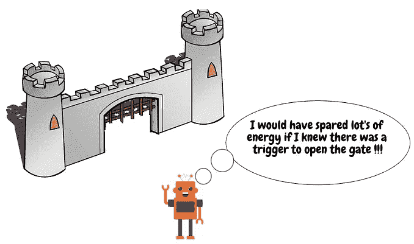
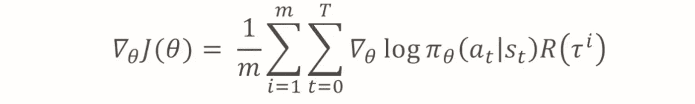
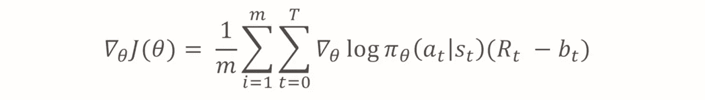
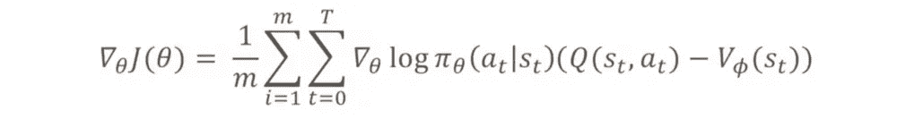
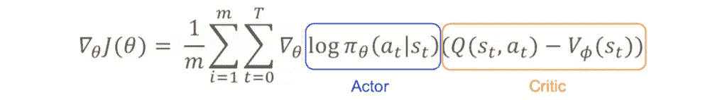

# 强化学习中的演员评论介绍

> 原文：<https://towardsdatascience.com/introduction-to-actor-critic-7642bdb2b3d2?source=collection_archive---------10----------------------->

## 直观的方法理解强化学习中最重要的方法之一。

Photo by [Fatih Kılıç](https://unsplash.com/@fatihkilic?utm_source=medium&utm_medium=referral) on [Unsplash](https://unsplash.com?utm_source=medium&utm_medium=referral)

**更新**:学习和练习强化学习的最好方式是去 http://rl-lab.com

# 概观

在深入探讨演员评论家的细节之前，让我们提醒自己一下[政策梯度](/policy-based-reinforcement-learning-the-easy-way-8de9a3356083)。

基于策略的强化学习意味着什么？简单地说，想象一个机器人发现自己处于某种状况，但这种状况似乎与它以前经历过的事情相似。
因此，基于策略的方法说:既然我过去在这种特定情况下采取了行动 ***(a)*** ，那么让我们这次也尝试同样的行动。

PS。不要把相似的情况和相同的状态混为一谈，在相似的情况下，机器人或智能体处于一些新的状态，类似于它以前经历过的，而不一定是完全相同的状态。

Left: The robot faces a barrier, but he has seen something like that before and it knows what to do in this situation. Middle: The robot took the same action it took in such situation. Right: The robot is wondering hindsight if there were more efficient way to overcome the barrier.

在上面的图像中，一个机器人面对着一个壁垒，但它似乎以前见过这种情况，所以像以前一样，它用火箭跳过它。

然而，这一次可能不是完美的行动！
可能发生的情况是，有一个简单的触发器来打开门，从而节省宝贵的能量，这些能量可能在以后被使用。

基于这个概念，机器人必须做一些回顾性的回顾，以检查那个动作(使用他的火箭)有多有用。

现在我们需要把它转化成一个数学方程。

# 目标

请记住，我们的目标是始终获得最高的回报。
为了能够做到这一点，我们必须定义一个收集这些奖励的函数，并对其进行优化，以最大化这些奖励。
另一个同样重要的点是，我们将使用神经网络来完成这项工作。
所以我们要做的是找到神经网络的一组权重𝜽，帮助我们**最大化**目标函数。

**重要！**注意以下陷阱:如果你熟悉深度学习和神经网络，你更习惯于寻找使误差最小的权重。在这种情况下，我们不这样做，相反，我们希望最大化一个目标函数。意识不到这一点会让你陷入困惑。

从基于政策的梯度中，我们找到了一个目标函数，并按如下方式计算其梯度(有关该等式如何形成的详细信息，请查看[政策梯度逐步](/policy-gradient-step-by-step-ac34b629fd55)):

J(𝜽)是依赖于𝜽的目标函数
m 是执行的情节(这里称为轨迹)的数量
𝛑是由𝜽参数化的政策，这意味着当𝜽变化时，政策将受到影响。请记住，策略给出了当代理处于特定状态时采取特定操作的概率。
𝞽ⁱ是执行的第 I 集或轨迹。
R(𝞽ⁱ)是轨迹𝞽ⁱ.的回报(总报酬)
T 是轨迹𝞽ⁱ.的步数

这个方程告诉我们的是，J(𝜽的梯度是所有 m 个轨迹的平均值，其中每个轨迹是组成它的步骤的总和。在每一步，我们计算保单𝛑对数的导数，并将其乘以回报 R(𝞽ⁱ).

换句话说，我们正试图找出𝜽.之后政策的变化返回 R(𝞽ⁱ的使用)是为了放大(或减小)这些变化。这意味着如果 R(𝞽ⁱ)很高，它将提高结果，并使神经网络确信𝜽在正确的方向上前进。

然而，返回 R(𝞽ⁱ).有一个问题

# 退货问题

假设我们在一个轨迹中，早期的回报是负的，而接近轨迹末端的回报是正的，这样总 R = 0！
在这种情况下，∇J(𝜽)将为 0，并且神经网络将不会从这种情况中学习𝜽的任何新值。
为了解决这个问题，我们在每一步都使用了折扣奖励，从当前状态开始，直到轨迹结束。

这将给我们一个新版本的∇J(𝜽):

现在神经网络将能够从轨迹中学习。还有更大的改进空间，但我们需要做更多的数学计算。

# 数学来了

如果我们深入思考呢？
Rt(从步骤 t 开始返回)还不错，但是我们不确定 Rt 的值是多少，好到可以考虑？！

以文章开头的机器人为例，使用火箭跳跃是一个好的解决方案吗？我们怎么知道？有多好？
同样，如果你拿 100 米短跑运动员 10 秒的成绩举例，他做得好还是不好？如果它是好的，那么它有多好？
赋予这个数字意义的一种方法是将其与一个参考值进行比较，或者我们称之为**基线**。

基线可以有几种形式，其中一种是预期绩效，或者说是平均绩效。如果短跑运动员得了 10 分，但平均分是 12 分，那么他做得很好，相反，如果平均分是 8 分，那么他做得很差。

让我们将基线表示为 **b** 𝑡，目标函数的梯度变为:

现在让我们想一想，R𝑡是在步骤 t 采取行动 *的回报，另一方面 **b** 𝑡代表所有行动结果的平均值。
这看起来很奇怪地类似于 Q(s，a)是在状态*采取的行动*的值，以及 V(s)是状态的值，或者是在状态*采取的所有行动(引起的)的平均值。****

***该等式可以改写为***

******

***如果我们仔细观察上面的等式，我们会看到𝛑(a|s)是执行动作的(记住𝛑是动作的概率*是在状态*时获得的)，而 Q(s，a)-V(s)告诉我们它有多有价值。*****

***换句话说，𝛑(a|s 是演员，Q(s，a)-V(s)是评论家。***

******

***批评家的计算可以有不同的味道:***

*   ***演员兼评论家***
*   ***优势演员兼评论家***
*   ***TD 演员兼评论家***
*   ***演员兼评论家***
*   ***天生的演员兼评论家***

# ***相关文章***

*   ***[政策梯度循序渐进](/policy-gradient-step-by-step-ac34b629fd55)***
*   ***[强化学习中的函数逼近](/function-approximation-in-reinforcement-learning-85a4864d566)***
*   ***[基于策略的强化学习](/policy-based-reinforcement-learning-the-easy-way-8de9a3356083)***