# 人工神经网络导论——解释、公式和推导

> 原文：<https://towardsdatascience.com/introduction-to-artificial-neural-networks-5036081137bb?source=collection_archive---------19----------------------->

Photo by [Billy Huynh](https://unsplash.com/@billy_huy?utm_source=unsplash&utm_medium=referral&utm_content=creditCopyText) on [Unsplash](https://unsplash.com/s/photos/abstract?utm_source=unsplash&utm_medium=referral&utm_content=creditCopyText)

神经网络处于机器学习的前沿。他们正在接受训练，以完成各种可以想象的任务。通过这篇文章，我们试图看看神经网络的公式，推导。我们也着眼于神经网络学习的实际方面。

# 来自生物学的动机

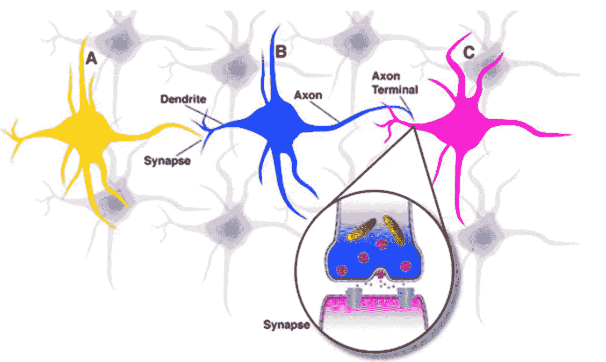

大脑是我们身体中支持学习的重要组成部分。它有大约 100 亿个相互连接的神经元。一个神经元从它的突触接收来自其他神经元的输入。输入发生总和，当总和超过特定阈值时，神经元通过轴突向另一个神经元发送电尖峰。

# 感知器

P erceptron 是机器学习中用于二元分类器监督学习的算法，即确定输入向量所属类别的函数。

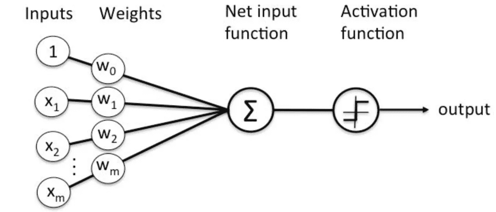

可以写成:

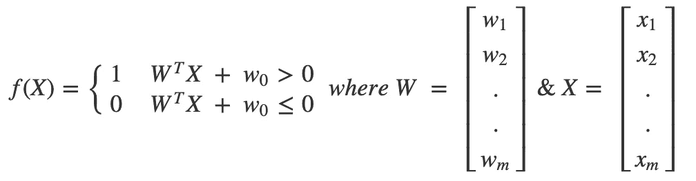

# 走向神经网络

基本的人工神经网络是感知器的自然扩展。我们可以说，一个基本的神经网络是一个多层感知器，称为前馈神经网络。它将包含:

*   隐藏层
*   偏差单位
*   神经元(输入、输出和感知器)
*   突触权重
*   激活功能

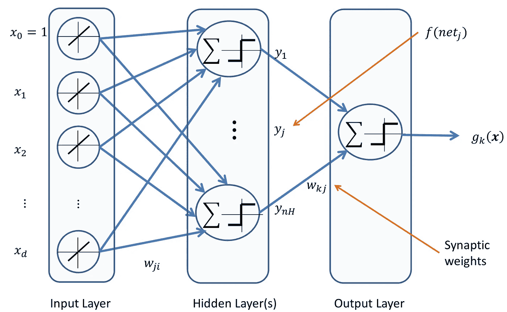

## 前馈神经网络

任何神经网络的目标都是估计一个函数 f，该函数对给定的一组输入给出一组输出的估计。
上面提到的神经网络被称为前馈，因为没有输出反馈给输入(不同于递归神经网络)。

> **输入时间权重，添加偏差并激活**

我们可以说:

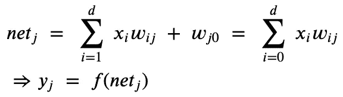

where f is the activation function

我们可以进一步说:

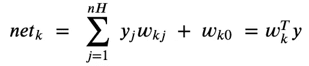

where nH represents the number of perceptrons in the hidden layer & w0 are the bias units.

因此，输出神经元 z 可以导出为:

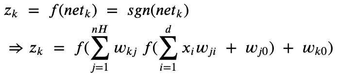

# 但是人工神经网络是怎么学习的呢？

对于每个神经网络，我们都有一个与其预测相关的成本函数。我们称这个成本函数为损失函数。该损失函数将根据输入和隐藏权重进行优化。现在，我们可以计算关于每个权重的成本函数偏导数，并更新最优成本函数的权重。

> 注意:在这种方法中，我们将单个输入样本多次(等于权重的数量)传递给神经网络，用于计算和优化单个输入**的所有权重。这在计算上非常昂贵。**

## 反向传播是来拯救我们的

Geoff Hinton 于 1986 年在其 [*论文*](http://www.cs.toronto.edu/~hinton/absps/naturebp.pdf) *中提出了反向传播。*当时它被高度低估，但后来逐渐成为前馈神经网络的主干。

> 本质上，反向传播只是链式法则的一个巧妙应用。

反向传播使我们能够在一次反向传递中计算每个重量的偏导数。我们可以说:

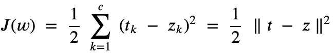

where J(w) represents the loss function, c = total number of output & t is the given output and z is the predicted output.

我们可以说:

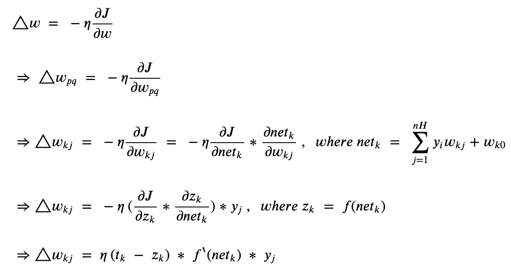

where eta is the learning rate.

类似地，对于其他重量，

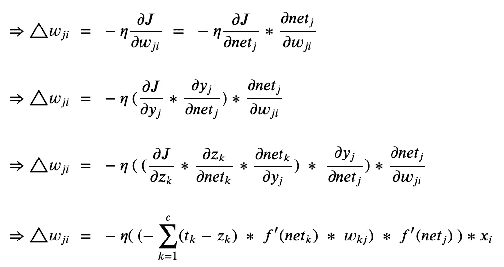

在我们获得由于后向传递中的误差函数(误差函数中每个权重的贡献)引起的权重变化之后，我们可以如下更新它们:

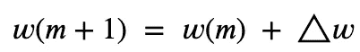

我们可以通过 [*随机梯度下降*](https://en.wikipedia.org/wiki/Stochastic_gradient_descent) 或其变体反向传播来计算权重。

# 反向传播的实际问题

## 激活功能

激活函数的主要目的是将输入信号转换为神经网络中某一节点的输出信号。没有激活函数的神经网络只是一个线性回归模型。因此，为了学习复杂的非线性曲线，我们需要激活函数。

激活函数应遵循的属性:

*   **非线性**为了生成非线性输入映射，我们需要一个非线性激活函数。
*   **饱和**一个饱和的激活函数挤压输入，把输出放在一个有限的范围内；因此，没有一个重量会对最终输出产生显著影响。
*   **连续和平滑**对于基于梯度的优化，更平滑的函数通常显示出更好的结果。因为输入取连续范围，所以输出也应该取节点的连续范围。
*   **可微**正如我们在推导 *f* 的反向传播导数时所看到的，应该定义。
*   **单调**如果激活函数不是单调递增的，则神经元的权重可能会使其影响较小，反之亦然；这与我们想要的正好相反。
*   **对于小值是线性的**如果对于小值是非线性的，我们需要在神经网络的权重初始化时考虑约束，因为我们可能会面临消失梯度或爆炸梯度的问题。

## 消失和爆炸渐变

V

正如我们之前讨论的，饱和激活函数将输入压缩到一个小值，因此输入的显著变化将导致输出的小变化，因此导数更小。

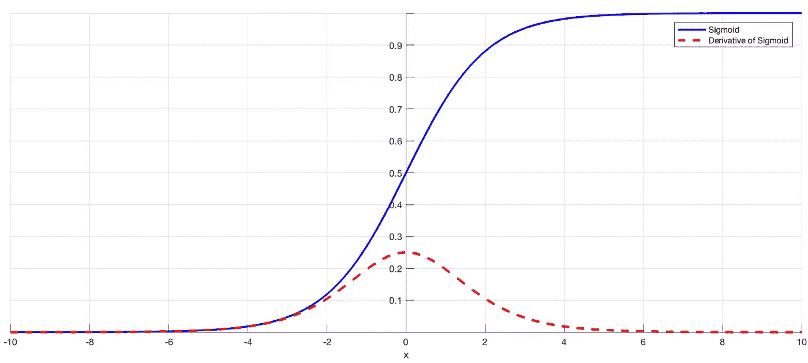

[**ReLU**](https://machinelearningmastery.com/rectified-linear-activation-function-for-deep-learning-neural-networks/) 是一个没有消失梯度问题的激活函数。大多数深度学习模型都以此为激活函数。

但是如果你仍然坚持使用 tanh 或 sigmoid，你可以选择批量标准化。它只是把输入保持在导数不小的绿色区域。

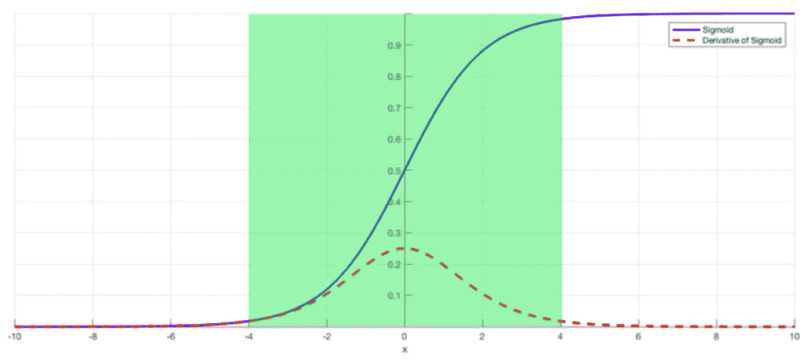

E 在极端情况下，权重值可能会溢出，从而导致 NaN 权重。因此，这些 NaN 权重不能被进一步更新，导致学习过程停止。

有许多方法来处理爆炸式渐变，如[渐变剪辑(](https://machinelearningmastery.com/how-to-avoid-exploding-gradients-in-neural-networks-with-gradient-clipping/)如果范数超过特定阈值则剪辑渐变)和[权重正则化](https://machinelearningmastery.com/weight-regularization-to-reduce-overfitting-of-deep-learning-models/)(对大权重值的损失函数进行惩罚)。

## 损失函数

成本函数或损失函数本质上计算神经网络输出和目标变量之间的 ***差*** 。它们可以分为三种分类:

**回归损失函数:**当目标变量为连续回归损失函数时使用。最常用的是均方差。其他名称包括绝对误差和平滑绝对误差。

**分类损失函数:**当输出变量是一个类的概率时，我们使用分类损失函数。大多数分类损失函数倾向于最大限度地增加利润。著名的名字包括分类交叉熵，负对数似然，边缘分类器。

**嵌入损失函数:**当我们必须测量两个或多个输入之间的相似性时，我们使用嵌入损失函数。一些广泛使用的嵌入损失函数是 L1 铰链误差和余弦误差。

## 优化算法

优化算法负责更新神经网络的权重和偏差，以减少损失。它们可以主要分为两类:

**恒定学习率算法:**其中学习率 **η** 对于所有参数和权重都是固定的。最常见的例子是随机梯度下降。

**自适应学习率算法:**Adam 等自适应优化器具有每参数学习率方法，该方法提供了更直接的启发式方法，而不是手动处理超参数。

以上让你开始学习神经网络。保持文章简短，我将在后续文章中讨论 CNN 和 RNN。请关注此空间了解更多信息。

**上一篇:** [**人工智能中的统计方法介绍**](/introduction-to-statistical-methods-in-ai-23f89df72cdb)

# 参考

*   [https://machine learning mastery . com/expanding-gradients-in-neural-networks/](https://machinelearningmastery.com/exploding-gradients-in-neural-networks/)
*   [https://medium . com/data-science-group-iitr/loss-functions-and-optimization-algorithms-demystified-bb 92 daff 331 c](https://medium.com/data-science-group-iitr/loss-functions-and-optimization-algorithms-demystified-bb92daff331c)
*   [https://towards data science . com/the-vanishing-gradient-problem-69 BF 08 b 15484](/the-vanishing-gradient-problem-69bf08b15484)