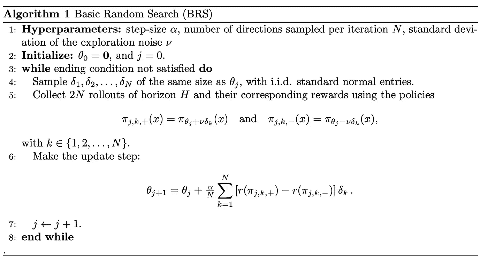
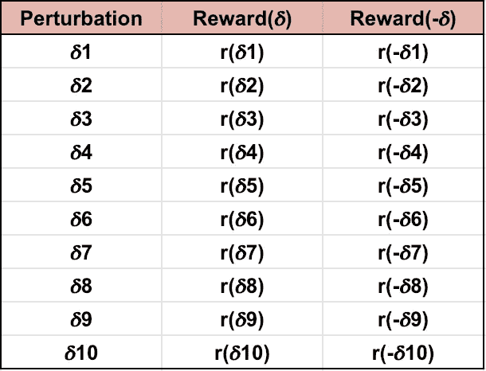
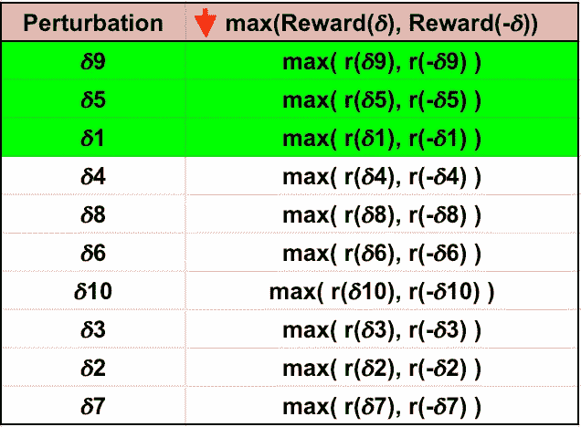
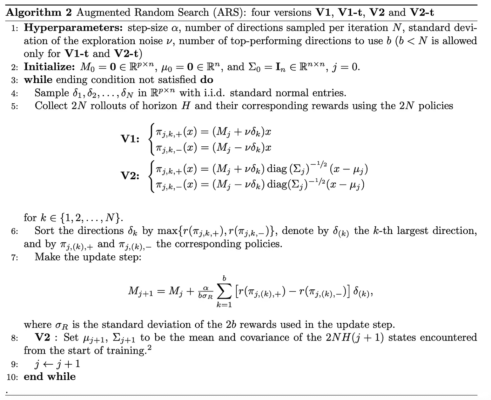

# 增强随机搜索简介。

> 原文：<https://towardsdatascience.com/introduction-to-augmented-random-search-d8d7b55309bd?source=collection_archive---------10----------------------->

## 让 MuJoCo 学习快速有趣的方法


Photo by [jean wimmerlin](https://unsplash.com/@jwimmerli?utm_source=medium&utm_medium=referral) on [Unsplash](https://unsplash.com?utm_source=medium&utm_medium=referral)

**更新**:学习和练习强化学习的最好方式是去 http://rl-lab.com

本文基于加州大学伯克利分校的 Horia Mania、Aurelia Guy 和 Benjamin Recht 于 2018 年 3 月发表的一篇[论文](https://arxiv.org/pdf/1803.07055.pdf)。

作者声称，他们已经建立了一种算法，在 MuJoCo 运动基准上，该算法比最快的竞争对手无模型方法至少高效 15 倍。

他们将这种算法命名为增强随机搜索，简称 ARS。

## 问题是

正如在每个 RL 问题中一样，目标是找到一个策略来最大化代理在给定环境中遵循该策略时可能获得的期望回报。

## 方法

本文提出的解决方案是增强一种称为基本随机搜索的现有算法。

## 基本随机搜索

基本随机搜索的想法是挑选一个参数化的政策𝜋𝜃，通过对所有𝜹应用+𝛎𝜹和-𝛎𝜹(其中𝛎< 1 is a constant noise and 𝜹 is a random number generate from a normal distribution).

Then apply the actions based on 𝜋(𝜃+𝛎𝜹) and 𝜋(𝜃-𝛎𝜹) then collect the rewards r(𝜃+𝛎𝜹) and r(𝜃-𝛎𝜹) resulting from those actions.

Now that we have the rewards of the perturbed 𝜃, compute the average
δ= 1/n *σ[r(𝜃+𝛎𝜹)-r(𝜃-𝛎𝜹)]𝜹来冲击(或扰动)参数𝜃，并且我们使用δ和学习率来更新参数。𝜃ʲ⁺=𝜃ʲ+𝝰.δ



# 增强随机搜索(ARS)

ARS 是 BRS 的改进版本，它包含三个方面的增强功能，使其性能更高。

## 除以标准偏差𝞼ᵣ

随着迭代的进行，r(𝜃+𝛎𝜹和 r(𝜃-𝛎𝜹之间的差异可以显著变化，学习率𝝰固定，更新𝜃ʲ⁺=𝜃ʲ+𝝰.δ可能大幅振荡。例如，如果𝝰 = 0.01，δ= 10，那么𝝰.δ就是 0.1，但是如果δ变成 1000，𝝰.δ就变成 10。这种残酷的变化伤害了更新。请记住，我们的目标是让𝜃向回报最大化的价值观靠拢。
为了避免这种类型的差异，我们将𝝰.δ除以𝞼ᵣ(所收集奖励的标准差)。

## 使状态正常化

国家的正常化确保政策对国家的不同组成部分给予同等的重视。例如，假设一个状态分量取值范围为[90，100]，而另一个状态分量取值范围为[1，1]。然后，第一个状态分量将支配计算，而第二个不会有任何影响。为了获得一个直觉，考虑一个简单的平均值，假设 C1 = 91，C2 = 1，平均值将是(C1 + C2) / 2 = 92 / 2 = 46。现在假设 C2 急剧下降到最小值，C2 = -1。平均值将是(91–1)/2 = 45。
注意，相对于 C2 的大幅下降，它几乎没有移动。
现在让我们使用规范化。对于 C1 = 91，NC1 =(91–90)/(100–90)= 0.1，
对于 C2 = 1，NC2 = (1 - (-1))/(1-(-1)) = 2/2 =1。
归一化平均值将为(0.1 + 1)/2 = 0.55。
现在如果 C2 下降到-1，NC2 = (-1-(-1))/2 = 0，归一化的平均值变成(0.1 + 0)/2 = 0.05。
如你所见，平均值受到了 C2 急剧变化的极大影响。

ARS 中使用的标准化技术包括从状态输入中减去状态的当前观察平均值，然后除以状态的标准偏差:
(state _ input-state _ observed _ average)/state _ STD

## 使用最佳表现方向

记住我们的目标是最大化收集到的奖励是很有用的。然而，我们在每次迭代中计算平均奖励，这意味着在每次迭代中，我们在𝜋(𝜃+𝛎𝜹和𝜋(𝜃-𝛎𝜹之后计算 2N 集，然后我们对所有 2N 集收集的奖励 r(𝜃+𝛎𝜹和 r(𝜃-𝛎𝜹进行平均。这就带来了一些隐患，因为如果一些奖励相对于其他奖励来说很小，它们就会压低平均值。
解决这个问题的一个方法是根据 max(r(𝜃+𝛎𝜹、r(𝜃-𝛎𝜹)).键将奖励按降序排列然后只使用排名前**的 *b* 和**的奖励(以及它们各自的摄𝜹)来计算平均奖励。
注意，当 ***b* = N** 时，算法将与没有此增强的算法相同。
例如，假设我们有以下扰动及其各自的回报，如下表所列。



我们按照键 max([r(𝜹i)、r(-𝜹i)])的降序对表进行排序，结果如下表所示:



我们假设 ***b*** = 3，那么我们在平均计算中考虑这些数字:
【𝜹9，r(𝜹9】，r(-𝜹9)]，【𝜹5，r(𝜹5】，r(-𝜹5)]，【𝜹1，r(𝜹1】，r(-1)]

## ARS 算法

最后，ARS 算法变成:



简单来说，它会变成如下形式:

```
Let 𝛎 a positive constant < 1
Let 𝝰 be the learning rate
Let N the number of perturbations
Let 𝜃 a (p x n) matrix representing the parameters of the policy 𝜋
Let 𝜹i a (p x n) matrix representing the ith perturbation1\. While end condition not satisfied do:
2\. Generate N perturbations 𝜹 from a normal distribution
3\. Normalize 𝜋i+ = (𝜃+𝛎𝜹i)ᵀx and 𝜋i- = (𝜃-𝛎𝜹i)ᵀx for i = 1 to N
4\. Generate 2N episodes and their 2N rewards using 𝜋i+ and 𝜋i- and collect the rewards ri+ and ri-
5\. Sort all 𝜹 by max(ri+, ri-)
6\. Update 𝜃 = 𝜃 + (𝝰/(b*𝞼ᵣ)) Σ(ri+ - ri-)𝜹i (where i = 1 to b)
7\. End While
```

## 实施和演示

下面是标准的 ARS 实现，很容易在互联网上找到。

运行代码将产生不同的学习阶段。

在最初的几次迭代之后

在第 100 次迭代之后

在第 300 次迭代之后