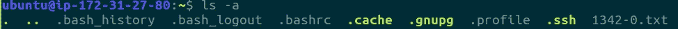
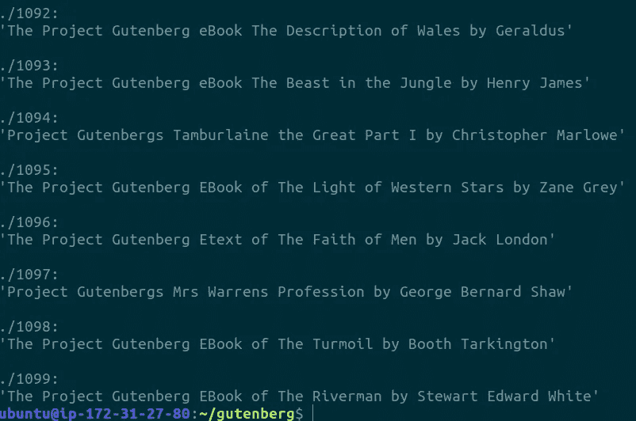

# AWS EC2 和数据科学中的命令行简介

> 原文：<https://towardsdatascience.com/introduction-to-aws-ec2-and-the-command-line-in-data-science-6de2a9aa8d8e?source=collection_archive---------11----------------------->


这个帖子的灵感来自于一个从来没有听说过命令行的朋友。这并不令人惊讶，因为我大约两年前才开始。现在，我每天都用它。

数据科学中最重要的工具之一是命令行(同义短语包括终端、shell、控制台、命令提示符、Bash)。尤其是在使用亚马逊网络服务(AWS)和弹性计算云(EC2)时，熟悉命令行是一个*必须*做的事情。

你可能会问，“为什么我不能用我自己的电脑呢？”答案很简单——随着数据量的增加，仅靠 8 或 16 GB 的 RAM 处理数 TB 的数据变得不可能。使用 AWS 可以在处理大数据时实现可扩展性。你不再使用*的一台*本地计算机，而是可能使用云上的 40 台计算机，这一概念被称为*并行处理。*简而言之(一语双关)，你是在付钱给亚马逊借他们的电脑。

命令行的目的是与计算机(本地或远程)及其文件系统进行交互。它提供了一个*纯文本*界面(是的，不再需要点击)来为你的操作系统运行提供命令。

一些使用案例:

*   读取、写入、编辑、查找、移动、复制、删除、下载文件
*   Git/Github
*   基本数据探索/操作
*   登录到远程计算机，也称为 SSH-ing(安全外壳)
*   观看《星球大战》(打开终端，输入 telnet towel.blinkenlights.nl)

一些*危险*用例:

*   拒绝服务(DoS)攻击
*   黑客攻击和窃取人们的信息


Source: [https://xkcd.com/196/](https://xkcd.com/196/)

本教程旨在给出一个简短的介绍，首先是 AWS EC2 入门(我们将使用自由层规范)，然后是在命令行上使用的重要语法。

# AWS 入门

首先要做的是去[https://aws.amazon.com/](https://aws.amazon.com/)创建一个账户。然后，按照这个简短的 GIF。


Launching an AWS instance

喝杯咖啡，等一两分钟，让 AWS 实例启动。一旦准备好，它应该显示*正在运行*。


EC2 Management Console

注意右下角的公共 DNS (IPv4)。

打开您的终端，键入以下命令:

```
chmod 400 <<name_of_pem_file>>
ssh -i <name_of_pem_file> [ubuntu@<<](mailto:ubuntu@ec2-54-213-153-185.us-west-2.compute.amazonaws.com)Public DNS (IPv4)>>
```

例如，我会键入:

```
chmod 400 chris_medium.pem
ssh -i "chris_medium.pem" ubuntu@ec2-54-213-153-185.us-west-2.compute.amazonaws.com
```


Inside an AWS instance


Source: [https://xkcd.com/908/](https://xkcd.com/908/)

恭喜你！您现在已经准备好在 AWS 上开始云计算了。

# 命令行入门

现在您已经进入了 AWS 实例，您需要知道如何通过终端输入文本命令来提供指令。

让我们从古腾堡计划中抓取一些文本(《傲慢与偏见》，简·奥斯汀)开始:[http://www.gutenberg.org/files/1342/1342-0.txt](http://www.gutenberg.org/files/1342/1342-0.txt)

> ***wget:*** *从网站下载文件*

```
wget [http://www.gutenberg.org/files/1342/1342-0.txt](http://www.gutenberg.org/files/1342/1342-0.txt)
```

> ***ls:*** *列出当前工作目录下的文件*


当输入 ls 时，您的终端应该显示一个名为`1342-0.txt`的文件。



前缀为的文件。*是隐藏的*文件。参数`-a`将显示它们。有些参数是必选的，而有些像`-a`是可选的。

> ***男人:*** *查看命令手册页*

键入`man ls`(或者 help 前面加两个连字符，由于某种原因 Medium 不断将两个连字符转换成长破折号)将为您提供每个参数的信息。多个参数可以通过连续输入来完成，例如，`ls -ltr`将以一个长列表的格式显示你的文件，并按修改时间排序，最早的条目最先出现。

> ***头:*** *打印前 10 行*


> ***尾:*** *打印最后 10 行*


你在屏幕上看到的被称为*标准输出*。让我们将三个命令合并成一个。

> ***猫:*** *打印文件的内容*
> 
> ***|:*** *将一个命令的输出作为输入传递给另一个命令的管道运算符*
> 
> **WC:**字数


首先，文本内容将被打印到标准输出。然后，标准输出将被传递给`wc`命令，该命令将提供文件的行数、字数和字符数。

> ***mv:*** *移动文件(可以用来重命名)*
> 
> ***mkdir:*** *创建目录/文件夹*
> 
> ***cp*** *:复制一个文件*
> 
> ***rm*** *:删除一个文件*
> 
> ***光盘:*** *更改目录*

让我们将文本文件重命名为`pride_and_prejudice`，创建一个名为`books`的目录，将`pride_and_prejudice`文件复制到`books`。

```
mv 1342-0.txt pride_and_prejudice
mkdir books
cp pride_and_prejudice books/
```

> ***grep:*** *基于模式的过滤器*
> 
> ***> :*** *将标准输出写入一个文件(如果已有同名文件则覆盖)*
> 
> ***>>:****将标准输出追加到文件末尾*
> 
> ***触摸:*** *创建空文件*
> 
> ***回显:*** *打印消息到标准输出*

1.  让我们将包含单词“happy”的所有行存储到一个名为 happy.txt 的文件中。
2.  接下来，让我们将包含单词“sad”的所有行存储到一个名为 sad.txt 的文件中
3.  然后，创建一个名为 subset 的空文件，并将这两个文件组合在一起。
4.  在子集的末尾添加一条消息，说明“完成！”

```
cat pride_and_prejudice | grep happy > happy.txt
cat pride_and_prejudice | grep -sw sad > sad.txt
touch subset
cat *.txt >> subset
echo "Finished" >> subset
```

在第二行中，使用了可选参数`-sw`，这样 dis **sad** vantage 这样的词也不会被捕获。您可以使用星号`*`对所有以扩展名`.txt`结尾的文件执行操作。

假设您的任务是从古腾堡项目网站下载 100 个文件(书籍 1000–1099 ),并将文件名更改为书名。这似乎是一个非常单调的任务，但是使用命令行，只用几行就可以完成！

我们需要学习如何做循环。


Source: [https://www.cyberciti.biz/faq/bash-for-loop/](https://www.cyberciti.biz/faq/bash-for-loop/)

```
for i in 1 2 3 4 5
do
   echo "Hi Person $i"
done
```

输出将是:

```
Hi Person 1
Hi Person 2
Hi Person 3
Hi Person 4
Hi Person 5
```

一个稍微复杂一点的例子:

```
for i in $( ls )
do
    echo file: $i
done
```

输出将是:

```
file: books
file: happy.txt
file: pride_and_prejudice
file: sad.txt
file: subset
```

`$`使您能够在另一个命令中使用一个命令。

从古腾堡网站上看，这些文件将会是[http://www.gutenberg.org/files/1/1-0.txt](http://www.gutenberg.org/files/1/1-0.txt)或[http://www.gutenberg.org/files/1/1.txt](http://www.gutenberg.org/files/1/1-0.txt)(它们的文件名中是否有`-0`并不一致。

考虑到这两种情况，我们可以使用`||`命令，如果第一个命令失败，它将只触发第二个命令。

> ***tr:*** *翻译一个字符(使用-d 会删除字符)*

代码如下(一步一步的细节可以在下面看到):

```
mkdir gutenberg
cd gutenbergfor i in {1000..1099}
do
    wget -O file "[http://www.gutenberg.org/files/$i/$i.txt](http://www.gutenberg.org/files/2/2.txt)" || 
    wget -O file "[http://www.gutenberg.org/files/$i/$i-0.txt](http://www.gutenberg.org/files/2/2-0.txt)"
    name=$(cat file | head -n 1 | tr -cd "[:alnum:][:space:]")
    name="${name/$'\r'/}"
    mkdir "$i"
    mv file "$i/$name"
done
```

键入`ls`应该会得到这样的结果:


要查看文件夹中的文件，您可以使用`ls -R`:



创建一个名为 gutenberg 的文件夹，并将目录更改为该文件夹

```
mkdir gutenberg
cd gutenberg
```

开始 for 循环，其中 I 将是一个从 1000 到 1099(包括 1000 和 1099)的数字

```
for i in {1000..1099}
do
```

参数`-O`会将文件重命名为名称`file`。它将首先尝试下载`<number>.txt`，如果失败，它将尝试`<number>-0.txt`。

```
wget -O file "[http://www.gutenberg.org/files/$i/$i.txt](http://www.gutenberg.org/files/2/2.txt)" || 
wget -O file "[http://www.gutenberg.org/files/$i/$i-0.txt](http://www.gutenberg.org/files/2/2-0.txt)"
```

这将获取文本文件，检索第一行(标题所在的位置)，只保留字母数字和空格，并将字符串存储为一个名为`name`的变量。`[:alnum:]`和`[:space:]`分别是字母数字和空白的字符集。下一行将删除剩余的奇怪的、bash 特有的字符，例如将`'The Project Gutenberg EBook of the Riverman by Stewart Edward White'$'\r'`转换为`'The Project Gutenberg EBook of the Riverman by Stewart Edward White'`。这使用了*变量替换、*的概念，并使用了以下语法:`${parameter//patern/string}`。在这一部分中，`/string`组件是空的，所以它不用任何东西替换`\r`。

```
name=$(cat file | head -n 1 | tr -cd "[:alnum:][:space:]")
name="${name/$'\r'/}"
```

最后一部分将通过创建一个具有适当编号的文件夹并将文件移动到其中来结束 for 循环。

```
 mkdir "$i"
    mv file "$i/$name"
done
```

# 结论

本教程中还有许多我没有涉及到的工具，它们也被广泛使用。其中包括:

*   Git/Github
*   精力
*   Bash 脚本
*   Bash 配置文件

感谢您的阅读！这是我的第一篇博文——欢迎留下评论，提供任何建设性的反馈。你也可以建议我将来写的主题。我会试着每周发一次帖子。