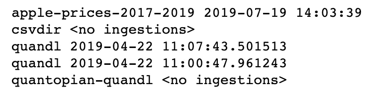

# 回溯测试交易策略简介

> 原文：<https://towardsdatascience.com/introduction-to-backtesting-trading-strategies-7afae611a35e?source=collection_archive---------6----------------------->


Source: [pixabay](https://pixabay.com/pl/photos/zapas%C3%B3w-handel-monitor-biznesu-1863880/)

## 学习如何使用`zipline`建立和回溯测试交易策略

在这篇文章中，我想继续量化金融系列。在[第一篇文章](/introduction-to-quantitative-finance-part-i-stylised-facts-of-asset-returns-5190581e40ea)中，我描述了资产回报的程式化事实。现在，我将介绍回溯测试交易策略的概念，以及如何使用 Python 中现有的框架进行回溯测试。

## 什么是回溯测试？

先说交易策略。它可以被定义为一种在市场上购买和/或出售资产的方法(基于预先定义的规则)。这些规则可以基于例如技术分析或机器学习模型。

回溯测试基本上是根据历史数据评估交易策略的表现——如果我们在过去对一组资产使用了给定的策略，它的表现会有多好/多差。当然，不能保证过去的表现能代表未来的表现，但是我们仍然可以调查！

Python 中有一些可用的回测框架，在本文中，我决定使用`zipline`。

## 为什么是`zipline`？

`zipline`环境提供的一些不错的特性包括:

*   易用性——有一个清晰的结构来说明如何构建回溯测试以及我们可以预期的结果，所以大部分时间可以花在开发最先进的交易策略上:)
*   现实—包括交易成本、滑点、订单延迟等。
*   基于流—单独处理每个事件，从而避免前瞻偏差
*   它附带了许多易于使用的统计方法，如移动平均、线性回归等。—无需从头开始编写代码
*   与 PyData 生态系统集成— `zipline`使用 Pandas 数据帧存储输入数据和性能指标
*   很容易将其他库，如`matplotlib`、`scipy`、`statsmodels`和`sklearn`集成到构建和评估策略的工作流中
*   由 Quantopian 开发和更新，为`zipline`、历史数据甚至实时交易功能提供网络界面

我相信这些论点不言自明。开始编码吧！

## 使用`conda`设置虚拟环境

安装`zipline`最方便的方法是使用虚拟环境。在本文中，我使用`conda`来实现这一点。我用 Python 3.5 创建了一个新环境(我在使用 3.6 或 3.7 时遇到了问题)，然后安装了`zipline`。也可以`pip install`一下。

```
# create new virtual environment
conda create -n env_zipline python=3.5# activate it
conda activate env_zipline# install zipline
conda install -c Quantopian zipline
```

为了一切正常工作，你还应该安装`jupyter`和本文中使用的其他软件包(见下面的`watermark`)。

## 导入库

首先，我们需要使用`%load_ext`魔法加载 IPython 扩展。

```
%load_ext watermark
%load_ext zipline
```

然后我们导入其余的库:

```
import numpy as np
import matplotlib.pyplot as plt
import pandas as pd
import zipline
from yahoofinancials import YahooFinancials
import warningsplt.style.use('seaborn')
plt.rcParams['figure.figsize'] = [16, 9]
plt.rcParams['figure.dpi'] = 200
warnings.simplefilter(action='ignore', category=FutureWarning)
```

下面您可以看到本文中使用的库列表，以及它们的版本。


## 导入自定义数据

`zipline`准备好从 Quandl(维基数据库)下载的数据。您始终可以通过运行以下命令来检查已经接收的数据:

```
!zipline bundles
```


这种方法的问题是，在 2018 年年中，数据被中断，因此没有去年的数据。为了克服这一点，我展示了如何手动接收来自任何来源的数据。为此，我使用了`yahoofinancials`库。为了加载到`zipline`中，数据必须是 CSV 文件和预定义的格式——就像数据帧预览中的格式。

然后，我们需要将数据作为 CSV 文件保存在名为“daily”的文件夹中(或者您选择的另一个文件夹)。

```
df.to_csv('daily/aapl.csv', header=True, index=False)
```

在下一步中，我们需要修改位于 zipline 目录中的`extension.py`文件。安装完`zipline`后，它是空的，我们需要添加以下内容:

我们还可以为数据接收脚本定义并提供一个定制的日历——例如在处理欧洲股票时。有关如何操作的详细信息，请查看[文档](https://www.zipline.io/trading-calendars.html)。

与数据下载函数相反，我们需要传递下载数据的确切日期范围。在本例中，我们从`2017-01-03`开始，因为这是我们获得定价数据的第一天。

最后，我们运行以下命令:

```
!zipline ingest -b apple-prices-2017-2019
```

我们可以验证捆绑包是否被成功摄取:

```
!zipline bundles
```



下载基准数据有一个[已知问题](https://github.com/quantopian/zipline/issues/2480),所以——目前——我们坚持使用默认包中的历史数据。但是，您现在知道了如何使用自定 CSV 文件摄取数据。

有关如何使用`csvdir`包加载自定义数据的详细信息，请参考这篇[文章](/backtesting-trading-strategies-using-custom-data-in-zipline-e6fd65eeaca0)，其中我展示了如何导入欧洲股票数据并在此基础上运行基本策略。

# 买入并持有策略

我们从最基本的策略开始——买入并持有。这个想法是，我们购买某项资产，在整个投资期限内不做任何事情。这个简单的策略也可以被认为是更高级策略的基准——因为使用一个非常复杂的策略比购买和什么都不做产生更少的钱(例如由于交易成本)是没有意义的。

在这个例子中，我们考虑苹果的股票，并选择 2016 年至 2017 年作为回溯测试的持续时间。我们从 1050 美元的资本开始。我选择这个数字，因为我知道我们需要多少或多或少的初始购买，我喜欢让这个数字尽可能小，因为我们只购买 10 股，所以不需要几千的初始余额。我们假设默认的交易成本(每股 0.001 美元，没有最低交易成本)。

使用`zipline`有两种方法——使用命令行或 Jupyter 笔记本。要使用后者，我们必须在笔记本的单元格中编写算法，并指出`zipline`应该运行它。这是通过`%%zipline` IPython magic 命令完成的。这个魔术与上面提到的 CLI 采用相同的参数。

还有一点很重要，算法运行所需的所有导入(如`numpy`、`sklearn`等)。)必须在算法单元中指定，即使它们以前被导入到其他地方。

恭喜，我们已经完成了第一次回溯测试。那么到底发生了什么？

每个`zipline`算法包含(至少)两个我们必须定义的函数:
* `initialize(context)`
* `handle_data(context, data)`

在算法开始之前，调用`initialize()`函数并传递一个`context`变量。`context`是一个全局变量，我们可以在其中存储从算法的一次迭代到下一次迭代需要访问的额外变量。

算法初始化后，每个事件调用一次`handle_data()`函数。在每次调用时，它传递同一个`context`变量和一个名为`data`的事件帧。它包含当前的交易棒线，包括开盘价、最高价、最低价和收盘价(OHLC)以及交易量。

我们通过使用`order(asset, number_of_units)`创建一个订单，在这里我们指定购买什么以及多少股票/单位。正数表示买入那么多股票，0 表示卖出我们所有的股票，负数表示卖空。另一种有用的订单类型是`order_target`，根据需要订购尽可能多的股票，以达到投资组合中所需的数量。

在我们的买入并持有策略中，我们会检查是否已经下单。如果没有，我们订购一定数量的股票，然后在回溯测试的剩余时间里什么也不做。

我们来分析一下策略的表现。首先，我们需要从 pickle 文件加载性能数据帧。

```
# read the performance summary dataframe
buy_and_hold_results = pd.read_pickle('buy_and_hold.pkl')
```

现在我们可以绘制一些存储的指标:


从第一眼看，我们看到该投资组合在投资期限内产生了资金，并在很大程度上跟随苹果的价格(这是有意义的，因为它是投资组合中的唯一资产)。

为了查看事务，我们需要从 performance DataFrame 转换`transactions`列。

```
pd.DataFrame.from_records([x[0] for x in buy_and_hold_results.transactions.values if x != []])
```


通过检查性能数据框架的列，我们可以看到所有可用的指标。

```
buy_and_hold_results.columns
```


其中一些值得注意的是:

*   期初/期末现金——检查给定日期的现金持有量
*   起始/终止值—检查资产；给定日期的值
*   订单—用于检查订单；当交易策略产生信号时，创建订单有不同的事件，当在下一个交易日实际执行时，创建订单有不同的事件
*   pnl —每日损益

# 简单移动平均策略

我们考虑的第二个策略是基于简单移动平均线(SMA)。该战略的“机制”可以总结如下:

*   当价格向上穿过 20 日均线时，买入`x`股票
*   当价格向下穿过 20 日均线时，卖出股票
*   在任何时候，我们最多只能拥有`x`股
*   该策略中没有卖空(尽管它很容易实现)

回溯测试的其余组成部分，如考虑的资产、投资期限或启动资本，与买入并持有示例中的相同。


这个算法的代码稍微复杂一点，但是我们涵盖了代码的所有新方面。为了简单起见，我在上面的代码片段中标记了引用点(`sma_strategy.py`)，并将在下面用数字引用它们。

1.我演示如何手动设置佣金。在这种情况下，为了便于比较，我使用默认值。
2。“热身期”——这是一个用来确保算法有足够的天数来计算移动平均值的技巧。如果我们使用具有不同窗口长度的多个指标，我们应该总是取最长的一个用于预热。
3。我们通过使用`data.history`访问历史(和当前)数据点。在本例中，我们访问过去 20 天。数据(在单个资产的情况下)存储为一个`pandas.Series`，按时间索引。
4。SMA 是一个非常基本的指标，所以对于计算来说，我简单地取之前访问的数据的平均值。
5。我把交易策略的逻辑概括在一个`if`声明中。为了访问当前和先前的数据点，我分别使用了`price_history[-2]`和`price_history[-1]`。为了查看是否有交叉，我将当前和以前的价格与均线进行比较，并确定我正在处理哪种情况(买入/卖出信号)。在没有信号的情况下，算法什么也不做。
6。当回溯测试完成时，您可以使用`analyze(context, perf)`语句来执行额外的分析(如绘图)。`perf`对象只是我们也存储在 pickle 文件中的性能数据帧。但是当在算法中使用时，我们应该称它为`perf`，不需要加载它。

与买入并持有策略相比，你可能已经注意到投资组合价值持平的时期。这是因为当我们出售资产时(以及再次购买之前)，我们只持有现金。

在我们的案例中，简单的均线策略胜过买入并持有策略。对于 SMA 策略，投资组合的期末价值(包括现金)为 1784.12 美元，而对于更简单的策略，期末价值为 1714.68 美元。

# 结论

在本文中，我展示了如何使用`zipline`框架来执行交易策略的回溯测试。一旦你熟悉了这个库，就很容易测试出不同的策略。在以后的文章中，我将介绍如何使用基于技术分析的更先进的交易策略。

一如既往，我们欢迎任何建设性的反馈。你可以在推特上或者评论里联系我。您可以在我的 [GitHub](https://github.com/erykml/medium_articles/blob/master/Quantitative%20Finance/introduction_to_backtesting.ipynb) 上找到本文使用的代码。

喜欢这篇文章吗？成为一个媒介成员，通过无限制的阅读继续学习。如果你使用[这个链接](https://eryk-lewinson.medium.com/membership)成为会员，你将支持我，不需要额外的费用。提前感谢，再见！

以下是本系列的后续文章:

*   导入自定义数据以使用 zipline ( [链接](/backtesting-trading-strategies-using-custom-data-in-zipline-e6fd65eeaca0))
*   评估交易策略的表现([链接](/the-easiest-way-to-evaluate-the-performance-of-trading-strategies-in-python-4959fd798bb3))
*   基于技术分析建立算法交易策略([链接](/algorithmic-trading-based-on-technical-analysis-in-python-80d445dc6943))
*   基于均值-方差分析建立算法交易策略([链接](/algorithmic-trading-based-on-mean-variance-optimization-in-python-62bdf844ac5b))

我最近出版了一本关于使用 Python 解决金融领域实际任务的书。如果你有兴趣，我在[贴了一篇文章](/introducing-my-book-python-for-finance-cookbook-de219ca0d612)介绍这本书的内容。你可以在亚马逊或者 Packt 的网站上买到这本书。