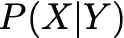

# 贝叶斯信念网络简介

> 原文：<https://towardsdatascience.com/introduction-to-bayesian-belief-networks-c012e3f59f1b?source=collection_archive---------2----------------------->

# 什么是贝叶斯信念网络？

贝叶斯信念网络或贝叶斯网络或信念网络是一种概率图形模型(PGM)，它通过有向无环图(DAG)来表示随机变量之间的条件依赖关系。


An Example Bayesian Belief Network Representation

今天，我将尝试解释信念网络的主要方面，尤其是可能与社会网络分析(SNA)相关的应用。此外，我将向您展示这种网络的一个示例实现。

# 我们用贝叶斯网络做什么？

贝叶斯网络在很多领域都有应用。例如，疾病诊断、优化的网络搜索、垃圾邮件过滤、基因调控网络等。这个列表还可以扩展。这些网络的主要目标是试图理解因果关系的结构。为了澄清这一点，让我们考虑一个疾病诊断问题。有了给定的症状及其导致的疾病，我们构建了我们的信念网络，当新患者到来时，我们可以通过提供每种疾病的概率来推断新患者可能患有哪种或哪些疾病。类似地，这些因果关系可以为其他问题构建，推理技术可以应用于有趣的结果。

# 快速概率复习

在继续之前，为了让我们回忆一下，让我给你条件属性的定义。条件概率是在给定其他随机变量的情况下，一个随机变量的概率。它显示为



如果这两个随机变量是相关的，


如果他们是独立的，那么


# 信念网络的数学定义

通过以下公式在信念网络中计算概率


正如您从公式中所理解的那样，为了能够计算联合分布，我们需要有由网络表示的条件概率。但是进一步说，如果我们有共同分布，那么我们可以开始问有趣的问题。例如，在第一个例子中，如果“季节”是“冬天”，“狗叫”是“真”，我们就要求“下雨”的概率。

# 信任网络的 Python 示例

所以，我认为这对于理论来说足够了，在继续之前，让我们看一些我目前最喜欢的编程语言 Python ❤️的真实例子，你可以在这里找到我写的 Jupyter 笔记本。

```
# create the nodes
season = BbnNode(Variable(0, 'season', ['winter', 'summer']), [0.5, 0.5])
atmos_pres = BbnNode(Variable(1, 'atmos_press', ['high', 'low']), [0.5, 0.5])
allergies = BbnNode(Variable(2, 'allergies', ['allergic', 'non_alergic']), [0.7, 0.3, 0.2, 0.8])
rain = BbnNode(Variable(3, 'rain', ['rainy', 'sunny']), [0.9, 0.1, 0.7, 0.3, 0.3, 0.7, 0.1, 0.9])
grass = BbnNode(Variable(4, 'grass', ['grass', 'no_grass']), [0.8, 0.2, 0.3, 0.7])
umbrellas = BbnNode(Variable(5, 'umbrellas', ['on', 'off']), [0.99, 0.01, 0.80, 0.20, 0.20, 0.80, 0.01, 0.99])
dog_bark = BbnNode(Variable(6, 'dog_bark', ['bark', 'not_bark']), [0.8, 0.2, 0.1, 0.9])
cat_mood = BbnNode(Variable(7, 'cat_mood', ['good', 'bad']), [0.05, 0.95, 0.95, 0.05])
cat_hide = BbnNode(Variable(8, 'cat_hide', ['hide', 'show']), [0.20, 0.80, 0.95, 0.05, 0.95, 0.05, 0.70, 0.30])bbn = Bbn() \
    .add_node(season) \
    .add_node(atmos_pres) \
    .add_node(allergies) \
    .add_node(rain) \
    .add_node(grass) \
    .add_node(umbrellas) \
    .add_node(dog_bark) \
    .add_node(cat_mood) \
    .add_node(cat_hide) \
    .add_edge(Edge(season, allergies, EdgeType.DIRECTED)) \
    .add_edge(Edge(season, umbrellas, EdgeType.DIRECTED)) \
    .add_edge(Edge(season, rain, EdgeType.DIRECTED)) \
    .add_edge(Edge(atmos_pres, rain, EdgeType.DIRECTED)) \
    .add_edge(Edge(rain, grass, EdgeType.DIRECTED)) \
    .add_edge(Edge(rain, umbrellas, EdgeType.DIRECTED)) \
    .add_edge(Edge(rain, dog_bark, EdgeType.DIRECTED)) \
    .add_edge(Edge(rain, cat_mood, EdgeType.DIRECTED)) \
    .add_edge(Edge(dog_bark, cat_hide, EdgeType.DIRECTED)) \
    .add_edge(Edge(cat_mood, cat_hide, EdgeType.DIRECTED))
```

我们首先用条件概率描述了我们的节点。您应该注意到，为了简单起见，我跳过了一些可能的状态值。例如，*季节*变量取其他值“春天”和“秋天”。所以，想法是一样的。

不，让我们检查一下我们的网络是否构建正确。

```
with warnings.catch_warnings():
    warnings.simplefilter('ignore')

    graph = convert_for_drawing(bbn)
    pos = nx.nx_agraph.graphviz_layout(graph, prog='neato')plt.figure(figsize=(20, 10))
    plt.subplot(121) 
    labels = dict([(k, node.variable.name) for k, node in bbn.nodes.items()])
    nx.draw(graph, pos=pos, with_labels=True, labels=labels)
    plt.title('BBN DAG')
```

这段代码片段将生成下图


所以，你看这个网络和我一开始画的很像。现在，让我们在这个信念网络上做一些推论。

```
# convert the BBN to a join tree
join_tree = InferenceController.apply(bbn)# insert an observation evidence
ev = EvidenceBuilder() \
    .with_node(join_tree.get_bbn_node_by_name('season')) \
    .with_evidence('winter', 1.0) \
    .build()join_tree.set_observation(ev)# print the marginal probabilities
for node in join_tree.get_bbn_nodes():
    potential = join_tree.get_bbn_potential(node)
    print(node)
    print(potential)
    print('--------------------->')
```

这段代码基本上以 1.0 的概率向网络证明了季节是冬天。根据这一证据，当我们进行推论时，我们得到以下结果。

```
0|season|winter,summer
0=winter|1.00000
0=summer|0.00000
--------------------->
2|allergies|allergic,non_alergic
2=allergic|0.70000
2=non_alergic|0.30000
--------------------->
3|rain|rainy,sunny
3=rainy|0.80000
3=sunny|0.20000
--------------------->
4|grass|grass,no_grass
4=grass|0.70000
4=no_grass|0.30000
--------------------->
1|atmos_press|high,low
1=high|0.50000
1=low|0.50000
--------------------->
5|umbrellas|on,off
5=on|0.95200
5=off|0.04800
--------------------->
6|dog_bark|bark,not_bark
6=bark|0.66000
6=not_bark|0.34000
--------------------->
7|cat_mood|good,bad
7=good|0.23000
7=bad|0.77000
--------------------->
8|cat_hide|hide,show
8=hide|0.87150
8=show|0.12850
--------------------->
```

当我们添加进一步的证据时，就像狗没有叫一样

```
# convert the BBN to a join tree
join_tree = InferenceController.apply(bbn)# insert an observation evidence
ev = EvidenceBuilder() \
    .with_node(join_tree.get_bbn_node_by_name('season')) \
    .with_evidence('winter', 1.0) \
    .build()ev2 = EvidenceBuilder() \
    .with_node(join_tree.get_bbn_node_by_name('dog_bark')) \
    .with_evidence('not_bark', 1.0) \
    .build()join_tree.set_observation(ev)
join_tree.set_observation(ev2)# print the marginal probabilities
for node in join_tree.get_bbn_nodes():
    potential = join_tree.get_bbn_potential(node)
    print(node)
    print(potential)
    print('--------------------->')
```

我们得到以下推论结果

```
0|season|winter,summer
0=winter|1.00000
0=summer|0.00000
--------------------->
2|allergies|allergic,non_alergic
2=allergic|0.70000
2=non_alergic|0.30000
--------------------->
3|rain|rainy,sunny
3=rainy|0.47059
3=sunny|0.52941
--------------------->
4|grass|grass,no_grass
4=grass|0.53529
4=no_grass|0.46471
--------------------->
1|atmos_press|high,low
1=high|0.39706
1=low|0.60294
--------------------->
5|umbrellas|on,off
5=on|0.88941
5=off|0.11059
--------------------->
6|dog_bark|bark,not_bark
6=bark|0.00000
6=not_bark|1.00000
--------------------->
7|cat_mood|good,bad
7=good|0.52647
7=bad|0.47353
--------------------->
8|cat_hide|hide,show
8=hide|0.83162
8=show|0.16838
--------------------->
```

你看出区别了吗？😆当我们加入与狗叫声有关的证据时，很多概率值都变了。这绝对是一个愚蠢的例子，但很好地获得了直觉。

# SNA 中如何使用贝叶斯网络？

贝叶斯网络是理解变量之间因果关系结构的非常强大的工具。一旦你设计了你的模型，即使只有很小的数据集，它也能告诉你各种各样的事情。这一部分的问题是如何在 SNA 中获得贝叶斯网的好处。答案不是唯一的，但让我们从一个深刻的想法开始。在 SNA 中，我们试图理解社会网络的结构。此外，我们试图理解节点的重要性。但是我们不知道我们的重要性度量的结果是什么。这就是贝叶斯网络发生的地方。例如，如果你认为一个节点的重要性是由度中心性和链接中心性引起的，你可能有下面的网络。


这是一个非常幼稚的贝叶斯网络。除了确定节点的重要性，进一步的应用可能是搜索某些特定类型的节点。让我们考虑一个社交网络，其中有一些人是潜在的领导者，我想寻找他们。考虑下图


这个稍微复杂一点的网络将有助于我们确定与成为领导相关的节点的不确定性。

另一个应用程序将推断链接。新的链接可以从现有的链接中推断出来。例如，从社交网络中的群组成员关系，可以推断出可能的成员关系链接。我的意思是，我们可以通过考虑现有的链接来建立用户和组之间的新链接。参见下面的模型图


所以，这些是贝叶斯网络如何应用于 SNA 的一些基本例子。这个主题没有被很好地研究过，但是我认为进一步研究可能是非常有用的。

# 结论

贝叶斯网络的难点在于设计。特别是，当你想到 SNA 时，用贝叶斯网络从社会网络构建映射是艺术而不是科学😃但是一旦你完成了艺术工作，并且很好地设计了你的模型，这些方便的工具可以告诉你很多事情。众所周知，贝叶斯网络在很多领域都有应用。在大多数情况下，它工作得非常好。因此，我坚信我们也可以对社交网络做出非常深刻的推论。

关于 SNA 和贝叶斯网络的进一步研究，请继续关注🚀

# 参考

1.  科尔勒、戴维&普法茨、乔纳森&法瑞、迈克尔&考克斯、扎克&卡托、杰弗里&坎波隆戈、约瑟夫。(2006).贝叶斯信念网络在社会网络分析中的应用。
2.  https://www.edureka.co/blog/bayesian-networks/
3.  图纸绘制在[草图 io](https://sketch.io) 中
4.  样本网络取自[https://www . probabilistic world . com/Bayesian-belief-networks-part-1/](https://www.probabilisticworld.com/bayesian-belief-networks-part-1/)