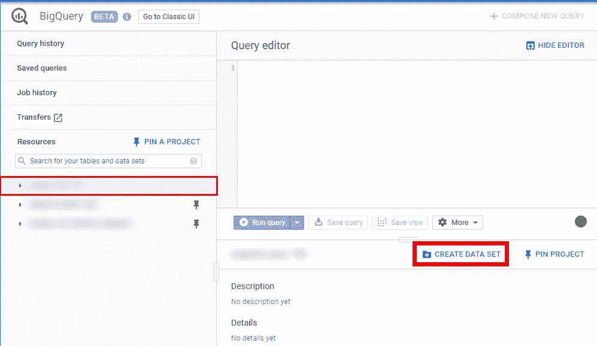
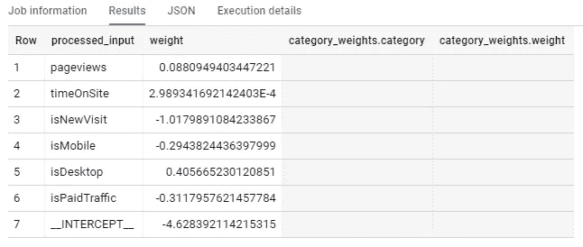
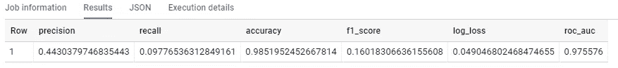
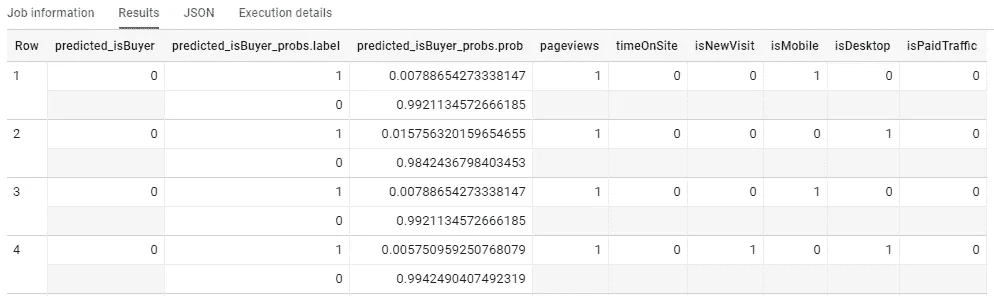

# BigQuery ML 简介

> 原文：<https://towardsdatascience.com/introduction-to-bigquery-ml-e746a3eaa28d?source=collection_archive---------7----------------------->

几个月前，谷歌宣布了一个名为 BigQuery ML 的新功能，目前正在测试中。它由一组 SQL 语言的扩展组成，允许创建机器学习模型，评估其预测性能，并直接在 BigQuery 中对新数据进行预测。


Source: [https://twitter.com/sfeir/status/1039135212633042945](https://twitter.com/sfeir/status/1039135212633042945)

BigQuery ML (BQML)的一个优点是，一个人只需要知道标准 SQL 就可以使用它(不需要使用 R 或 Python 来训练模型)，这使得机器学习更容易使用。它甚至处理数据转换、训练/测试集分割等。此外，它减少了模型的训练时间，因为它直接在存储数据的地方工作(BigQuery ),因此，没有必要将数据导出到其他工具。

但并不是一切都是优势。首先，实现的模型目前是有限的(尽管我们将看到它提供了一些灵活性)，由于适应 SQL 的事实，这种情况可能会一直存在。其次(在我看来，更重要的是)，即使 BQML 使模型训练变得更容易，但一个不熟悉机器学习的人仍然可能难以解释他们创建的模型，评估其性能并试图改进它。

在这篇文章中，我将解释 BQML 的主要功能，以及如何使用它们来创建我们的模型，评估它并使用它进行预测。这一过程将包括以下步骤:

1.  创建数据集(可选)
2.  创建模型
3.  型号信息(可选)
4.  评估模型
5.  预测

# 创建数据集(可选)

与 BigQuery (BQ)表一样，模型必须保存在一个数据集中，因此首先您必须决定要将模型保存在哪个数据集中:现有的数据集还是新的数据集。

如果您的情况是后者，创建一个新的数据集就像下面这样简单:

1.  在 [BQ 界面](https://console.cloud.google.com/bigquery?hl=en)中，选择要创建数据集的项目，点击“创建数据集”按钮。



2.命名新数据集，并选择存储数据的位置和到期时间。你可以在这个[链接](https://cloud.google.com/bigquery/docs/datasets#creating_a_dataset)中找到关于这些领域的更多信息。

# 创建模型

在监督机器学习中，使用响应变量已知的训练数据集来生成模型，该模型捕获数据的潜在模式，以便它可以预测看不见的数据的结果。

BQML 允许您直接在 BigQuery 中完成这个过程。目前，它支持三种类型的模型:

1.  **线性回归**。它用于预测连续数值变量的结果，如收入。
2.  **二元逻辑回归**。它用于预测具有两个可能类别的分类变量的结果，例如当您想要确定用户*是否会购买*或*而不是*时。
3.  **多项逻辑回归**(或多类)。它用于预测具有两个以上类别的分类变量的结果。

要使用 BQML 创建(和训练)模型，必须使用以下语法:

```
#standardSQL
{CREATE MODEL | CREATE MODEL IF NOT EXISTS | CREATE OR REPLACE MODEL} `project.dataset.model_name`
OPTIONS(model_option_list)
AS query_statement
```

此查询将使用指定的选项(options)创建一个模型(CREATE MODEL ),并将查询的结果(AS)用作训练数据。我们必须指定:

1)模型的名称及其保存位置。**创建模型**创建并训练模型(将在指定的数据集中以名称“ **model_name** ”保存)，只要没有已创建的同名模型。如果模型名称存在，带有 CREATE MODEL 的查询将返回错误。为了避免这种错误，我们可以使用两种替代方法:

*   如果不存在，则创建模型，这将仅在没有已创建的同名模型的情况下创建和定型模型。
*   创建或替换模型，即创建模型(如果不存在)或替换模型(如果存在)并训练模型。

2) **型号 _ 选项 _ 列表**。指定与模型和培训过程相关的一些选项的列表。格式如下:*选项 1 =值 1，选项 2 =值 2，…* 两个最重要的选项是:

*   model_type(强制):指定我们要训练的模型的类型: *linear_reg* 用于线性回归，或者 *logistic_reg* 用于二元或多类 logistic 回归。
*   input_label_cols:指定包含响应变量的训练数据的表的列名。如果列名为*标签*，则该字段是可选的；如果不是，必须指定为 *['列名']* 。

尽管 BigQuery ML 具有用于模型训练的默认选项，但是它提供了一些灵活性来选择与避免过度拟合和模型参数优化相关的选项。例如，我们可以应用正则化 L1 或 L2，将数据分为训练集和验证集，或者设置梯度下降的最大迭代次数。您可以在这个[链接](https://cloud.google.com/bigquery/docs/reference/standard-sql/bigqueryml-syntax-create#model_option_list)中找到所有可用的选项。

3) **查询 _ 语句**。生成将用作定型数据的表的查询。BigQuery ML 的一个优点是负责模型训练的数据转换。特别是:

*   分类特征(BOOL、STRING、BYTES、DATE、DATETIME 或 TIME 类型)是一次性编码的(即转换为每个类的二进制变量)。由于被称为*多重共线性*的问题，如果您想要得出关于特征和响应变量之间关系的结论，则不建议这样做。
*   数值特征(NUMERIC、FLOAT64 或 INT64 类型)针对训练数据和未来预测进行了标准化。
*   在数值变量的情况下，空值由平均值替换；在分类特征的情况下，空值由对所有这些缺失数据进行分组的新类替换。

关于响应变量，必须考虑到:

*   线性回归中不能有无穷大或 NaN 值。
*   在二元逻辑回归中，它必须正好有两个可能的值。
*   在多类逻辑回归中，最多可以有 50 个不同的类别。

例如，让我们想象一下，我们希望根据与用户浏览活动相关的几个特征(页面浏览量、会话持续时间、用户类型、他使用的设备以及是否是付费流量)来预测一个 web 会话最终是否会购买。如果你想了解这个例子，我们将使用 BigQuery 提供的[谷歌分析测试数据集。为了创建模型，我们将使用以下查询:](https://support.google.com/analytics/answer/7586738?hl=en)

```
#standardSQL
CREATE MODEL `project.dataset.sample_model`
OPTIONS(model_type='logistic_reg',
       input_label_cols=['isBuyer'])
AS
SELECT
 IF(totals.transactions IS NULL, 0, 1) AS isBuyer,
 IFNULL(totals.pageviews, 0) AS pageviews,
 IFNULL(totals.timeOnSite, 0) AS timeOnSite,
 IFNULL(totals.newVisits, 0) AS isNewVisit,
 IF(device.deviceCategory = 'mobile', 1, 0) AS isMobile,
 IF(device.deviceCategory = 'desktop', 1, 0) AS isDesktop,
 IF(trafficSource.medium in ('affiliate', 'cpc', 'cpm'), 1, 0) AS isPaidTraffic
FROM
 `bigquery-public-data.google_analytics_sample.ga_sessions_*`
WHERE
 _TABLE_SUFFIX BETWEEN '20160801' AND '20170630'
```

由于我们的响应变量具有两个分类(1 =“有购买”或 0 =“没有购买”)，我们必须在选项中指定模型的类型是逻辑回归(logistic_reg)。另外，请注意，响应变量名为“isBuyer”，因此我们也必须在选项中指定它。

# 型号信息(可选)

在线性模型中，每个解释变量都有一个相关的系数(或权重),用于确定该特征和响应变量之间的关系。其幅度越大，对响应变量的影响就越大。此外，正(负)号表示当该解释变量的值增加时(或者，在分类变量的情况下，类别存在)，响应是否增加(减少)。

在 BigQuery ML 中，我们可以使用以下查询来获取已训练模型的权重:

```
#standardSQL
SELECT *
FROM ML.WEIGHTS(MODEL `project.dataset.model_name`)
```

如前所述，如果您没有在查询中“手动”将分类变量转换为二进制变量(例如，正如我们对 isMobile 和 isDesktop 所做的那样)，每个可能的类别都将有一个权重，并且系数的可靠性将由于多重共线性而受到损害。

例如，我们在上一节中创建的模型具有以下系数:



也就是说，作为一个新用户的会话，使用移动设备或通过付费渠道访问网络降低了访问以购买结束的概率。而使用桌面或者在网站上花更多的时间增加转化的概率。

# 评估模型

一旦我们有了训练好的模型，我们需要评估它的预测性能。这总是必须在不同于训练集的测试集上进行，以避免过度拟合，当我们的模型记忆我们的训练数据的模式时，就会发生过度拟合，因此它在我们的训练集中非常精确，但它不能在新数据中做出良好的预测。

BQML 提供了几个函数来评估我们的模型:

*   ML。培训信息。提供有关模型定型期间迭代的信息，包括每次迭代时定型集和验证集中的损失。预期结果是两组中的损失都减少(理想情况下，减少到 0，这意味着模型总是正确的)。
*   ML.EVALUATE .提供最常用的指标来评估模型的预测性能。此函数可用于任何类型的模型(线性回归、二元逻辑回归、多类逻辑回归)，但根据是回归还是分类任务，度量标准会有所不同。
*   ML。困惑 _ 矩阵。返回给定数据集的混淆矩阵，这使我们能够知道分类模型中每个可能类别的正确预测和错误。它只能用于分类模型，即逻辑回归和多类逻辑回归。
*   ML。ROC_CURVE。此函数允许我们构建 ROC 曲线，这是一种用于评估二元分类模型预测能力的可视化图形。在这种情况下，它只能用于二元逻辑回归模型。

在这篇文章中，我们将关注 ML。评估，但我们将给出其他函数的语法和示例，以防有人对使用它们感兴趣。

## ML。评价

要评估先前创建的模型，必须使用以下语法:

```
#standardSQL
SELECT *
FROM ML.EVALUATE(MODEL `project.dataset.model_name`,
          {TABLE table_name | (query_statement)}
          [, STRUCT(XX AS threshold)])
```

我们必须指定:

*   模型。
*   我们要为其计算评估度量的表，评估度量可以是查询的结果。显然，这个测试集必须与定型集具有相同的列，包括响应变量(以便将模型预测与实际值进行比较)。如果未指定表或查询，它将使用验证集(如果在创建模型时指定)或定型集(如果未指定验证集)。
*   在逻辑回归的情况下，阈值。此值是可选的，它指定了我们的模型的预测值(介于 0 和 1 之间的值，可以解释为该观察值属于类 1 的概率)将用于类 0 或类 1。默认情况下，阈值为 0.5。

此查询的结果是一个单行，其中包含评估模型预测的最常用指标，这取决于所使用的模型类型。

特别是，BigQuery ML 为逻辑回归和多类逻辑回归模型提供的指标有:

*   精确
*   召回
*   准确(性)
*   f1 _ 分数
*   日志 _ 损失
*   roc_auc

在线性回归的情况下，它们是:

*   平均绝对误差
*   均方误差
*   均方对数误差
*   中位数绝对误差
*   r2 _ 分数
*   解释的差异

例如，对于我们示例中的逻辑回归，我们必须使用:

```
#standardSQL
SELECT *
FROM ML.EVALUATE(MODEL `project.dataset.sample_model`,
   (
     SELECT
        IF(totals.transactions IS NULL, 0, 1) AS isBuyer,
        IFNULL(totals.pageviews, 0) AS pageviews,
        IFNULL(totals.timeOnSite, 0) AS timeOnSite,
        IFNULL(totals.newVisits, 0) AS isNewVisit,
        IF(device.deviceCategory = 'mobile', 1, 0) AS isMobile,
        IF(device.deviceCategory = 'desktop', 1, 0) AS isDesktop,
        IF(trafficSource.medium in ('affiliate', 'cpc', 'cpm'), 1, 0) AS isPaidTraffic
     FROM
        `bigquery-public-data.google_analytics_sample.ga_sessions_*`
     WHERE
        _TABLE_SUFFIX BETWEEN '20170701' AND '20170801'
   ),
   STRUCT(0.5 AS threshold)
   )
```

请注意，用于生成数据的日期与用于创建模型的日期不同。前一个查询的结果是:



## 评估模型的其他函数

1.ML。培训 _ 信息

语法:

```
#standardSQL
SELECT *
FROM ML.TRAINING_INFO(MODEL `project.dataset.model_name`)
```

示例:

```
#standardSQL
SELECT *
FROM ML.TRAINING_INFO(MODEL `project.dataset.sample_model`)
```

2.ML。困惑 _ 矩阵

语法:

```
#standardSQL
ML.CONFUSION_MATRIX(MODEL `project.dataset.model_name`,
          {TABLE table_name | (query_statement)}
          [, STRUCT(XX AS threshold)])
```

示例:

```
#standardSQL
SELECT *
FROM ML.CONFUSION_MATRIX(MODEL `project.dataset.sample_model`,
   (
     SELECT
        IF(totals.transactions IS NULL, 0, 1) AS isBuyer,
        IFNULL(totals.pageviews, 0) AS pageviews,
        IFNULL(totals.timeOnSite, 0) AS timeOnSite,
        IFNULL(totals.newVisits, 0) AS isNewVisit,
        IF(device.deviceCategory = 'mobile', 1, 0) AS isMobile,
        IF(device.deviceCategory = 'desktop', 1, 0) AS isDesktop,
        IF(trafficSource.medium in ('affiliate', 'cpc', 'cpm'), 1, 0) AS isPaidTraffic
     FROM
        `bigquery-public-data.google_analytics_sample.ga_sessions_*`
     WHERE
        _TABLE_SUFFIX BETWEEN '20170701' AND '20170801'
   ),
   STRUCT(0.5 AS threshold)
   )
```

3.ML。ROC _ 曲线

语法:

```
#standardSQL
ML.ROC_CURVE(MODEL `project.dataset.model_name`,
           {TABLE table_name | (query_statement)},
           [GENERATE_ARRAY(thresholds)])
```

示例:

```
#standardSQL
SELECT *
FROM ML.ROC_CURVE(MODEL `project.dataset.sample_model`,
   (
     SELECT
        IF(totals.transactions IS NULL, 0, 1) AS isBuyer,
        IFNULL(totals.pageviews, 0) AS pageviews,
        IFNULL(totals.timeOnSite, 0) AS timeOnSite,
        IFNULL(totals.newVisits, 0) AS isNewVisit,
        IF(device.deviceCategory = 'mobile', 1, 0) AS isMobile,
        IF(device.deviceCategory = 'desktop', 1, 0) AS isDesktop,
        IF(trafficSource.medium in ('affiliate', 'cpc', 'cpm'), 1, 0) AS isPaidTraffic
     FROM
        `bigquery-public-data.google_analytics_sample.ga_sessions_*`
     WHERE
        _TABLE_SUFFIX BETWEEN '20170701' AND '20170801'
   ),
   GENERATE_ARRAY(0.0, 1.0, 0.01)
   )
```

# 预测

要使用通过 BigQuery ML 创建的模型进行预测，必须使用以下语法:

```
#standardSQL
ML.PREDICT(MODEL model_name,
         {TABLE table_name | (query_statement)}
          [, STRUCT(XX AS threshold)])
```

该查询将使用一个模型(model ),并对一个新的数据集(TABLE)进行预测。显然，该表必须具有与定型数据相同的列，尽管没有必要包含响应变量(因为我们不需要它来预测新数据)。在逻辑回归中，您可以选择指定一个阈值，该阈值定义将哪个估计概率视为最终预测的一个类别或另一个类别。

该查询的结果将包含与我们提供的数据集一样多的行，并且将包括输入表和模型预测。在逻辑回归模型(二元或多类)的情况下，除了预测模型的类之外，还提供了每个可能类的估计概率。

继续我们的例子:

```
#standardSQL
SELECT *
FROM ML.PREDICT(MODEL `project.dataset.sample_model`,
   (
     SELECT
        IFNULL(totals.pageviews, 0) AS pageviews,
        IFNULL(totals.timeOnSite, 0) AS timeOnSite,
        IFNULL(totals.newVisits, 0) AS isNewVisit,
        IF(device.deviceCategory = 'mobile', 1, 0) AS isMobile,
        IF(device.deviceCategory = 'desktop', 1, 0) AS isDesktop,
        IF(trafficSource.medium in ('affiliate', 'cpc', 'cpm'), 1, 0) AS isPaidTraffic
     FROM
        `bigquery-public-data.google_analytics_sample.ga_sessions_*`
     WHERE
        _TABLE_SUFFIX BETWEEN '20170701' AND '20170801'
   )
   )
```

请注意，包含响应(isBuyer)的列不是必需的。前一个查询的结果是:



第一列返回我们的模型为每个新观察预测的类。第二列和第三列给出了每个类别的估计概率(估计概率较大的类别是第一列中的类别)。其余的列是我们请求其预测的数据。