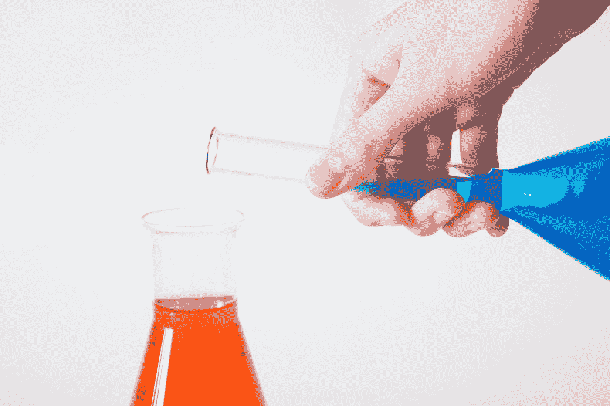
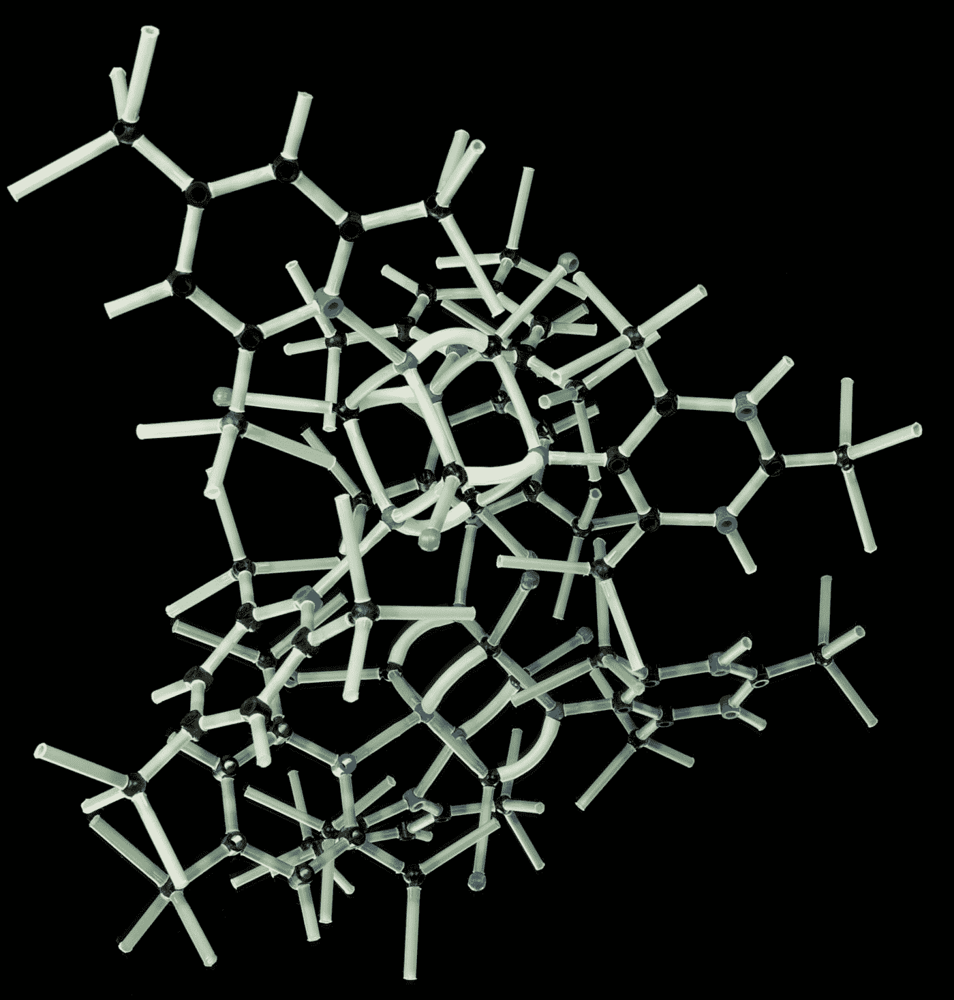
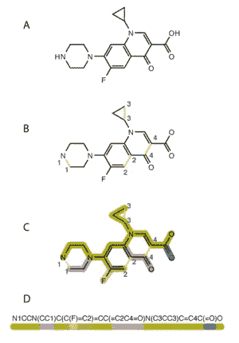
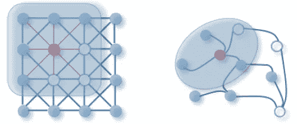

# 化学信息学导论

> 原文：<https://towardsdatascience.com/introduction-to-cheminformatics-7241de2fe5a8?source=collection_archive---------12----------------------->

## 化学信息学的常见挑战、库和数据集

Photo by [Alex Kondratiev](https://unsplash.com/@alexanderkondratiev?utm_source=medium&utm_medium=referral) on [Unsplash](https://unsplash.com?utm_source=medium&utm_medium=referral)

# 什么是化学信息学？

随着计算能力的增加，机器学习在不同的科学领域中得到了许多应用。其中之一是化学，科学家应用机器学习模型来预测各种分子的属性，如其溶解性和毒性[1]或将其用于药物发现。

**化学信息学**是一个应用机器学习等计算方法来解决化学中各种问题的科学领域[2]。它提出了非常具有挑战性的问题，例如将 3D 分子结构转换为 ML 模型的输入，解决数据稀缺的问题，或者试图更好地理解哪个分子的特征对于预测是重要的[3]。

在本文中，我将温和地向您介绍化学信息学目前面临的几个问题，并列出一些可用的库和数据集，以帮助您开始涉足这一激动人心且富有挑战性的领域！

# 如何表示分子结构

分子可以被视为一个三维量子力学对象，它由分子内位置明确的原子组成[4]。你可以在这里提取大量信息:与每个分子的相对距离、原子序数、电子概率云的形状以及许多其他信息。

Photo by [Holger Link](https://unsplash.com/@photoholgic?utm_source=medium&utm_medium=referral) on [Unsplash](https://unsplash.com?utm_source=medium&utm_medium=referral)

然而，在将这些信息转换为机器学习模型的输入时，很难保留所有这些信息。幸运的是，有一些现有的分子表示正在试图解决这个问题。

## 笑容

*微笑*是分子的一种类似文本的表示，它代表*简化的分子输入行条目*。除了它听起来别扭的名字之外，它还是最流行的表示分子的方式之一。事实上，一些深度学习模型直接接受*微笑*作为输入[5]。

你也应该意识到*微笑*表示确实会产生信息损失，这对训练机器学习模型非常重要。在将分子转换成*微笑*【4】时，像原子键的长度和分子的 3D 坐标位置这样的特征会丢失。

SMILES algorithm. [[Source]](https://en.wikipedia.org/wiki/Simplified_molecular-input_line-entry_system)

## 扩展连接指纹(ECFP)

*首先:什么是分子指纹？*分子指纹只是用数字表示分子的另一种方式。指纹产生的位状图案表明分子中某些亚结构的存在或不存在。生成这些模式背后的想法有点复杂，如果你感兴趣，可以看看这里的。

*ECFP* 是分子指纹的一个特例，它为任何分子的原子分配唯一的编号。编号取决于许多因素，如绝对电荷、重原子连接数、非氢键数量或原子电荷。这里需要注意的关键是，这种算法可以通过各种方式进行优化，并且可以由流行的化学信息学库 RDKit 处理。

# 流行的深度学习架构

一旦我们得到了正确形状的输入，我们应该决定哪种机器学习模型将有效地处理分子结构。在这里，我将为您提供一些在化学信息学中运行良好的流行架构。

## 递归神经网络

RNNs 与分子的 SMILES 表示一起工作得很好。由于 SMILES 是基于文本的表示，RNNs 可以用于预测序列中的另一个分子。它允许生成新的 SMILES 序列，这可能有助于发现具有所需特性(例如，某些溶解性或毒性)的分子。[本文](https://arxiv.org/pdf/1705.04612.pdf)展示了用 RNNs 生成新分子的结果。

## 图形卷积网络

将 RNNs 和 CNN 一般化以将图形作为输入是一个相当困难的问题，在处理分子时经常会出现这种情况。图形卷积网络(gcn)通过将分子图及其特征作为输入来解决这个问题。更具体地说，图形连同每个节点(原子)的特征被转换成矩阵形式，然后插入到神经网络模型中。关于 GCNs 的深入文章可以在[这里](https://tkipf.github.io/graph-convolutional-networks/)找到。

Image Convolution and Graph Convolution. [[Source]](/beyond-graph-convolution-networks-8f22c403955a)

*我们为什么要使用 gcn？*根据文献[7]，如果将分子表示为 2D 图，则保留了更多的信息。它还需要相对低的计算成本并达到高精度，这有助于类似 CNN 的架构。

# 公开可用的分子数据集

如果没有足够的数据，如何训练机器学习模型？这曾经是化学中的一个问题，但现在化学家们通常会将数据免费提供给每个人。我将在这里列出一些最受欢迎的分子数据集，以便您可以将其用作参考:)

## 公共化学

世界上最大的免费化学信息收集。它包含近 1 亿种化合物和超过 2.36 亿种物质。数据集似乎维护得很好，包括文档和教程。有大量关于物理和化学性质的信息，以及每种化合物的各种结构表示。绝对值得一探究竟！链接是[这里的](https://pubchem.ncbi.nlm.nih.gov/)。

## 化学蜘蛛

这是一个与 Pubchem 非常相似的数据库，但是化学成分更少。在写这篇文章的时候，它包含了来自 270 个数据源的 7700 万个化学结构。如果你打算做一些大的事情，它可以和 PubChem 一起使用。这里的链接是[这里的](http://www.chemspider.com/)。

## ChEMBL

这是一个人工筛选的数据集，包含具有类似药物特性的生物活性分子。目前，它包含 2M 化合物和 110 万种分析。此外，他们使用数据挖掘来收集更多关于分子的数据(例如，从专利文件中)。这里的链接是。

## 荣誉奖

一些鲜为人知但有用的数据集包括 [Tox21](https://tripod.nih.gov/tox21) (毒理学)[溶解度挑战](http://www-jmg.ch.cam.ac.uk/data/solubility/)，以及其他许多可以在 [Kaggle](https://www.kaggle.com/datasets?search=Chemistry) 上找到的数据集。

# 有用的工具和 Python 库

## 深度化学

这是一个非常受欢迎和维护良好的 Python 库，在 Github 上有超过 1.7k 的 start。它为药物发现、量子化学和其他生命科学中的深度学习提供了开源工具链。他们网站的链接是[这里](https://deepchem.io/)。

## RDKit

它是用 C++和 Python 编写的通用机器学习和化学信息学软件的集合。一些功能包括读写分子、亚结构搜索、化学转化或分子相似性。就我个人而言，我在我的笔记本电脑(Ubuntu)上很难设置它，但在 Conda 安装上它工作得很完美。他们网站的链接是[这里](https://www.rdkit.org/)。

## 荣誉奖

请看一下这个与化学相关的所有可用 Python 库的精选列表。

# 最后几句话要说

*喜欢这篇关于化学信息学的文章吗？*

确保你在 [Medium](https://medium.com/@kacperkubara) 和 [Linkedin](https://www.linkedin.com/in/kacperkubara/) 上关注我，我在那里发布了很多关于这个领域的有趣文章！你也可以在 [Github](https://github.com/KacperKubara) 上找到我。

# 参考

[1] Pirashvili，m .，Steinberg，l .，Belchi Guillamon，f .，Niranjan，m .，Frey，j .和 Brodzki，J. (2019)。*通过拓扑数据分析加深了对水溶性建模的理解*。

[2]网上来源。可用[这里](https://en.wikipedia.org/wiki/Cheminformatics)。

[3]网上来源。约翰·加斯泰格。*化学信息学中已解决和未解决的问题。*可用[此处](http://infochim.u-strasbg.fr/CS3_2014/Slides/CS3_2014_Gasteiger.pdf)。

[4]丹尼尔·c·埃尔顿、佐伊斯·鲍库瓦拉斯、马克·d·富格和彼得·w·琼加(2019)。*用于分子设计的深度学习——当前技术水平综述*

[5]潘德五世，沃尔特斯 P，伊斯曼 P，拉姆松达 B. *生命科学的深度学习*

[6]网上来源。(2019).*计算扩展连接指纹。*此处可用。

[7] Seongok Ryu 等人。(2018).*利用注意力和门增强图卷积网络深度学习分子结构-性质关系*