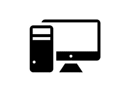
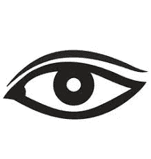
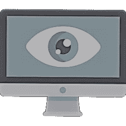
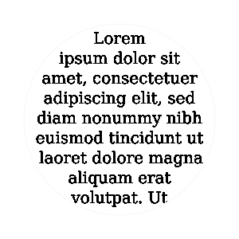

# 计算机视觉导论

> 原文：<https://towardsdatascience.com/introduction-to-computer-vision-b44bb4c495ab?source=collection_archive---------25----------------------->

超越所有媒体噪音和魅力的计算机视觉的基本解释。

***“我不害怕电脑。我担心缺乏他们。”*** *—艾萨克·阿西莫夫*

在过去的十年中，计算机视觉一直是一个流行的重复出现的术语，尽管随着时间的推移，它的流行程度已经从一个闻所未闻的主题变成了热门新闻。作为近年来成为一个趋势性话题的结果，对计算机视觉需要什么的理解有些嘈杂。因此，本文的目的是分解术语计算机视觉并分析其组成部分，从而提供对什么是计算机视觉的基本理解。

为了扩展计算机视觉的主题，我们首先需要分析术语(“计算机”和“视觉”)的组成部分，并对它们进行定义。
计算机可以被定义为能够根据软件或硬件指导的指令集执行各种处理、计算和操作的电子机器。

因此，视觉，更具体地说，通过视觉的视觉感知可以被定义为通过可见光谱对环境中的物体进行照明来理解局部环境。

结合这两个术语的定义，初步的解释是，计算机视觉是机器如何试图理解它们看到的东西以实现目标。

我们可以通过陈述计算机视觉是机器或系统通过调用一个或多个作用于所提供的信息的算法来产生对视觉信息的理解的过程来扩展上述定义。理解然后被转化为决策、分类、模式观察等等。

然后在应用程序、硬件和软件中利用整理理解的翻译，翻译可以采取多种形式，如下所示:

*   对象检测:在数字图像甚至视频中识别感兴趣的对象(猫、狗、汽车)
*   光学字符识别:将书写或打字的文本图像翻译成机器编码格式
*   指纹识别:使用人类指纹的模式信息在指纹源和作为目标的指纹之间进行比较。

当向大众介绍计算机视觉时，我们需要包括已经采取的方法，以便使系统能够推理发展理解，并因此开发计算机视觉的有用应用。

计算机视觉系统可以应用两种主要的策略来从已经提供给它的信息中获得理解。它们分别是:**自下而上**和**自上而下**的方法。

自下而上的方法包括利用对积累的信息的理解来对一些任意的观察进行进一步的理解；最终，所有积累的理解会导致对观察对象整体的解决方案或总体理解。

在计算机视觉应用中使用自底向上方法的一个例子是自动车牌识别。这种类型的应用似乎是交通超速摄像机的合理组成部分。

自动车牌识别(ANPR)通过自下而上的方法将视觉信息(车牌)传递到我们的计算机视觉系统中。该系统通过识别盘子上数字的边缘来进行某种形式的理解。从边缘信息，我们继续向上一个层次，并开始通过连接边缘来识别线(这里我们可以看到理解从一个层次到另一个层次的转移)。之后，线条可以连接起来形成形状，最后，我们通过识别线条相交的区域和边缘来观察字符。

自上而下的方法应用背景知识从观察中获得理解。背景知识作为选择适合模型的参数的参考指南(类似于深度学习技术的方法)。这种方法可以简单地概括为这样的过程，通过该过程，图像被分解为子成分，并且获得对片段信息的理解，以呈现对图像整体的理解。

从这篇文章中，我们了解了计算机视觉的定义及其组成部分。还提到了计算机视觉技术的一些应用领域。除此之外，我们还探索了这些系统中的计算机视觉技术在试图从信息中获得理解时可以采用的方法。

从这里开始，您可以了解一些基本的低级图像处理技术，如边缘检测、降噪、图像锐化等。