# 张量流卷积神经网络简介

> 原文：<https://towardsdatascience.com/introduction-to-convolutional-neural-networks-cnn-with-tensorflow-57e2f4837e18?source=collection_archive---------3----------------------->

## 学习计算机视觉卷积神经网络的基础，并使用 TensorFlow 构建 CNN


Photo by [Stephanie Cook](https://unsplash.com/@stephtcook?utm_source=medium&utm_medium=referral) on [Unsplash](https://unsplash.com?utm_source=medium&utm_medium=referral)

深度学习的最新进展使计算机视觉应用向前迈进了一大步:从用我们的脸解锁手机，到更安全的自动驾驶汽车。

**卷积神经网络** (CNN)是计算机视觉应用背后的架构。在这篇文章中，你将学习细胞神经网络和计算机视觉的基础，如卷积运算，填充，步长卷积和池层。然后，我们将使用 TensorFlow 构建一个用于图像识别的 CNN。

> 对于机器学习、深度学习和人工智能的实践视频教程，请查看我的 [YouTube 频道](https://www.youtube.com/channel/UC-0lpiwlftqwC7znCcF83qg?view_as=subscriber)。

Spiderman recognizing Spiderman…

# 理解卷积

顾名思义，**卷积**运算是卷积神经网络的构建模块。

现在，在计算机视觉领域，图像可以表示为 RGB 值的矩阵。这个概念实际上是在之前的一篇[文章中介绍的。](/step-by-step-guide-to-building-your-own-neural-network-from-scratch-df64b1c5ab6e)

为了完成卷积运算，我们需要一个图像和一个过滤器。

因此，让我们将下面的 6x6 矩阵视为图像的一部分:

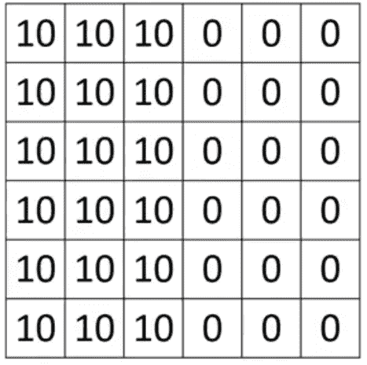

6x6 matrix. [Source](https://www.coursera.org/learn/convolutional-neural-networks/lecture/4Trod/edge-detection-example)

并且过滤器将是下面的矩阵:

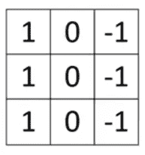

3x3 filter. [Source](https://www.coursera.org/learn/convolutional-neural-networks/lecture/4Trod/edge-detection-example)

然后，卷积包括将过滤器叠加到图像矩阵上，将来自过滤器的值和来自图像矩阵的值的乘积相加，这将生成 4x4 卷积层。

这很难用语言表达，但这里有一个很好的动画来解释这个卷积:

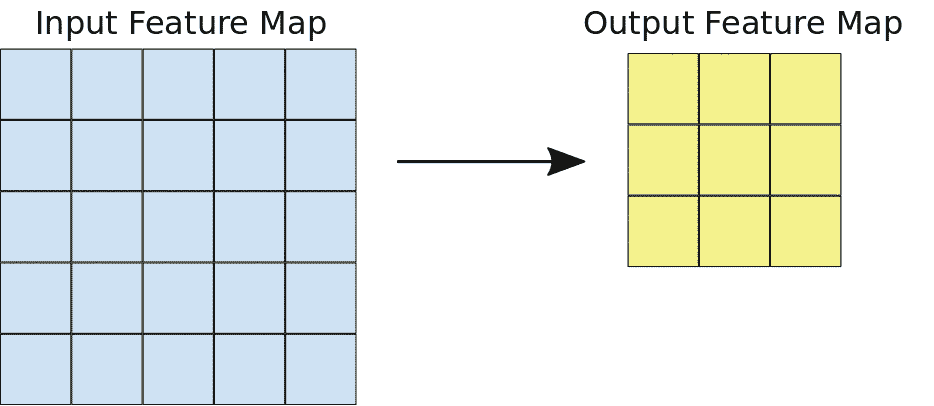

Convolution operation

对上面的图像矩阵执行此操作，并使用上面定义的过滤器，您应该得到下面的结果矩阵:

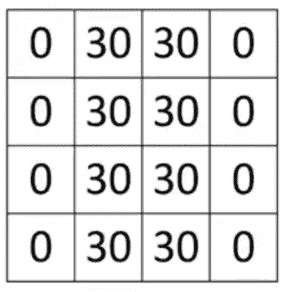

4x4 output layer. [Source](https://www.coursera.org/learn/convolutional-neural-networks/lecture/4Trod/edge-detection-example)

如何解读输出层？

考虑到每个值都表示颜色，或者像素有多暗(正值表示亮，负值表示暗)，您可以将输出图层解释为:

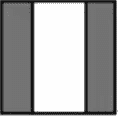

Output layer interpretation. [Source](https://www.coursera.org/learn/convolutional-neural-networks/lecture/4Trod/edge-detection-example)

因此，似乎这个特殊的过滤器负责检测图像中的垂直边缘！

## 如何选择合适的滤镜？

这是一个很自然的问题，因为你可能会意识到有无数种可能的滤镜可以应用于一幅图像。

事实证明，您的过滤器矩阵中的精确值可以是基于模型目标的可训练参数。因此，您可以选择适合特定应用的滤波器，也可以使用[反向传播](/step-by-step-guide-to-building-your-own-neural-network-from-scratch-df64b1c5ab6e)来确定能够产生最佳结果的滤波器的最佳值。

# 计算机视觉中的填充

之前，我们已经看到，3x3 滤波器与 6x6 图像卷积将产生 4x4 矩阵。这是因为在 6×6 的图像中，有 4×4 的可能位置适合滤波器。

因此，在每个卷积步骤之后，图像会缩小，这意味着只能执行有限次数的卷积，直到图像无法再缩小为止。此外，位于图像角落的像素仅被使用一次，这导致神经网络的信息丢失。

为了解决上述两个问题，使用了**填充**。填充包括在输入图像周围添加边框，如下所示:

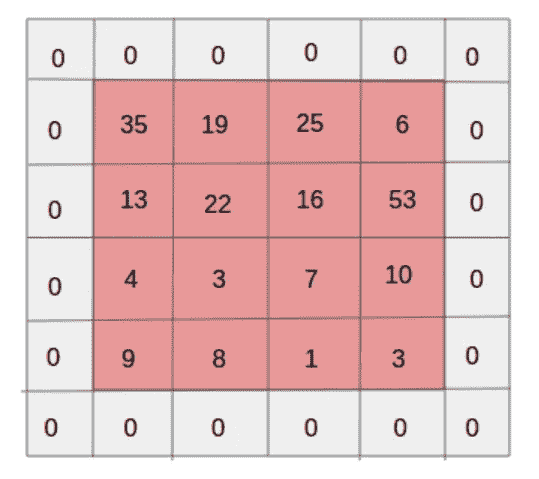

Input image with padding of 1

如你所见，添加的边框通常用零填充。现在，图像的角像素将被多次使用来计算输出，有效地防止信息丢失。此外，它允许我们在输出中保持输入矩阵的形状。

考虑我们的 6x6 输入图像，如果我们添加 1 的填充，我们得到一个 8x8 的矩阵。应用 3×3 滤波器，这将产生 6×6 输出。

一个简单的等式可以帮助我们计算出输出的形状:

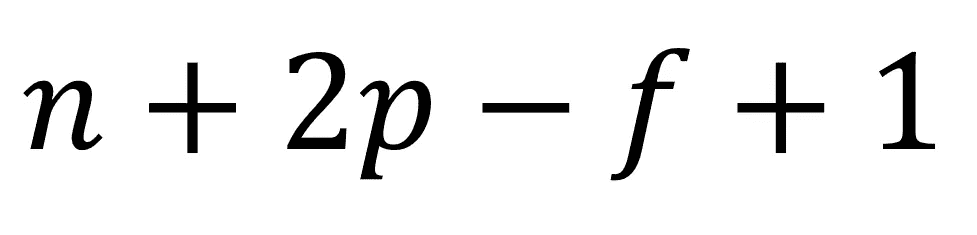

Where n is the input shape, p is the padding size, and f is the filter shape

重申一下，我们有:

*   6x6 输入
*   填充 1
*   3x3 过滤器

因此，输出形状将是:6+2(1)-3+1 = 6。因此，输出将是一个 6x6 的矩阵，就像输入图像一样！

填充并不总是必需的。但是，当使用填充时，通常是为了使输出与输入图像具有相同的大小。这产生了两种类型的卷积。

当没有应用填充时，这被称为“**有效卷积”**。否则称为“**同卷积”**。要确定保持输入图像尺寸所需的填充大小，只需将上面的公式等同于 *n* 。求解完 *p* 后，你应该得到:

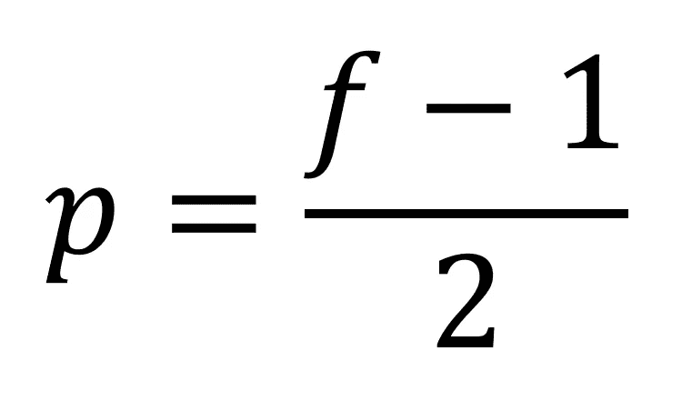

您可能已经注意到，为了使填充为整数， *f* 应该是奇数。因此，在计算机视觉领域，使用奇数滤镜是一种惯例。

# 步进卷积

之前，我们已经看到了步长为 1 的卷积。这意味着过滤器水平和垂直移动了 1 个像素。

跨距卷积是指跨距大于 1 的卷积。在下面的动画中，步幅是 2:

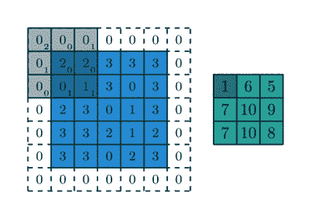

Convolution with a stride of 2

现在，考虑步幅，计算输出矩阵形状的公式为:

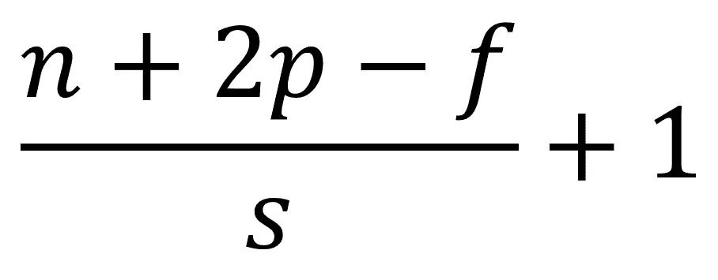

Where s is the stride

按照惯例，如果上面的公式不能得出一个整数，那么我们就向下舍入到最接近的整数。

# 池层

合并图层是另一种减少图像解释大小以加快计算速度的方法，它使检测到的特征更加稳健。

用一个图像来解释池是最好的。下面是**最大池**的一个例子:

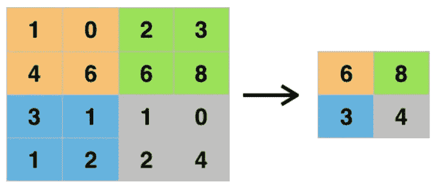

Max pooling with a 2x2 filter

如您所见，我们选择了步幅为 2 的 2x2 滤波器。这相当于将输入分成 4 个相同的正方形，然后我们取每个正方形的最大值，并将其用于输出。

也可以执行平均池化，但是它不如最大池化流行。

您可以将池化视为防止过度拟合的一种方式，因为我们正在从输入图像中移除一些特征。

# 为什么要使用卷积神经网络？

我们现在有一个强大的卷积神经网络的基础知识。但是，深度学习从业者为什么要用呢？

与全连接层不同，卷积层需要学习的参数要少得多。这是因为:

*   参数共享
*   联系的稀疏性

参数共享是指一个特征检测器，例如垂直边缘检测器，将在图像的许多部分有用。那么，连接的稀疏性是指只有少数特征与某个输出值相关。

考虑上面的最大池示例，输出的左上值仅取决于输入图像的左上 2x2 正方形。

因此，我们可以在更小的数据集上进行训练，并大大减少要学习的参数数量，使 CNN 成为计算机视觉任务的一个伟大工具。

# 用 TensorFlow 构建 CNN

理论讲够了，让我们为手势识别编写一个 CNN。我们重温一个[以前的项目](/the-complete-tensorflow-tutorial-for-newbies-dc3acc1310f8)，看看 CNN 是否会表现得更好。

一如既往，完整的笔记本可在[这里](https://github.com/marcopeix/Deep_Learning_AI/blob/master/4.Convolutional%20Neural%20Networks/1.Foundations%20of%20Convolutional%20Neural%20Networks/ConvNet%20in%20TensorFlow.ipynb)获得。

## 步骤 1:预处理图像

导入所需的库和资产后，我们加载数据并预处理图像:

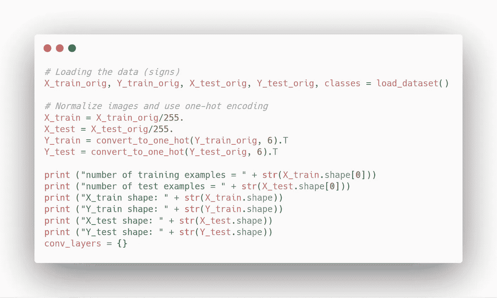

## 步骤 2:创建占位符

然后，我们为特征和目标创建占位符:

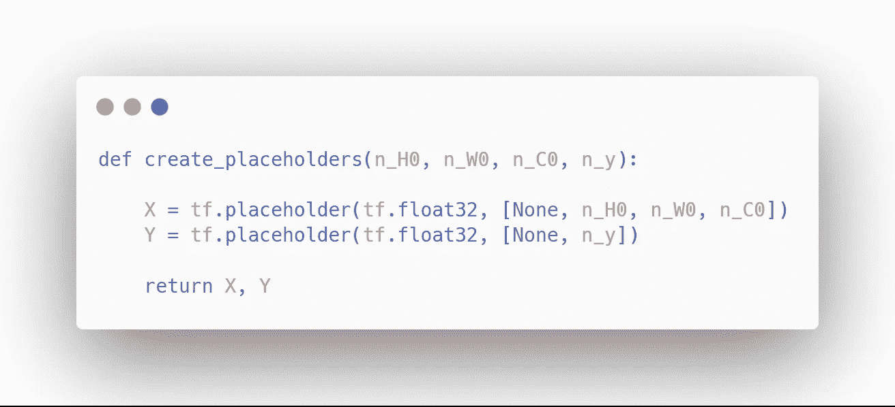

## 步骤 3:初始化参数

然后，我们使用 Xavier 初始化来初始化参数:

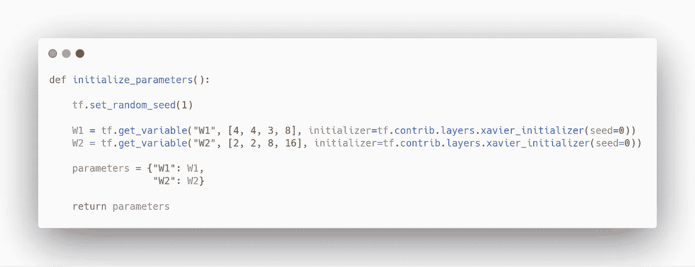

## 步骤 4:定义正向传播

现在，我们定义正向传播步骤，这实际上是我们 CNN 的架构。我们将使用一个简单的三层网络，包括两个卷积层和一个全连接层:

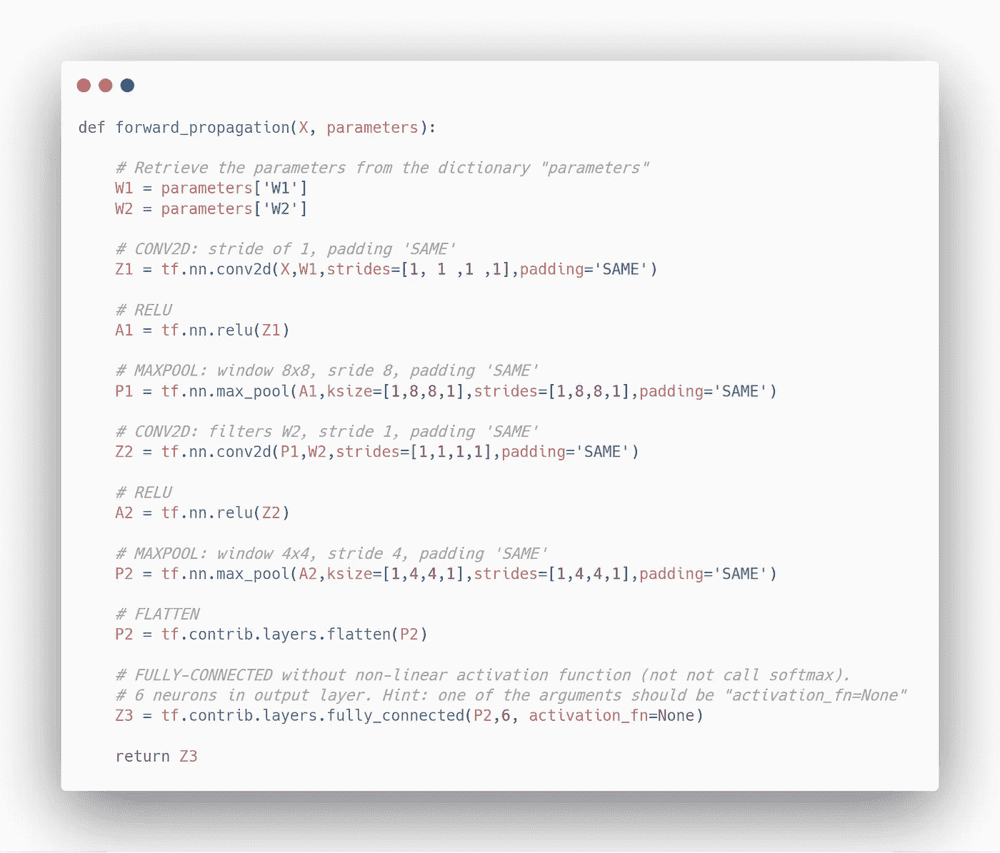

## 第五步:计算成本

最后，我们定义一个函数来计算成本:

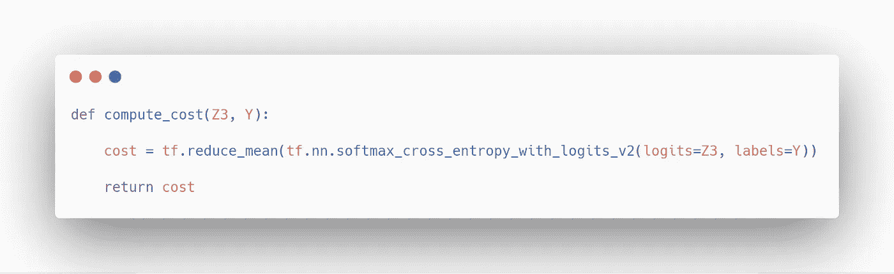

## 步骤 6:将所有功能组合成一个模型

现在，我们将上述所有功能合并到一个 CNN 网络中。我们将使用小批量梯度下降进行训练:

太好了！现在，我们可以运行我们的模型，看看它的表现如何:

```
_, _, parameters = model(X_train, Y_train, X_test, Y_test)
```

在我的例子中，我在只使用 CPU 的笔记本电脑上训练 CNN，我得到了一个相当糟糕的结果。如果你在有更好的 CPU 和 GPU 的台式机上训练 CNN，你肯定会得到比我更好的结果。

恭喜你！你现在对 CNN 和计算机视觉领域有了很好的了解。尽管还有更多的东西需要学习，但是更高级的技术使用这里介绍的概念作为构建模块。

在下一篇文章中，我将介绍 Keras 的剩余网络！

干杯！

参考: [deeplearning.ai](https://www.deeplearning.ai/)