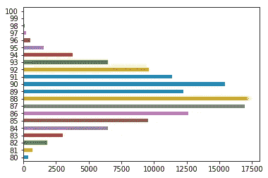

# Python 中的数据可视化简介

> 原文：<https://towardsdatascience.com/introduction-to-data-visualization-in-python-89a54c97fbed?source=collection_archive---------0----------------------->

## 如何使用 Matplotlib，Pandas 和 Seaborn 制作图形


Figure 1: Photo by [Lukas Blazek](https://unsplash.com/@goumbik?utm_source=medium&utm_medium=referral) on [Unsplash](https://unsplash.com?utm_source=medium&utm_medium=referral)

数据可视化是一门学科，它试图通过将数据置于可视化的环境中来理解数据，从而揭示出可能无法检测到的模式、趋势和相关性。

Python 提供了多个优秀的图形库，这些图形库包含了许多不同的特性。无论你是想创建交互式的、实时的还是高度定制的情节，python 都为你提供了一个优秀的库。

下面是一些流行的绘图库:

*   [**Matplotlib:**](https://matplotlib.org/)**低等级，提供了大量的自由**
*   **[**熊猫可视化:**](https://pandas.pydata.org/pandas-docs/stable/visualization.html) 易于使用的界面，基于 Matplotlib 构建**
*   **[**Seaborn:**](https://seaborn.pydata.org/)**高级界面，绝佳的默认样式****
*   ****[**gg plot:**](http://ggplot.yhathq.com/)**基于 R 的 ggplot2，采用[图形的语法](https://www.amazon.com/Grammar-Graphics-Statistics-Computing/dp/0387245448)******
*   ******[**剧情:**](https://plot.ly/python/) 可以创建互动剧情******

****在本文中，我们将学习如何使用 Matplotlib、Pandas visualization 和 Seaborn 创建基本的绘图，以及如何使用每个库的一些特定功能。本文将关注语法，而不是解释图形，我将在另一篇博客文章中介绍。****

****在以后的文章中，我将介绍像 Plotly 这样的交互式绘图工具，它构建在 D3 上，也可以与 JavaScript 一起使用。****

# ****导入数据集****

****在本文中，我们将使用两个免费提供的数据集。 [Iris](https://archive.ics.uci.edu/ml/datasets/iris) 和[葡萄酒评论](https://www.kaggle.com/zynicide/wine-reviews)数据集，我们都可以使用 pandas `read_csv`方法加载。****

********

****Figure 2: Iris dataset head****

********

****Figure 3: Wine Review dataset head****

# ****Matplotlib****

****Matplotlib 是最流行的 python 绘图库。这是一个低级的库，有一个类似 Matlab 的接口，提供了很多自由，代价是必须写更多的代码。****

****要安装 Matplotlib，可以使用 pip 和 conda。****

```
**pip install matplotlib
or
conda install matplotlib**
```

****Matplotlib 特别适合创建基本的图表，如线形图、条形图、直方图等等。可以通过键入以下内容来导入它:****

```
**import matplotlib.pyplot as plt**
```

## ****散点图****

****要在 Matplotlib 中创建散点图，我们可以使用`scatter`方法。我们还将使用`plt.subplots`创建一个图形和一个轴，这样我们就可以给我们的绘图一个标题和标签。****

********

****Figure 4: Matplotlib Scatter plot****

****我们可以通过按类别给每个数据点着色来赋予图表更多的意义。这可以通过创建一个从类映射到颜色的字典来完成，然后使用 for 循环分散每个点并传递各自的颜色。****

********

****Figure 5: Scatter Plot colored by class****

## ****折线图****

****在 Matplotlib 中，我们可以通过调用`plot`方法来创建折线图。我们还可以在一个图形中绘制多个列，方法是循环遍历我们需要的列，并将每个列绘制在同一轴上。****

********

****Figure 6: Line Chart****

## ****柱状图****

****在 Matplotlib 中，我们可以使用`hist`方法创建一个直方图。如果我们向它传递分类数据，如葡萄酒评论数据集中的 points 列，它将自动计算每个类出现的频率。****

********

****Figure 7: Histogram****

## ****条形图****

****可以使用`bar`方法创建条形图。条形图不会自动计算类别的频率，所以我们将使用 pandas `value_counts`函数来完成这项工作。条形图对于没有太多不同类别(少于 30 个)的分类数据非常有用，因为否则它会变得非常混乱。****

********

****Figure 8: Bar-Chart****

# ****熊猫可视化****

****Pandas 是一个开源的高性能、易于使用的库，它提供了数据结构(如数据帧)和数据分析工具(如我们将在本文中使用的可视化工具)。****

****熊猫可视化使得从熊猫数据帧和系列中创建情节变得非常容易。它还拥有比 Matplotlib 更高级的 API，因此我们需要更少的代码来获得相同的结果。****

****Pandas 可以使用 pip 或 conda 安装。****

```
**pip install pandas
or
conda install pandas**
```

## ****散点图****

****为了在 Pandas 中创建散点图，我们可以调用`<dataset>.plot.scatter()`并向它传递两个参数，x 列的名称和 y 列的名称。可选地，我们也可以传递给它一个标题。****

********

****Figure 9: Scatter Plot****

****正如您在图像中看到的，它会自动将 x 和 y 标签设置为列名。****

## ****折线图****

****为了创建熊猫的折线图，我们可以称之为`<dataframe>.plot.line()`。在 Matplotlib 中，我们需要循环遍历我们想要绘制的每一列，而在 Pandas 中，我们不需要这样做，因为它会自动绘制所有可用的数字列(至少如果我们没有指定特定的列)。****

********

****Figure 10: Line Chart****

****如果我们有一个以上的功能，熊猫会自动为我们创建一个图例，如上图所示。****

## ****柱状图****

****在熊猫中，我们可以用`plot.hist`方法创建一个直方图。没有任何必需的参数，但是我们可以有选择地传递一些参数，比如 bin 的大小。****

********

****Figure 11: Histogram****

****创建多个直方图也非常容易。****

********

****Figure 12: Multiple Histograms****

****`subplots`参数指定我们想要为每个特征单独绘图，而`layout`指定每行和每列的绘图数量。****

## ****条形图****

****为了绘制条形图，我们可以使用`plot.bar()`方法，但是在调用这个方法之前，我们需要获取数据。为此，我们将首先使用`value_count()`方法对事件进行计数，然后使用`sort_index()`方法从最小到最大对事件进行排序。****

********

****Figure 13: Vertical Bar-Chart****

****使用`plot.barh()`方法制作水平条形图也非常简单。****

********

****Figure 14: Horizontal Bar-Chart****

****我们也可以绘制其他数据，然后是出现的次数。****

********

****Figure 15: Countries with the most expensive wine(on average)****

****在上面的例子中，我们按国家对数据进行分组，然后取葡萄酒价格的平均值，对其排序，并绘制出平均葡萄酒价格最高的 5 个国家。****

# ****海生的****

****Seaborn 是一个基于 Matplotlib 的 Python 数据可视化库。它为创建吸引人的图形提供了一个高级接口。****

****Seaborn 有很多东西可以提供。在 Matplotlib 中，你可以用一行创建几十行的图形。它的标准设计非常棒，而且它还有一个很好的界面来处理熊猫数据框。****

****可以通过键入以下内容来导入它:****

```
**import seaborn as sns**
```

## ****散点图****

****我们可以使用`.scatterplot`方法创建散点图，就像在 Pandas 中一样，我们需要传递 x 和 y 数据的列名，但现在我们也需要传递数据作为附加参数，因为我们没有像在 Pandas 中那样直接调用数据上的函数。****

********

****Figure 16: Scatterplot****

****我们还可以使用`hue`参数按类突出显示要点，这比在 Matplotlib 中容易得多。****

********

****Figure 17: Scatterplot colored by class****

## ****折线图****

****可使用`sns.lineplot`方法创建折线图。唯一需要的参数是数据，在我们的例子中是 Iris 数据集中的四个数字列。我们也可以使用`sns.kdeplot`方法，如果你的数据集中有很多异常值，这种方法会使曲线的边缘变圆，因此更干净。****

********

****Figure 18: Line Chart****

## ****柱状图****

****为了在 Seaborn 中创建直方图，我们使用了`sns.distplot`方法。我们需要将我们想要绘制的列传递给它，它会自己计算出现的次数。如果我们想在图中画出高斯核密度估计值，我们也可以传递给它箱的数量。****

********

****Figure 19: Histogram****

********

****Figure 20: Histogram with gaussian kernel density estimate****

## ****条形图****

****在 Seaborn 中，可以使用`sns.countplot`方法创建一个条形图，并将数据传递给它。****

********

****Figure 21: Bar-Chart****

# ****其他图表****

****现在你已经对 Matplotlib、Pandas Visualization 和 Seaborn 语法有了一个基本的了解，我想向你展示一些对提取内部有用的其他图形类型。****

****对他们中的大多数人来说，Seaborn 是首选库，因为它的高级接口只需要几行代码就可以创建漂亮的图形。****

## ****箱线图****

****方框图是显示[五个数字汇总](https://en.wikipedia.org/wiki/Five-number_summary)的图形方法。我们可以使用 seaborns `sns.boxplot`方法创建箱线图，并向它传递数据以及 x 和 y 列名。****

********

****Figure 22: Boxplot****

****箱线图，就像条形图一样，对于只有几个类别的数据来说是很好的，但是会很快变得混乱。****

## ****热图****

****热图是数据的图形表示，其中包含在矩阵[中的单个值用颜色表示。热点图非常适合探索数据集中要素的相关性。](https://en.wikipedia.org/wiki/Matrix_(mathematics))****

****为了获得数据集中特征的相关性，我们可以调用`<dataset>.corr()`，这是一个 Pandas dataframe 方法。这将给我们[相关矩阵](https://www.displayr.com/what-is-a-correlation-matrix/)。****

****我们现在可以使用 Matplotlib 或 Seaborn 来创建热图。****

****Matplotlib:****

********

****Figure 23: Heatmap without annotations****

****要向热图添加注释，我们需要添加两个 for 循环:****

********

****Figure 24: Heatmap with annotations****

****Seaborn 使创建热图和添加注释变得更加容易:****

********

****Figure 25: Heatmap with annotations****

## ****刻面****

****分面是将数据变量分解成多个子情节并将这些子情节组合成一个图形的行为。****

****如果想快速浏览数据集，分面真的很有帮助。****

****要在 Seaborn 使用一种刻面，我们可以使用`FacetGrid`。首先，我们需要定义`FacetGrid`并向它传递我们的数据以及一行或一列，它们将用于拆分数据。然后我们需要在我们的`FacetGrid`对象上调用`map` 函数，并定义我们想要使用的绘图类型，以及我们想要绘制的列。****

********

****Figure 26: Facet-plot****

****你可以做出比上面例子更大更复杂的图。你可以在这里找到几个例子[。](https://seaborn.pydata.org/generated/seaborn.FacetGrid.html)****

## ****配对图****

****最后，我将向您展示 Seaborns `pairplot`和 Pandas `scatter_matrix`，它们使您能够在数据集中绘制成对关系的网格。****

********

****Figure 27: Pairplot****

********

****Figure 28: Scatter matrix****

****正如你在上面的图片中所看到的，这些技术总是将两个特征彼此结合在一起。图表的对角线用直方图填充，其他图是散点图。****

# ****推荐阅读****

****[](/scraping-reddit-data-1c0af3040768) [## 抓取 Reddit 数据

### 如何使用 Python Reddit API 包装器从 Reddit 抓取数据(PRAW)

towardsdatascience.com](/scraping-reddit-data-1c0af3040768)**** 

# ****结论****

****数据可视化是一门学科，它试图通过将数据置于可视化的环境中来理解数据，从而揭示出可能无法检测到的模式、趋势和相关性。****

****Python 提供了多个优秀的图形库，这些图形库包含了许多不同的特性。在本文中，我们研究了 Matplotlib、Pandas visualization 和 Seaborn。****

****如果你喜欢这篇文章，可以考虑订阅我的 Youtube 频道，在社交媒体上关注我。****

****本文涵盖的代码可以从 [Github 资源库](https://github.com/TannerGilbert/Tutorials/blob/master/Introduction%20to%20Data%20Visualization%20in%C2%A0Python/Introduction%20to%20Data%20Visualization%20in%C2%A0Python.ipynb)获得。****

****如果你有任何问题、建议或批评，可以通过[推特](https://twitter.com/Tanner__Gilbert)或评论区联系我。****