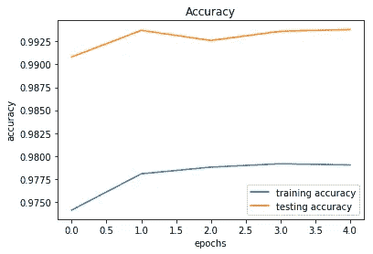
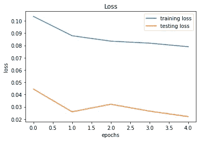

# Keras 深度学习简介

> 原文：<https://towardsdatascience.com/introduction-to-deep-learning-with-keras-17c09e4f0eb2?source=collection_archive---------3----------------------->

## 如何使用 Keras 深度学习库


Figure 1: Photo by [Blake Connally](https://unsplash.com/@blakeconnally?utm_source=medium&utm_medium=referral) on [Unsplash](https://unsplash.com?utm_source=medium&utm_medium=referral)

[Keras](https://keras.io/) 是一个高级神经网络 API，能够运行在 [Tensorflow](https://github.com/tensorflow/tensorflow) 、 [Theano、](https://github.com/Theano/Theano)和 [CNTK](https://github.com/Microsoft/cntk) 之上。它通过高级、用户友好、模块化和可扩展的 API 实现快速实验。Keras 也可以在 CPU 和 GPU 上运行。

Keras 由 [Francois Chollet](https://twitter.com/fchollet?ref_src=twsrc%5Egoogle%7Ctwcamp%5Eserp%7Ctwgr%5Eauthor) 开发和维护，是 Tensorflow 核心的一部分，这使其成为 tensor flow 首选的高级 API。

本文是解释如何使用 Keras 进行深度学习的系列文章的第一篇。

在本文中，我们将介绍 Keras 的基础知识，包括两个最常用的 Keras 模型([顺序](https://keras.io/getting-started/sequential-model-guide/)和[功能](https://keras.io/getting-started/functional-api-guide/))、核心层以及一些预处理功能。

# 安装 Keras

我假设你已经有了一个可以工作的 Tensorflow 或 Theano 或 CNTK。如果你不检查上面的链接。

Keras 可以使用 pip 或 conda 安装:

```
pip install keras
or
conda install keras
```

# 在数据集中加载

Keras 提供了[七个不同的数据集](https://keras.io/datasets/)，可以使用 Keras 直接加载。这些包括图像数据集以及[房价](https://www.kaggle.com/vikrishnan/boston-house-prices)和[电影评论](https://www.kaggle.com/iarunava/imdb-movie-reviews-dataset)数据集。

在本文中，我们将使用 [MNIST 数据集](http://yann.lecun.com/exdb/mnist/) [，](https://www.cs.toronto.edu/~kriz/cifar.html)，它包含 70000 张 28x28 灰度图像和 10 个不同的类别。Keras 将其分为一个包含 60000 个实例的训练集和一个包含 10000 个实例的测试集。

为了将图像输入到[卷积神经网络](http://cs231n.github.io/convolutional-networks/)中，我们将数据帧转换为四维。这可以使用 numpys `reshape`方法来完成。我们还将把数据转换成浮点数，并使其正常化。

我们还将使用 Keras 的`to_categorical`方法将我们的标签转换成[一键编码](https://hackernoon.com/what-is-one-hot-encoding-why-and-when-do-you-have-to-use-it-e3c6186d008f)。

# 使用顺序 API 创建模型

在 Keras 中创建模型最简单的方法是使用顺序 API，它允许您一层一层地堆叠。顺序 API 的问题是，它不允许模型有多个输入或输出，而这对于某些问题是需要的。

然而，对于大多数问题，顺序 API 是一个完美的选择。

要创建一个[卷积神经网络](http://cs231n.github.io/convolutional-networks/)，我们只需要创建一个`Sequential`对象，并使用`add`函数添加层。

上面的代码首先创建了一个`Sequential`对象，并添加了一些卷积、最大池和漏失层。然后，它使输出变平，并在将其传递给输出层之前，将其传递给最后一个密集层和漏失层。如果你没有信心建立一个卷积神经网络(CNN ),看看这个伟大的教程。

顺序 API 还支持另一种语法，其中层被直接传递给构造函数。

# 使用函数式 API 创建模型

或者，函数式 API 允许您创建相同的模型，但是以简单性和可读性为代价为您提供了更多的灵活性。

它可用于多个输入和输出图层以及共享图层，从而使您能够构建真正复杂的网络结构。

当使用函数式 API 时，我们总是需要将前一层传递给当前层。它还需要使用输入层。

函数式 API 也经常用于[迁移学习](https://machinelearningmastery.com/transfer-learning-for-deep-learning/)，我们将在另一篇文章中讨论。

# 编译模型

在开始训练我们的模型之前，我们需要配置学习过程。为此，我们需要指定一个优化器、一个损失函数和一些可选的度量标准，如准确性。

[损失函数](https://www.youtube.com/watch?v=IVVVjBSk9N0)是对我们的模型在实现给定目标方面有多好的度量。

[优化器](/types-of-optimization-algorithms-used-in-neural-networks-and-ways-to-optimize-gradient-95ae5d39529f)用于通过使用梯度更新权重来最小化损失(目标)函数。

# 扩充图像数据

扩充是从现有数据中创建更多数据的过程。对于图像，你可以做一些小的变换，比如旋转图像，放大图像，添加噪声等等。

这有助于使模型更加稳健，并解决没有足够数据的问题。Keras 有一个叫做`ImageDataGenerator`的方法，可以用来扩充图像。

这个`ImageDataGenerator` 将创建已经旋转、放大或缩小、宽度和高度发生变化的新图像。

# 符合模型

既然我们已经定义并编译了我们的模型，那么就可以开始训练了。为了训练一个模型，我们通常会使用`fit`方法，但是因为我们使用的是数据生成器，我们将使用`fit_generator` 并向其传递我们的生成器、X 数据、y 数据以及[历元数和批量大小](/epoch-vs-iterations-vs-batch-size-4dfb9c7ce9c9)。我们还将向它传递一个验证集，以便我们可以监控这两个集的损失和准确性，以及使用生成器时所需的 steps_per_epoch，它被设置为训练集的长度除以 batch_size。

这将输出:

```
Epoch 1/5
1875/1875 [==============================] - 22s 12ms/step - loss: 0.1037 - acc: 0.9741 - val_loss: 0.0445 - val_acc: 0.9908
Epoch 2/5
1875/1875 [==============================] - 22s 12ms/step - loss: 0.0879 - acc: 0.9781 - val_loss: 0.0259 - val_acc: 0.9937
Epoch 3/5
1875/1875 [==============================] - 22s 12ms/step - loss: 0.0835 - acc: 0.9788 - val_loss: 0.0321 - val_acc: 0.9926
Epoch 4/5
1875/1875 [==============================] - 22s 12ms/step - loss: 0.0819 - acc: 0.9792 - val_loss: 0.0264 - val_acc: 0.9936
Epoch 5/5
1875/1875 [==============================] - 22s 12ms/step - loss: 0.0790 - acc: 0.9790 - val_loss: 0.0220 - val_acc: 0.9938
```

# 可视化培训过程

我们可以可视化每个时期的训练和测试精度和损失，这样我们就可以直观地了解模型的性能。各代的精度和损失保存在我们训练时获得的历史变量中，我们将使用 Matplotlib 来可视化这些数据。



Figure 2: Training/Testing accuracy over epochs



Figure 3: Training/Testing loss over epochs

在上面的图表中，我们可以看到我们的模型没有过度拟合，我们可以训练更多的纪元，因为验证损失仍在减少。

# 推荐读物

[](/building-a-book-recommendation-system-using-keras-1fba34180699) [## 使用 Keras 构建图书推荐系统

### 如何使用嵌入创建图书推荐系统？

towardsdatascience.com](/building-a-book-recommendation-system-using-keras-1fba34180699) 

# 结论

[Keras](https://keras.io/) 是一个高级神经网络 API，能够运行在 [Tensorflow](https://github.com/tensorflow/tensorflow) 、 [Theano](https://github.com/Theano/Theano) 和 [CNTK](https://github.com/Microsoft/cntk) 之上。它通过高级、用户友好、模块化和可扩展的 API 以及在 CPU 和 GPU 上运行来实现快速实验。

本文是介绍 Keras 工作原理的系列文章的第一篇。在这篇文章中，我们讨论了安装以及如何创建一个简单的卷积神经网络。

如果你喜欢这篇文章，可以考虑订阅我的 Youtube 频道并在社交媒体上关注我。

本文涵盖的代码可以从 [Github 资源库](https://github.com/TannerGilbert/Tutorials/blob/master/Introduction%20to%20Deep%20Learning%20with%C2%A0Keras/Introduction%20to%20Deep%20Learning%20with%20Keras.ipynb)获得。

如果您有任何问题、建议或批评，可以通过 [Twitter](https://twitter.com/Tanner__Gilbert) 或评论区联系我。