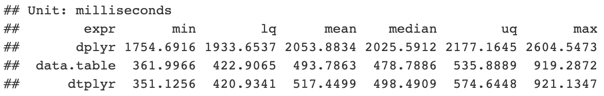
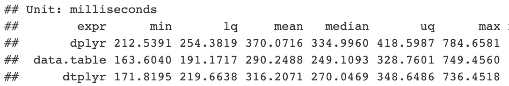
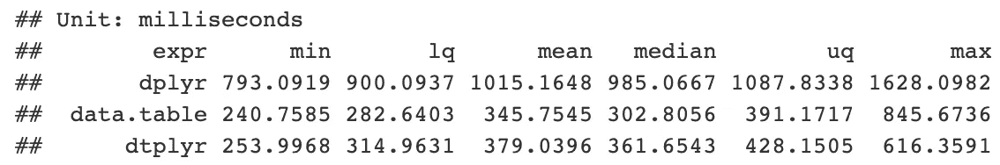
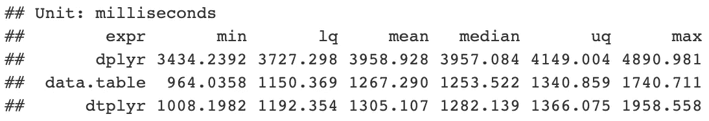

# 使用 dtplyr 加速数据争论

> 原文：<https://towardsdatascience.com/introduction-to-dtplyr-783d89e9ae56?source=collection_archive---------12----------------------->


## 了解如何轻松地将`dplyr`的可读性与`data.table`的性能结合起来！

我最近看到了哈德利·韦翰关于《T2》上映的推文。这是一个支持在`data.table`对象上使用`dplyr`语法的包。`dtplyr`自动将`dplyr`语法翻译成等价的`data.table`，最终导致性能提升。

> 漫威:无限战争是历史上最雄心勃勃的跨界事件。哈德利·韦翰:拿着我的啤酒。

我一直很喜欢`dplyr`的易用性和可读性，也很渴望对比一下软件包的性能。让我们看看它在实践中是如何工作的！

# 加载库

对于本文，我们需要通过运行`devtools::install_github(“tidyverse/dtplyr”)`从 GitHub 安装`dtplyr`，我们使用`microbenchmark`进行性能比较。

# 生成数据集

我们生成一个人工数据集。我首先想到的是订单注册表，我们在其中存储:

*   `id`客户端的
*   `name`产品的
*   `date`采购
*   `amount`购买的产品
*   某一产品的单位`price`

由于这只是一个玩具示例，我们不会深入研究数据集背后的逻辑。我们可以同意这有点像现实生活中的场景。为了测试不同方法的性能，我们生成了 1000 万行数据。

通过使用`lazy_dt()`我们触发了惰性评估——直到我们通过使用`as.data.table()`、`as.data.frame()`或`as_tibble()`明确请求它，才执行任何计算。为了便于比较，我们储存一个`data.frame`，一个`data.table`，一个【懒人】`data.table`。

我们可以通过打印结果来预览转换以及生成的`data.table`代码:

```
**Source:** local data table [?? x 3]
**Call:** `_DT3`[date < as.Date("2019-02-01"), .(id, product, date)][order(date)] id    product date      
  *<chr>* *<chr>*   *<date>*    
1 DHQ   GVF     2019-01-01
2 NUB   ZIU     2019-01-01
3 CKW   LJH     2019-01-01
4 AZO   VIQ     2019-01-01
5 AQW   AGD     2019-01-01
6 OBL   NPC     2019-01-01
```

通常，这应该用于调试。我们应该指出我们希望在管道末端接收哪种类型的对象，以清楚地表明我们已经完成了转换。

# 用例 1:过滤、选择和排序

假设我们想要一个 2019 年 2 月 1 日之前发生的交易列表，按日期排序，我们不关心金额或价格。



我们看到`dtplyr`比`data.table`稍慢，但是通过观察中间时间，它比`dplyr.`快了大约 4 倍

# 用例 2:过滤后添加新变量

在本例中，我们要过滤产品数量超过 5000 的订单，并计算订单值，即`amount * price`。

大部分使用`mutate()`的表达式必须复制(不要原地修改)，直接使用`data.table`就没必要了。为了应对这种情况，我们可以在`lazy_dt()`中指定`immutable = FALSE`来退出上述行为。



这一次，差异没有那么明显。当然，这取决于对表进行操作的复杂性。

# 用例 3:顶层聚合

假设我们想要:

*   根据金额<= 4000
*   Calculate the average order value per customer



This time we get ~3x improvement in median execution time.

# Use-case 4: Joining

In the last example, we consider a case of joining datasets. For that, we create a new 【 / 【 called 【 by selecting 75% of the available products and assigning a random letter to them. We can assume that the letter corresponds to a distribution center (variable called 【 ), from which the item is shipped.

We want to calculate the average order value per distribution center. In case we do not have data regarding the distribution center, we discard the row.



Again we see a ~3x speedup in the median execution time.

# Conclusions

【 is (and always will be) slightly slower than 【 . That is because:

1\. Each 【 verb must be converted to a 【 equivalent. For large datasets, this should be negligible, as these translation operations take time proportional to the complexity of the input code, rather than the amount of data.
2 过滤所有订单。一些`data.table`表达式没有直接的`dplyr`等价物。
3。用例 2 中提到的不变性问题。

综上所述，我认为`dtplyr`是对`tidyverse`的一个有价值的补充，因为只需对`dplyr`代码做很小的改动，我们就可以实现显著的性能提升。

一如既往，我们欢迎任何建设性的反馈。你可以在推特上或评论中联系我。你可以在我的 [GitHub](https://github.com/erykml/medium_articles/blob/master/Data%20Wrangling/introduction_to_dtplyr.Rmd) 上找到本文使用的代码。