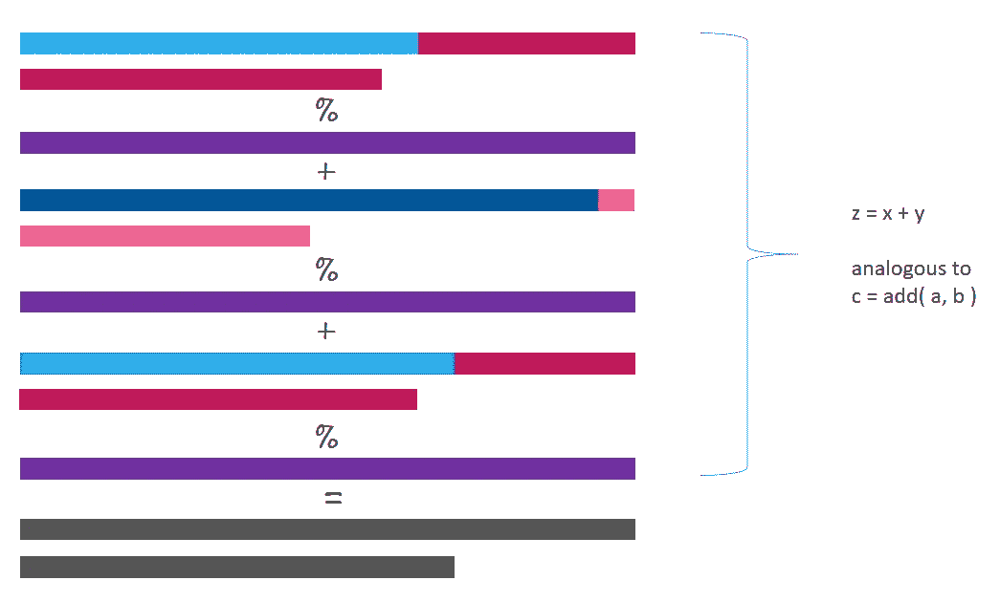

# 联合学习和隐私保护简介

> 原文：<https://towardsdatascience.com/introduction-to-federated-learning-and-privacy-preservation-75644686b559?source=collection_archive---------14----------------------->

## 使用 PySyft 框架的联邦学习和附加秘密共享。

深度学习包括对存在于多个客户端设备上的大量高质量分散数据进行训练。该模型在客户端设备上被训练，因此不需要上传用户的数据。将个人数据保存在客户的设备上，使他们能够直接和实际控制自己的数据。


Figure 1: Federated Learning

服务器在预先可用的代理数据上训练初始模型。初始模型被发送到选定数量的合格客户端设备。合格标准确保用户的体验不会因为试图训练模型而被破坏。选择最佳数量的客户端设备来参与训练过程。处理完用户数据后，模型更新将与服务器共享。服务器聚集这些梯度并改进全局模型。

所有的模型更新都在内存中进行*处理*，而*在服务器上只持续很短的一段时间*。然后，服务器将改进的模型发送回参与下一轮训练的客户端设备。达到所需的精确度后，设备上的模型可以根据用户的个性化进行调整。然后，他们不再有资格参加培训。在整个过程中，数据不会离开客户端设备。

## 这与分散计算有什么不同？

联合学习与分散计算的不同之处在于:

*   客户端设备(如智能手机)的网络带宽有限。它们不能传输大量数据，上传速度通常低于下载速度。
*   客户端设备并不总是能够参与训练会话。最佳条件，如充电状态、连接到未计量的 Wi-Fi 网络、空闲等。并不总是可以实现的。
*   设备上的数据更新很快，并且不总是相同的。[数据并不总是可以获得。]
*   客户端设备可以选择不参与培训。
*   可用的客户端设备数量非常多，但是不一致。
*   联合学习将隐私保护与大规模群体的分布式训练和聚合结合在一起。
*   数据通常是不平衡的，因为数据是用户特定的并且是自相关的。

> 联合学习是“将代码带给数据，而不是将数据带给代码”这种更普遍方法的一个例子，它解决了数据的隐私、所有权和位置等基本问题。

在联合学习中:

*   某些技术用于压缩模型更新。
*   执行质量更新，而不是简单的梯度步骤。
*   在执行聚合之前，由服务器添加噪声，以掩盖个体对学习模型的影响。[全局差分隐私]
*   如果渐变更新太大，则会被裁剪。

## PYSYFT 简介

我们将使用 PySyft 实现一个联邦学习模型。PySyft 是一个用于安全和私有深度学习的 Python 库。

## 装置

PySyft 要求 Python >= 3.6 和 PyTorch 1.1.0。确保你符合这些要求。

## 基础

让我们从导入库和初始化钩子开始。

这样做是为了覆盖 PyTorch 的方法，在一个 worker 上执行命令，这些命令在本地 worker 控制的 tensors 上调用。它还允许我们在工人之间移动张量。工人解释如下。

```
Jake has: {}
```

虚拟工作者是存在于我们本地机器上的实体。它们用于模拟实际工人的行为。

为了与分布在网络中的工作者一起工作，PySyft 提供了两种类型的工作者:

*   网络套接字工人
*   Web 套接字工人

Web sockets workers 可以从浏览器实例化，每个 worker 位于一个单独的选项卡上。

在这里，Jake 是我们的虚拟工作者，可以将其视为设备上的一个独立实体。我们给他发些数据吧。

```
x: (Wrapper)>[PointerTensor | me:50034657126 -> jake:55209454569]
Jake has: {55209454569: tensor([1, 2, 3, 4, 5])}
```

当我们向 Jake 发送一个张量时，我们返回一个指向这个张量的指针。所有的操作都将通过这个指针来执行。这个指针保存另一台机器上的数据信息。现在， *x* 是一个点张量。

使用 *get()* 方法从杰克的设备中获取 *x* 的值。然而，这样做的话，杰克设备上的张量就被删除了。

```
x: tensor([1, 2, 3, 4, 5])
Jake has: {}
```

当我们将 PointTensor *x* (指向 Jake 机器上的一个张量)发送给另一个工人 John 时，整个链被发送给 John，并返回一个指向 John 设备上的节点的 PointTensor。张量仍在杰克的设备上。

```
x: (Wrapper)>[PointerTensor | me:70034574375 -> john:19572729271]
John has: {19572729271: (Wrapper)>[PointerTensor | john:19572729271 -> jake:55209454569]}
Jake has: {55209454569: tensor([1, 2, 3, 4, 5])}
```


Figure 2: Using the send() method on a PointTensor [Step 2].

方法的作用是:从一个工作线程中移除所有的对象。

```
Jake has: {}
John has: {}
```

假设我们想把一个张量从杰克的机器移到约翰的机器上。我们可以通过使用 *send()* 方法将“指向张量的指针”发送给 John，并让他调用 *get()* 方法。PySfyt 为此提供了一个 *remote_get()* 方法。还有一个方便的方法——*move()*，来执行这个操作。

```
(Wrapper)>[PointerTensor | me:86076501268 -> john:86076501268]
Jake has: {}
John has: {86076501268: tensor([ 6,  7,  8,  9, 10])}
```


Figure 3: Using the move() method on a PointTensor. [Step 2]

## 战略

我们可以通过以下步骤在客户端设备上执行联合学习:

1.  将模型发送到设备，
2.  使用设备上的数据进行正常训练，
3.  拿回更聪明的模型。

然而，如果有人截获了与服务器共享的 smarter 模型，他可以执行*逆向工程*并提取关于数据集的敏感数据。差分隐私方法解决了这个问题并保护了数据。

当更新被发送回服务器时，服务器在聚集梯度时不应该能够辨别。让我们使用一种叫做附加秘密共享的加密形式。

我们希望在执行聚合之前加密这些梯度(或模型更新),这样就没有人能够看到梯度。我们可以通过附加秘密共享来实现这一点。

## 附加秘密共享

在秘密共享中，我们将一个秘密分成多个份额，并在一组秘密持有者中分发。秘密 *x* 只有当它被分割成的所有份额都可用时才能被构造。

比如说我们把 *x* 拆分成 3 份: *x1* 、 *x2、*和 *x3* 。我们随机初始化前两个份额，计算第三个份额为*x3*=*x*-(*x1*+*x2*)。然后我们将这些股份分配给三个秘密持有者。这个秘密仍然是隐藏的，因为每个人只持有一份，不知道总价值。

我们可以通过选择股票价值的范围来使其更加安全。设大质数 *Q* 为上限。现在第三份， *x3* ，等于*Q-*(*x1*+*x2*)*% Q*+*x*。

```
Shares: (6191537984105042523084, 13171802122881167603111, 4377289736774029360531)
```


Figure 4: Encrypting x in three shares.

解密过程将股份求和在一起得到模数 *Q* 。

```
Value after decrypting: 3
```


Figure 5: Decrypting x from the three shares.

## 同态加密

同态加密是一种加密形式，它允许我们对加密的操作数执行计算，从而产生加密的输出。解密后的加密输出与对实际操作数执行相同计算得到的结果相匹配。

附加秘密共享技术已经具有同态性质。如果我们把 *x* 拆分成 *x1* 、 *x2、*和 *x3* ，把 *y* 拆分成 *y1* 、 *y2、*和 *y3* ，那么 *x+y* 就等于三份之和解密后的值:( *x1+y1*

```
Shares encrypting x: (17500273560307623083756, 20303731712796325592785, 9677254414416530296911)
Shares encrypting y: (2638247288257028636640, 9894151868679961125033, 11208230686823249725058)
Sum of shares: (20138520848564651720396, 6457253737716047231095, 20885485101239780021969)
Sum of original values (x + y): 14
```

我们能够在不知道 *x* 和 *y* 的值的情况下计算聚合函数加法的值。

## 使用 PYSYFT 的秘密共享

PySyft 提供了一个 *share()* 方法，将数据拆分成附加的秘密份额，并发送给指定的 workers。为了处理十进制数， *fix_precision()* 方法用于将小数表示为整数值。

```
Jake has: {}
John has: {}
Secure_worker has: {}
```

份额法用于在几个工人之间分配股份。每个指定的工人都得到一份，但不知道实际价值。

```
x: (Wrapper)>[AdditiveSharingTensor]
	-> (Wrapper)>[PointerTensor | me:61668571578 -> jake:46010197955]
	-> (Wrapper)>[PointerTensor | me:98554485951 -> john:16401048398]
	-> (Wrapper)>[PointerTensor | me:86603681108 -> secure_worker:10365678011]
	*crypto provider: me*
Jake has: {46010197955: tensor([3763264486363335961])}
John has: {16401048398: tensor([-3417241240056123075])}
Secure_worker has: {10365678011: tensor([-346023246307212880])}
```

如您所见， *x* 现在分别指向 Jake、John 和 Secure_worker 机器上的三个共享。


Figure 6: Encryption of x into three shares.


Figure 7: Distributing the shares of x among 3 VirtualWorkers.

```
(Wrapper)>[AdditiveSharingTensor]
	-> (Wrapper)>[PointerTensor | me:86494036026 -> jake:42086952684]
	-> (Wrapper)>[PointerTensor | me:25588703909 -> john:62500454711]
	-> (Wrapper)>[PointerTensor | me:69281521084 -> secure_worker:18613849202]
	*crypto provider: me*
```


Figure 8: Encryption of y into 3 shares.


Figure 9: Distributing the shares of y among 3 VirtualWorkers.

```
(Wrapper)>[AdditiveSharingTensor]
	-> (Wrapper)>[PointerTensor | me:42086114389 -> jake:42886346279]
	-> (Wrapper)>[PointerTensor | me:17211757051 -> john:23698397454]
	-> (Wrapper)>[PointerTensor | me:83364958697 -> secure_worker:94704923907]
	*crypto provider: me*
```

注意将 *x* 和 *y* 相加后得到的 *z* 的值存储在三台工人机中。 *z* 也加密了。



Figure 10: Performing computation on encrypted inputs.

```
tensor([14])
```


Figure 11: Decryption of result obtained after computation on encrypted inputs.

在对加密的份额执行加法之后获得的值等于通过将实际数字相加获得的值。

## 使用 PYSYFT 的联邦学习

现在，我们将使用两个工人:杰克和约翰，实现联合学习方法，在 MNIST 数据集上训练一个简单的神经网络。应用联邦学习方法只需要做一些修改。

1.  导入库和模块。

2.加载数据集。

在实际应用中，数据存在于客户端设备上。为了复制这个场景，我们向虚拟工作者发送数据。

请注意，我们以不同的方式创建了训练数据集。 *train_set.federate((jake，john))* 创建了一个 *FederatedDataset* ，其中 *train_set* 在 jake 和 john(我们的两个虚拟工作者)之间被拆分。 *FederatedDataset* 类旨在像 PyTorch 的*数据集*类一样使用。将创建的 *FederatedDataset* 传递给联邦数据加载器“ *FederatedDataLoader* ”，以联邦的方式对其进行迭代。这些批次来自不同的设备。

3.建立模型

4.训练模型

因为数据存在于客户端设备上，所以我们通过 *location* 属性获得它的位置。对代码的重要补充是从客户端设备取回改进的模型和损失值的步骤。

```
Epoch:  1 [    0/60032 (  0%)]	Loss: 2.306809
Epoch:  1 [ 6400/60032 ( 11%)]	Loss: 1.439327
Epoch:  1 [12800/60032 ( 21%)]	Loss: 0.857306
Epoch:  1 [19200/60032 ( 32%)]	Loss: 0.648741
Epoch:  1 [25600/60032 ( 43%)]	Loss: 0.467296
...
...
...
Epoch:  5 [32000/60032 ( 53%)]	Loss: 0.151630
Epoch:  5 [38400/60032 ( 64%)]	Loss: 0.135291
Epoch:  5 [44800/60032 ( 75%)]	Loss: 0.202033
Epoch:  5 [51200/60032 ( 85%)]	Loss: 0.303086
Epoch:  5 [57600/60032 ( 96%)]	Loss: 0.130088
```

5.测试模型

```
Test set: Average loss: 0.2428, Accuracy: 9300/10000 (93%)
```

就是这样。我们已经使用联合学习方法训练了一个模型。与传统训练相比，使用联邦方法训练模型需要更多的时间。

## 保护模型

在客户端设备上训练模型保护了用户的隐私。但是，模特的隐私呢？下载模型会威胁到组织的知识产权！

安全多方计算由秘密加法共享组成，为我们提供了一种在不公开模型的情况下进行模型训练的方法。

为了保护模型的权重，我们在客户端设备之间秘密共享模型。

要做到这一点，需要对上面的联邦学习示例进行一些更改。

如使用 PYSYFT 的秘密共享部分所示，现在是模型、输入、模型输出、权重等。也会被加密。处理加密的输入将产生加密的输出。

## 参考

[1] Theo Ryffel，Andrew Trask，Morten Dahl，Bobby Wagner，Jason Mancuso，Daniel Rueckert，Jonathan Passerat-Palmbach，[保护隐私的深度学习通用框架(2018)](https://arxiv.org/abs/1811.04017) ，arXiv

[2] Andrew Hard，Kanishka Rao，Rajiv Mathews，Swaroop Ramaswamy，Franç oise Beaufays，Sean Augenstein，Hubert Eichner，Chloé Kiddon，Daniel Ramage，[用于移动键盘预测的联邦学习(2019)](https://arxiv.org/abs/1811.03604) ，arXiv

[3]基思·博纳维茨、休伯特·艾希纳、沃尔夫冈·格里斯坎普、迪米特里·胡巴、亚历克斯·英格曼、弗拉基米尔·伊万诺夫、克洛伊·基登、雅各布·科涅纳、斯特凡诺·马佐基、h .布伦丹·麦克马汉、蒂蒙·范·奥弗代尔、戴维·彼得鲁、丹尼尔·拉梅奇、杰森·罗斯兰德、[《走向大规模联合学习:系统设计》(2019)](https://arxiv.org/abs/1902.01046) 、arXiv

[4] Brendan McMahan，Daniel Ramage，[联合学习:没有集中训练数据的协作机器学习(2017)](https://ai.googleblog.com/2017/04/federated-learning-collaborative.html) ，谷歌 AI 博客

[5]苹果差分隐私团队，[大规模隐私学习(2017)](https://machinelearning.apple.com/2017/12/06/learning-with-privacy-at-scale.html) ，苹果机器学习杂志

[6] Daniel Ramage，Emily Glanz，[联合学习:分散数据上的机器学习(2019)](https://www.youtube.com/watch?v=89BGjQYA0uE) ，Google I/O'19

[7] OpenMind， [PySyft](https://github.com/OpenMined/PySyft/) ，GitHub