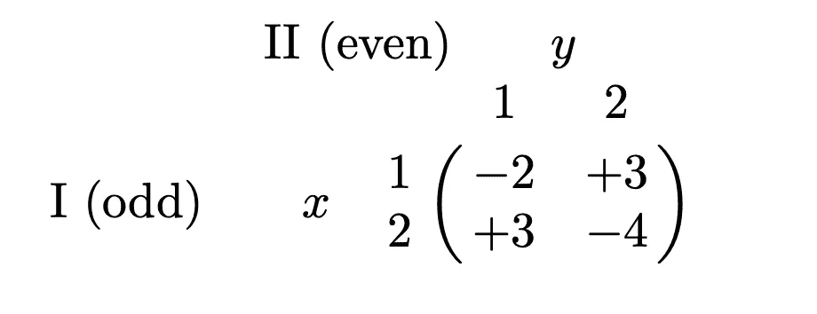
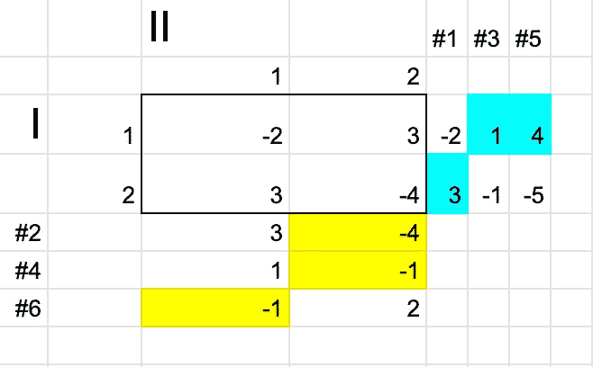
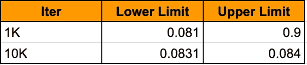

# 虚拟游戏介绍

> 原文：<https://towardsdatascience.com/introduction-to-fictitious-play-12a8bc4ed1bb?source=collection_archive---------16----------------------->

理解强化学习中自我游戏的第一步

Photo by [Mpho Mojapelo](https://unsplash.com/@mpho_mojapelo?utm_source=medium&utm_medium=referral) on [Unsplash](https://unsplash.com?utm_source=medium&utm_medium=referral)

**更新**:学习和练习强化学习的最好方式是去 http://rl-lab.com

虚拟游戏是一个博弈论概念。它包括分析游戏，找出在零和游戏中面对对手时采取的最佳策略。

这通常是一个沉重的主题，所以我们将从一些重要的定义开始，然后我们将解释虚拟游戏算法。

## 零和对策

零和游戏是一种游戏，其中一个玩家获得的分数是其他玩家的损失。以这种方式，归属于玩家的所有分数的总和等于零。例如，如果玩家 I 赢了 5 分，那么玩家 II 输了 5 分。

## 游戏价值

游戏价值(V)是玩家在玩了足够多的次数后，平均期望赢得(或输掉)的点数、金钱、信用等。如果 V 为正，我们认为它有利于参与人 I(所以参与人 II 必须支付)，如果 V 为负，我们认为它有利于支付者 II(所以参与人 I 必须支付)。

## 纳什均衡

纳什均衡是一种状态，在这种状态下，任何参与者都没有兴趣改变自己的策略，因为任何改变都会遭到他人的反击。纳什均衡并不意味着最优均衡，一个或多个参与者可能会有一个对他们更有利的策略，但他们不能采用的原因是因为对手(假设足够聪明)会反击他们，最终结果会变得不利。你可以认为这是一个僵局，但它也可能对所有人都有利。
一个简单的例子是想象两个强盗把他们的抢劫分成两半。如果其中一人向警方告发另一人，他可以得到全部赃物，但他没有兴趣这样做，因为另一个人也会告发他，他们最终都会进监狱。所以一分为二对他们俩来说都是最好的解决方案。

## 为什么我们要在人工智能中寻找纳什均衡？

理论上，纳什均衡将保证平均没有损失。这意味着在相当多的游戏中，平均而言，人工智能将会平局或获胜。

然而，在实践中，这是比较乐观的。当与人类对战时，人类玩家很有可能会在某一点上犯错误，而人工智能会利用这一点来获胜。

另一个重要的问题是，为什么人工智能不寻求纳什均衡，而是研究人类的策略，并利用它来获胜。这种方法的风险是，人类可以学会欺骗人工智能，给它一种他们正在使用某种策略的印象，然后切换到另一种策略。
例如假设在游戏石头剪刀布中，人类连续给出 3 把剪刀，这导致 AI 假设这是人类的策略。下一步，AI 会用石头反击，但是人类(放置陷阱的人)会用纸。
所以这个游戏中的最佳策略是坚持纳什均衡，使用随机策略(随机选择物品)。

## 虚拟游戏

虚拟博弈是乔治·w·布朗在 1951 年定义的一种方法，它由零和博弈组成，每个参与者对对手的策略做出最佳反应。该方法的目的是以迭代的方式找到游戏值。
通常，当问题变得复杂时，迭代法比解析法更容易计算。

虚拟方法被证明收敛于理论博弈值(V)。还证明了在两人零和博弈中**虚拟博弈收敛于纳什均衡。**

## 玩虚拟游戏

考虑下面的奇数或偶数游戏:
两个玩家 I 和 II 各自可以抽取数字“1”或“2”，如果抽取的数字之和是偶数，玩家 I 向玩家 II 支付该和，在下面的矩阵中用(-2 和-4)表示，如果该和是奇数，则玩家 II 向玩家 I 支付该和，用(+3 和+3)表示。

这个问题可以用解析的方法来解决，如果玩家 I 以 7/12 的概率玩“1”，以 5/12 的概率玩“2”，那么平均来说，玩家 I 会赢 1/12(这个方法的细节在这里并不重要)。

下图详细描述了迭代是如何展开的:

迭代#1 参与人 I 对抗选择“1”的参与人 II 的行动，参与人 I 的目标是最大化他的收益，所以他选择“2”，它的值是 max(-2，3) = 3。选择的值用青色标记。

在迭代#2 中，参与人 II 必须对抗选择“2”的参与人 I，他的目标是最小化参与人 I 的收益，所以他选择“2”，导致 min(3，-4) = -4。选择的值用黄色标记。

迭代#3，参与人 I 通过选择画“1”或“2”来对抗参与人 II，数值将取自第二列(记住参与人 II 在前一次迭代中选择了“2”)。这一列的值会加到参与人 I 的期望值上，意思是(-2+3 = 1；3 -4 = -1).所以从这些期望值中，参与人 I 必须选择对他最好的+1，所以他抽取相应的数字“1”(PS“1”不是抽取的数字，而+1 是收益)。

迭代#4，参与人 II 必须从第一行开始选择(因为参与人 I 选了“1”)。所以他把这些值加到他已经有的值上(3–2 = 1；-4+3=-1)所以他画“2”，以此类推…

这样做的次数足够多，就会导致值太接近游戏值。

以下是明确的步骤:

1.  选择一列并写在网格的右边。
2.  选择最大值并将其行写在底部。
3.  选择该行的最小值，将其列与右边的值相加，写出总和。
4.  选择该列的最大值，将其行与底部的值相加，写出总和。
5.  根据需要重复步骤 3 和 4。
6.  计算下限(L)和上限(U ),方法是取最后选择的值并除以迭代次数。这将给出游戏值(V)的范围，例如 L ≤ V ≤ U

以下代码将帮助您了解算法的工作原理:

Javascript implementation of Odd/Even game Fictitious Play. It can be easily tested using any online JS editor

在马克斯 _ITER = 1000 和马克斯 _ITER = 10000 的情况下运行上述代码会产生以下结果:

记住理论博弈值是 1/12 = 0.083333…这显然在迭代法的下限和上限之内。

## 结论

这篇文章以简单的方式解释了虚拟游戏算法，但没有提到任何与深度学习或神经网络相关的内容，这些内容将是未来文章的主题。

## 相关文章

[神经虚构自演](/neural-fictitious-self-play-800612b4a53f)
[神经虚构自演](/fictitious-self-play-30b76e30ec6a)