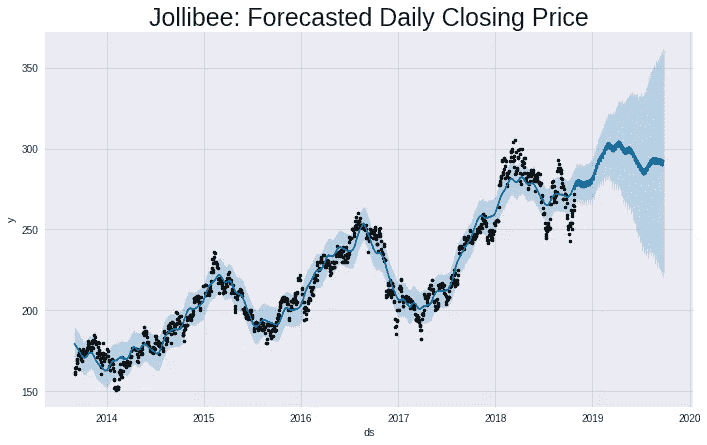

# 介绍使用脸书的先知预测菲律宾股票价格

> 原文：<https://towardsdatascience.com/introduction-to-forecasting-philippine-stock-prices-fd4df5dad9c3?source=collection_archive---------9----------------------->

## 预测菲律宾 Jollibee Food Corp (JFC)公司股票价格的基本 python 工作流



我从大学开始就在菲律宾从事股票交易，并立即确信这是一个预测模型非常有用的领域。为什么？因为你在股市赚钱的能力取决于你预测未来价格的能力。

在本文中，我将使用 python 上强大的 Prophet 包演示一种快速预测菲律宾股票 Jollibee Foods Corporation (JFC)每日收盘价的方法。Prophet 是脸书公司开发的一款开源预测工具，它可以将标准的预测工作流程从通常需要几天或几周的时间缩短到几分钟(假设你已经有了正确格式的数据)。

所有相关数据和代码可在本[回购](https://github.com/enzoampil/data-science-demos)的*时序*目录中找到。

我们将遵循以下工作流程:

1.  安装并导入必要的软件包
2.  获取数据
3.  绘制时间序列
4.  训练先知模型
5.  预测未来！
6.  评估准确性

我们开始吧！

# 1.安装并导入必要的软件包

只是先知+基础。

```
# Run these on your terminal
pip install pandas
pip install datetime
pip install fbprophet
pip install numpy
pip install matplotlib# Alternatively, you can run these from jupyter this way
!pip install pandas
!pip install datetime
!pip install fbprophet
!pip install numpy
!pip install matplotlib
```

# 2.获取数据

我们所需要的是一个文件，我们可以读入 python 作为熊猫数据帧，其中包含 2 列对应于股票的收盘价和日期。

对于这个介绍，我在这个[回购](https://github.com/enzoampil/data-science-demos)的*时间序列*目录中保存了一份 JFC 从 2013 年 9 月 1 日到 2019 年 4 月 26 日的收盘价(以及这里的其余代码)。我们可以通过克隆这个 [repo](https://github.com/enzoampil/data-science-demos) 并导航到*时序*目录来访问数据。

```
# Run these on your terminal
git clone [https://github.com/enzoampil/data-science-demos.git](https://github.com/enzoampil/data-science-demos.git)
cd data-science-demos/time-series# Alternatively, you can run these from jupyter this way
!git clone [https://github.com/enzoampil/data-science-demos.git](https://github.com/enzoampil/data-science-demos.git)
!cd data-science-demos/time-series# Read the JFC data (csv) as a pandas DataFrame
jfc = pd.read_csv("[jfc_20130901_to_20190426.csv](https://github.com/enzoampil/data-science-demos/blob/master/time-series/jfc_20130901_to_20190426.csv)")# Convert the date column to datetime format
jfc['CHART_DATE'] = pd.to_datetime(jfc.CHART_DATE)
```

# 3.绘制时间序列

为此，我们可以使用直接从 pandas 数据框架中访问的基本绘图功能。

```
# Plot the time series
# 'CHART_DATE' is the date and 'CLOSE' is the closing price
jfc.set_index('CHART_DATE').CLOSE.plot(figsize=(15, 10))
plt.title('Jollibee Daily Closing Price', fontsize=25)
```


你会注意到，JFC 的收盘价在上升和下降的周期中波动，但整体趋势仍在上升。Prophet 的优势之一是，在进行预测时，它可以自动考虑趋势中发现的季节性。

# 4.训练先知模型

现在，我们可以训练先知模型了！要做到这一点，我们必须首先过滤数据框架，使其只有两列:日期，“CHART_DATE”和收盘价“CLOSE”。然后，我们将它们的名称分别改为“ds”和“y ”,因为 Prophet 会自动将“ds”列读取为日期，将“y”列读取为被预测的变量。最后，我们根据训练数据训练模型，训练数据是指在指定的维持期开始之前的数据。在这种情况下，“HOLDOUT_START”是对应于保持期开始的日期(设置为 2019-03-01)。

请注意，维持期的数据将被视为我们的验证集，并将用于评估已训练的 Prophet 模型的性能。

```
# Set holdout (validation) set start
HOLDOUT_START = '2019-03-01'# Import the Prophet package
from fbprophet import Prophet# Filter to only the date and closing price columns
ts = jfc[['CHART_DATE', 'CLOSE']]# Rename the date and closing price columns to 'ds', and 'y', respectively
# We do this since prophet automatically reads the 'ds' column as the date and the 'y' column as the variable that we are forecasting
ts.columns = ['ds', 'y']# Fit the Prophet model to the training data (before the start of the holdout set)
# We set daily_seasonality and yearly_seasonality to True to account for daily and yearly seasonality, respectively
m = Prophet(daily_seasonality=True, yearly_seasonality=True).fit(ts[ts.ds < HOLDOUT_START])
```

# 5.预测未来！

在 Prophet 中，我们首先创建一个未来数据帧*，*，在这里我们指定我们想要预测的未来有多远；在本例中，我们将其设置为 336 天。接下来，我们调用在已训练的 prophet 模型中找到的 predict 方法(使用未来数据帧作为参数),这将返回预测。

```
# Set the forecast period, "periods", in the specified unit, "freq"
# In this case, we're predicting 336 days into the future
future = m.make_future_dataframe(periods=7*4*12, freq='D')# Make the actual predictions
pred = m.predict(future)# Visualise the predictions using Prophet's plotting method
from matplotlib import pyplot as plt
fig1 = m.plot(pred)
plt.title('Jollibee: Forecasted Daily Closing Price', fontsize=25)
```


预测以及历史收盘价如上所示。蓝线对应于预测的收盘价，而黑点对应于训练集中的历史收盘价。抵制期的预测收盘价表明价格将在该期间(2019 年 3 月 1 日至 2019 年 4 月 26 日)下跌。

蓝色阴影区域对应于预测的 95%置信区间。您会注意到，距离更远的预测也具有更宽的预测置信区间。

# 6.评估准确性

为了评估我们训练的 Prophet 模型的准确性，我们将计算我们对 2019 年 3 月 1 日至 2019 年 4 月 26 日的维持集的预测的均方根误差(RMSE)。为了更详细地展示业绩，我们还绘制了 57 天维持期的预测 JFC 收盘价与实际 JFC 收盘价的对比图。

```
# Concatenate holdout (validation) set predictions and targets into one dataframe for easy comparison
pred_holdout = pred[(pred.ds >= HOLDOUT_START)&(pred.ds <= ts.ds.max())].set_index('ds').yhat
target_holdout = ts[ts.ds >= HOLDOUT_START].set_index('ds')
comb = pd.concat([pred_holdout, target_holdout], axis=1).dropna()# Calculate root mean squared error (RMSE)
import numpy as np
rmse_holdout = np.sqrt(comb.yhat.subtract(comb.y).pow(2).mean())# Plot predicted vs target while displaying accuracy based on rmse
comb.columns = ['Predicted', 'Actual']
comb.plot(figsize=(15, 10))
plt.title('Predicted (yhat) vs Actual (y) JFC Closing Price \n Validation Set RMSE: {}'.format(rmse_holdout), fontsize=25)
```


如前所述，维持集的预测价格(蓝色)表明，在维持集的持续时间内，价格会整体下降。有趣的是，实际价格(橙色)也显示了 JFC 收盘价的总体下降，尽管比预测的要快。

此外，短期运动似乎也反映在预测中。实际趋势显示，到 4 月 8 日开始上升，然后在 4 月 26 日开始下降。预测再次显示了类似的变化，尽管没有那么剧烈。

计算出的均方根误差(RMSE)为 5.56，这告诉我们，对于 2019 年 3 月 1 日至 2019 年 4 月 26 日的坚守期，Prophet 模型的 JFC 收盘价预测平均误差为 5.56 PHP。这个误差足够小，让我们相信预测吗？这将取决于我们承担风险的意愿，但保守的经验法则是，即使在预期价格向下偏离预测价格的情况下，也只根据显示盈利机会的预测进行交易。

# 下一步是什么？

恭喜你！您现在知道如何使用强大的 Prophet 包执行基本的预测工作流。这包括以下步骤:1)安装和导入必要的软件包，2)获取数据，3)绘制时间序列，4)训练 Prophet 模型，5)使用该模型预测未来，最后，6)评估准确性。除了预测股票价格之外，还可以使用其他预测模型和用例来应用相同的工作流。

值得注意的是，仍有许多方法可以改进我们当前的预测工作流程:

1.  **利用外生变量和衍生指标进行预测。**我们可以明确说明股票过去收盘价以外的信息(外生变量)。例如股票的交易量、其他股票的价格和交易量、利率、通货膨胀、最近发布的广告的成功以及其他衍生指标，如波动性、RSI、短期&长期移动平均线等。
2.  **识别可能引发价格波动的事件。**例如与公司相关的公告(通常在 twitter 上披露),如绩效、合并&收购、新法律等。我们可以专门对这些进行建模，以估计它们对价格的影响。
3.  **试验其他强大的模型。**我经常使用 Prophet 作为基准，但最终还是使用了其他性能超过基准模型的模型。例如梯度推进机器(如 LightGBM)、深度学习模型(如 LSTM RNNs)和其他前沿时间序列模型(如 TBATS、SARIMAX)。
4.  **提高预测模型不确定性的准确性。除了点预测的性能，更重要的是预测不确定性的准确性，这可以指导我们知道何时更信任模型的预测。这是最近研究的一个焦点，一些[已经成功地创建了模型，这些模型准确地预测了 95%的置信区间，实际上覆盖了 95%的目标。](https://eng.uber.com/neural-networks-uncertainty-estimation/)**
5.  通过模拟引擎可视化估计的影响。通过创建能够解释外部因素和事件的模型，我们可以将这些模型转化为模拟引擎，以可视化不同情景下价格的变化(即情景分析)。例如，如果明年经济衰退，利率上升 2%,价格会如何？

以上只是改进我们当前预测工作流程的许多方法中的一部分，我计划在未来的博客文章中详细讨论这些方法。如果你对从哪一个开始有任何建议，请随时评论或发电子邮件给我，地址是 lorenzo.ampil@gmail.com*。敬请期待！*

****来自《走向数据科学》编辑的提示:*** *虽然我们允许独立作者根据我们的* [*规则和指导方针*](/questions-96667b06af5) *发表文章，但我们并不认可每个作者的贡献。你不应该在没有寻求专业建议的情况下依赖一个作者的作品。详见我们的* [*读者术语*](/readers-terms-b5d780a700a4) *。**