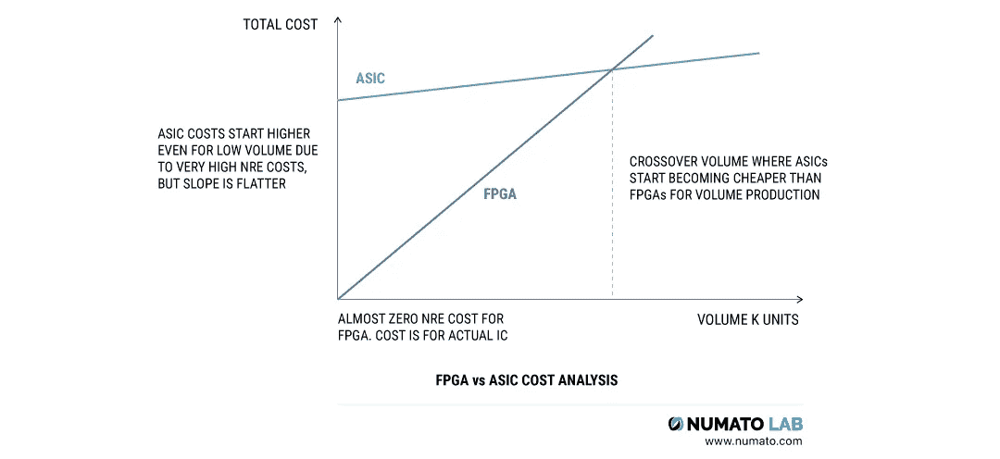
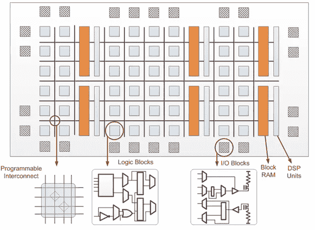
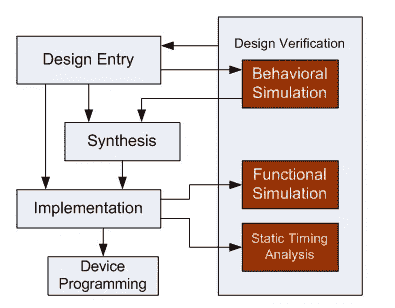
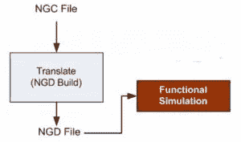
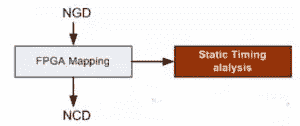
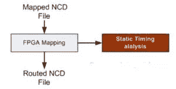

# FPGA 及其架构介绍

> 原文：<https://towardsdatascience.com/introduction-to-fpga-and-its-architecture-20a62c14421c?source=collection_archive---------6----------------------->

不久以前，大多数软件都是和它们各自的硬件一起永久发布的，没有办法改变它。但是随着技术的成熟，制造商找到了在现有硬件上增加新功能的方法。

现在，想象一下硬件更新也成为可能的未来——这难道不令人着迷吗？

这种可编程硬件的子系统配置甚至可以在制造后修改，属于可重构系统的范畴。而支持可重构计算的最主要的集成电路是 **FPGA** ，是**F**field**P**可编程 **G** ate **A** rray 的缩写。

FPGA 使您能够对产品功能进行编程，适应新标准，并针对特定应用重新配置硬件，即使产品已经现场安装——因此有术语“*现场可编程*”。而“*门阵列*指的是其架构中存在的二维逻辑门阵列。

所有现代个人计算机，包括台式机、笔记本电脑、智能手机和平板电脑，都是通用计算机的例子。通用计算结合了“冯·诺依曼”方法，该方法指出取指令和数据操作不能同时发生。因此，作为顺序机器，它们的性能也是有限的。

另一方面，我们有专用集成电路(ASICs ),它们是为特定任务定制的，如数字录音机或高效比特币挖矿机。ASIC 使用空间方法仅实现一个应用程序，并提供最佳性能。但是，除了最初设计的任务之外，它不能用于其他任务。

那么，如何用 ASICs 的性能换取通用处理器的灵活性呢？

> 嗯…
> 
> FPGAs 充当了这两种架构模式之间的中间地带！

话虽如此，FPGAs 与 ASICs 相比能效较低，也不适合大批量生产。然而，与 ASIC 相比，它们是可重新编程的，并且具有较低的 NRE 成本。

你看，ASICs 和 FPGAs 有不同的价值主张。大多数器件制造商通常更倾向于使用 FPGAs 进行原型开发，使用 ASICs 进行大批量生产。

Photo by [numato.com](https://numato.com/help/wp-content/uploads/2018/07/How-to-select-the-best-FPGA1-2.png)

过去，FPGA 常常被选择用于较低的速度和复杂的设计，但现在 FPGA 可以轻松超过 500 MHz 的性能基准。

# FPGA 的内部架构

1985 年，一家名为 [Xilinx](https://www.xilinx.com/) 的半导体制造公司发明了第一个商业上可行的 FPGA——xc 2064。另一家公司 [Altera](https://en.wikipedia.org/wiki/Altera) ，于 2015 年被[英特尔](https://www.intel.com/)收购，也与 Xilinx 一起推动了这个市场的发展。

FPGA 源于相对简单的技术，如可编程只读存储器(PROM)和可编程逻辑器件(PLD)，如 PAL、PLA 或复杂 PLD (CPLD)。

它由三个主要部分组成:

*   *可配置逻辑块*——实现逻辑功能。
*   *可编程互连*——实现路由。
*   *可编程* *I* / *O 块*——与外部元件连接。

The basic architecture of an FPGA

逻辑模块实现设计所需的逻辑功能，由晶体管对、查找表(lut)、触发器和多路复用器等各种元件组成。

您可以将逻辑块视为独立的模块，就像可以并行操作的乐高积木一样。与乐高积木不同，逻辑积木是可配置的，即其内部状态可以控制，您可以通过对互连进行编程来将它们连接在一起，以便构建有意义的东西。

这种可编程互连的层次结构用于在可配置逻辑块(clb)之间分配资源；其中布线路径包含可以通过反熔丝或基于存储器的技术连接的不同长度的线段。

每个 CLB 都连接到一个交换矩阵，以访问通用路由结构。开关矩阵提供可编程多路复用器，用于选择给定路由通道中的信号，从而连接垂直和水平线路。

最后，I/O 模块(iob)用于将 clb 和路由架构与外部元件连接。

在早期的 FPGAs 中，没有处理器来运行任何软件；因此，实现应用意味着从头开始设计电路。因此，我们可以将 FPGA 配置为像或门一样简单，或者像多核处理器一样复杂。

但是，自 XC2064 以来，我们已经取得了长足的进步，基本 FPGA 架构已经通过添加更专业的可编程功能模块得到了发展，如 alu、块 RAM、多路复用器、DSP-48 和微处理器。

# FPGA 设计流程

设计流程说明了在物理板上实现和编程任何给定逻辑的流水线。我选择将这个设计流程命名为 FPGA 开发生命周期或 FDLC，因为它类似于 SDLC。

FPGA 架构设计流程包括设计输入、逻辑综合、设计实现、器件编程和设计验证。然而，具体步骤因制造商而异。

## 设计条目

可以使用原理图编辑器、有限状态机(FSM)编辑器或硬件描述语言(HDL)来描述逻辑。这是通过从给定库中选择组件并提供设计功能到所选计算模块的直接映射来实现的。

当具有大量功能的设计变得难以图形化管理时，HDL 可以用于以结构或行为的方式捕获设计。除了 VHDL 和 Verilog 这两种最成熟的 HDL 之外，还有几种类似 C 的语言可用，比如 Handel-C、Impulse C 和 SystemC。

## 逻辑综合

该过程将上述 VHDL 代码翻译成用于描述具有逻辑元件的完整电路的设备网表格式。综合包括检查代码语法和分析设计架构的层次结构。接下来，代码随着优化被编译，生成的网表被保存为 ***。ngc*** 文件。

## 设计实施

设计实施过程包括以下步骤:

*   **翻译**:该过程将所有输入的网表合并成逻辑设计文件，保存为 ***。ngd* 文件**文件。这里，用户约束文件将端口分配给物理元素。

*   **映射**:这包括映射由。ngd 文件转换成 FPGA 的组件然后生成一个 ***。ncd* 文件**文件。

*   **放置和布线**:这里的布线根据约束将上述过程中的子模块放置到逻辑模块中，然后连接这些模块。

## 设备编程

上述布线设计必须被加载并转换成 FPGA 支持的格式。于是，被击溃的 ***。ncd*** 文件交给 BitGen 程序，BitGen 程序生成包含 FPGA 所有编程信息的比特流文件。

## 设计验证

这与设计流程一起完成，以确保逻辑行为符合预期。这一过程涉及以下模拟:

*   **行为模拟(RTL 模拟)**
*   **功能模拟**
*   **静态时序模拟**

进行这些模拟是为了通过向设计的输入提供测试模式并观察输出来仿真组件的行为。

# FPGA 的未来

行业趋势正在推动 FPGAs 在异构计算模式中发挥重要作用。在这里，异构计算指的是使用多种类型的处理器来执行专门处理功能的系统。所有这些不同的处理器，包括 FPGAs，都可以通过 OpenCL 进行编程，OpenCL 是一个行业标准开发平台。

事实上，FPGA 提供了经济高效的并行计算能力，这使得它适合快速原型制作。在测试神经网络时，有些情况下 FPGA 也优于 GPU。虽然 GPU 可能适合训练，但当涉及到实时应用时，FPGA 更具适应性。事实上，微软已经在通过微软 Azure 云服务来加速人工智能。

> 🔌简而言之…
> 
> 从汽车到加密，从芯片开发到人工智能推理模型，FPGAs 提供了一定的通用性，吸引了广泛的用户，从而使未来看起来更光明！