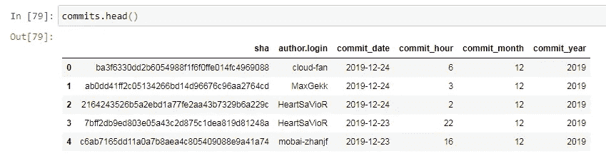

# Python 中 Git 数据提取和分析简介

> 原文：<https://towardsdatascience.com/introduction-to-git-data-extraction-and-analysis-in-python-e7e2bf9b4606?source=collection_archive---------10----------------------->

## 从 Github REST API 中提取 Git 数据并在 Pandas 和 Plotly 中执行数据分析


Photo by [Colby Thomas](https://unsplash.com/@coloradocolby?utm_source=medium&utm_medium=referral) on [Unsplash](https://unsplash.com?utm_source=medium&utm_medium=referral)

软件行业有没有人没用过或者至少听说过 Git？

Git 是一个革命性的工具，如今在软件团队中无处不在。本文的目的并不是介绍 git，有大量的资源可以指导您完成这个过程。它的目的是分析 git 相关数据，以便从这些数据中获得重要的见解。

在整篇文章中，我们将使用 Github REST API 提取 Git 相关数据，然后利用 Python 的顶级数据分析库 ***【熊猫】*** 以及广受欢迎的交互式数据可视化库 ***Plotly*** 来分析这些数据。我们将以 [Apache Spark](https://github.com/apache/spark) 的存储库为例。

# Git 数据提取

Git 存储库通常存储在源代码托管设施中。其中最流行的是 Github 和 Bitbucket，但是也有很多其他的，比如 Gitea、GitLab 等等。在本文中，我们将重点关注 Github，但是其他托管设施的数据提取过程应该也是类似的。

Github 提供了一个 REST API，其中包含了所有 git 相关资源的端点。为了能够使用 Github APIs，我们需要在 Github Profile 页面的开发者设置中生成一个访问令牌。做完那件事后，我们应该都准备好了。我们启动 Jupyter 笔记本，首先导入必要的库:

我们将配置参数存储在一个单独的文件中，即 Github 用户名和我们之前生成的访问令牌。与 Github 交互的推荐方式是使用 API 创建一个会话，如下所示:

*哪些与 git 相关的实体可以提供关于 git 存储库进展的有价值的信息？*

**提交**是首先想到的，但也有其他的，如分支、拉请求、问题、贡献者列表等。假设我们需要检索给定 git 存储库的提交列表。我们搜索 [Github API 文档](https://developer.github.com/v3/)并找到相应的 API 端点:

```
GET /repos/:owner/:repo/commits
```

这里我们需要提供所有者和存储库名称作为输入参数。我们可以像这样用 Python 调用上面的 API 端点:

`commits` 变量包含从 Github API 返回的响应。然后我们使用 json 包的`json()` 方法来反序列化上面的响应对象。然而，这个 API 调用只返回 30 个结果，这对应于默认情况下通过单个 Github API 响应返回的结果数。我们可以为 API 请求提供一个额外的参数，`per_page`,这允许我们将返回结果的数量增加到 100 个，但是我们试图从中提取数据的 Apache Spark 存储库有大约 26K 个提交！

别担心。Github 的家伙们提供了一个分页参数，称为`page`，它与`per_page`参数相结合，使我们能够提取任何 git 库的所有提交。现在，我们的 API 请求应该如下所示:

我们可以将提交提取过程封装在一个函数中，该函数将所有者和存储库名称作为参数，并返回一个提交列表:

为了控制遍历过程，在每次迭代中，我们检查响应头中的`Link`参数是否包含`rel="Next"`属性值，这告诉我们存在一个连续的页面，我们可以继续迭代；否则我们就此打住。为了更多地了解这种方法，你可以阅读 Github 文档中的[分页遍历](https://developer.github.com/v3/guides/traversing-with-pagination/)指南。

提取了列表中的提交后，我们现在可以从字典列表中生成 Pandas 数据帧，因此我们定义了以下函数来处理该任务:

`json_normalize`函数很好地做到了这一点，它将一个半结构化的 JSON(字典列表)规范化为一个平面表。我们现在通过为 Apache Spark git 存储库传递必要的参数来调用上面创建的函数:

对其他资源的提取执行相同的过程，所以我跳过这一部分，您可以在本文的 Github 资源库中浏览。我还添加了将结果存储在 CSV 文件或 SQLAlchemy 支持的数据库中的可能性，以便我们可以访问这些数据以供以后分析。

# 数据预处理

因此，我们将提交和分支以及其他资源存储在内存中(如果您愿意，也可以存储在 CSV 文件中)。下一步是预处理这些数据。

检查提交数据帧的结构，我们得到以下结果:


我们将删除这些列中的大部分，更重要的是，我们将生成一些数据分析过程所需的与时间相关的列。以下代码将提交日期字段转换为日期时间字段，并利用`dt` 访问器对象获取熊猫系列的类似日期时间的属性:

删除不必要的列后，我们的`commits.head` 方法返回:



# Git 数据分析

现在，我们转向数据科学领域的精彩部分——数据分析和数据可视化。Spark 资源库的贡献者总数是多少？


一个很好的洞察是一天中每个小时提交的分布情况。我们可以计算这个度量，因为我们已经为存储库的每次提交生成了一天中的某个小时。熊猫的代码是:

现在是时候可视化一些数据了。Plotly Python 库( [plotly.py](https://plot.ly/python/) )是一个交互式、[开源](https://github.com/plotly/plotly.py)绘图库，支持 40 多种独特的图表类型，涵盖了广泛的统计、金融、地理、科学和三维用例。作为一个[声明式编程](https://en.wikipedia.org/wiki/Declarative_programming)库，Plotly 允许我们编写代码来描述*我们想要制作什么*，而不是*如何制作*。这大大减少了构建图表所花费的时间，并使我们更加专注于展示和解释结果。

标准 plotly 导入以及离线运行的设置如下:

回到我们有趣的每小时提交量指标，生成条形图所需的代码如下:


从图表中，我们注意到大部分的贡献都是在晚上提交的:)。在一天的工作时间里，活动较少。

随着时间的推移，Spark 存储库进展如何？这些年来它的活动是什么？让我们创建一个时序图并检查它。


事实证明，Spark repository 在 2015 年至 2016 年期间出现了活动高峰。但是我们能证明这个假设吗？当然可以！我们将计算每年的*日均提交数量，以验证 2015 年和 2016 年是否是 Spark 存储库最活跃的年份。*


上面的图表清楚地显示，存储库在 2015 年达到顶点，此后一直下降到 2017 年。从那时起，我们看到每年的日均提交数量保持稳定，并且直到撰写本文时，这种趋势一直存在。

谁是 Spark 存储库的主要贡献者？让我们找出它。


作为一个非常活跃的存储库，Spark 也有很多开放的拉取请求。通常，拉请求由一些预定义的关键字标记。下面的条形图显示了每个标签的拉取请求数:


很明显，最活跃的贡献者正在从事与 SQL 相关的功能。最后，Spark 是一个数据框架，允许对数 Pb 的数据进行类似 SQL 的操作。

# 恭喜


Photo by [Ian Stauffer](https://unsplash.com/@ianstauffer?utm_source=medium&utm_medium=referral) on [Unsplash](https://unsplash.com?utm_source=medium&utm_medium=referral)

您已到达这篇文章的结尾。在本指南中，我们学习了以下重要概念:

*   通过 Github API 在 Python 中提取数据
*   预处理 git 数据
*   使用 Pandas 和 Plotly 执行交互式分析和数据可视化

下面是我们在这篇文章中运行的所有内容的完整代码:

[](https://github.com/xhentilokaraj/git-statistics) [## xhentilokaraj/git-统计

### 这是一个基于 git 库生成统计数据的迷你项目。已经有把 Github 当版本了…

github.com](https://github.com/xhentilokaraj/git-statistics) 

***感谢*** *的阅读！如果你想与我取得联系，请随时通过 xhentilokaraj@gmail.com 或我的* [*LinkedIn 个人资料*](https://al.linkedin.com/in/xhentilo-karaj-66227aa7) *联系我。*