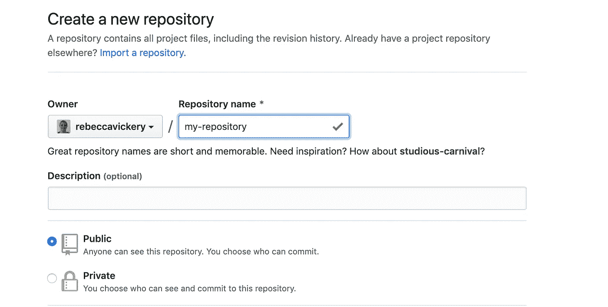
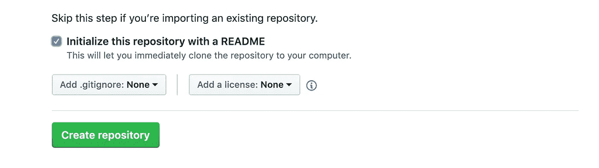
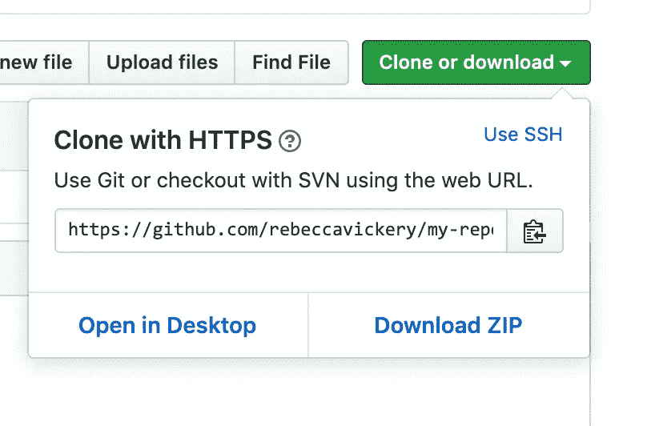
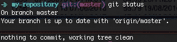
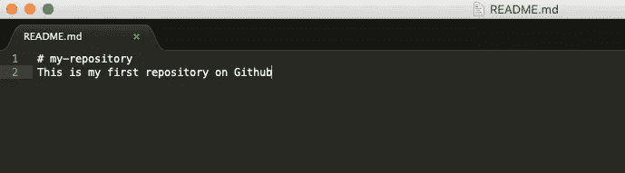
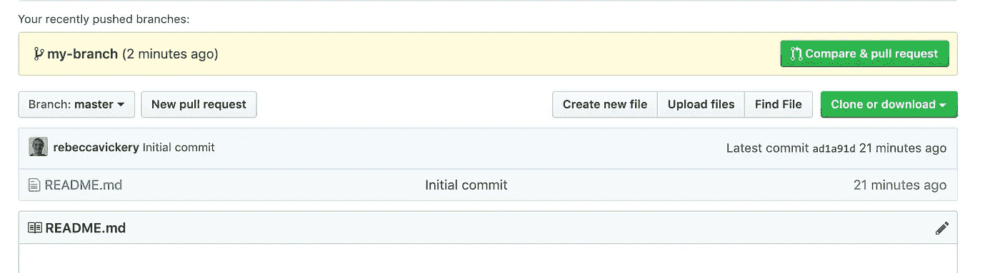
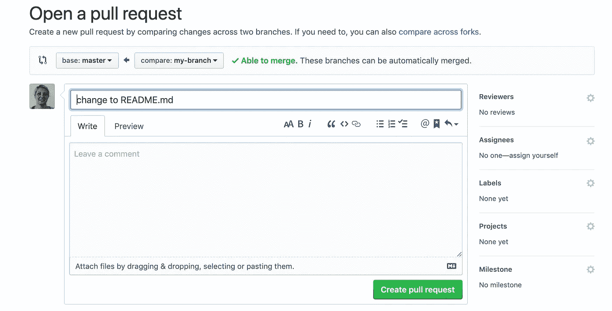
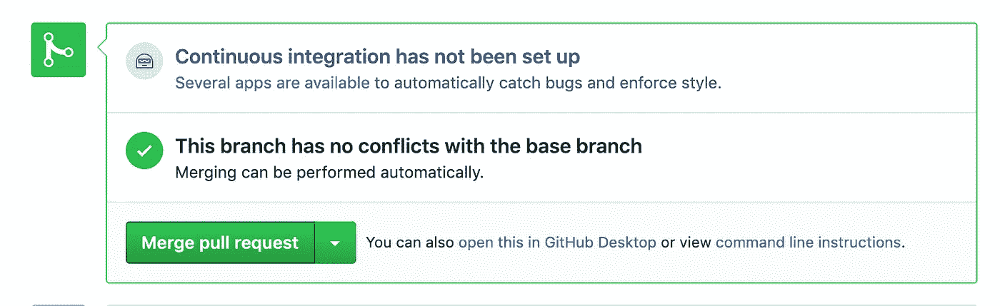
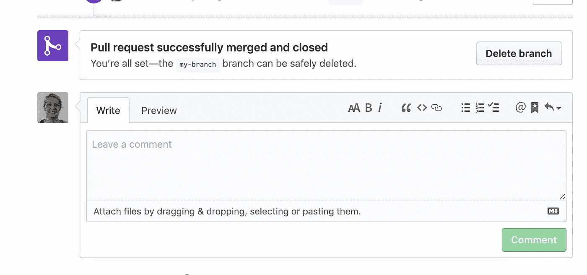

# 面向数据科学家的 Github 简介

> 原文：<https://towardsdatascience.com/introduction-to-github-for-data-scientists-2cf8b9b25fba?source=collection_archive---------6----------------------->

## 掌握 Github 的基础知识


Photo by [Hack Capital](https://unsplash.com/@hackcapital?utm_source=unsplash&utm_medium=referral&utm_content=creditCopyText) on [Unsplash](https://unsplash.com/search/photos/code?utm_source=unsplash&utm_medium=referral&utm_content=creditCopyText)

对版本控制的体验正迅速成为所有数据科学家的要求。版本控制可以帮助数据科学家更好地作为一个团队工作，促进项目协作，共享工作，并帮助其他数据科学家重复相同或相似的过程。即使您是一名独立工作的数据科学家，在合并到当前项目之前，能够先回滚更改或对分支进行更改，并测试您的更改不会破坏任何东西，这总是有用的。在接下来的文章中，我将讲述以下内容:

1.  什么是 Github？
2.  为什么数据科学家需要使用它？
3.  如何创建和克隆存储库
4.  分支
5.  拉取请求

## 什么是 Github？

[Github](https://github.com/) 是版本控制最知名和最广泛使用的平台之一。Github 使用一个名为 Git 的应用程序对代码进行版本控制。项目文件存储在一个称为存储库的中央远程位置。每次你在你的机器上做了一个本地的修改，然后推送到 Github，你的远程版本就会被更新，提交的内容会被记录下来。如果您想在提交之前回滚到项目的前一个版本，该记录允许您这样做。

此外，由于项目文件存储在远程位置，任何其他人都可以下载回购协议并对项目进行更改。分支的概念，本质上意味着你制作一个完全独立的项目的临时副本，意味着你可以首先在那里进行修改，而不用担心破坏任何东西。如果您从事的项目中有一个功能依赖于代码工作，这一点尤其重要。

> 这个[页面](https://help.github.com/en/articles/github-glossary)涵盖了我在本文中使用的所有关键术语的含义，比如提交、分支和存储库。

## 为什么数据科学家需要使用它？

数据科学家需要使用 Github 的原因和软件工程师一样——为了协作,“安全地”对项目进行更改，并能够随着时间的推移跟踪和回滚更改。

传统上，数据科学家不一定必须使用 Github，因为将模型投入生产的过程(版本控制变得至关重要)通常被移交给软件或数据工程团队。然而，系统中有一个日益增长的趋势，这使得数据科学家更容易编写自己的代码来将模型投入生产——参见工具，如 [H20.ai](https://www.h2o.ai/) 和[谷歌云人工智能平台](https://cloud.google.com/ai-platform/)。因此，数据科学家熟练使用版本控制变得越来越重要。

## 创建存储库

我将简要介绍如何使用 Github 和 Git 从命令行执行最常见的操作。如果你还没有帐户，你需要注册一个(这是完全免费的！)[这里](https://github.com/)。

要从头开始创建存储库，请转到[https://github.com/](https://github.com/)并点击`new`按钮。


在接下来的页面上，您需要为您的项目键入一个名称，并选择是将其设为公共还是私有。



接下来，您要选中框`initialise with a README.md`并点击`create repository`。



现在，您可以添加并更改存储库中的文件了。要从命令行执行此操作，您首先需要按照这里的说明[下载并安装 Git](https://git-scm.com/downloads)。

要在本地处理项目，您首先需要克隆存储库。如果您想克隆其他人的项目来工作，您也可以遵循这个步骤。

```
cd my-directory
git clone [https://github.com/rebeccavickery/my-repository.git](https://github.com/rebeccavickery/my-repository.git)
```

您可以通过点击`clone or download`按钮找到存储库的 URL。



现在，一个新目录将出现在您当前的工作目录中，并与存储库同名。这是您的项目的本地版本。

## 分支

分支允许您制作存储库的副本，在那里进行更改，并在合并到主副本之前测试它们是否正常工作。最佳实践是始终在分支上进行更改，而不是在主分支上工作。

在创建分支之前，最好检查您的本地项目是否与远程存储库保持一致。您可以通过键入以下命令来检查状态:

```
git status
```



如果你不是最新的，你只需输入`git pull`。

要创建并签出一个分支，请键入以下内容。

```
git branch my-branch
git checkout my-branch
```

现在，您可以进行更改，在合并之前，这些更改不会影响远程存储库。让我们对`README.md`文件进行更改，并完成提交和合并更改的过程。

在首选文本编辑器中打开自述文件，并进行任何更改。我使用了[升华文本](https://www.sublimetext.com/)并在文件中添加了一行。



## 拉取请求

处理协作项目的最佳实践是使用拉式请求，因此我们将使用此流程合并我们的变更。“拉”请求是一个过程，它允许您或其他人在将更改合并到主版本之前检查您所做的更改。在打开拉取请求之前，您需要添加并提交您的更改。

```
git add .
git commit -m "change to README.md"
git push --set-upstream origin my-branch
```

您只需要在第一次从新分支推送时添加参数`---set-upstream origin my-branch`。

现在，您将在远程存储库中看到此消息。



点击`compare and pull request`，然后点击`create pull request`。



在这一点上，如果你和其他人或团队在项目上合作，你可能会要求别人检查你的修改。他们可以添加评论，当每个人都对更改感到满意时，您可以合并拉取请求



您的更改现在将被合并到主分支中。



如果你已经完成了分支，最好点击`delete branch`按钮删除它

使用 Github 会变得更加复杂，但是我想在这里做一个简单的介绍。为了更全面的了解，Github 制作了一套指南，可以在[这里](https://guides.github.com/)找到。