# 使用 Catboost 对决策树进行梯度提升的介绍

> 原文：<https://towardsdatascience.com/introduction-to-gradient-boosting-on-decision-trees-with-catboost-d511a9ccbd14?source=collection_archive---------2----------------------->

今天我想和大家分享我在[开源](https://github.com/catboost)机器学习库的经验，这个库是基于决策树的梯度推进，由俄罗斯搜索引擎公司 Yandex 开发的。

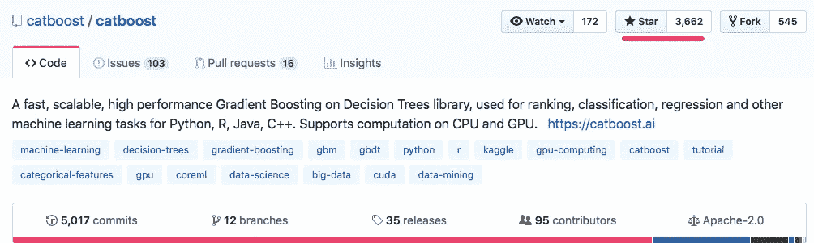

Github profile according to the 12th of February 2020

库是在 Apache 许可下发布的，并作为免费服务提供。


‘Cat’, by the way, is a shortening of ‘category’, Yandex is enjoying the play on words.

你可能熟悉梯度增强库，如 XGBoost、H2O 或 LightGBM，但在本教程中，我将快速概述梯度增强的基础，然后逐步转向更核心复杂的东西。

# 决策树简介

在谈论梯度推进之前，我将从决策树开始。树作为一种数据结构，在现实生活中有很多类比。它被用于许多领域，是决策过程的一个很好的代表。该树由根节点、决策节点和终端节点(不会被进一步分割的节点)组成。树通常是倒着画的，因为树叶在树的底部。决策树可以应用于回归和分类问题。

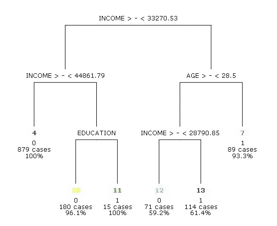

A simple decision tree used in scoring classification problem

在分类问题中，作为进行二元划分的标准，我们使用不同的指标——最常用的是基尼指数和交叉熵。基尼指数是对 K 个阶层总方差的一种衡量。在回归问题中，我们使用方差或与中位数的平均偏差

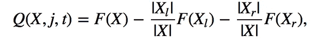

The functional whose value is maximized for finding the optimal partition at a given vertex

生长一棵树包括决定选择哪些特征和使用什么条件进行分割，以及知道何时停止。决策树往往非常复杂和过度拟合，这意味着训练集的误差将很低，但在验证集上却很高。更小的树和更少的分裂可能导致更低的方差和更好的解释，代价是一点点偏差。

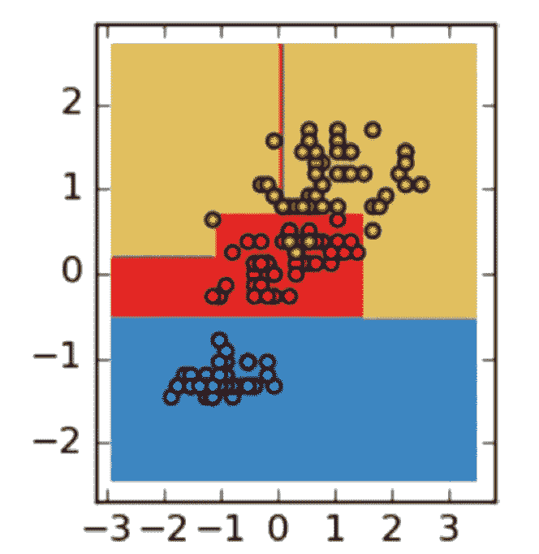

决策树在非线性依赖中表现出良好的结果。在上面的例子中，我们可以看到每个类的划分表面是分段常数，并且表面的每一边都平行于坐标轴，因为每个条件都将一个符号的值与阈值进行比较。

我们可以用两种方法来避免过度拟合:添加停止标准，或者使用树修剪。停止标准有助于决定，我们是否需要继续划分树，或者我们可以停止，把这个顶点变成一片叶子。例如，我们可以在每个节点中设置多个对象。如果 m > n，则继续划分树，否则停止。n = = 1——最差情况。

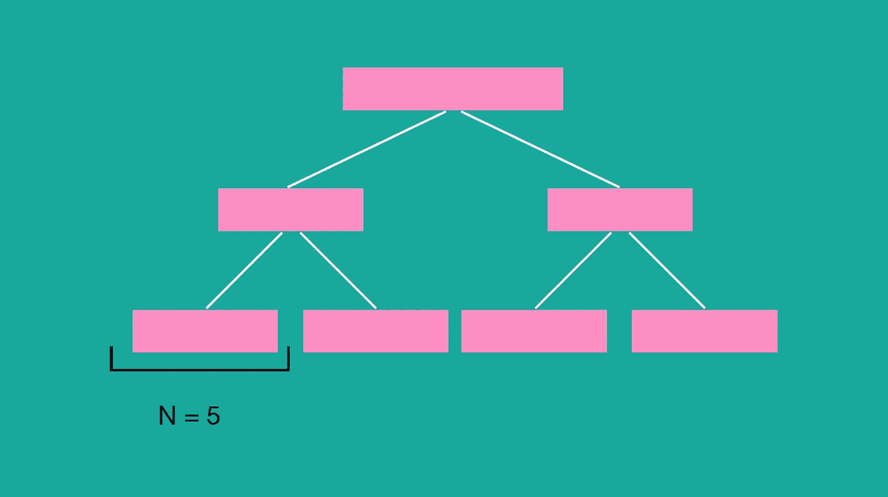

或者我们可以调整树的高度。

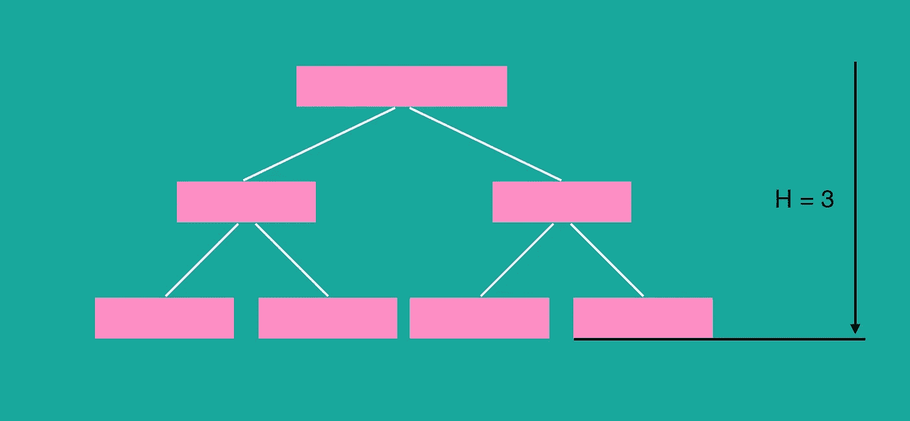

另一种方法是树修剪——我们构建一棵过度拟合的树，然后根据选择的标准删除叶子。修剪可以从根部开始，也可以从叶子开始。从一棵“完全成长”的树上移除树枝——得到一系列逐渐修剪的树。在交叉验证中，我们比较了有分裂和没有分裂的过度拟合树。如果没有这个节点结果更好，我们就排除它。有许多用于优化性能的树修剪技术，例如，减少错误修剪和成本复杂性修剪，其中学习参数(alpha)用于衡量是否可以根据子树的大小删除节点。

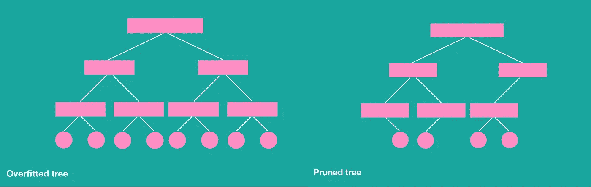

决策树受到高方差的影响。这意味着，如果我们将训练数据随机分成两部分，并对这两部分都使用决策树，我们得到的结果可能会非常不同。

# 合奏

然而，研究人员发现，结合不同的决策树可能会显示更好的结果。整体——当我们有一个 N 基算法时，最终算法的结果将是基算法结果的函数。我们结合一系列 k 学习模型来创建改进的模型。

有各种集成技术，如 boosting(用一组分类器进行加权投票)、bagging(对一组分类器的预测进行平均)和 stacking(组合一组异类分类器)。

为了构建树集成，我们需要在不同的样本上训练算法。但是我们不能在一台设备上训练它们。我们需要使用随机化在不同的数据集上训练分类。例如，我们可以使用 bootstrap。

误差的期望值是方差、偏差和噪声的总和。集合由具有低偏差和高方差的树组成。梯度推进算法的主要目标是保持构造具有低偏差的树。

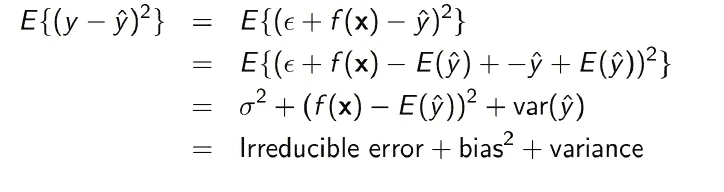

例如，我们需要基于带有噪声的 10 个点来近似右图中的格林函数。在左图中，我们显示了在不同样本上训练的策略。右图用红线显示了平均多项式。

我们可以看到，红色图形与绿色图形几乎相同，而算法分别与绿色函数有显著不同。下面的算法家族有**低偏差，但高方差。**

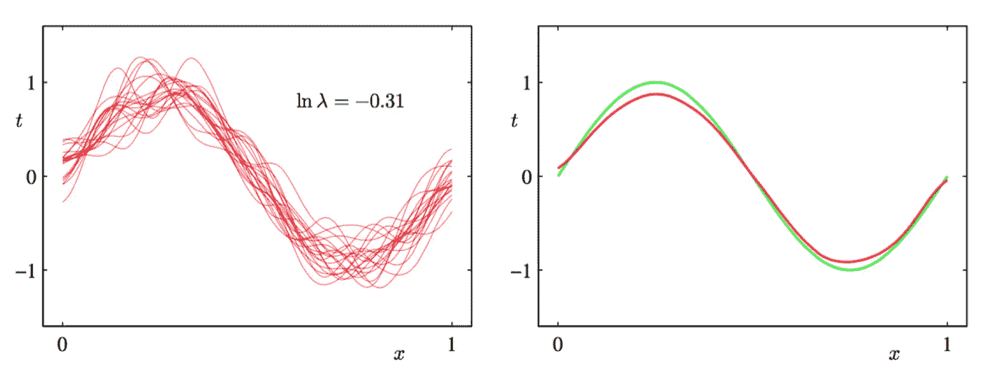

决策树的特点是低偏差但高方差，即使训练样本有很小的变化。总体方差是一个基本算法的方差除以算法数+基本算法之间的相关性。

## 随机森林算法

为了减少基算法之间相关性的影响，我们可以使用 **bagging** 算法和**随机子空间方法。**这种方法最显著的例子之一是随机森林分类器。这是一种基于随机子空间和 bagging 方法的算法，使用 CART 决策树作为基本算法。

随机子空间方法有助于降低树之间的相关性，避免过度拟合。让我们仔细看看:假设我们有一个数据集，有 D 个特征，L 个对象和 N 个基树。

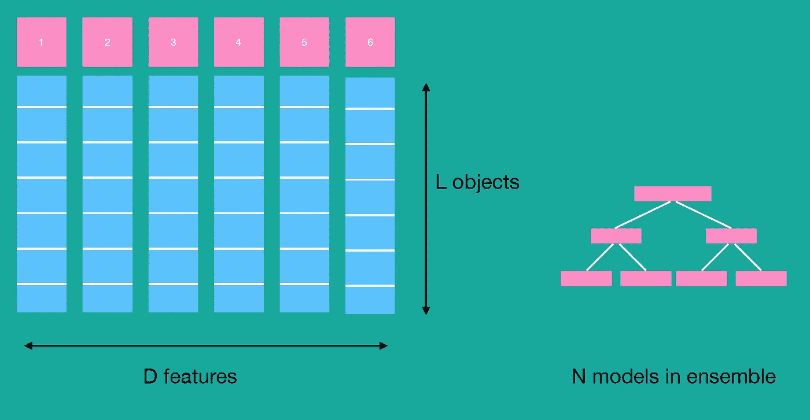

每个基本算法都适合来自 bootstrap 的样本。

我们从 D 中随机选择 D 个特征，构建树直到停止准则(我前面提到过)。通常我们用低偏差建立过度拟合的树。

回归问题的特征数 D 为 D/3，分类 sqrt 为(D)。

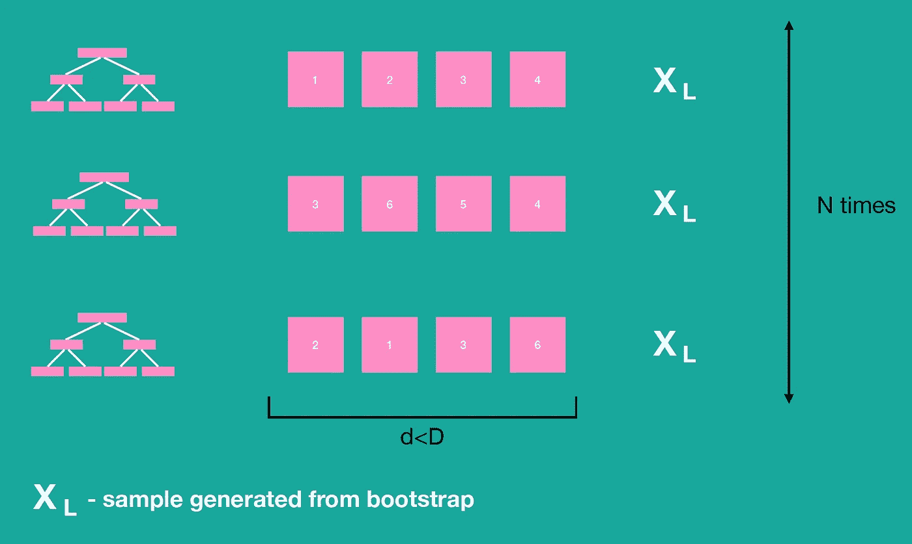

应该强调的是，每个
再次选择一个大小为 d 的随机子集，这是分裂另一个顶点的时候。这是这种
方法与随机子空间方法的主要区别，在随机子空间方法中，在构建基础算法之前选择一次随机特征子集。

毕竟，我们应用 bagging 和平均每个基本算法的结果。

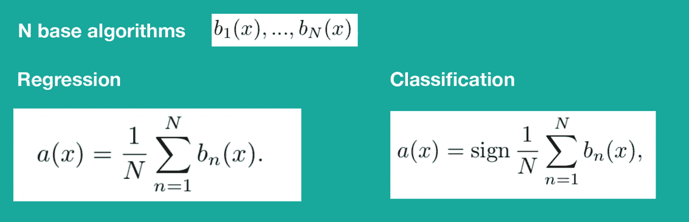

随机森林具有各种优点，如对离群点不敏感，对大特征空间工作良好，难以通过添加更多的树来过度拟合。

然而有一个缺点，存储模型需要 O(NK)内存存储，其中 *K* —树的数量。这已经很多了。

## 助推

Boosting 是一种加权集成方法。每个基本算法都是一个接一个按顺序添加的。一系列 *N* 分类器迭代学习。更新权重以允许后续分类器“更多地关注”被先前分类器错误分类的训练元组。加权投票不影响算法的复杂度，但平滑了基本算法的答案。

*增压与装袋相比如何？* Boosting 侧重于错误分类的元组，它有使生成的复合模型过度适应此类数据的风险。

用于构建线性模型的贪婪算法

以下每个算法都是为了纠正现有集合的错误而构建的。

*   用于阈值损失函数的不同近似

以 MSE 作为损失函数的标准回归任务为例

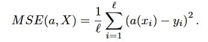

通常作为基本算法，我们采用最简单的算法，例如我们可以采用一个短决策树

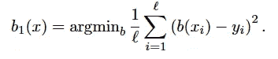

第二种算法必须以最小化合成 *b1(x)* 和 *b2(x)* 的误差的方式拟合

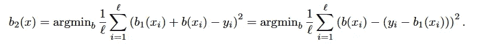

至于 *bN(x)*

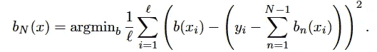

## 梯度推进

已知梯度推进是主要的集成算法之一。

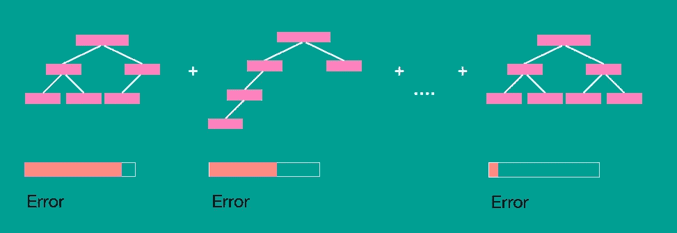

梯度推进算法采用梯度下降法优化损失函数。这是一种迭代算法，步骤如下:

1.  初始化第一个简单算法 *b0*
2.  在每次迭代中，我们生成一个移位向量 *s = (s1，..sl)。si —* 训练样本上算法 *bN(xi) = si* 的值

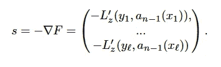

3.那么算法就是

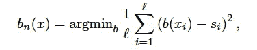

4.最后，我们将算法 *bN* 添加到集成中

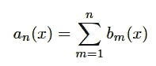

有几个可用的梯度增强库:XGBoost、H20、LightGBM。它们之间的主要区别在于树结构、特征工程和处理稀疏数据

# Catboost

Catboost 可以解决回归、分类、多类分类、排序等问题。模式因目标函数而异，我们试图在梯度下降过程中将其最小化。此外，Catboost 有预构建的[指标](https://tech.yandex.com/catboost/doc/dg/concepts/loss-functions-docpage/)来衡量模型的准确性。

在 Catboost [官方网站](https://catboost.ai/#benchmark)上，你可以找到 Catboost (method)与主要基准的比较，或者你可以在 Neptune.ai [博客](https://bit.ly/3OQC3aR)上深入研究这个主题

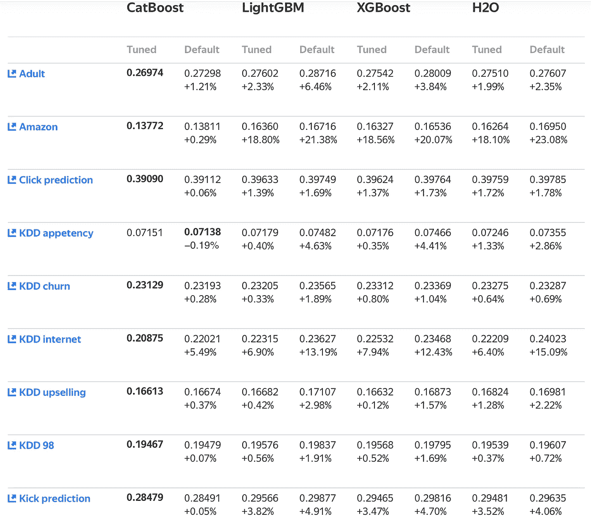

Figures in this table represent Logloss values (lower is better) for Classification mode.

百分比是根据优化的 CatBoost 结果测量的度量差异。

# Catboost 优势

Catboost 引入了以下算法进步:

1.  一种用于处理分类特征的创新算法。不需要自己对特性进行预处理—它是开箱即用的。对于具有分类特征的数据，与另一种算法相比，准确性会更好。
2.  实施**有序升压**，这是一种替代经典 bosting 算法的置换驱动算法。在小型数据集上，GB 很快就会被过度分配。在 Catboost 中，有一个针对这种情况的特殊修改。也就是说，在其他算法存在过度拟合问题的数据集上，您不会在 Catboost 上观察到相同的问题
3.  快速易用的 GPU 训练。您可以通过 *pip-install* 简单地安装它
4.  其他有用的特性:缺少值支持，可视化效果好

## 分类特征

分类特征是一组离散的值，称为*类别*，彼此不可比。

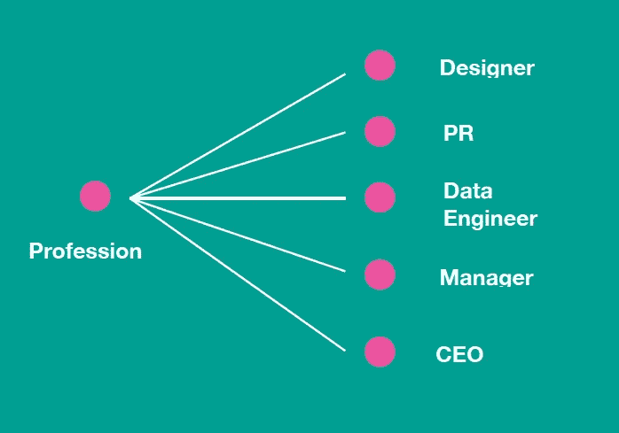

Catboost 的主要优势是分类数据的智能预处理。您不必自己对数据进行预处理。对分类数据进行编码的一些最流行的做法是:

1.  一键编码
2.  标签编码
3.  哈希编码
4.  目标编码
5.  等等..

对于具有少量不同特征的分类特征，一键编码是一种流行的方法。Catboost 将 *one_hot_max_size* 用于多个不同值小于或等于给定参数值的所有特征。

在具有高基数的特征的情况下(例如，像“用户 ID”特征)，这样的技术导致不可行的大量新特征。

另一种流行的方法是通过*目标统计* (TS)对类别进行分组，这些统计估计了每个类别中的预期目标值。

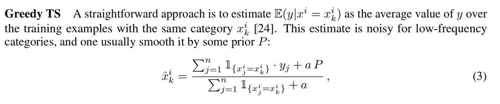

这种贪婪方法的问题是目标泄漏:使用前一个特征的目标来计算新特征。这导致了有条件的转移——对于训练和测试示例，分布是不同的。

解决这个问题的标准方法是*保持 TS* 和*留一*TS。但是他们仍然不能防止模型目标泄漏。

CatBoost 使用更有效的策略。它依赖于排序原则，被称为*基于目标与先验(TBS)* 。它是受在线学习算法的启发，在线学习算法按时间顺序获取训练样本。每个示例的 *TS* 的值仅依赖于观察到的历史。为了使这种思想适应标准的离线设置，我们引入了人工“时间”，即训练样本的随机排列σ。

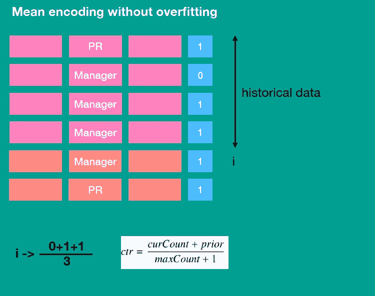

在 Catboost 中，数据被随机打乱，并且只对每个对象的历史数据计算平均值。数据可以被多次重组。

CatBoost 的另一个重要细节是使用分类特征的组合作为额外的分类特征，这些分类特征在广告点击预测任务中捕获高阶依赖性，如用户 ID 和广告主题的联合信息。可能组合的数量随着数据集中分类要素的数量呈指数增长，不可能处理所有的组合。CatBoost 以贪婪的方式构造组合。也就是说，对于树的每次分裂，CatBoost 将当前树中先前分裂已经使用的所有分类特征(及其组合)与数据集中的所有分类特征相结合(连接)。组合被动态地转换成 TS。

## 对抗梯度偏差

CatBoost 实现了一种算法，允许对抗常见的梯度增强偏差。现有的实现面临统计问题，*预测偏移。*训练示例的分布 *F(x_k) | x_k* 从测试示例 *x* 的分布 *F(x) | x* 转移。这个问题类似于上述分类变量预处理中出现的问题。

Catboost 团队衍生了有序增强，这是标准梯度增强算法的一种修改，可以避免目标泄漏。CatBoost 有两种升压模式，*命令*和*普通*。后一种模式是内置有序 TS 的标准 GBDT 算法。

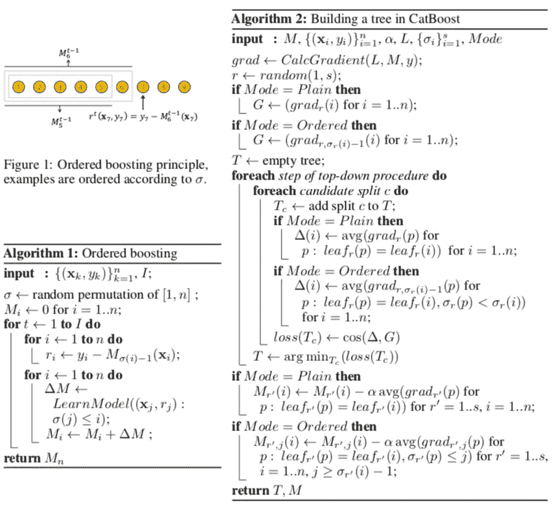

You can find a detailed description of the algorithm in the paper [Fighting biases with dynamic boosting](https://arxiv.org/abs/1706.09516)

CatBoost 使用不经意决策树，在树的整个级别上使用相同的分裂标准。这样的树是平衡的，不容易过度拟合，并允许在测试时显著加速预测。

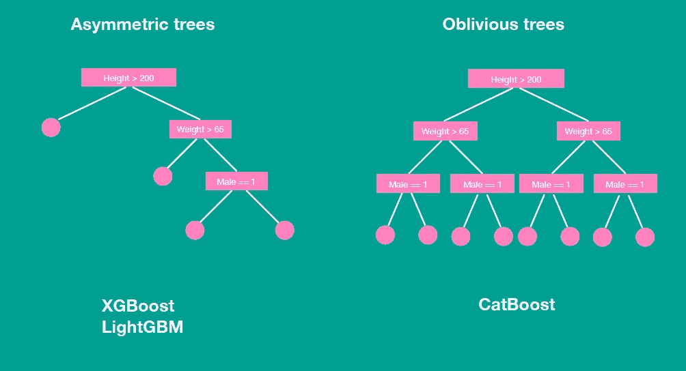

下面是不经意树评估在 [Catboost](https://github.com/catboost/catboost/blob/92fd122c98f273a6df77de72f3c4e3bc2e1f5ee2/catboost/libs/model/model_calcer.h#L37) 中的实现:

```
int index = 0;
 for (int depth = 0; depth < tree.ysize(); ++depth) {
  index |= binFeatures[tree[depth]] << depth;
 }
 result += Model.LeafValues[treeId][resultId][index];
```

如您所见，这段代码中没有“if”操作符。你不需要分支来评估一个健忘的决策树。

遗忘决策树可以描述为一个条件列表，每层一个条件。对于不经意树，你只需要评估所有树的条件，组成二进制向量，将这个二进制向量转换成数字，并通过等于这个数字的索引访问叶子数组。

例如在 LightGBM 中(XgBoost 有类似的实现)

```
std::vector<int> left_child_;
std::vector<int> right_child_;inline int NumericalDecision(double fval, int node) const { 
...
  if (GetDecisionType(decision_type_[node], kDefaultLeftMask)) {
   return left_child_[node];
  } else {
   return right_child_[node];
  }
...
}

inline int Tree::GetLeaf(const double* feature_values) const {
...
 while (node >= 0) {
   node = NumericalDecision(feature_values[split_feature_[node]], node);
  }
...
}
```

在有序增强模式中，在学习过程中，我们维护支持模型 *Mr，j* ，其中 *Mr，j(i)* 是基于排列 *σr* 中的前 j 个示例的第 *i* 个示例的当前预测。在算法的每次迭代 *t* 中，我们从 *{σ1，.。。，σs}* 并在此基础上构造一棵 Tt。首先，对于分类特征，所有的 TS 都是根据这个排列计算的。第二，排列影响树学习过程。

基于 *Mr，j(i)，*计算相应的梯度。在构建树时，我们根据余弦相似性来近似梯度 *G* ，其中对于每个示例 I，我们基于之前的示例取梯度为*σs。*当树结构 *Tt* (即，分裂属性的序列)被构建时，我们使用它来提升所有模型*Mr’，j*

您可以在[原始文件](https://arxiv.org/pdf/1706.09516.pdf)或 [NIPS 的 18 张幻灯片](https://github.com/catboost/catboost/blob/master/slides/CatBoostPaper_NIPS2018/Presentation.pdf)中找到详细信息

## GPU 培训

CatBoost 可以在一台机器的几个 GPU 上高效训练。

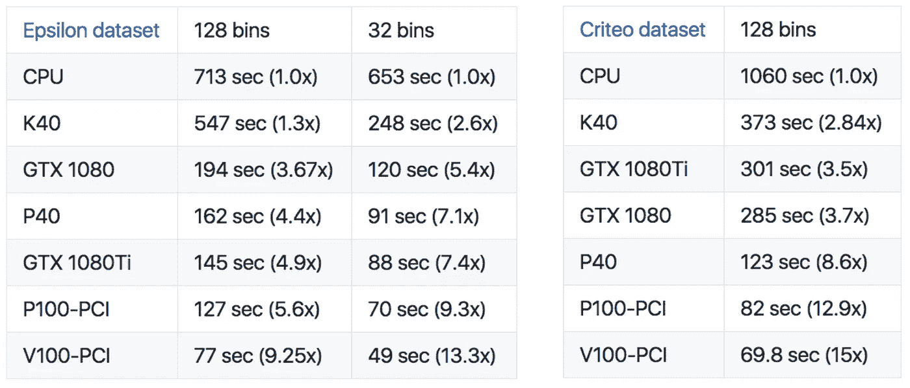

Experimental result for different hardware

CatBoost 实现了良好的可扩展性。在采用 InfiniBand 的 16 个 GPU 上，CatBoost 的运行速度比 4 个 GPU 快大约 3.75 倍。对于更大的数据集，可伸缩性应该更好。如果有足够的数据，我们可以在缓慢的 1gb 网络上训练模型，因为两台机器(每台机器有两个卡)不会明显慢于一个 PCIe 根联合体上的 4 个 GPU。你可以在这篇 NVIDIA [文章](https://devblogs.nvidia.com/catboost-fast-gradient-boosting-decision-trees/)中了解更多信息

在所描述的优点中，还需要提到以下一个:

1.  过拟合检测器。通常在梯度推进中，我们将学习速率调整到稳定的精度。但是学习率越小，需要的迭代次数就越多。
2.  缺少变量。刚离开南
3.  在 Catboost 中，您可以编写自己的损失函数
4.  特征重要性
5.  CatBoost 为 [Python 包](https://catboost.ai/docs/concepts/python-installation.html#python-installation)提供工具，允许用不同的训练统计数据绘制图表。该信息可以在训练过程中和训练之后被访问

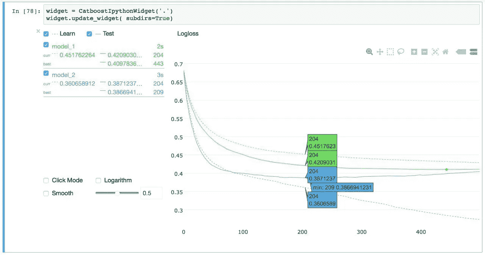

Monitor training in iPython Notebook using our visualization tool CatBoost Viewer.

Catboost 模型可以集成到 Tensorflow 中。例如，将 Catboost 和 Tensorflow 结合在一起是常见的情况。神经网络可用于梯度增强的特征提取。

此外，现在 Catboost 模型可以在 CoreML 的帮助下用于生产。

# 例子

我创建了一个应用 Catboost 解决回归问题的[例子](https://colab.research.google.com/drive/1Lte4Pb4lw_w7OGp2wqwS5a50ZgBIcW6j)。我使用 Allstate 索赔严重程度的数据作为基础。

在您的进一步研究中，请随意使用 [my colab](https://colab.research.google.com/drive/1Lte4Pb4lw_w7OGp2wqwS5a50ZgBIcW6j#scrollTo=nPJ39y19C41z) ！

你也可以在 Catboost 官方的 github 中找到大量其他的[例子](https://github.com/catboost/tutorials)

# 贡献

如果你想让 CatBoost 变得更好:

*   查看[求助](https://github.com/catboost/catboost/labels/help%20wanted)问题，看看有哪些可以改进的地方，或者如果您需要什么，可以打开一个问题。
*   将您的故事和经验添加到 [Awesome CatBoost](https://github.com/catboost/catboost/blob/master/AWESOME.md) 中。
*   要向 CatBoost 投稿，您需要首先阅读 CLA 文本，并在您的请求中添加您同意 CLA 条款的内容。更多信息可以在 [CONTRIBUTING.md](https://github.com/catboost/catboost/blob/master/CONTRIBUTING.md) 找到[对贡献者的说明可以在](https://tech.yandex.com/catboost/doc/dg/concepts/development-and-contributions-docpage/)这里找到。

关注[推特](https://twitter.com/kidrulit)或微信(zkid18)来了解我的最新消息。